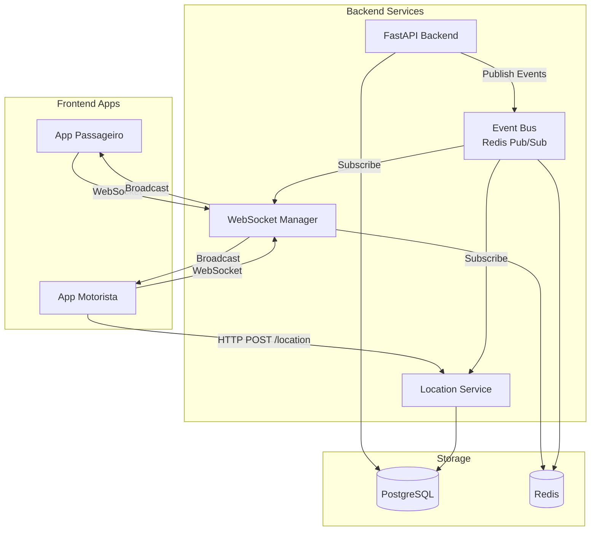

# Itens H e I: Eventos e Tempo Real + Contratos API FastAPI

---

## 📋 Índice

1. [Item H - Eventos e Tempo Real](#item-h---eventos-e-tempo-real)
2. [Item I - Contratos API FastAPI](#item-i---contratos-api-fastapi)

---

# Item H - Eventos e Tempo Real

## 🔔 Catálogo de Eventos

### Eventos de Corrida

#### 1. `ride.created`
```json
{
  "event_type": "ride.created",
  "ride_id": "uuid",
  "passenger_id": "uuid",
  "pickup": {"lat": -23.5505, "lon": -46.6333, "address": "..."},
  "dropoff": {"lat": -23.5629, "lon": -46.6544, "address": "..."},
  "estimated_fare": 50.00,
  "requested_category": "standard",
  "timestamp": "2024-12-14T18:00:00Z"
}
```
**Consumidores:** Matching Service, Analytics

---

#### 2. `ride.searching`
```json
{
  "event_type": "ride.searching",
  "ride_id": "uuid",
  "passenger_id": "uuid",
  "search_radius_km": 5.0,
  "timestamp": "2024-12-14T18:00:05Z"
}
```
**Consumidores:** WebSocket Manager (notifica passageiro)

---

#### 3. `ride.offered`
```json
{
  "event_type": "ride.offered",
  "ride_id": "uuid",
  "driver_ids": ["uuid1", "uuid2", "uuid3"],
  "expires_at": "2024-12-14T18:05:00Z",
  "timestamp": "2024-12-14T18:00:10Z"
}
```
**Consumidores:** WebSocket Manager (notifica motoristas), Notification Service

---

#### 4. `ride.accepted`
```json
{
  "event_type": "ride.accepted",
  "ride_id": "uuid",
  "driver_id": "uuid",
  "passenger_id": "uuid",
  "accepted_at": "2024-12-14T18:01:00Z",
  "timestamp": "2024-12-14T18:01:00Z"
}
```
**Consumidores:** WebSocket Manager, Notification Service, Analytics

---

#### 5. `ride.started`
```json
{
  "event_type": "ride.started",
  "ride_id": "uuid",
  "driver_id": "uuid",
  "passenger_id": "uuid",
  "started_at": "2024-12-14T18:15:00Z",
  "timestamp": "2024-12-14T18:15:00Z"
}
```
**Consumidores:** WebSocket Manager, Billing Service

---

#### 6. `ride.completed`
```json
{
  "event_type": "ride.completed",
  "ride_id": "uuid",
  "driver_id": "uuid",
  "passenger_id": "uuid",
  "final_fare": 52.50,
  "actual_distance_km": 12.5,
  "actual_duration_minutes": 25,
  "completed_at": "2024-12-14T18:40:00Z",
  "timestamp": "2024-12-14T18:40:00Z"
}
```
**Consumidores:** Payment Service, WebSocket Manager, Analytics

---

#### 7. `ride.canceled`
```json
{
  "event_type": "ride.canceled",
  "ride_id": "uuid",
  "canceled_by": "passenger",
  "cancellation_reason": "Changed plans",
  "cancellation_fee": 5.00,
  "timestamp": "2024-12-14T18:05:00Z"
}
```
**Consumidores:** WebSocket Manager, Billing Service

---

### Eventos de Localização

#### 8. `driver.location.updated`
```json
{
  "event_type": "driver.location.updated",
  "driver_id": "uuid",
  "ride_id": "uuid",
  "location": {
    "lat": -23.5505,
    "lon": -46.6333,
    "accuracy": 10.5,
    "heading": 45.0,
    "speed": 35.5
  },
  "timestamp": "2024-12-14T18:10:30Z"
}
```
**Consumidores:** WebSocket Manager (passageiro rastreia motorista), Analytics

**Frequência:** A cada 5 segundos durante corrida ativa

---

### Eventos de Pagamento

#### 9. `payment.intent.created`
```json
{
  "event_type": "payment.intent.created",
  "payment_intent_id": "uuid",
  "ride_id": "uuid",
  "amount": 52.50,
  "txid": "...",
  "expires_at": "2024-12-14T19:40:00Z",
  "timestamp": "2024-12-14T18:40:05Z"
}
```
**Consumidores:** WebSocket Manager, Notification Service

---

#### 10. `payment.confirmed`
```json
{
  "event_type": "payment.confirmed",
  "payment_intent_id": "uuid",
  "ride_id": "uuid",
  "amount": 52.50,
  "e2e_id": "E12345678202412141840...",
  "driver_id": "uuid",
  "passenger_id": "uuid",
  "timestamp": "2024-12-14T18:42:00Z"
}
```
**Consumidores:** WebSocket Manager, Ledger Service, Notification Service

---

#### 11. `payment.expired`
```json
{
  "event_type": "payment.expired",
  "payment_intent_id": "uuid",
  "ride_id": "uuid",
  "timestamp": "2024-12-14T19:40:00Z"
}
```
**Consumidores:** WebSocket Manager, Notification Service

---

### Eventos de Ledger

#### 12. `ledger.entry.created`
```json
{
  "event_type": "ledger.entry.created",
  "transaction_id": "payment_uuid",
  "account_code": "1300",
  "entry_type": "DEBIT",
  "amount": 52.50,
  "driver_id": "uuid",
  "timestamp": "2024-12-14T18:42:01Z"
}
```
**Consumidores:** Analytics, Audit Service

---

### Eventos de Payout

#### 13. `payout.created`
```json
{
  "event_type": "payout.created",
  "payout_id": "uuid",
  "driver_id": "uuid",
  "amount": 120.00,
  "timestamp": "2024-12-14T20:00:00Z"
}
```
**Consumidores:** WebSocket Manager, Notification Service

---

#### 14. `payout.completed`
```json
{
  "event_type": "payout.completed",
  "payout_id": "uuid",
  "driver_id": "uuid",
  "amount": 120.00,
  "txid": "...",
  "timestamp": "2024-12-14T20:01:30Z"
}
```
**Consumidores:** WebSocket Manager, Notification Service, Analytics

---

## 🌐 Arquitetura de Tempo Real

### Diagrama de Componentes



---

## 🔌 WebSocket Manager

### Conexão e Autenticação

```python
from fastapi import WebSocket, WebSocketDisconnect, Depends
from typing import Dict, Set
import json

class ConnectionManager:
    def __init__(self):
        # user_id -> Set[WebSocket]
        self.active_connections: Dict[str, Set[WebSocket]] = {}

    async def connect(self, websocket: WebSocket, user_id: str):
        """Conecta um WebSocket e registra o usuário."""
        await websocket.accept()

        if user_id not in self.active_connections:
            self.active_connections[user_id] = set()

        self.active_connections[user_id].add(websocket)

        logger.info(f"User {user_id} connected. Total connections: {len(self.active_connections[user_id])}")

    def disconnect(self, websocket: WebSocket, user_id: str):
        """Desconecta um WebSocket."""
        if user_id in self.active_connections:
            self.active_connections[user_id].discard(websocket)

            if not self.active_connections[user_id]:
                del self.active_connections[user_id]

        logger.info(f"User {user_id} disconnected")

    async def send_to_user(self, user_id: str, message: dict):
        """Envia mensagem para todas as conexões de um usuário."""
        if user_id not in self.active_connections:
            logger.debug(f"User {user_id} not connected")
            return

        connections = self.active_connections[user_id].copy()

        for websocket in connections:
            try:
                await websocket.send_json(message)
            except Exception as e:
                logger.error(f"Error sending to user {user_id}: {e}")
                self.disconnect(websocket, user_id)

    async def broadcast(self, user_ids: List[str], message: dict):
        """Envia mensagem para múltiplos usuários."""
        for user_id in user_ids:
            await self.send_to_user(user_id, message)


manager = ConnectionManager()


@app.websocket("/ws/{token}")
async def websocket_endpoint(
    websocket: WebSocket,
    token: str
):
    """
    Endpoint WebSocket para tempo real.

    Autenticação via token JWT no path.
    """
    # Validar token
    try:
        payload = jwt.decode(token, settings.SECRET_KEY, algorithms=["HS256"])
        user_id = payload["sub"]
        user_type = payload["type"]  # passenger, driver
    except JWTError:
        await websocket.close(code=4001, reason="Invalid token")
        return

    # Conectar
    await manager.connect(websocket, user_id)

    try:
        # Enviar mensagem de boas-vindas
        await websocket.send_json({
            "type": "connection.established",
            "user_id": user_id,
            "user_type": user_type,
            "timestamp": datetime.now(timezone.utc).isoformat()
        })

        # Keepalive loop
        while True:
            # Aguardar mensagens do cliente
            data = await websocket.receive_text()

            # Processar ping/pong
            message = json.loads(data)
            if message.get("type") == "ping":
                await websocket.send_json({"type": "pong"})

    except WebSocketDisconnect:
        manager.disconnect(websocket, user_id)
    except Exception as e:
        logger.exception(f"WebSocket error for user {user_id}")
        manager.disconnect(websocket, user_id)
```

---

## 📡 Event Bus (Redis Pub/Sub)

### Publicação de Eventos

```python
class EventBus:
    def __init__(self, redis_client: aioredis.Redis):
        self.redis = redis_client

    async def publish(self, event_type: str, payload: dict):
        """
        Publica evento no Redis Pub/Sub.
        """
        message = {
            "event_type": event_type,
            "payload": payload,
            "timestamp": datetime.now(timezone.utc).isoformat(),
            "event_id": str(uuid4())
        }

        channel = f"events:{event_type}"

        await self.redis.publish(channel, json.dumps(message))

        logger.debug(f"Published event {event_type} to channel {channel}")

    async def post_from_transaction(
        self,
        db_session: AsyncSession,
        event_type: str,
        payload: dict
    ):
        """
        Publica evento após commit da transação.

        Usa hook after_commit do SQLAlchemy.
        """
        @event.listens_for(db_session.sync_session, "after_commit", once=True)
        def publish_event(session):
            asyncio.create_task(
                self.publish(event_type, payload)
            )
```

### Subscrição de Eventos

```python
class EventSubscriber:
    def __init__(self, redis_client: aioredis.Redis):
        self.redis = redis_client
        self.handlers: Dict[str, List[Callable]] = {}

    def subscribe(self, event_type: str, handler: Callable):
        """Registra handler para um tipo de evento."""
        if event_type not in self.handlers:
            self.handlers[event_type] = []

        self.handlers[event_type].append(handler)

    async def start(self):
        """Inicia escuta de eventos."""
        pubsub = self.redis.pubsub()

        # Subscrever todos os eventos
        await pubsub.psubscribe("events:*")

        logger.info("Event subscriber started")

        async for message in pubsub.listen():
            if message["type"] == "pmessage":
                await self._handle_message(message)

    async def _handle_message(self, message: dict):
        """Processa mensagem recebida."""
        try:
            data = json.loads(message["data"])
            event_type = data["event_type"]
            payload = data["payload"]

            # Chamar handlers registrados
            if event_type in self.handlers:
                for handler in self.handlers[event_type]:
                    try:
                        await handler(payload)
                    except Exception as e:
                        logger.exception(f"Error in handler for {event_type}")

        except Exception as e:
            logger.exception("Error handling message")


# Inicializar subscriber
subscriber = EventSubscriber(redis_client)

# Registrar handlers
subscriber.subscribe("ride.accepted", handle_ride_accepted)
subscriber.subscribe("driver.location.updated", handle_location_update)
subscriber.subscribe("payment.confirmed", handle_payment_confirmed)

# Iniciar em background task
@app.on_event("startup")
async def startup_event():
    asyncio.create_task(subscriber.start())
```

---

## 🎯 Handlers de Eventos

### Handler: ride.accepted

```python
async def handle_ride_accepted(payload: dict):
    """
    Notifica passageiro e motoristas quando corrida é aceita.
    """
    ride_id = payload["ride_id"]
    driver_id = payload["driver_id"]
    passenger_id = payload["passenger_id"]

    # Notificar passageiro
    await manager.send_to_user(
        user_id=passenger_id,
        message={
            "type": "ride.accepted",
            "data": {
                "ride_id": ride_id,
                "driver_id": driver_id,
                "message": "Um motorista aceitou sua corrida!"
            }
        }
    )

    # Notificar motorista aceito
    await manager.send_to_user(
        user_id=driver_id,
        message={
            "type": "ride.accepted",
            "data": {
                "ride_id": ride_id,
                "message": "Você aceitou a corrida! Vá ao ponto de partida."
            }
        }
    )

    # Notificar motoristas que perderam (offer.canceled)
    # (Já tratado no endpoint de accept)
```

### Handler: driver.location.updated

```python
async def handle_location_update(payload: dict):
    """
    Transmite localização do motorista para passageiro.
    """
    driver_id = payload["driver_id"]
    ride_id = payload.get("ride_id")

    if not ride_id:
        return  # Motorista offline, não transmitir

    # Buscar passageiro da corrida
    async with async_session_maker() as db:
        ride = await db.get(Ride, ride_id)

        if not ride or ride.passenger_id is None:
            return

        # Transmitir para passageiro
        await manager.send_to_user(
            user_id=str(ride.passenger_id),
            message={
                "type": "driver.location.updated",
                "data": {
                    "ride_id": ride_id,
                    "driver_id": driver_id,
                    "location": payload["location"]
                }
            }
        )
```

### Handler: payment.confirmed

```python
async def handle_payment_confirmed(payload: dict):
    """
    Notifica passageiro e motorista quando pagamento é confirmado.
    """
    ride_id = payload["ride_id"]
    passenger_id = payload["passenger_id"]
    driver_id = payload["driver_id"]
    amount = payload["amount"]

    # Notificar passageiro
    await manager.send_to_user(
        user_id=passenger_id,
        message={
            "type": "payment.confirmed",
            "data": {
                "ride_id": ride_id,
                "amount": amount,
                "message": "Pagamento confirmado! Obrigado por usar nosso serviço."
            }
        }
    )

    # Notificar motorista
    await manager.send_to_user(
        user_id=driver_id,
        message={
            "type": "payment.confirmed",
            "data": {
                "ride_id": ride_id,
                "amount": amount,
                "message": "Pagamento da corrida confirmado!"
            }
        }
    )
```

---

## 📍 Location Service

### Endpoint: POST /drivers/{id}/location

```python
class LocationUpdate(BaseModel):
    lat: float = Field(..., ge=-90, le=90)
    lon: float = Field(..., ge=-180, le=180)
    accuracy: float = Field(..., gt=0)
    heading: Optional[float] = Field(None, ge=0, lt=360)
    speed: Optional[float] = Field(None, ge=0)


@app.post("/drivers/{driver_id}/location")
async def update_driver_location(
    driver_id: UUID,
    location: LocationUpdate,
    db: AsyncSession = Depends(get_db),
    event_bus: EventBus = Depends(get_event_bus),
    current_user: User = Depends(get_current_user)
):
    """
    Atualiza localização do motorista.

    Chamado frequentemente (a cada 5s) durante corrida.
    """
    # Validar que usuário é o motorista
    if str(current_user.id) != str(driver_id):
        raise HTTPException(403, "Not authorized")

    # Atualizar motorista
    driver = await db.get(Driver, driver_id)

    driver.current_lat = location.lat
    driver.current_lon = location.lon
    driver.current_heading = location.heading
    driver.last_location_update = datetime.now(timezone.utc)

    db.add(driver)

    # Salvar no histórico
    location_record = LocationUpdate(
        entity_type="driver",
        entity_id=driver_id,
        ride_id=driver.current_ride_id,
        lat=location.lat,
        lon=location.lon,
        accuracy=location.accuracy,
        heading=location.heading,
        speed=location.speed,
        device_time=datetime.now(timezone.utc),
        source="gps"
    )

    db.add(location_record)

    await db.commit()

    # Publicar evento (se em corrida)
    if driver.current_ride_id:
        await event_bus.publish(
            event_type="driver.location.updated",
            payload={
                "driver_id": str(driver_id),
                "ride_id": str(driver.current_ride_id),
                "location": {
                    "lat": location.lat,
                    "lon": location.lon,
                    "accuracy": location.accuracy,
                    "heading": location.heading,
                    "speed": location.speed
                }
            }
        )

    return {"status": "ok"}
```

---

# Item I - Contratos API FastAPI

## 📝 Schemas Pydantic

### Schemas de Corrida

```python
from pydantic import BaseModel, Field, validator
from typing import Optional
from decimal import Decimal
from datetime import datetime
from uuid import UUID

class Location(BaseModel):
    lat: float = Field(..., ge=-90, le=90)
    lon: float = Field(..., ge=-180, le=180)
    address: str


class CreateRideRequest(BaseModel):
    pickup: Location
    dropoff: Optional[Location] = None
    requested_category: str = Field(default="standard")

    @validator('requested_category')
    def validate_category(cls, v):
        if v not in ['standard', 'comfort', 'premium', 'xl']:
            raise ValueError("Invalid category")
        return v


class RideResponse(BaseModel):
    id: UUID
    status: str
    passenger_id: UUID
    driver_id: Optional[UUID]

    pickup: Location
    dropoff: Optional[Location]

    estimated_fare: Optional[Decimal]
    final_fare: Optional[Decimal]

    created_at: datetime
    accepted_at: Optional[datetime]
    started_at: Optional[datetime]
    completed_at: Optional[datetime]

    class Config:
        from_attributes = True


class AcceptRideRequest(BaseModel):
    driver_id: UUID
    idempotency_key: str = Field(..., min_length=1)


class CancelRideRequest(BaseModel):
    reason: str = Field(..., min_length=1, max_length=500)
```

---

## 🛣️ Endpoints de Corrida

### POST /rides
```python
@app.post("/rides", response_model=RideResponse, status_code=201)
async def create_ride(
    request: CreateRideRequest,
    db: AsyncSession = Depends(get_db),
    current_passenger: Passenger = Depends(get_current_passenger)
):
    """
    Cria nova solicitação de corrida.
    """
    # Calcular estimativas
    estimated_distance = calculate_distance(
        request.pickup,
        request.dropoff
    )
    estimated_fare = calculate_fare(estimated_distance, request.requested_category)

    # Criar corrida
    ride = Ride(
        passenger_id=current_passenger.id,
        pickup_lat=request.pickup.lat,
        pickup_lon=request.pickup.lon,
        pickup_address=request.pickup.address,
        dropoff_lat=request.dropoff.lat if request.dropoff else None,
        dropoff_lon=request.dropoff.lon if request.dropoff else None,
        dropoff_address=request.dropoff.address if request.dropoff else None,
        requested_category=request.requested_category,
        estimated_distance_km=estimated_distance,
        estimated_fare=estimated_fare,
        status="REQUESTED"
    )

    db.add(ride)
    await db.commit()

    # Iniciar busca de motoristas (assíncrono)
    await start_driver_search.delay(str(ride.id))

    return ride
```

### POST /rides/{id}/accept
**Ver documento:** `D-ACCEPT-RIDE-TRANSACIONAL.md`

### POST /rides/{id}/start
```python
@app.post("/rides/{ride_id}/start")
async def start_ride(
    ride_id: UUID,
    db: AsyncSession = Depends(get_db),
    current_driver: Driver = Depends(get_current_driver)
):
    """
    Motorista inicia a corrida (passageiro embarcou).
    """
    async with db.begin():
        ride = await db.get(Ride, ride_id)

        if ride.driver_id != current_driver.id:
            raise HTTPException(403, "Not your ride")

        if ride.status != "ARRIVING":
            raise HTTPException(400, f"Cannot start ride in status {ride.status}")

        ride.status = "STARTED"
        ride.started_at = datetime.now(timezone.utc)

        db.add(ride)

        await event_bus.post_from_transaction(
            db,
            "ride.started",
            {"ride_id": str(ride_id), "driver_id": str(current_driver.id)}
        )

    return {"status": "ok", "ride": ride}
```

### POST /rides/{id}/complete
```python
@app.post("/rides/{ride_id}/complete")
async def complete_ride(
    ride_id: UUID,
    db: AsyncSession = Depends(get_db),
    current_driver: Driver = Depends(get_current_driver)
):
    """
    Motorista finaliza a corrida.
    """
    async with db.begin():
        ride = await db.get(Ride, ride_id)

        if ride.driver_id != current_driver.id:
            raise HTTPException(403, "Not your ride")

        if ride.status != "STARTED":
            raise HTTPException(400, f"Cannot complete ride in status {ride.status}")

        # Calcular valores reais
        ride.completed_at = datetime.now(timezone.utc)
        ride.actual_duration_minutes = int(
            (ride.completed_at - ride.started_at).total_seconds() / 60
        )

        # Calcular distância real (soma de location updates)
        distance = await calculate_actual_distance(ride_id, db)
        ride.actual_distance_km = distance

        # Calcular tarifa final
        ride.final_fare = calculate_fare(distance, ride.requested_category)

        ride.status = "COMPLETED"

        # Liberar motorista
        current_driver.current_ride_id = None
        current_driver.status = "available"

        db.add(ride)
        db.add(current_driver)

        await event_bus.post_from_transaction(
            db,
            "ride.completed",
            {
                "ride_id": str(ride_id),
                "driver_id": str(current_driver.id),
                "final_fare": float(ride.final_fare)
            }
        )

    # Criar payment intent
    await create_payment_intent(ride_id)

    return {"status": "ok", "ride": ride}
```

---

## 💳 Endpoints de Pagamento

### POST /payments/intent
**Ver documento:** `E-PIX-WEBHOOK-TRANSACIONAL.md`

### POST /webhooks/efi/pix
**Ver documento:** `E-PIX-WEBHOOK-TRANSACIONAL.md`

### GET /rides/{id}/payment
```python
@app.get("/rides/{ride_id}/payment")
async def get_ride_payment(
    ride_id: UUID,
    db: AsyncSession = Depends(get_db),
    current_user: User = Depends(get_current_user)
):
    """
    Retorna informações de pagamento de uma corrida.
    """
    ride = await db.get(Ride, ride_id)

    # Verificar autorização
    if str(ride.passenger_id) != str(current_user.id):
        raise HTTPException(403, "Not authorized")

    # Buscar payment intent
    payment = await db.execute(
        select(PaymentIntent).where(PaymentIntent.ride_id == ride_id)
    )
    payment = payment.scalar_one_or_none()

    if not payment:
        return {"status": "no_payment"}

    # Buscar pix charge
    pix_charge = await db.execute(
        select(PixCharge).where(PixCharge.payment_intent_id == payment.id)
    )
    pix_charge = pix_charge.scalar_one_or_none()

    return {
        "payment_intent_id": payment.id,
        "amount": payment.amount,
        "status": payment.status,
        "qr_code": pix_charge.qr_code if pix_charge else None,
        "pix_copy_paste": pix_charge.pix_copy_paste if pix_charge else None,
        "expires_at": pix_charge.expires_at if pix_charge else None
    }
```

---

## 💰 Endpoints de Payout

### GET /drivers/{id}/financials
**Ver documento:** `F-G-LEDGER-FINANCEIRO-PAYOUT.md`

### POST /payouts
```python
class CreatePayoutRequest(BaseModel):
    amount: Decimal = Field(..., gt=0)


@app.post("/payouts", response_model=PayoutResponse)
async def request_payout(
    request: CreatePayoutRequest,
    db: AsyncSession = Depends(get_db),
    current_driver: Driver = Depends(get_current_driver)
):
    """
    Motorista solicita repasse.
    """
    payout = await create_payout(
        driver_id=current_driver.id,
        amount=request.amount,
        request_id=str(uuid4())
    )

    return payout
```

---

## 🎯 Resumo de Endpoints

### Corridas
- `POST /rides` - Criar corrida
- `GET /rides/{id}` - Detalhes da corrida
- `POST /rides/{id}/accept` - Aceitar corrida
- `POST /rides/{id}/cancel` - Cancelar corrida
- `POST /rides/{id}/start` - Iniciar corrida
- `POST /rides/{id}/complete` - Finalizar corrida
- `GET /rides/active` - Corridas ativas do usuário

### Pagamentos
- `POST /payments/intent` - Criar intenção de pagamento
- `GET /rides/{id}/payment` - Informações de pagamento
- `POST /webhooks/efi/pix` - Webhook Pix

### Motorista
- `GET /drivers/{id}/financials` - Situação financeira
- `POST /drivers/{id}/location` - Atualizar localização
- `POST /payouts` - Solicitar repasse
- `GET /payouts` - Listar repasses

### Tempo Real
- `WS /ws/{token}` - WebSocket para eventos

---

**Documento criado em:** 14/12/2024
**Versão:** 1.0
**Autor:** Sistema de Arquitetura Backend
