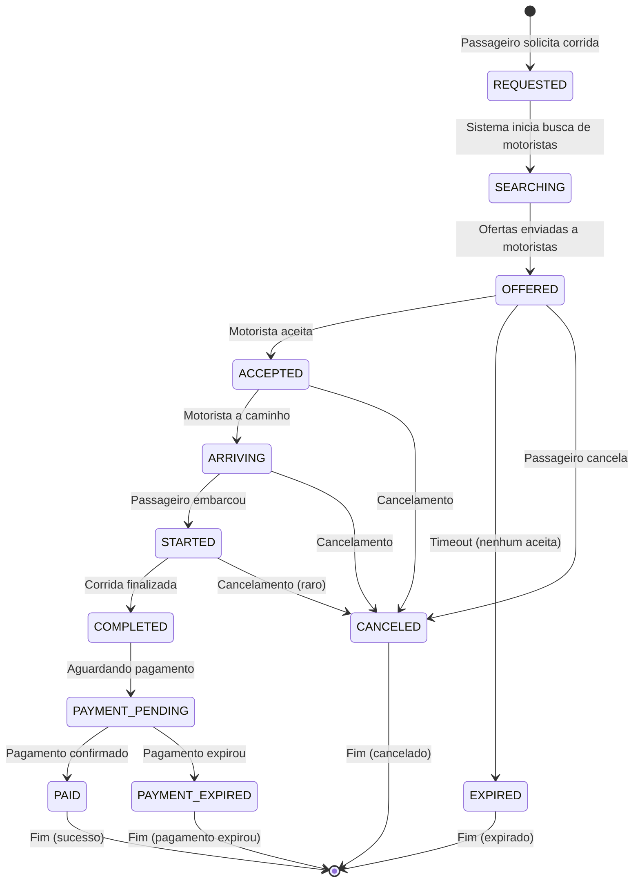

# Itens A, B, C: Modelo de Domínio, Invariantes e Máquina de Estados

**Objetivo:** Definir o modelo de dados completo, regras de negócio invioláveis e fluxos de estados.

---

## 📋 Índice

1. [Item A - Modelo de Domínio](#item-a---modelo-de-domínio)
2. [Item B - Invariantes do Sistema](#item-b---invariantes-do-sistema)
3. [Item C - Máquina de Estados da Corrida](#item-c---máquina-de-estados-da-corrida)

---

# Item A - Modelo de Domínio

## 🚗 Entidades de Mobilidade

### 1. Passenger (Passageiro)

```sql
CREATE TABLE passengers (
    id UUID PRIMARY KEY DEFAULT gen_random_uuid(),

    -- Identificação
    user_id UUID NOT NULL UNIQUE REFERENCES users(id),
    full_name VARCHAR(255) NOT NULL,
    cpf VARCHAR(11) UNIQUE,  -- CPF sem pontuação
    phone VARCHAR(20) NOT NULL,
    email VARCHAR(255) NOT NULL,

    -- Endereços favoritos (JSONB)
    favorite_addresses JSONB DEFAULT '[]'::jsonb,
    -- Formato: [{"label": "Casa", "lat": -23.5505, "lon": -46.6333, "address": "..."}]

    -- Pagamento
    default_payment_method VARCHAR(50) DEFAULT 'pix',

    -- Status
    status VARCHAR(50) NOT NULL DEFAULT 'active',
    -- active, suspended, banned

    -- Avaliação
    average_rating DECIMAL(3, 2) DEFAULT 5.00,
    total_ratings INTEGER DEFAULT 0,

    -- Estatísticas
    total_rides INTEGER DEFAULT 0,
    total_spent DECIMAL(10, 2) DEFAULT 0.00,

    -- Timestamps
    created_at TIMESTAMP WITH TIME ZONE NOT NULL DEFAULT NOW(),
    updated_at TIMESTAMP WITH TIME ZONE NOT NULL DEFAULT NOW(),
    last_ride_at TIMESTAMP WITH TIME ZONE,

    -- Índices
    INDEX idx_passengers_user_id (user_id),
    INDEX idx_passengers_cpf (cpf) WHERE cpf IS NOT NULL,
    INDEX idx_passengers_phone (phone),
    INDEX idx_passengers_status (status),

    CONSTRAINT valid_passenger_status CHECK (status IN ('active', 'suspended', 'banned')),
    CONSTRAINT valid_rating CHECK (average_rating >= 1.00 AND average_rating <= 5.00)
);
```

### 2. Driver (Motorista)

```sql
CREATE TABLE drivers (
    id UUID PRIMARY KEY DEFAULT gen_random_uuid(),

    -- Identificação
    user_id UUID NOT NULL UNIQUE REFERENCES users(id),
    full_name VARCHAR(255) NOT NULL,
    cpf VARCHAR(11) NOT NULL UNIQUE,
    phone VARCHAR(20) NOT NULL,
    email VARCHAR(255) NOT NULL,

    -- Documentação
    cnh_number VARCHAR(20) NOT NULL UNIQUE,
    cnh_category VARCHAR(5) NOT NULL,  -- B, C, D, E
    cnh_expiry_date DATE NOT NULL,

    -- Conta bancária (para repasses)
    bank_code VARCHAR(3),
    bank_branch VARCHAR(10),
    bank_account VARCHAR(20),
    bank_account_type VARCHAR(20),  -- checking, savings
    pix_key VARCHAR(255),
    pix_key_type VARCHAR(20),  -- cpf, email, phone, random

    -- Status
    status VARCHAR(50) NOT NULL DEFAULT 'pending_approval',
    -- pending_approval, active, available, on_trip, offline, suspended, banned

    approval_status VARCHAR(50) DEFAULT 'pending',
    -- pending, approved, rejected
    approved_at TIMESTAMP WITH TIME ZONE,
    approved_by UUID REFERENCES users(id),

    -- Localização atual
    current_lat DECIMAL(10, 8),
    current_lon DECIMAL(11, 8),
    current_heading DECIMAL(5, 2),  -- 0-360 graus
    last_location_update TIMESTAMP WITH TIME ZONE,

    -- Corrida atual
    current_ride_id UUID REFERENCES rides(id),

    -- Avaliação
    average_rating DECIMAL(3, 2) DEFAULT 5.00,
    total_ratings INTEGER DEFAULT 0,

    -- Estatísticas
    total_rides INTEGER DEFAULT 0,
    total_distance_km DECIMAL(10, 2) DEFAULT 0.00,
    total_earnings DECIMAL(10, 2) DEFAULT 0.00,

    -- Disponibilidade
    online BOOLEAN DEFAULT FALSE,
    accepting_rides BOOLEAN DEFAULT TRUE,

    -- Timestamps
    created_at TIMESTAMP WITH TIME ZONE NOT NULL DEFAULT NOW(),
    updated_at TIMESTAMP WITH TIME ZONE NOT NULL DEFAULT NOW(),
    last_ride_at TIMESTAMP WITH TIME ZONE,

    -- Índices
    INDEX idx_drivers_user_id (user_id),
    INDEX idx_drivers_cpf (cpf),
    INDEX idx_drivers_status (status),
    INDEX idx_drivers_online (online, status) WHERE online = TRUE,
    INDEX idx_drivers_location (current_lat, current_lon) WHERE online = TRUE,
    INDEX idx_drivers_current_ride (current_ride_id) WHERE current_ride_id IS NOT NULL,

    CONSTRAINT valid_driver_status CHECK (status IN (
        'pending_approval', 'active', 'available', 'on_trip', 'offline', 'suspended', 'banned'
    )),
    CONSTRAINT valid_approval_status CHECK (approval_status IN ('pending', 'approved', 'rejected')),
    CONSTRAINT valid_rating CHECK (average_rating >= 1.00 AND average_rating <= 5.00),
    CONSTRAINT cnh_not_expired CHECK (cnh_expiry_date > CURRENT_DATE)
);
```

### 3. Vehicle (Veículo)

```sql
CREATE TABLE vehicles (
    id UUID PRIMARY KEY DEFAULT gen_random_uuid(),

    -- Propriedade
    driver_id UUID NOT NULL REFERENCES drivers(id),

    -- Identificação
    license_plate VARCHAR(10) NOT NULL UNIQUE,
    renavam VARCHAR(20),

    -- Características
    brand VARCHAR(100) NOT NULL,  -- Marca: Toyota, Honda, etc.
    model VARCHAR(100) NOT NULL,  -- Modelo: Corolla, Civic, etc.
    year INTEGER NOT NULL,
    color VARCHAR(50) NOT NULL,

    -- Categoria
    category VARCHAR(50) NOT NULL DEFAULT 'standard',
    -- standard, comfort, premium, xl

    seats INTEGER NOT NULL DEFAULT 4,

    -- Documentação
    crlv_number VARCHAR(50),  -- Certificado de Registro
    crlv_expiry_date DATE,

    -- Status
    status VARCHAR(50) NOT NULL DEFAULT 'pending_approval',
    -- pending_approval, active, inactive, suspended

    approval_status VARCHAR(50) DEFAULT 'pending',
    approved_at TIMESTAMP WITH TIME ZONE,
    approved_by UUID REFERENCES users(id),

    -- Timestamps
    created_at TIMESTAMP WITH TIME ZONE NOT NULL DEFAULT NOW(),
    updated_at TIMESTAMP WITH TIME ZONE NOT NULL DEFAULT NOW(),

    -- Índices
    INDEX idx_vehicles_driver (driver_id),
    INDEX idx_vehicles_plate (license_plate),
    INDEX idx_vehicles_status (status),

    CONSTRAINT valid_vehicle_status CHECK (status IN (
        'pending_approval', 'active', 'inactive', 'suspended'
    )),
    CONSTRAINT valid_category CHECK (category IN ('standard', 'comfort', 'premium', 'xl')),
    CONSTRAINT valid_year CHECK (year >= 2010 AND year <= EXTRACT(YEAR FROM CURRENT_DATE) + 1)
);
```

### 4. Ride (Corrida)

```sql
CREATE TABLE rides (
    id UUID PRIMARY KEY DEFAULT gen_random_uuid(),

    -- Participantes
    passenger_id UUID NOT NULL REFERENCES passengers(id),
    driver_id UUID REFERENCES drivers(id),  -- NULL até ser aceita
    vehicle_id UUID REFERENCES vehicles(id),

    -- Status
    status VARCHAR(50) NOT NULL DEFAULT 'REQUESTED',
    -- REQUESTED → SEARCHING → OFFERED → ACCEPTED → ARRIVING → STARTED → COMPLETED
    -- CANCELED, EXPIRED, PAYMENT_PENDING, PAID, PAYMENT_EXPIRED

    -- Localização: Partida
    pickup_lat DECIMAL(10, 8) NOT NULL,
    pickup_lon DECIMAL(11, 8) NOT NULL,
    pickup_address TEXT NOT NULL,

    -- Localização: Destino
    dropoff_lat DECIMAL(10, 8),
    dropoff_lon DECIMAL(11, 8),
    dropoff_address TEXT,

    -- Categoria solicitada
    requested_category VARCHAR(50) NOT NULL DEFAULT 'standard',

    -- Estimativas (calculadas ao criar)
    estimated_distance_km DECIMAL(10, 2),
    estimated_duration_minutes INTEGER,
    estimated_fare DECIMAL(10, 2),

    -- Valores reais (preenchidos durante/após corrida)
    actual_distance_km DECIMAL(10, 2),
    actual_duration_minutes INTEGER,
    final_fare DECIMAL(10, 2),

    -- Timestamps do fluxo
    created_at TIMESTAMP WITH TIME ZONE NOT NULL DEFAULT NOW(),
    searching_started_at TIMESTAMP WITH TIME ZONE,
    offered_at TIMESTAMP WITH TIME ZONE,
    accepted_at TIMESTAMP WITH TIME ZONE,
    driver_arrived_at TIMESTAMP WITH TIME ZONE,
    started_at TIMESTAMP WITH TIME ZONE,
    completed_at TIMESTAMP WITH TIME ZONE,
    canceled_at TIMESTAMP WITH TIME ZONE,
    paid_at TIMESTAMP WITH TIME ZONE,

    -- Expiração
    expires_at TIMESTAMP WITH TIME ZONE,

    -- Cancelamento
    canceled_by VARCHAR(50),  -- passenger, driver, system
    cancellation_reason TEXT,
    cancellation_fee DECIMAL(10, 2) DEFAULT 0.00,

    -- Avaliações
    passenger_rating INTEGER,  -- 1-5
    passenger_review TEXT,
    driver_rating INTEGER,  -- 1-5
    driver_review TEXT,

    -- Concorrência (otimista)
    version INTEGER NOT NULL DEFAULT 1,

    -- Índices
    INDEX idx_rides_passenger (passenger_id),
    INDEX idx_rides_driver (driver_id) WHERE driver_id IS NOT NULL,
    INDEX idx_rides_status (status, created_at),
    INDEX idx_rides_created (created_at),
    INDEX idx_rides_expires (expires_at) WHERE expires_at IS NOT NULL,
    INDEX idx_rides_pickup_location (pickup_lat, pickup_lon),

    CONSTRAINT valid_ride_status CHECK (status IN (
        'REQUESTED', 'SEARCHING', 'OFFERED', 'ACCEPTED', 'ARRIVING', 'STARTED',
        'COMPLETED', 'CANCELED', 'EXPIRED', 'PAYMENT_PENDING', 'PAID', 'PAYMENT_EXPIRED'
    )),
    CONSTRAINT driver_required_after_accepted CHECK (
        (status IN ('ACCEPTED', 'ARRIVING', 'STARTED', 'COMPLETED', 'PAID') AND driver_id IS NOT NULL) OR
        (status NOT IN ('ACCEPTED', 'ARRIVING', 'STARTED', 'COMPLETED', 'PAID'))
    ),
    CONSTRAINT valid_ratings CHECK (
        (passenger_rating IS NULL OR (passenger_rating >= 1 AND passenger_rating <= 5)) AND
        (driver_rating IS NULL OR (driver_rating >= 1 AND driver_rating <= 5))
    )
);
```

### 5. RideOffer (Oferta de Corrida)

```sql
CREATE TABLE ride_offers (
    id UUID PRIMARY KEY DEFAULT gen_random_uuid(),

    -- Relacionamentos
    ride_id UUID NOT NULL REFERENCES rides(id) ON DELETE CASCADE,
    driver_id UUID NOT NULL REFERENCES drivers(id),

    -- Oferta
    offered_at TIMESTAMP WITH TIME ZONE NOT NULL DEFAULT NOW(),
    expires_at TIMESTAMP WITH TIME ZONE NOT NULL,

    -- Estimativas para o motorista
    distance_to_pickup_km DECIMAL(10, 2),
    eta_to_pickup_minutes INTEGER,
    estimated_earnings DECIMAL(10, 2),

    -- Resposta
    responded_at TIMESTAMP WITH TIME ZONE,
    response VARCHAR(50),
    -- ACCEPTED, REJECTED, EXPIRED, CANCELED

    -- Índices
    UNIQUE (ride_id, driver_id),
    INDEX idx_offers_ride (ride_id),
    INDEX idx_offers_driver (driver_id, offered_at),
    INDEX idx_offers_expires (expires_at) WHERE response IS NULL,

    CONSTRAINT valid_offer_response CHECK (response IN (
        'ACCEPTED', 'REJECTED', 'EXPIRED', 'CANCELED'
    ))
);
```

### 6. LocationUpdate (Atualização de Localização)

```sql
CREATE TABLE location_updates (
    id BIGSERIAL PRIMARY KEY,

    -- Entidade (driver ou passenger)
    entity_type VARCHAR(20) NOT NULL,  -- driver, passenger
    entity_id UUID NOT NULL,

    -- Corrida (se houver)
    ride_id UUID REFERENCES rides(id),

    -- Localização
    lat DECIMAL(10, 8) NOT NULL,
    lon DECIMAL(11, 8) NOT NULL,
    accuracy DECIMAL(6, 2),  -- metros
    altitude DECIMAL(8, 2),
    heading DECIMAL(5, 2),  -- 0-360 graus
    speed DECIMAL(6, 2),  -- km/h

    -- Timestamps
    device_time TIMESTAMP WITH TIME ZONE NOT NULL,  -- Hora do dispositivo
    server_time TIMESTAMP WITH TIME ZONE NOT NULL DEFAULT NOW(),  -- Hora do servidor

    -- Metadata
    source VARCHAR(50),  -- gps, network, fused

    -- Particionamento por data (recomendado)
    -- PARTITION BY RANGE (server_time);

    -- Índices
    INDEX idx_location_entity (entity_type, entity_id, server_time DESC),
    INDEX idx_location_ride (ride_id, server_time) WHERE ride_id IS NOT NULL,
    INDEX idx_location_time (server_time DESC),

    CONSTRAINT valid_entity_type CHECK (entity_type IN ('driver', 'passenger'))
);

-- Criar partições mensais (exemplo)
-- CREATE TABLE location_updates_2024_12 PARTITION OF location_updates
--     FOR VALUES FROM ('2024-12-01') TO ('2025-01-01');
```

---

## 💰 Entidades Financeiras

### 7. PaymentIntent (Intenção de Pagamento)

**Ver documento:** `E-PIX-WEBHOOK-TRANSACIONAL.md`

```sql
CREATE TABLE payment_intents (
    id UUID PRIMARY KEY DEFAULT gen_random_uuid(),
    ride_id UUID NOT NULL REFERENCES rides(id),

    amount DECIMAL(10, 2) NOT NULL,
    currency VARCHAR(3) NOT NULL DEFAULT 'BRL',

    status VARCHAR(50) NOT NULL DEFAULT 'PENDING',
    -- PENDING, CONFIRMED, EXPIRED, REFUNDED, FAILED

    payment_method VARCHAR(50) DEFAULT 'pix',
    description TEXT,

    created_at TIMESTAMP WITH TIME ZONE NOT NULL DEFAULT NOW(),
    confirmed_at TIMESTAMP WITH TIME ZONE,
    expires_at TIMESTAMP WITH TIME ZONE,

    INDEX idx_payment_intents_ride (ride_id),
    INDEX idx_payment_intents_status (status),

    CONSTRAINT valid_payment_status CHECK (status IN (
        'PENDING', 'CONFIRMED', 'EXPIRED', 'REFUNDED', 'FAILED'
    ))
);
```

### 8. PixCharge (Cobrança Pix)

**Ver documento:** `E-PIX-WEBHOOK-TRANSACIONAL.md`

```sql
CREATE TABLE pix_charges (
    id UUID PRIMARY KEY DEFAULT gen_random_uuid(),
    payment_intent_id UUID NOT NULL REFERENCES payment_intents(id),

    txid VARCHAR(100) NOT NULL UNIQUE,
    e2e_id VARCHAR(100) UNIQUE,

    qr_code TEXT NOT NULL,
    pix_copy_paste TEXT NOT NULL,
    amount DECIMAL(10, 2) NOT NULL,

    status VARCHAR(50) NOT NULL DEFAULT 'ACTIVE',
    -- ACTIVE, COMPLETED, EXPIRED, REMOVED

    created_at TIMESTAMP WITH TIME ZONE NOT NULL DEFAULT NOW(),
    expires_at TIMESTAMP WITH TIME ZONE NOT NULL,
    paid_at TIMESTAMP WITH TIME ZONE,

    efi_response JSONB,

    INDEX idx_pix_charges_payment_intent (payment_intent_id),
    INDEX idx_pix_charges_txid (txid),
    INDEX idx_pix_charges_status (status)
);
```

### 9. LedgerAccount (Conta Contábil)

```sql
CREATE TABLE ledger_accounts (
    id UUID PRIMARY KEY DEFAULT gen_random_uuid(),

    -- Código da conta (Chart of Accounts)
    code VARCHAR(20) NOT NULL UNIQUE,  -- Ex: 1100, 2100, 4100
    name VARCHAR(255) NOT NULL,

    -- Tipo
    account_type VARCHAR(50) NOT NULL,
    -- ASSET, LIABILITY, EQUITY, INCOME, EXPENSE

    -- Hierarquia
    parent_id UUID REFERENCES ledger_accounts(id),

    -- Classificação
    classification VARCHAR(50) NOT NULL,
    -- HEADER (agrupamento) ou DETAIL (transacional)

    -- Status
    active BOOLEAN NOT NULL DEFAULT TRUE,
    allow_manual_entries BOOLEAN DEFAULT FALSE,

    -- Metadata
    description TEXT,

    created_at TIMESTAMP WITH TIME ZONE NOT NULL DEFAULT NOW(),
    updated_at TIMESTAMP WITH TIME ZONE NOT NULL DEFAULT NOW(),

    INDEX idx_ledger_accounts_code (code),
    INDEX idx_ledger_accounts_type (account_type),
    INDEX idx_ledger_accounts_parent (parent_id),

    CONSTRAINT valid_account_type CHECK (account_type IN (
        'ASSET', 'LIABILITY', 'EQUITY', 'INCOME', 'EXPENSE'
    )),
    CONSTRAINT valid_classification CHECK (classification IN ('HEADER', 'DETAIL'))
);
```

### 10. LedgerEntry (Lançamento Contábil)

```sql
CREATE TABLE ledger_entries (
    id BIGSERIAL PRIMARY KEY,

    -- Transação (agrupa débitos e créditos)
    transaction_id VARCHAR(100) NOT NULL,

    -- Conta
    account_id UUID NOT NULL REFERENCES ledger_accounts(id),

    -- Tipo (débito ou crédito)
    entry_type VARCHAR(10) NOT NULL,  -- DEBIT, CREDIT

    -- Valor
    amount DECIMAL(19, 6) NOT NULL,
    currency VARCHAR(3) NOT NULL DEFAULT 'BRL',

    -- Entidade relacionada (rastreabilidade)
    entity_type VARCHAR(50),  -- RIDE, PAYMENT, PAYOUT, COMMISSION
    entity_id VARCHAR(100),

    -- Motorista (se aplicável)
    driver_id UUID REFERENCES drivers(id),

    -- Referência externa (ex: e2eId do Pix)
    reference_number VARCHAR(255),

    -- Descrição
    description TEXT,

    -- Reversão
    reversed BOOLEAN DEFAULT FALSE,
    reversal_entry_id BIGINT REFERENCES ledger_entries(id),

    -- Timestamps
    transaction_date DATE NOT NULL DEFAULT CURRENT_DATE,
    created_at TIMESTAMP WITH TIME ZONE NOT NULL DEFAULT NOW(),
    created_by UUID REFERENCES users(id),

    -- Índices
    INDEX idx_ledger_entries_transaction (transaction_id),
    INDEX idx_ledger_entries_account (account_id, transaction_date),
    INDEX idx_ledger_entries_driver (driver_id) WHERE driver_id IS NOT NULL,
    INDEX idx_ledger_entries_entity (entity_type, entity_id),
    INDEX idx_ledger_entries_reference (reference_number) WHERE reference_number IS NOT NULL,
    INDEX idx_ledger_entries_date (transaction_date),

    CONSTRAINT valid_entry_type CHECK (entry_type IN ('DEBIT', 'CREDIT')),
    CONSTRAINT positive_amount CHECK (amount > 0)
);
```

### 11. FinancialEvent (Evento Financeiro)

**Ver documento:** `E-PIX-WEBHOOK-TRANSACIONAL.md`

```sql
CREATE TABLE financial_events (
    id UUID PRIMARY KEY DEFAULT gen_random_uuid(),

    event_type VARCHAR(100) NOT NULL,
    -- ride.completed, payment.confirmed, payout.created, refund.created

    ride_id UUID REFERENCES rides(id),
    payment_intent_id UUID REFERENCES payment_intents(id),
    payout_id UUID,  -- References payouts(id)

    amount DECIMAL(10, 2) NOT NULL,
    currency VARCHAR(3) NOT NULL DEFAULT 'BRL',

    external_id VARCHAR(255) UNIQUE,  -- Deduplicação

    occurred_at TIMESTAMP WITH TIME ZONE NOT NULL DEFAULT NOW(),

    metadata JSONB,

    INDEX idx_financial_events_type (event_type),
    INDEX idx_financial_events_ride (ride_id),
    INDEX idx_financial_events_external_id (external_id)
);
```

### 12. Payout (Repasse ao Motorista)

```sql
CREATE TABLE payouts (
    id UUID PRIMARY KEY DEFAULT gen_random_uuid(),

    -- Motorista
    driver_id UUID NOT NULL REFERENCES drivers(id),

    -- Valor
    amount DECIMAL(10, 2) NOT NULL,
    currency VARCHAR(3) NOT NULL DEFAULT 'BRL',

    -- Status
    status VARCHAR(50) NOT NULL DEFAULT 'PENDING',
    -- PENDING, PROCESSING, COMPLETED, FAILED, REVERSED

    -- Método de pagamento
    payout_method VARCHAR(50) NOT NULL,  -- pix, bank_transfer

    -- Dados bancários (snapshot no momento do payout)
    bank_details JSONB NOT NULL,

    -- Gateway de pagamento
    provider VARCHAR(50),  -- efi, stripe, etc.
    provider_transaction_id VARCHAR(255),
    provider_response JSONB,

    -- Timestamps
    created_at TIMESTAMP WITH TIME ZONE NOT NULL DEFAULT NOW(),
    processing_started_at TIMESTAMP WITH TIME ZONE,
    completed_at TIMESTAMP WITH TIME ZONE,
    failed_at TIMESTAMP WITH TIME ZONE,

    -- Erro
    failure_reason TEXT,

    -- Conciliação
    reconciled BOOLEAN DEFAULT FALSE,
    reconciled_at TIMESTAMP WITH TIME ZONE,

    INDEX idx_payouts_driver (driver_id, created_at DESC),
    INDEX idx_payouts_status (status),
    INDEX idx_payouts_provider_tx (provider_transaction_id),

    CONSTRAINT valid_payout_status CHECK (status IN (
        'PENDING', 'PROCESSING', 'COMPLETED', 'FAILED', 'REVERSED'
    )),
    CONSTRAINT positive_amount CHECK (amount > 0)
);
```

---

## 👤 Entidades de Usuário e Autenticação

### 13. User (Usuário)

```sql
CREATE TABLE users (
    id UUID PRIMARY KEY DEFAULT gen_random_uuid(),

    -- Autenticação
    email VARCHAR(255) NOT NULL UNIQUE,
    phone VARCHAR(20) UNIQUE,
    password_hash VARCHAR(255) NOT NULL,

    -- Tipo
    user_type VARCHAR(50) NOT NULL,
    -- passenger, driver, admin

    -- Verificação
    email_verified BOOLEAN DEFAULT FALSE,
    phone_verified BOOLEAN DEFAULT FALSE,
    email_verified_at TIMESTAMP WITH TIME ZONE,
    phone_verified_at TIMESTAMP WITH TIME ZONE,

    -- Status
    status VARCHAR(50) NOT NULL DEFAULT 'active',
    -- active, suspended, banned

    -- MFA
    mfa_enabled BOOLEAN DEFAULT FALSE,
    mfa_secret VARCHAR(255),

    -- Timestamps
    created_at TIMESTAMP WITH TIME ZONE NOT NULL DEFAULT NOW(),
    updated_at TIMESTAMP WITH TIME ZONE NOT NULL DEFAULT NOW(),
    last_login_at TIMESTAMP WITH TIME ZONE,

    INDEX idx_users_email (email),
    INDEX idx_users_phone (phone),
    INDEX idx_users_type (user_type),

    CONSTRAINT valid_user_type CHECK (user_type IN ('passenger', 'driver', 'admin')),
    CONSTRAINT valid_user_status CHECK (status IN ('active', 'suspended', 'banned'))
);
```

---

## 🔔 Entidades de Eventos e Auditoria

### 14. WebhookEvent (Evento de Webhook)

**Ver documento:** `E-PIX-WEBHOOK-TRANSACIONAL.md`

```sql
CREATE TABLE webhook_events (
    id UUID PRIMARY KEY DEFAULT gen_random_uuid(),

    provider VARCHAR(50) NOT NULL DEFAULT 'efi',
    event_type VARCHAR(100) NOT NULL,

    txid VARCHAR(100),
    e2e_id VARCHAR(100),

    payload JSONB NOT NULL,
    payload_hash VARCHAR(64) NOT NULL,

    processed BOOLEAN NOT NULL DEFAULT FALSE,
    processed_at TIMESTAMP WITH TIME ZONE,
    processing_error TEXT,

    received_at TIMESTAMP WITH TIME ZONE NOT NULL DEFAULT NOW(),
    signature VARCHAR(500),
    ip_address INET,

    INDEX idx_webhook_events_txid (txid),
    INDEX idx_webhook_events_hash (payload_hash),
    INDEX idx_webhook_events_processed (processed, received_at)
);
```

### 15. AuditLog (Log de Auditoria)

```sql
CREATE TABLE audit_logs (
    id BIGSERIAL PRIMARY KEY,

    -- Ação
    action VARCHAR(100) NOT NULL,
    -- create_ride, accept_ride, cancel_ride, approve_driver, etc.

    -- Entidade afetada
    entity_type VARCHAR(50) NOT NULL,
    entity_id VARCHAR(100) NOT NULL,

    -- Usuário
    user_id UUID REFERENCES users(id),
    user_type VARCHAR(50),

    -- Mudanças (antes/depois)
    changes JSONB,

    -- Metadata
    ip_address INET,
    user_agent TEXT,
    request_id VARCHAR(100),

    -- Timestamp
    occurred_at TIMESTAMP WITH TIME ZONE NOT NULL DEFAULT NOW(),

    INDEX idx_audit_logs_entity (entity_type, entity_id),
    INDEX idx_audit_logs_user (user_id, occurred_at DESC),
    INDEX idx_audit_logs_action (action, occurred_at DESC),
    INDEX idx_audit_logs_time (occurred_at DESC)
);
```

---

## 📊 Diagrama de Relacionamentos (ER)

```
┌─────────────┐       ┌─────────────┐       ┌─────────────┐
│    User     │──────>│  Passenger  │──────>│    Ride     │
└─────────────┘       └─────────────┘       └─────────────┘
      │                                              │
      │                                              │
      ▼                                              ▼
┌─────────────┐       ┌─────────────┐       ┌─────────────┐
│   Driver    │──────>│   Vehicle   │       │ RideOffer   │
└─────────────┘       └─────────────┘       └─────────────┘
      │                                              │
      │                                              │
      ▼                                              ▼
┌─────────────┐       ┌─────────────┐       ┌─────────────┐
│  Location   │       │PaymentIntent│──────>│ PixCharge   │
│  Update     │       └─────────────┘       └─────────────┘
└─────────────┘               │
                              │
                              ▼
                      ┌─────────────┐
                      │  Financial  │
                      │   Event     │
                      └─────────────┘
                              │
                              ▼
                      ┌─────────────┐       ┌─────────────┐
                      │   Ledger    │──────>│   Ledger    │
                      │   Entry     │       │   Account   │
                      └─────────────┘       └─────────────┘
                              │
                              ▼
                      ┌─────────────┐
                      │   Payout    │
                      └─────────────┘
```

---

# Item B - Invariantes do Sistema

## 🔒 Regras que NUNCA podem quebrar

### Invariante 1: Unicidade de Aceite de Corrida

**Regra:** Uma Ride só pode ter 1 Driver "ACEITO" ativo.

**Garantias:**
- `rides.driver_id` é NULL ou aponta para exatamente 1 driver
- Quando `status = 'ACCEPTED'`, `driver_id` NÃO pode ser NULL
- `ride_offers` pode ter múltiplas ofertas, mas apenas 1 com `response = 'ACCEPTED'`

**Validação:**
```sql
-- Constraint no banco
ALTER TABLE rides ADD CONSTRAINT driver_required_after_accepted CHECK (
    (status IN ('ACCEPTED', 'ARRIVING', 'STARTED', 'COMPLETED', 'PAID') AND driver_id IS NOT NULL) OR
    (status NOT IN ('ACCEPTED', 'ARRIVING', 'STARTED', 'COMPLETED', 'PAID'))
);

-- Query de verificação
SELECT ride_id, COUNT(*) as accepted_count
FROM ride_offers
WHERE response = 'ACCEPTED'
GROUP BY ride_id
HAVING COUNT(*) > 1;
-- Deve retornar 0 linhas
```

**Implementação:**
- Lock distribuído (Redis)
- SELECT ... FOR UPDATE (PostgreSQL)
- Idempotency key
- Ver documento `D-ACCEPT-RIDE-TRANSACIONAL.md`

---

### Invariante 2: Idempotência de Pagamentos

**Regra:** Um PaymentIntent tem no máximo 1 confirmação efetiva.

**Garantias:**
- `payment_intents.status` só pode ir de `PENDING` → `CONFIRMED` uma vez
- `financial_events.external_id` (e2eId) é UNIQUE
- Webhooks duplicados não geram efeito financeiro duplicado

**Validação:**
```sql
-- Constraint
ALTER TABLE financial_events ADD CONSTRAINT unique_external_id UNIQUE (external_id);

-- Query de verificação
SELECT external_id, COUNT(*) as count
FROM financial_events
WHERE external_id IS NOT NULL
GROUP BY external_id
HAVING COUNT(*) > 1;
-- Deve retornar 0 linhas
```

**Implementação:**
- Deduplicação por e2eId
- Lock em PixCharge durante processamento de webhook
- Ver documento `E-PIX-WEBHOOK-TRANSACIONAL.md`

---

### Invariante 3: Imutabilidade do Ledger

**Regra:** LedgerEntry é imutável (append-only).

**Garantias:**
- Entradas nunca são atualizadas ou deletadas
- Reversões são feitas via novos LedgerEntries invertidos
- `ledger_entries.reversed` só pode ir de `FALSE` → `TRUE`

**Validação:**
```sql
-- Trigger para prevenir UPDATE e DELETE
CREATE OR REPLACE FUNCTION prevent_ledger_modification()
RETURNS TRIGGER AS $$
BEGIN
    IF TG_OP = 'UPDATE' THEN
        -- Permitir apenas atualização do campo 'reversed'
        IF OLD.reversed = FALSE AND NEW.reversed = TRUE AND
           OLD.id = NEW.id AND
           OLD.transaction_id = NEW.transaction_id AND
           OLD.account_id = NEW.account_id AND
           OLD.amount = NEW.amount THEN
            RETURN NEW;
        END IF;
        RAISE EXCEPTION 'Ledger entries are immutable';
    ELSIF TG_OP = 'DELETE' THEN
        RAISE EXCEPTION 'Ledger entries cannot be deleted';
    END IF;
    RETURN NULL;
END;
$$ LANGUAGE plpgsql;

CREATE TRIGGER prevent_ledger_modification_trigger
BEFORE UPDATE OR DELETE ON ledger_entries
FOR EACH ROW EXECUTE FUNCTION prevent_ledger_modification();
```

**Implementação:**
- Application-level: Nunca UPDATE/DELETE
- Database-level: Trigger previne modificações
- Ver documento `F-LEDGER-FINANCEIRO.md` (a ser criado)

---

### Invariante 4: Balanceamento do Ledger (Double-Entry)

**Regra:** Para cada transaction_id, soma de DEBIT = soma de CREDIT.

**Garantias:**
- Todas entradas de uma transação são criadas atomicamente
- Não é possível ter transação desbalanceada

**Validação:**
```sql
-- Query de verificação
SELECT
    transaction_id,
    SUM(CASE WHEN entry_type = 'DEBIT' THEN amount ELSE 0 END) as total_debit,
    SUM(CASE WHEN entry_type = 'CREDIT' THEN amount ELSE 0 END) as total_credit,
    SUM(CASE WHEN entry_type = 'DEBIT' THEN amount ELSE -amount END) as balance
FROM ledger_entries
WHERE reversed = FALSE
GROUP BY transaction_id
HAVING SUM(CASE WHEN entry_type = 'DEBIT' THEN amount ELSE -amount END) != 0;
-- Deve retornar 0 linhas
```

**Implementação:**
```python
async def create_journal_entry(transaction_id: str, entries: List[Entry]):
    # Validar balanceamento ANTES de persistir
    total_debit = sum(e.amount for e in entries if e.type == "DEBIT")
    total_credit = sum(e.amount for e in entries if e.type == "CREDIT")

    if total_debit != total_credit:
        raise UnbalancedTransactionError(
            f"Debit ({total_debit}) != Credit ({total_credit})"
        )

    # Inserir todas entradas atomicamente
    async with db.transaction():
        for entry in entries:
            db.add(LedgerEntry(transaction_id=transaction_id, ...))
```

---

### Invariante 5: Saldo do Motorista Não Negativo

**Regra:** Payout nunca pode exceder saldo disponível do driver.

**Garantias:**
- Saldo é derivado do ledger (soma de entradas)
- Payout só é criado se saldo >= valor solicitado

**Validação:**
```sql
-- Query para calcular saldo
WITH driver_balance AS (
    SELECT
        driver_id,
        SUM(
            CASE
                WHEN entry_type = 'CREDIT' THEN amount
                WHEN entry_type = 'DEBIT' THEN -amount
            END
        ) as balance
    FROM ledger_entries
    WHERE driver_id IS NOT NULL
      AND reversed = FALSE
      AND account_id = (SELECT id FROM ledger_accounts WHERE code = 'MOTORISTAS_A_PAGAR')
    GROUP BY driver_id
)
SELECT * FROM driver_balance WHERE balance < 0;
-- Deve retornar 0 linhas
```

**Implementação:**
```python
async def create_payout(driver_id: UUID, amount: Decimal):
    async with db.transaction():
        # Calcular saldo disponível
        balance = await ledger_service.get_driver_balance(driver_id)

        if balance < amount:
            raise InsufficientBalanceError(
                f"Balance {balance} < requested {amount}"
            )

        # Criar payout
        payout = Payout(driver_id=driver_id, amount=amount, ...)
        db.add(payout)

        # Criar ledger entries
        await ledger_service.create_journal_entry(
            transaction_id=f"payout_{payout.id}",
            entries=[
                {"account": "MOTORISTAS_A_PAGAR", "type": "DEBIT", "amount": amount, "driver_id": driver_id},
                {"account": "BANCO_CORRENTE", "type": "CREDIT", "amount": amount}
            ]
        )
```

---

### Invariante 6: Webhook Nunca Aplica Mesmo Efeito Duas Vezes

**Regra:** WebhookEvent nunca pode aplicar o mesmo efeito duas vezes.

**Garantias:**
- Deduplicação por `external_id` (e2eId)
- Flag `processed` previne reprocessamento
- Idempotência garantida

**Validação:**
```sql
-- Verificar eventos duplicados
SELECT e2e_id, COUNT(*) as count
FROM webhook_events
WHERE processed = TRUE AND e2e_id IS NOT NULL
GROUP BY e2e_id
HAVING COUNT(*) > 1;
-- Múltiplos webhooks OK, mas apenas 1 processado

-- Verificar efeitos financeiros duplicados
SELECT external_id, COUNT(*) as count
FROM financial_events
GROUP BY external_id
HAVING COUNT(*) > 1;
-- Deve retornar 0 linhas
```

**Implementação:**
- Ver documento `E-PIX-WEBHOOK-TRANSACIONAL.md`

---

### Invariante 7: Driver Só Pode Ter 1 Corrida Ativa

**Regra:** Um driver só pode estar em 1 corrida por vez.

**Garantias:**
- `drivers.current_ride_id` aponta para no máximo 1 ride
- Quando status = 'on_trip', `current_ride_id` NOT NULL

**Validação:**
```sql
-- Constraint
ALTER TABLE drivers ADD CONSTRAINT current_ride_when_on_trip CHECK (
    (status = 'on_trip' AND current_ride_id IS NOT NULL) OR
    (status != 'on_trip')
);

-- Query de verificação
SELECT driver_id, COUNT(*) as active_rides
FROM rides
WHERE driver_id IS NOT NULL
  AND status IN ('ACCEPTED', 'ARRIVING', 'STARTED')
GROUP BY driver_id
HAVING COUNT(*) > 1;
-- Deve retornar 0 linhas
```

---

### Invariante 8: Timestamps Consistentes

**Regra:** Timestamps devem respeitar ordem lógica.

**Garantias:**
- `created_at` <= `accepted_at` <= `started_at` <= `completed_at`
- Não é possível ter `started_at` antes de `accepted_at`

**Validação:**
```sql
-- Query de verificação
SELECT id, status, created_at, accepted_at, started_at, completed_at
FROM rides
WHERE
    (accepted_at IS NOT NULL AND accepted_at < created_at) OR
    (started_at IS NOT NULL AND started_at < accepted_at) OR
    (completed_at IS NOT NULL AND completed_at < started_at);
-- Deve retornar 0 linhas
```

**Implementação:**
```sql
-- Constraint (PostgreSQL)
ALTER TABLE rides ADD CONSTRAINT valid_timestamps CHECK (
    (accepted_at IS NULL OR accepted_at >= created_at) AND
    (started_at IS NULL OR started_at >= accepted_at) AND
    (completed_at IS NULL OR completed_at >= started_at)
);
```

---

# Item C - Máquina de Estados da Corrida

## 🔄 Diagrama Mermaid



## 📝 Estados Detalhados

### REQUESTED
**Descrição:** Passageiro acabou de solicitar a corrida.

**Campos:**
- `pickup_lat`, `pickup_lon`, `pickup_address` preenchidos
- `estimated_distance_km`, `estimated_fare` calculados

**Transições:**
- → `SEARCHING`: Automático (sistema inicia busca)
- → `CANCELED`: Passageiro cancela

**Guard Conditions:**
- Passageiro deve estar ativo
- Localização válida

---

### SEARCHING
**Descrição:** Sistema está buscando motoristas disponíveis.

**Ações:**
- Buscar motoristas online próximos
- Calcular distância e ETA para cada motorista

**Transições:**
- → `OFFERED`: Ao menos 1 motorista encontrado
- → `EXPIRED`: Timeout (ex: 60s sem motoristas)
- → `CANCELED`: Passageiro cancela

**Guard Conditions:**
- Motoristas disponíveis no raio de busca

---

### OFFERED
**Descrição:** Ofertas enviadas a múltiplos motoristas.

**Campos:**
- `ride_offers` criados com `expires_at`

**Transições:**
- → `ACCEPTED`: Motorista aceita (primeiro a aceitar ganha)
- → `EXPIRED`: Timeout (ex: 30s sem aceites)
- → `CANCELED`: Passageiro cancela

**Guard Conditions:**
- Ao menos 1 oferta ativa

**Eventos:**
- `offer.sent` para cada motorista
- `offer.accepted` quando aceita
- `offer.canceled` para motoristas que perderam

---

### ACCEPTED
**Descrição:** Motorista aceitou a corrida.

**Campos:**
- `driver_id` preenchido
- `accepted_at` registrado

**Ações:**
- Atualizar `drivers.current_ride_id`
- Atualizar `drivers.status = 'on_trip'`
- Cancelar outras ofertas

**Transições:**
- → `ARRIVING`: Motorista confirmou que está indo
- → `CANCELED`: Cancelamento (passageiro ou motorista)

**Guard Conditions:**
- Motorista deve estar disponível
- Apenas 1 motorista pode aceitar (invariante 1)

**Eventos:**
- `ride.accepted`
- `driver.assigned`

---

### ARRIVING
**Descrição:** Motorista a caminho do ponto de partida.

**Ações:**
- Rastreamento em tempo real
- Atualizar ETA continuamente

**Transições:**
- → `STARTED`: Motorista chegou e passageiro embarcou
- → `CANCELED`: Cancelamento

**Guard Conditions:**
- Motorista deve estar em movimento em direção ao pickup

**Eventos:**
- `driver.location.updated` (frequente)
- `driver.approaching` (quando < 500m)
- `driver.arrived` (quando chegou)

---

### STARTED
**Descrição:** Passageiro embarcou, corrida em andamento.

**Campos:**
- `started_at` registrado

**Ações:**
- Rastreamento contínuo
- Cálculo de distância percorrida
- Atualização de tarifa em tempo real

**Transições:**
- → `COMPLETED`: Motorista finaliza corrida no destino
- → `CANCELED`: Cancelamento excepcional (raro)

**Guard Conditions:**
- Localização válida e em movimento

**Eventos:**
- `ride.started`
- `driver.location.updated`

---

### COMPLETED
**Descrição:** Corrida finalizada, aguardando pagamento.

**Campos:**
- `completed_at` registrado
- `actual_distance_km` calculado
- `actual_duration_minutes` calculado
- `final_fare` calculado

**Ações:**
- Solicitar avaliações (passageiro e motorista)
- Limpar `drivers.current_ride_id`
- Atualizar `drivers.status = 'available'`

**Transições:**
- → `PAYMENT_PENDING`: Pagamento iniciado
- → `CANCELED`: Cancelamento excepcional (com tarifa de cancelamento)

**Guard Conditions:**
- Distância percorrida > 0
- Tarifa calculada

**Eventos:**
- `ride.completed`
- `rating.requested`

---

### PAYMENT_PENDING
**Descrição:** Aguardando confirmação de pagamento via Pix.

**Campos:**
- `payment_intents.status = 'PENDING'`
- `pix_charges.status = 'ACTIVE'`

**Ações:**
- Criar PaymentIntent
- Criar PixCharge na Efí
- Mostrar QR Code ao passageiro

**Transições:**
- → `PAID`: Webhook confirma pagamento
- → `PAYMENT_EXPIRED`: Cobrança Pix expira (ex: 1h)

**Guard Conditions:**
- PaymentIntent criado
- PixCharge ativo

**Eventos:**
- `payment.intent.created`
- `pix.charge.created`

---

### PAID
**Descrição:** Pagamento confirmado, corrida finalizada com sucesso.

**Campos:**
- `paid_at` registrado
- `payment_intents.status = 'CONFIRMED'`
- `pix_charges.status = 'COMPLETED'`

**Ações:**
- Aplicar ledger entries
- Calcular comissão plataforma
- Creditar saldo motorista
- Emitir recibo

**Transições:**
- → (fim): Estado final

**Guard Conditions:**
- Webhook validado
- Efeito financeiro aplicado

**Eventos:**
- `payment.confirmed`
- `ride.paid`
- `ledger.entry.created`

---

### CANCELED
**Descrição:** Corrida cancelada.

**Campos:**
- `canceled_at` registrado
- `canceled_by` (passenger, driver, system)
- `cancellation_reason`
- `cancellation_fee` (se aplicável)

**Ações:**
- Calcular tarifa de cancelamento (se aplicável)
- Limpar `drivers.current_ride_id` (se houver)
- Liberar motorista

**Transições:**
- → (fim): Estado final

**Guard Conditions:**
- Nenhuma (sempre permite cancelamento)

**Eventos:**
- `ride.canceled`

---

### EXPIRED
**Descrição:** Corrida expirou (timeout sem motoristas ou sem aceites).

**Transições:**
- → (fim): Estado final

**Eventos:**
- `ride.expired`

---

### PAYMENT_EXPIRED
**Descrição:** Pagamento não realizado dentro do prazo.

**Ações:**
- Notificar passageiro
- Possível bloqueio de novas corridas até regularizar

**Transições:**
- → (fim): Estado final

**Eventos:**
- `payment.expired`

---

## 🔒 Validações de Transição

```python
# Exemplo de validação de transição
VALID_TRANSITIONS = {
    "REQUESTED": ["SEARCHING", "CANCELED"],
    "SEARCHING": ["OFFERED", "EXPIRED", "CANCELED"],
    "OFFERED": ["ACCEPTED", "EXPIRED", "CANCELED"],
    "ACCEPTED": ["ARRIVING", "CANCELED"],
    "ARRIVING": ["STARTED", "CANCELED"],
    "STARTED": ["COMPLETED", "CANCELED"],
    "COMPLETED": ["PAYMENT_PENDING", "CANCELED"],
    "PAYMENT_PENDING": ["PAID", "PAYMENT_EXPIRED"],
    "PAID": [],  # Estado final
    "CANCELED": [],  # Estado final
    "EXPIRED": [],  # Estado final
    "PAYMENT_EXPIRED": []  # Estado final
}

def validate_transition(current_status: str, new_status: str) -> bool:
    allowed = VALID_TRANSITIONS.get(current_status, [])
    return new_status in allowed

# Uso
if not validate_transition(ride.status, "ACCEPTED"):
    raise InvalidStateTransition(
        f"Cannot transition from {ride.status} to ACCEPTED"
    )
```

---

## 🎯 Resumo Executivo

### Modelo de Domínio
- ✅ **15 entidades** principais definidas
- ✅ **Campos, tipos, constraints** especificados
- ✅ **Índices** para performance
- ✅ **Relacionamentos** documentados

### Invariantes
- ✅ **8 regras críticas** que nunca podem quebrar
- ✅ **Validações SQL** e em código
- ✅ **Queries de verificação** para auditoria

### Máquina de Estados
- ✅ **12 estados** definidos
- ✅ **Transições válidas** especificadas
- ✅ **Guard conditions** documentadas
- ✅ **Eventos** emitidos em cada transição
- ✅ **Diagrama Mermaid** visual

### Próximos Passos
1. ✅ Modelo completo documentado
2. ⏳ Implementar migrations (Alembic)
3. ⏳ Implementar models (SQLAlchemy)
4. ⏳ Implementar validações
5. ⏳ Testes de integridade

---

**Documento criado em:** 14/12/2024
**Versão:** 1.0
**Autor:** Sistema de Arquitetura Backend
