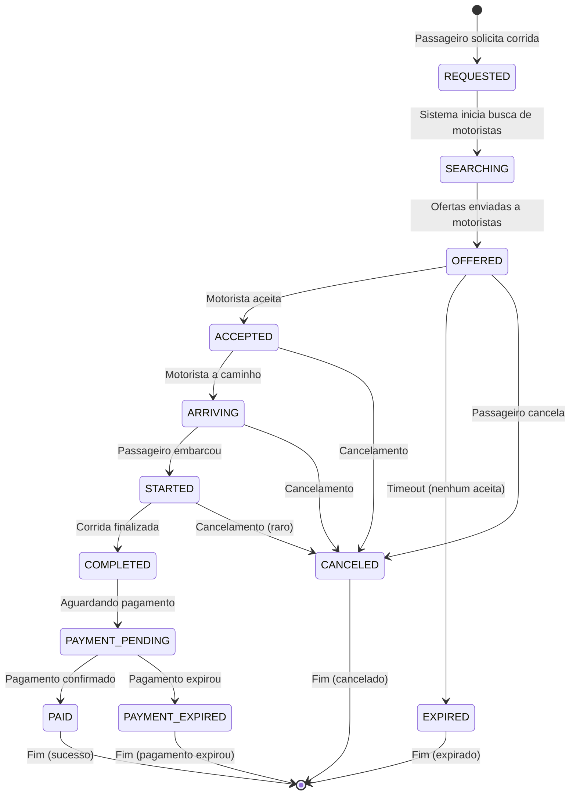
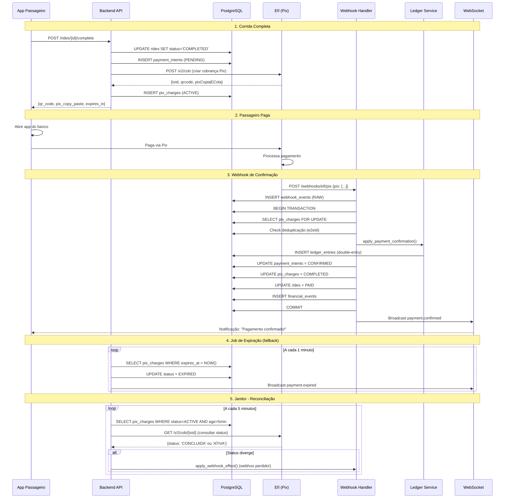
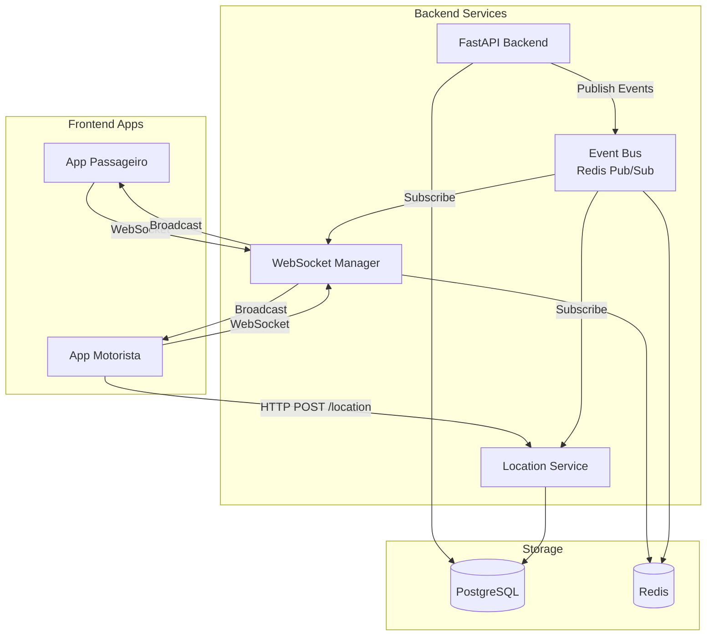
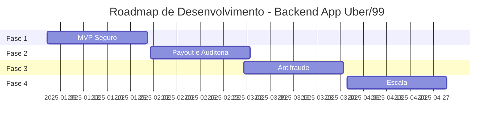

# Itens A, B, C: Modelo de Domínio, Invariantes e Máquina de Estados

**Objetivo:** Definir o modelo de dados completo, regras de negócio invioláveis e fluxos de estados.

---

## 📋 Índice

1. [Item A - Modelo de Domínio](#item-a---modelo-de-domínio)
2. [Item B - Invariantes do Sistema](#item-b---invariantes-do-sistema)
3. [Item C - Máquina de Estados da Corrida](#item-c---máquina-de-estados-da-corrida)

---

# Item A - Modelo de Domínio

## 🚗 Entidades de Mobilidade

### 1. Passenger (Passageiro)

```sql
CREATE TABLE passengers (
    id UUID PRIMARY KEY DEFAULT gen_random_uuid(),

    -- Identificação
    user_id UUID NOT NULL UNIQUE REFERENCES users(id),
    full_name VARCHAR(255) NOT NULL,
    cpf VARCHAR(11) UNIQUE,  -- CPF sem pontuação
    phone VARCHAR(20) NOT NULL,
    email VARCHAR(255) NOT NULL,

    -- Endereços favoritos (JSONB)
    favorite_addresses JSONB DEFAULT '[]'::jsonb,
    -- Formato: [{"label": "Casa", "lat": -23.5505, "lon": -46.6333, "address": "..."}]

    -- Pagamento
    default_payment_method VARCHAR(50) DEFAULT 'pix',

    -- Status
    status VARCHAR(50) NOT NULL DEFAULT 'active',
    -- active, suspended, banned

    -- Avaliação
    average_rating DECIMAL(3, 2) DEFAULT 5.00,
    total_ratings INTEGER DEFAULT 0,

    -- Estatísticas
    total_rides INTEGER DEFAULT 0,
    total_spent DECIMAL(10, 2) DEFAULT 0.00,

    -- Timestamps
    created_at TIMESTAMP WITH TIME ZONE NOT NULL DEFAULT NOW(),
    updated_at TIMESTAMP WITH TIME ZONE NOT NULL DEFAULT NOW(),
    last_ride_at TIMESTAMP WITH TIME ZONE,

    -- Índices
    INDEX idx_passengers_user_id (user_id),
    INDEX idx_passengers_cpf (cpf) WHERE cpf IS NOT NULL,
    INDEX idx_passengers_phone (phone),
    INDEX idx_passengers_status (status),

    CONSTRAINT valid_passenger_status CHECK (status IN ('active', 'suspended', 'banned')),
    CONSTRAINT valid_rating CHECK (average_rating >= 1.00 AND average_rating <= 5.00)
);
```

### 2. Driver (Motorista)

```sql
CREATE TABLE drivers (
    id UUID PRIMARY KEY DEFAULT gen_random_uuid(),

    -- Identificação
    user_id UUID NOT NULL UNIQUE REFERENCES users(id),
    full_name VARCHAR(255) NOT NULL,
    cpf VARCHAR(11) NOT NULL UNIQUE,
    phone VARCHAR(20) NOT NULL,
    email VARCHAR(255) NOT NULL,

    -- Documentação
    cnh_number VARCHAR(20) NOT NULL UNIQUE,
    cnh_category VARCHAR(5) NOT NULL,  -- B, C, D, E
    cnh_expiry_date DATE NOT NULL,

    -- Conta bancária (para repasses)
    bank_code VARCHAR(3),
    bank_branch VARCHAR(10),
    bank_account VARCHAR(20),
    bank_account_type VARCHAR(20),  -- checking, savings
    pix_key VARCHAR(255),
    pix_key_type VARCHAR(20),  -- cpf, email, phone, random

    -- Status
    status VARCHAR(50) NOT NULL DEFAULT 'pending_approval',
    -- pending_approval, active, available, on_trip, offline, suspended, banned

    approval_status VARCHAR(50) DEFAULT 'pending',
    -- pending, approved, rejected
    approved_at TIMESTAMP WITH TIME ZONE,
    approved_by UUID REFERENCES users(id),

    -- Localização atual
    current_lat DECIMAL(10, 8),
    current_lon DECIMAL(11, 8),
    current_heading DECIMAL(5, 2),  -- 0-360 graus
    last_location_update TIMESTAMP WITH TIME ZONE,

    -- Corrida atual
    current_ride_id UUID REFERENCES rides(id),

    -- Avaliação
    average_rating DECIMAL(3, 2) DEFAULT 5.00,
    total_ratings INTEGER DEFAULT 0,

    -- Estatísticas
    total_rides INTEGER DEFAULT 0,
    total_distance_km DECIMAL(10, 2) DEFAULT 0.00,
    total_earnings DECIMAL(10, 2) DEFAULT 0.00,

    -- Disponibilidade
    online BOOLEAN DEFAULT FALSE,
    accepting_rides BOOLEAN DEFAULT TRUE,

    -- Timestamps
    created_at TIMESTAMP WITH TIME ZONE NOT NULL DEFAULT NOW(),
    updated_at TIMESTAMP WITH TIME ZONE NOT NULL DEFAULT NOW(),
    last_ride_at TIMESTAMP WITH TIME ZONE,

    -- Índices
    INDEX idx_drivers_user_id (user_id),
    INDEX idx_drivers_cpf (cpf),
    INDEX idx_drivers_status (status),
    INDEX idx_drivers_online (online, status) WHERE online = TRUE,
    INDEX idx_drivers_location (current_lat, current_lon) WHERE online = TRUE,
    INDEX idx_drivers_current_ride (current_ride_id) WHERE current_ride_id IS NOT NULL,

    CONSTRAINT valid_driver_status CHECK (status IN (
        'pending_approval', 'active', 'available', 'on_trip', 'offline', 'suspended', 'banned'
    )),
    CONSTRAINT valid_approval_status CHECK (approval_status IN ('pending', 'approved', 'rejected')),
    CONSTRAINT valid_rating CHECK (average_rating >= 1.00 AND average_rating <= 5.00),
    CONSTRAINT cnh_not_expired CHECK (cnh_expiry_date > CURRENT_DATE)
);
```

### 3. Vehicle (Veículo)

```sql
CREATE TABLE vehicles (
    id UUID PRIMARY KEY DEFAULT gen_random_uuid(),

    -- Propriedade
    driver_id UUID NOT NULL REFERENCES drivers(id),

    -- Identificação
    license_plate VARCHAR(10) NOT NULL UNIQUE,
    renavam VARCHAR(20),

    -- Características
    brand VARCHAR(100) NOT NULL,  -- Marca: Toyota, Honda, etc.
    model VARCHAR(100) NOT NULL,  -- Modelo: Corolla, Civic, etc.
    year INTEGER NOT NULL,
    color VARCHAR(50) NOT NULL,

    -- Categoria
    category VARCHAR(50) NOT NULL DEFAULT 'standard',
    -- standard, comfort, premium, xl

    seats INTEGER NOT NULL DEFAULT 4,

    -- Documentação
    crlv_number VARCHAR(50),  -- Certificado de Registro
    crlv_expiry_date DATE,

    -- Status
    status VARCHAR(50) NOT NULL DEFAULT 'pending_approval',
    -- pending_approval, active, inactive, suspended

    approval_status VARCHAR(50) DEFAULT 'pending',
    approved_at TIMESTAMP WITH TIME ZONE,
    approved_by UUID REFERENCES users(id),

    -- Timestamps
    created_at TIMESTAMP WITH TIME ZONE NOT NULL DEFAULT NOW(),
    updated_at TIMESTAMP WITH TIME ZONE NOT NULL DEFAULT NOW(),

    -- Índices
    INDEX idx_vehicles_driver (driver_id),
    INDEX idx_vehicles_plate (license_plate),
    INDEX idx_vehicles_status (status),

    CONSTRAINT valid_vehicle_status CHECK (status IN (
        'pending_approval', 'active', 'inactive', 'suspended'
    )),
    CONSTRAINT valid_category CHECK (category IN ('standard', 'comfort', 'premium', 'xl')),
    CONSTRAINT valid_year CHECK (year >= 2010 AND year <= EXTRACT(YEAR FROM CURRENT_DATE) + 1)
);
```

### 4. Ride (Corrida)

```sql
CREATE TABLE rides (
    id UUID PRIMARY KEY DEFAULT gen_random_uuid(),

    -- Participantes
    passenger_id UUID NOT NULL REFERENCES passengers(id),
    driver_id UUID REFERENCES drivers(id),  -- NULL até ser aceita
    vehicle_id UUID REFERENCES vehicles(id),

    -- Status
    status VARCHAR(50) NOT NULL DEFAULT 'REQUESTED',
    -- REQUESTED → SEARCHING → OFFERED → ACCEPTED → ARRIVING → STARTED → COMPLETED
    -- CANCELED, EXPIRED, PAYMENT_PENDING, PAID, PAYMENT_EXPIRED

    -- Localização: Partida
    pickup_lat DECIMAL(10, 8) NOT NULL,
    pickup_lon DECIMAL(11, 8) NOT NULL,
    pickup_address TEXT NOT NULL,

    -- Localização: Destino
    dropoff_lat DECIMAL(10, 8),
    dropoff_lon DECIMAL(11, 8),
    dropoff_address TEXT,

    -- Categoria solicitada
    requested_category VARCHAR(50) NOT NULL DEFAULT 'standard',

    -- Estimativas (calculadas ao criar)
    estimated_distance_km DECIMAL(10, 2),
    estimated_duration_minutes INTEGER,
    estimated_fare DECIMAL(10, 2),

    -- Valores reais (preenchidos durante/após corrida)
    actual_distance_km DECIMAL(10, 2),
    actual_duration_minutes INTEGER,
    final_fare DECIMAL(10, 2),

    -- Timestamps do fluxo
    created_at TIMESTAMP WITH TIME ZONE NOT NULL DEFAULT NOW(),
    searching_started_at TIMESTAMP WITH TIME ZONE,
    offered_at TIMESTAMP WITH TIME ZONE,
    accepted_at TIMESTAMP WITH TIME ZONE,
    driver_arrived_at TIMESTAMP WITH TIME ZONE,
    started_at TIMESTAMP WITH TIME ZONE,
    completed_at TIMESTAMP WITH TIME ZONE,
    canceled_at TIMESTAMP WITH TIME ZONE,
    paid_at TIMESTAMP WITH TIME ZONE,

    -- Expiração
    expires_at TIMESTAMP WITH TIME ZONE,

    -- Cancelamento
    canceled_by VARCHAR(50),  -- passenger, driver, system
    cancellation_reason TEXT,
    cancellation_fee DECIMAL(10, 2) DEFAULT 0.00,

    -- Avaliações
    passenger_rating INTEGER,  -- 1-5
    passenger_review TEXT,
    driver_rating INTEGER,  -- 1-5
    driver_review TEXT,

    -- Concorrência (otimista)
    version INTEGER NOT NULL DEFAULT 1,

    -- Índices
    INDEX idx_rides_passenger (passenger_id),
    INDEX idx_rides_driver (driver_id) WHERE driver_id IS NOT NULL,
    INDEX idx_rides_status (status, created_at),
    INDEX idx_rides_created (created_at),
    INDEX idx_rides_expires (expires_at) WHERE expires_at IS NOT NULL,
    INDEX idx_rides_pickup_location (pickup_lat, pickup_lon),

    CONSTRAINT valid_ride_status CHECK (status IN (
        'REQUESTED', 'SEARCHING', 'OFFERED', 'ACCEPTED', 'ARRIVING', 'STARTED',
        'COMPLETED', 'CANCELED', 'EXPIRED', 'PAYMENT_PENDING', 'PAID', 'PAYMENT_EXPIRED'
    )),
    CONSTRAINT driver_required_after_accepted CHECK (
        (status IN ('ACCEPTED', 'ARRIVING', 'STARTED', 'COMPLETED', 'PAID') AND driver_id IS NOT NULL) OR
        (status NOT IN ('ACCEPTED', 'ARRIVING', 'STARTED', 'COMPLETED', 'PAID'))
    ),
    CONSTRAINT valid_ratings CHECK (
        (passenger_rating IS NULL OR (passenger_rating >= 1 AND passenger_rating <= 5)) AND
        (driver_rating IS NULL OR (driver_rating >= 1 AND driver_rating <= 5))
    )
);
```

### 5. RideOffer (Oferta de Corrida)

```sql
CREATE TABLE ride_offers (
    id UUID PRIMARY KEY DEFAULT gen_random_uuid(),

    -- Relacionamentos
    ride_id UUID NOT NULL REFERENCES rides(id) ON DELETE CASCADE,
    driver_id UUID NOT NULL REFERENCES drivers(id),

    -- Oferta
    offered_at TIMESTAMP WITH TIME ZONE NOT NULL DEFAULT NOW(),
    expires_at TIMESTAMP WITH TIME ZONE NOT NULL,

    -- Estimativas para o motorista
    distance_to_pickup_km DECIMAL(10, 2),
    eta_to_pickup_minutes INTEGER,
    estimated_earnings DECIMAL(10, 2),

    -- Resposta
    responded_at TIMESTAMP WITH TIME ZONE,
    response VARCHAR(50),
    -- ACCEPTED, REJECTED, EXPIRED, CANCELED

    -- Índices
    UNIQUE (ride_id, driver_id),
    INDEX idx_offers_ride (ride_id),
    INDEX idx_offers_driver (driver_id, offered_at),
    INDEX idx_offers_expires (expires_at) WHERE response IS NULL,

    CONSTRAINT valid_offer_response CHECK (response IN (
        'ACCEPTED', 'REJECTED', 'EXPIRED', 'CANCELED'
    ))
);
```

### 6. LocationUpdate (Atualização de Localização)

```sql
CREATE TABLE location_updates (
    id BIGSERIAL PRIMARY KEY,

    -- Entidade (driver ou passenger)
    entity_type VARCHAR(20) NOT NULL,  -- driver, passenger
    entity_id UUID NOT NULL,

    -- Corrida (se houver)
    ride_id UUID REFERENCES rides(id),

    -- Localização
    lat DECIMAL(10, 8) NOT NULL,
    lon DECIMAL(11, 8) NOT NULL,
    accuracy DECIMAL(6, 2),  -- metros
    altitude DECIMAL(8, 2),
    heading DECIMAL(5, 2),  -- 0-360 graus
    speed DECIMAL(6, 2),  -- km/h

    -- Timestamps
    device_time TIMESTAMP WITH TIME ZONE NOT NULL,  -- Hora do dispositivo
    server_time TIMESTAMP WITH TIME ZONE NOT NULL DEFAULT NOW(),  -- Hora do servidor

    -- Metadata
    source VARCHAR(50),  -- gps, network, fused

    -- Particionamento por data (recomendado)
    -- PARTITION BY RANGE (server_time);

    -- Índices
    INDEX idx_location_entity (entity_type, entity_id, server_time DESC),
    INDEX idx_location_ride (ride_id, server_time) WHERE ride_id IS NOT NULL,
    INDEX idx_location_time (server_time DESC),

    CONSTRAINT valid_entity_type CHECK (entity_type IN ('driver', 'passenger'))
);

-- Criar partições mensais (exemplo)
-- CREATE TABLE location_updates_2024_12 PARTITION OF location_updates
--     FOR VALUES FROM ('2024-12-01') TO ('2025-01-01');
```

---

## 💰 Entidades Financeiras

### 7. PaymentIntent (Intenção de Pagamento)

**Ver documento:** `E-PIX-WEBHOOK-TRANSACIONAL.md`

```sql
CREATE TABLE payment_intents (
    id UUID PRIMARY KEY DEFAULT gen_random_uuid(),
    ride_id UUID NOT NULL REFERENCES rides(id),

    amount DECIMAL(10, 2) NOT NULL,
    currency VARCHAR(3) NOT NULL DEFAULT 'BRL',

    status VARCHAR(50) NOT NULL DEFAULT 'PENDING',
    -- PENDING, CONFIRMED, EXPIRED, REFUNDED, FAILED

    payment_method VARCHAR(50) DEFAULT 'pix',
    description TEXT,

    created_at TIMESTAMP WITH TIME ZONE NOT NULL DEFAULT NOW(),
    confirmed_at TIMESTAMP WITH TIME ZONE,
    expires_at TIMESTAMP WITH TIME ZONE,

    INDEX idx_payment_intents_ride (ride_id),
    INDEX idx_payment_intents_status (status),

    CONSTRAINT valid_payment_status CHECK (status IN (
        'PENDING', 'CONFIRMED', 'EXPIRED', 'REFUNDED', 'FAILED'
    ))
);
```

### 8. PixCharge (Cobrança Pix)

**Ver documento:** `E-PIX-WEBHOOK-TRANSACIONAL.md`

```sql
CREATE TABLE pix_charges (
    id UUID PRIMARY KEY DEFAULT gen_random_uuid(),
    payment_intent_id UUID NOT NULL REFERENCES payment_intents(id),

    txid VARCHAR(100) NOT NULL UNIQUE,
    e2e_id VARCHAR(100) UNIQUE,

    qr_code TEXT NOT NULL,
    pix_copy_paste TEXT NOT NULL,
    amount DECIMAL(10, 2) NOT NULL,

    status VARCHAR(50) NOT NULL DEFAULT 'ACTIVE',
    -- ACTIVE, COMPLETED, EXPIRED, REMOVED

    created_at TIMESTAMP WITH TIME ZONE NOT NULL DEFAULT NOW(),
    expires_at TIMESTAMP WITH TIME ZONE NOT NULL,
    paid_at TIMESTAMP WITH TIME ZONE,

    efi_response JSONB,

    INDEX idx_pix_charges_payment_intent (payment_intent_id),
    INDEX idx_pix_charges_txid (txid),
    INDEX idx_pix_charges_status (status)
);
```

### 9. LedgerAccount (Conta Contábil)

```sql
CREATE TABLE ledger_accounts (
    id UUID PRIMARY KEY DEFAULT gen_random_uuid(),

    -- Código da conta (Chart of Accounts)
    code VARCHAR(20) NOT NULL UNIQUE,  -- Ex: 1100, 2100, 4100
    name VARCHAR(255) NOT NULL,

    -- Tipo
    account_type VARCHAR(50) NOT NULL,
    -- ASSET, LIABILITY, EQUITY, INCOME, EXPENSE

    -- Hierarquia
    parent_id UUID REFERENCES ledger_accounts(id),

    -- Classificação
    classification VARCHAR(50) NOT NULL,
    -- HEADER (agrupamento) ou DETAIL (transacional)

    -- Status
    active BOOLEAN NOT NULL DEFAULT TRUE,
    allow_manual_entries BOOLEAN DEFAULT FALSE,

    -- Metadata
    description TEXT,

    created_at TIMESTAMP WITH TIME ZONE NOT NULL DEFAULT NOW(),
    updated_at TIMESTAMP WITH TIME ZONE NOT NULL DEFAULT NOW(),

    INDEX idx_ledger_accounts_code (code),
    INDEX idx_ledger_accounts_type (account_type),
    INDEX idx_ledger_accounts_parent (parent_id),

    CONSTRAINT valid_account_type CHECK (account_type IN (
        'ASSET', 'LIABILITY', 'EQUITY', 'INCOME', 'EXPENSE'
    )),
    CONSTRAINT valid_classification CHECK (classification IN ('HEADER', 'DETAIL'))
);
```

### 10. LedgerEntry (Lançamento Contábil)

```sql
CREATE TABLE ledger_entries (
    id BIGSERIAL PRIMARY KEY,

    -- Transação (agrupa débitos e créditos)
    transaction_id VARCHAR(100) NOT NULL,

    -- Conta
    account_id UUID NOT NULL REFERENCES ledger_accounts(id),

    -- Tipo (débito ou crédito)
    entry_type VARCHAR(10) NOT NULL,  -- DEBIT, CREDIT

    -- Valor
    amount DECIMAL(19, 6) NOT NULL,
    currency VARCHAR(3) NOT NULL DEFAULT 'BRL',

    -- Entidade relacionada (rastreabilidade)
    entity_type VARCHAR(50),  -- RIDE, PAYMENT, PAYOUT, COMMISSION
    entity_id VARCHAR(100),

    -- Motorista (se aplicável)
    driver_id UUID REFERENCES drivers(id),

    -- Referência externa (ex: e2eId do Pix)
    reference_number VARCHAR(255),

    -- Descrição
    description TEXT,

    -- Reversão
    reversed BOOLEAN DEFAULT FALSE,
    reversal_entry_id BIGINT REFERENCES ledger_entries(id),

    -- Timestamps
    transaction_date DATE NOT NULL DEFAULT CURRENT_DATE,
    created_at TIMESTAMP WITH TIME ZONE NOT NULL DEFAULT NOW(),
    created_by UUID REFERENCES users(id),

    -- Índices
    INDEX idx_ledger_entries_transaction (transaction_id),
    INDEX idx_ledger_entries_account (account_id, transaction_date),
    INDEX idx_ledger_entries_driver (driver_id) WHERE driver_id IS NOT NULL,
    INDEX idx_ledger_entries_entity (entity_type, entity_id),
    INDEX idx_ledger_entries_reference (reference_number) WHERE reference_number IS NOT NULL,
    INDEX idx_ledger_entries_date (transaction_date),

    CONSTRAINT valid_entry_type CHECK (entry_type IN ('DEBIT', 'CREDIT')),
    CONSTRAINT positive_amount CHECK (amount > 0)
);
```

### 11. FinancialEvent (Evento Financeiro)

**Ver documento:** `E-PIX-WEBHOOK-TRANSACIONAL.md`

```sql
CREATE TABLE financial_events (
    id UUID PRIMARY KEY DEFAULT gen_random_uuid(),

    event_type VARCHAR(100) NOT NULL,
    -- ride.completed, payment.confirmed, payout.created, refund.created

    ride_id UUID REFERENCES rides(id),
    payment_intent_id UUID REFERENCES payment_intents(id),
    payout_id UUID,  -- References payouts(id)

    amount DECIMAL(10, 2) NOT NULL,
    currency VARCHAR(3) NOT NULL DEFAULT 'BRL',

    external_id VARCHAR(255) UNIQUE,  -- Deduplicação

    occurred_at TIMESTAMP WITH TIME ZONE NOT NULL DEFAULT NOW(),

    metadata JSONB,

    INDEX idx_financial_events_type (event_type),
    INDEX idx_financial_events_ride (ride_id),
    INDEX idx_financial_events_external_id (external_id)
);
```

### 12. Payout (Repasse ao Motorista)

```sql
CREATE TABLE payouts (
    id UUID PRIMARY KEY DEFAULT gen_random_uuid(),

    -- Motorista
    driver_id UUID NOT NULL REFERENCES drivers(id),

    -- Valor
    amount DECIMAL(10, 2) NOT NULL,
    currency VARCHAR(3) NOT NULL DEFAULT 'BRL',

    -- Status
    status VARCHAR(50) NOT NULL DEFAULT 'PENDING',
    -- PENDING, PROCESSING, COMPLETED, FAILED, REVERSED

    -- Método de pagamento
    payout_method VARCHAR(50) NOT NULL,  -- pix, bank_transfer

    -- Dados bancários (snapshot no momento do payout)
    bank_details JSONB NOT NULL,

    -- Gateway de pagamento
    provider VARCHAR(50),  -- efi, stripe, etc.
    provider_transaction_id VARCHAR(255),
    provider_response JSONB,

    -- Timestamps
    created_at TIMESTAMP WITH TIME ZONE NOT NULL DEFAULT NOW(),
    processing_started_at TIMESTAMP WITH TIME ZONE,
    completed_at TIMESTAMP WITH TIME ZONE,
    failed_at TIMESTAMP WITH TIME ZONE,

    -- Erro
    failure_reason TEXT,

    -- Conciliação
    reconciled BOOLEAN DEFAULT FALSE,
    reconciled_at TIMESTAMP WITH TIME ZONE,

    INDEX idx_payouts_driver (driver_id, created_at DESC),
    INDEX idx_payouts_status (status),
    INDEX idx_payouts_provider_tx (provider_transaction_id),

    CONSTRAINT valid_payout_status CHECK (status IN (
        'PENDING', 'PROCESSING', 'COMPLETED', 'FAILED', 'REVERSED'
    )),
    CONSTRAINT positive_amount CHECK (amount > 0)
);
```

---

## 👤 Entidades de Usuário e Autenticação

### 13. User (Usuário)

```sql
CREATE TABLE users (
    id UUID PRIMARY KEY DEFAULT gen_random_uuid(),

    -- Autenticação
    email VARCHAR(255) NOT NULL UNIQUE,
    phone VARCHAR(20) UNIQUE,
    password_hash VARCHAR(255) NOT NULL,

    -- Tipo
    user_type VARCHAR(50) NOT NULL,
    -- passenger, driver, admin

    -- Verificação
    email_verified BOOLEAN DEFAULT FALSE,
    phone_verified BOOLEAN DEFAULT FALSE,
    email_verified_at TIMESTAMP WITH TIME ZONE,
    phone_verified_at TIMESTAMP WITH TIME ZONE,

    -- Status
    status VARCHAR(50) NOT NULL DEFAULT 'active',
    -- active, suspended, banned

    -- MFA
    mfa_enabled BOOLEAN DEFAULT FALSE,
    mfa_secret VARCHAR(255),

    -- Timestamps
    created_at TIMESTAMP WITH TIME ZONE NOT NULL DEFAULT NOW(),
    updated_at TIMESTAMP WITH TIME ZONE NOT NULL DEFAULT NOW(),
    last_login_at TIMESTAMP WITH TIME ZONE,

    INDEX idx_users_email (email),
    INDEX idx_users_phone (phone),
    INDEX idx_users_type (user_type),

    CONSTRAINT valid_user_type CHECK (user_type IN ('passenger', 'driver', 'admin')),
    CONSTRAINT valid_user_status CHECK (status IN ('active', 'suspended', 'banned'))
);
```

---

## 🔔 Entidades de Eventos e Auditoria

### 14. WebhookEvent (Evento de Webhook)

**Ver documento:** `E-PIX-WEBHOOK-TRANSACIONAL.md`

```sql
CREATE TABLE webhook_events (
    id UUID PRIMARY KEY DEFAULT gen_random_uuid(),

    provider VARCHAR(50) NOT NULL DEFAULT 'efi',
    event_type VARCHAR(100) NOT NULL,

    txid VARCHAR(100),
    e2e_id VARCHAR(100),

    payload JSONB NOT NULL,
    payload_hash VARCHAR(64) NOT NULL,

    processed BOOLEAN NOT NULL DEFAULT FALSE,
    processed_at TIMESTAMP WITH TIME ZONE,
    processing_error TEXT,

    received_at TIMESTAMP WITH TIME ZONE NOT NULL DEFAULT NOW(),
    signature VARCHAR(500),
    ip_address INET,

    INDEX idx_webhook_events_txid (txid),
    INDEX idx_webhook_events_hash (payload_hash),
    INDEX idx_webhook_events_processed (processed, received_at)
);
```

### 15. AuditLog (Log de Auditoria)

```sql
CREATE TABLE audit_logs (
    id BIGSERIAL PRIMARY KEY,

    -- Ação
    action VARCHAR(100) NOT NULL,
    -- create_ride, accept_ride, cancel_ride, approve_driver, etc.

    -- Entidade afetada
    entity_type VARCHAR(50) NOT NULL,
    entity_id VARCHAR(100) NOT NULL,

    -- Usuário
    user_id UUID REFERENCES users(id),
    user_type VARCHAR(50),

    -- Mudanças (antes/depois)
    changes JSONB,

    -- Metadata
    ip_address INET,
    user_agent TEXT,
    request_id VARCHAR(100),

    -- Timestamp
    occurred_at TIMESTAMP WITH TIME ZONE NOT NULL DEFAULT NOW(),

    INDEX idx_audit_logs_entity (entity_type, entity_id),
    INDEX idx_audit_logs_user (user_id, occurred_at DESC),
    INDEX idx_audit_logs_action (action, occurred_at DESC),
    INDEX idx_audit_logs_time (occurred_at DESC)
);
```

---

## 📊 Diagrama de Relacionamentos (ER)

```
┌─────────────┐       ┌─────────────┐       ┌─────────────┐
│    User     │──────>│  Passenger  │──────>│    Ride     │
└─────────────┘       └─────────────┘       └─────────────┘
      │                                              │
      │                                              │
      ▼                                              ▼
┌─────────────┐       ┌─────────────┐       ┌─────────────┐
│   Driver    │──────>│   Vehicle   │       │ RideOffer   │
└─────────────┘       └─────────────┘       └─────────────┘
      │                                              │
      │                                              │
      ▼                                              ▼
┌─────────────┐       ┌─────────────┐       ┌─────────────┐
│  Location   │       │PaymentIntent│──────>│ PixCharge   │
│  Update     │       └─────────────┘       └─────────────┘
└─────────────┘               │
                              │
                              ▼
                      ┌─────────────┐
                      │  Financial  │
                      │   Event     │
                      └─────────────┘
                              │
                              ▼
                      ┌─────────────┐       ┌─────────────┐
                      │   Ledger    │──────>│   Ledger    │
                      │   Entry     │       │   Account   │
                      └─────────────┘       └─────────────┘
                              │
                              ▼
                      ┌─────────────┐
                      │   Payout    │
                      └─────────────┘
```

---

# Item B - Invariantes do Sistema

## 🔒 Regras que NUNCA podem quebrar

### Invariante 1: Unicidade de Aceite de Corrida

**Regra:** Uma Ride só pode ter 1 Driver "ACEITO" ativo.

**Garantias:**
- `rides.driver_id` é NULL ou aponta para exatamente 1 driver
- Quando `status = 'ACCEPTED'`, `driver_id` NÃO pode ser NULL
- `ride_offers` pode ter múltiplas ofertas, mas apenas 1 com `response = 'ACCEPTED'`

**Validação:**
```sql
-- Constraint no banco
ALTER TABLE rides ADD CONSTRAINT driver_required_after_accepted CHECK (
    (status IN ('ACCEPTED', 'ARRIVING', 'STARTED', 'COMPLETED', 'PAID') AND driver_id IS NOT NULL) OR
    (status NOT IN ('ACCEPTED', 'ARRIVING', 'STARTED', 'COMPLETED', 'PAID'))
);

-- Query de verificação
SELECT ride_id, COUNT(*) as accepted_count
FROM ride_offers
WHERE response = 'ACCEPTED'
GROUP BY ride_id
HAVING COUNT(*) > 1;
-- Deve retornar 0 linhas
```

**Implementação:**
- Lock distribuído (Redis)
- SELECT ... FOR UPDATE (PostgreSQL)
- Idempotency key
- Ver documento `D-ACCEPT-RIDE-TRANSACIONAL.md`

---

### Invariante 2: Idempotência de Pagamentos

**Regra:** Um PaymentIntent tem no máximo 1 confirmação efetiva.

**Garantias:**
- `payment_intents.status` só pode ir de `PENDING` → `CONFIRMED` uma vez
- `financial_events.external_id` (e2eId) é UNIQUE
- Webhooks duplicados não geram efeito financeiro duplicado

**Validação:**
```sql
-- Constraint
ALTER TABLE financial_events ADD CONSTRAINT unique_external_id UNIQUE (external_id);

-- Query de verificação
SELECT external_id, COUNT(*) as count
FROM financial_events
WHERE external_id IS NOT NULL
GROUP BY external_id
HAVING COUNT(*) > 1;
-- Deve retornar 0 linhas
```

**Implementação:**
- Deduplicação por e2eId
- Lock em PixCharge durante processamento de webhook
- Ver documento `E-PIX-WEBHOOK-TRANSACIONAL.md`

---

### Invariante 3: Imutabilidade do Ledger

**Regra:** LedgerEntry é imutável (append-only).

**Garantias:**
- Entradas nunca são atualizadas ou deletadas
- Reversões são feitas via novos LedgerEntries invertidos
- `ledger_entries.reversed` só pode ir de `FALSE` → `TRUE`

**Validação:**
```sql
-- Trigger para prevenir UPDATE e DELETE
CREATE OR REPLACE FUNCTION prevent_ledger_modification()
RETURNS TRIGGER AS $$
BEGIN
    IF TG_OP = 'UPDATE' THEN
        -- Permitir apenas atualização do campo 'reversed'
        IF OLD.reversed = FALSE AND NEW.reversed = TRUE AND
           OLD.id = NEW.id AND
           OLD.transaction_id = NEW.transaction_id AND
           OLD.account_id = NEW.account_id AND
           OLD.amount = NEW.amount THEN
            RETURN NEW;
        END IF;
        RAISE EXCEPTION 'Ledger entries are immutable';
    ELSIF TG_OP = 'DELETE' THEN
        RAISE EXCEPTION 'Ledger entries cannot be deleted';
    END IF;
    RETURN NULL;
END;
$$ LANGUAGE plpgsql;

CREATE TRIGGER prevent_ledger_modification_trigger
BEFORE UPDATE OR DELETE ON ledger_entries
FOR EACH ROW EXECUTE FUNCTION prevent_ledger_modification();
```

**Implementação:**
- Application-level: Nunca UPDATE/DELETE
- Database-level: Trigger previne modificações
- Ver documento `F-LEDGER-FINANCEIRO.md` (a ser criado)

---

### Invariante 4: Balanceamento do Ledger (Double-Entry)

**Regra:** Para cada transaction_id, soma de DEBIT = soma de CREDIT.

**Garantias:**
- Todas entradas de uma transação são criadas atomicamente
- Não é possível ter transação desbalanceada

**Validação:**
```sql
-- Query de verificação
SELECT
    transaction_id,
    SUM(CASE WHEN entry_type = 'DEBIT' THEN amount ELSE 0 END) as total_debit,
    SUM(CASE WHEN entry_type = 'CREDIT' THEN amount ELSE 0 END) as total_credit,
    SUM(CASE WHEN entry_type = 'DEBIT' THEN amount ELSE -amount END) as balance
FROM ledger_entries
WHERE reversed = FALSE
GROUP BY transaction_id
HAVING SUM(CASE WHEN entry_type = 'DEBIT' THEN amount ELSE -amount END) != 0;
-- Deve retornar 0 linhas
```

**Implementação:**
```python
async def create_journal_entry(transaction_id: str, entries: List[Entry]):
    # Validar balanceamento ANTES de persistir
    total_debit = sum(e.amount for e in entries if e.type == "DEBIT")
    total_credit = sum(e.amount for e in entries if e.type == "CREDIT")

    if total_debit != total_credit:
        raise UnbalancedTransactionError(
            f"Debit ({total_debit}) != Credit ({total_credit})"
        )

    # Inserir todas entradas atomicamente
    async with db.transaction():
        for entry in entries:
            db.add(LedgerEntry(transaction_id=transaction_id, ...))
```

---

### Invariante 5: Saldo do Motorista Não Negativo

**Regra:** Payout nunca pode exceder saldo disponível do driver.

**Garantias:**
- Saldo é derivado do ledger (soma de entradas)
- Payout só é criado se saldo >= valor solicitado

**Validação:**
```sql
-- Query para calcular saldo
WITH driver_balance AS (
    SELECT
        driver_id,
        SUM(
            CASE
                WHEN entry_type = 'CREDIT' THEN amount
                WHEN entry_type = 'DEBIT' THEN -amount
            END
        ) as balance
    FROM ledger_entries
    WHERE driver_id IS NOT NULL
      AND reversed = FALSE
      AND account_id = (SELECT id FROM ledger_accounts WHERE code = 'MOTORISTAS_A_PAGAR')
    GROUP BY driver_id
)
SELECT * FROM driver_balance WHERE balance < 0;
-- Deve retornar 0 linhas
```

**Implementação:**
```python
async def create_payout(driver_id: UUID, amount: Decimal):
    async with db.transaction():
        # Calcular saldo disponível
        balance = await ledger_service.get_driver_balance(driver_id)

        if balance < amount:
            raise InsufficientBalanceError(
                f"Balance {balance} < requested {amount}"
            )

        # Criar payout
        payout = Payout(driver_id=driver_id, amount=amount, ...)
        db.add(payout)

        # Criar ledger entries
        await ledger_service.create_journal_entry(
            transaction_id=f"payout_{payout.id}",
            entries=[
                {"account": "MOTORISTAS_A_PAGAR", "type": "DEBIT", "amount": amount, "driver_id": driver_id},
                {"account": "BANCO_CORRENTE", "type": "CREDIT", "amount": amount}
            ]
        )
```

---

### Invariante 6: Webhook Nunca Aplica Mesmo Efeito Duas Vezes

**Regra:** WebhookEvent nunca pode aplicar o mesmo efeito duas vezes.

**Garantias:**
- Deduplicação por `external_id` (e2eId)
- Flag `processed` previne reprocessamento
- Idempotência garantida

**Validação:**
```sql
-- Verificar eventos duplicados
SELECT e2e_id, COUNT(*) as count
FROM webhook_events
WHERE processed = TRUE AND e2e_id IS NOT NULL
GROUP BY e2e_id
HAVING COUNT(*) > 1;
-- Múltiplos webhooks OK, mas apenas 1 processado

-- Verificar efeitos financeiros duplicados
SELECT external_id, COUNT(*) as count
FROM financial_events
GROUP BY external_id
HAVING COUNT(*) > 1;
-- Deve retornar 0 linhas
```

**Implementação:**
- Ver documento `E-PIX-WEBHOOK-TRANSACIONAL.md`

---

### Invariante 7: Driver Só Pode Ter 1 Corrida Ativa

**Regra:** Um driver só pode estar em 1 corrida por vez.

**Garantias:**
- `drivers.current_ride_id` aponta para no máximo 1 ride
- Quando status = 'on_trip', `current_ride_id` NOT NULL

**Validação:**
```sql
-- Constraint
ALTER TABLE drivers ADD CONSTRAINT current_ride_when_on_trip CHECK (
    (status = 'on_trip' AND current_ride_id IS NOT NULL) OR
    (status != 'on_trip')
);

-- Query de verificação
SELECT driver_id, COUNT(*) as active_rides
FROM rides
WHERE driver_id IS NOT NULL
  AND status IN ('ACCEPTED', 'ARRIVING', 'STARTED')
GROUP BY driver_id
HAVING COUNT(*) > 1;
-- Deve retornar 0 linhas
```

---

### Invariante 8: Timestamps Consistentes

**Regra:** Timestamps devem respeitar ordem lógica.

**Garantias:**
- `created_at` <= `accepted_at` <= `started_at` <= `completed_at`
- Não é possível ter `started_at` antes de `accepted_at`

**Validação:**
```sql
-- Query de verificação
SELECT id, status, created_at, accepted_at, started_at, completed_at
FROM rides
WHERE
    (accepted_at IS NOT NULL AND accepted_at < created_at) OR
    (started_at IS NOT NULL AND started_at < accepted_at) OR
    (completed_at IS NOT NULL AND completed_at < started_at);
-- Deve retornar 0 linhas
```

**Implementação:**
```sql
-- Constraint (PostgreSQL)
ALTER TABLE rides ADD CONSTRAINT valid_timestamps CHECK (
    (accepted_at IS NULL OR accepted_at >= created_at) AND
    (started_at IS NULL OR started_at >= accepted_at) AND
    (completed_at IS NULL OR completed_at >= started_at)
);
```

---

# Item C - Máquina de Estados da Corrida

## 🔄 Diagrama Mermaid



## 📝 Estados Detalhados

### REQUESTED
**Descrição:** Passageiro acabou de solicitar a corrida.

**Campos:**
- `pickup_lat`, `pickup_lon`, `pickup_address` preenchidos
- `estimated_distance_km`, `estimated_fare` calculados

**Transições:**
- → `SEARCHING`: Automático (sistema inicia busca)
- → `CANCELED`: Passageiro cancela

**Guard Conditions:**
- Passageiro deve estar ativo
- Localização válida

---

### SEARCHING
**Descrição:** Sistema está buscando motoristas disponíveis.

**Ações:**
- Buscar motoristas online próximos
- Calcular distância e ETA para cada motorista

**Transições:**
- → `OFFERED`: Ao menos 1 motorista encontrado
- → `EXPIRED`: Timeout (ex: 60s sem motoristas)
- → `CANCELED`: Passageiro cancela

**Guard Conditions:**
- Motoristas disponíveis no raio de busca

---

### OFFERED
**Descrição:** Ofertas enviadas a múltiplos motoristas.

**Campos:**
- `ride_offers` criados com `expires_at`

**Transições:**
- → `ACCEPTED`: Motorista aceita (primeiro a aceitar ganha)
- → `EXPIRED`: Timeout (ex: 30s sem aceites)
- → `CANCELED`: Passageiro cancela

**Guard Conditions:**
- Ao menos 1 oferta ativa

**Eventos:**
- `offer.sent` para cada motorista
- `offer.accepted` quando aceita
- `offer.canceled` para motoristas que perderam

---

### ACCEPTED
**Descrição:** Motorista aceitou a corrida.

**Campos:**
- `driver_id` preenchido
- `accepted_at` registrado

**Ações:**
- Atualizar `drivers.current_ride_id`
- Atualizar `drivers.status = 'on_trip'`
- Cancelar outras ofertas

**Transições:**
- → `ARRIVING`: Motorista confirmou que está indo
- → `CANCELED`: Cancelamento (passageiro ou motorista)

**Guard Conditions:**
- Motorista deve estar disponível
- Apenas 1 motorista pode aceitar (invariante 1)

**Eventos:**
- `ride.accepted`
- `driver.assigned`

---

### ARRIVING
**Descrição:** Motorista a caminho do ponto de partida.

**Ações:**
- Rastreamento em tempo real
- Atualizar ETA continuamente

**Transições:**
- → `STARTED`: Motorista chegou e passageiro embarcou
- → `CANCELED`: Cancelamento

**Guard Conditions:**
- Motorista deve estar em movimento em direção ao pickup

**Eventos:**
- `driver.location.updated` (frequente)
- `driver.approaching` (quando < 500m)
- `driver.arrived` (quando chegou)

---

### STARTED
**Descrição:** Passageiro embarcou, corrida em andamento.

**Campos:**
- `started_at` registrado

**Ações:**
- Rastreamento contínuo
- Cálculo de distância percorrida
- Atualização de tarifa em tempo real

**Transições:**
- → `COMPLETED`: Motorista finaliza corrida no destino
- → `CANCELED`: Cancelamento excepcional (raro)

**Guard Conditions:**
- Localização válida e em movimento

**Eventos:**
- `ride.started`
- `driver.location.updated`

---

### COMPLETED
**Descrição:** Corrida finalizada, aguardando pagamento.

**Campos:**
- `completed_at` registrado
- `actual_distance_km` calculado
- `actual_duration_minutes` calculado
- `final_fare` calculado

**Ações:**
- Solicitar avaliações (passageiro e motorista)
- Limpar `drivers.current_ride_id`
- Atualizar `drivers.status = 'available'`

**Transições:**
- → `PAYMENT_PENDING`: Pagamento iniciado
- → `CANCELED`: Cancelamento excepcional (com tarifa de cancelamento)

**Guard Conditions:**
- Distância percorrida > 0
- Tarifa calculada

**Eventos:**
- `ride.completed`
- `rating.requested`

---

### PAYMENT_PENDING
**Descrição:** Aguardando confirmação de pagamento via Pix.

**Campos:**
- `payment_intents.status = 'PENDING'`
- `pix_charges.status = 'ACTIVE'`

**Ações:**
- Criar PaymentIntent
- Criar PixCharge na Efí
- Mostrar QR Code ao passageiro

**Transições:**
- → `PAID`: Webhook confirma pagamento
- → `PAYMENT_EXPIRED`: Cobrança Pix expira (ex: 1h)

**Guard Conditions:**
- PaymentIntent criado
- PixCharge ativo

**Eventos:**
- `payment.intent.created`
- `pix.charge.created`

---

### PAID
**Descrição:** Pagamento confirmado, corrida finalizada com sucesso.

**Campos:**
- `paid_at` registrado
- `payment_intents.status = 'CONFIRMED'`
- `pix_charges.status = 'COMPLETED'`

**Ações:**
- Aplicar ledger entries
- Calcular comissão plataforma
- Creditar saldo motorista
- Emitir recibo

**Transições:**
- → (fim): Estado final

**Guard Conditions:**
- Webhook validado
- Efeito financeiro aplicado

**Eventos:**
- `payment.confirmed`
- `ride.paid`
- `ledger.entry.created`

---

### CANCELED
**Descrição:** Corrida cancelada.

**Campos:**
- `canceled_at` registrado
- `canceled_by` (passenger, driver, system)
- `cancellation_reason`
- `cancellation_fee` (se aplicável)

**Ações:**
- Calcular tarifa de cancelamento (se aplicável)
- Limpar `drivers.current_ride_id` (se houver)
- Liberar motorista

**Transições:**
- → (fim): Estado final

**Guard Conditions:**
- Nenhuma (sempre permite cancelamento)

**Eventos:**
- `ride.canceled`

---

### EXPIRED
**Descrição:** Corrida expirou (timeout sem motoristas ou sem aceites).

**Transições:**
- → (fim): Estado final

**Eventos:**
- `ride.expired`

---

### PAYMENT_EXPIRED
**Descrição:** Pagamento não realizado dentro do prazo.

**Ações:**
- Notificar passageiro
- Possível bloqueio de novas corridas até regularizar

**Transições:**
- → (fim): Estado final

**Eventos:**
- `payment.expired`

---

## 🔒 Validações de Transição

```python
# Exemplo de validação de transição
VALID_TRANSITIONS = {
    "REQUESTED": ["SEARCHING", "CANCELED"],
    "SEARCHING": ["OFFERED", "EXPIRED", "CANCELED"],
    "OFFERED": ["ACCEPTED", "EXPIRED", "CANCELED"],
    "ACCEPTED": ["ARRIVING", "CANCELED"],
    "ARRIVING": ["STARTED", "CANCELED"],
    "STARTED": ["COMPLETED", "CANCELED"],
    "COMPLETED": ["PAYMENT_PENDING", "CANCELED"],
    "PAYMENT_PENDING": ["PAID", "PAYMENT_EXPIRED"],
    "PAID": [],  # Estado final
    "CANCELED": [],  # Estado final
    "EXPIRED": [],  # Estado final
    "PAYMENT_EXPIRED": []  # Estado final
}

def validate_transition(current_status: str, new_status: str) -> bool:
    allowed = VALID_TRANSITIONS.get(current_status, [])
    return new_status in allowed

# Uso
if not validate_transition(ride.status, "ACCEPTED"):
    raise InvalidStateTransition(
        f"Cannot transition from {ride.status} to ACCEPTED"
    )
```

---

## 🎯 Resumo Executivo

### Modelo de Domínio
- ✅ **15 entidades** principais definidas
- ✅ **Campos, tipos, constraints** especificados
- ✅ **Índices** para performance
- ✅ **Relacionamentos** documentados

### Invariantes
- ✅ **8 regras críticas** que nunca podem quebrar
- ✅ **Validações SQL** e em código
- ✅ **Queries de verificação** para auditoria

### Máquina de Estados
- ✅ **12 estados** definidos
- ✅ **Transições válidas** especificadas
- ✅ **Guard conditions** documentadas
- ✅ **Eventos** emitidos em cada transição
- ✅ **Diagrama Mermaid** visual

### Próximos Passos
1. ✅ Modelo completo documentado
2. ⏳ Implementar migrations (Alembic)
3. ⏳ Implementar models (SQLAlchemy)
4. ⏳ Implementar validações
5. ⏳ Testes de integridade

---

**Documento criado em:** 14/12/2024
**Versão:** 1.0
**Autor:** Sistema de Arquitetura Backend

# Item D: Controle Transacional do "Accept Ride"

**Objetivo:** Garantir que uma corrida seja aceita por APENAS UM motorista, mesmo sob alta concorrência.

**Criticidade:** 🔴 CRÍTICO - Este é o ponto mais sensível do sistema.

---

## 📋 Índice

1. [Problema](#problema)
2. [3 Abordagens de Concorrência](#3-abordagens-de-concorrência)
3. [Abordagem Escolhida (Híbrida)](#abordagem-escolhida-híbrida)
4. [Esquema de Dados](#esquema-de-dados)
5. [Pseudocódigo do Endpoint](#pseudocódigo-do-endpoint)
6. [Estratégia de Idempotência](#estratégia-de-idempotência)
7. [Eventos Realtime](#eventos-realtime)
8. [Casos de Borda](#casos-de-borda)
9. [Testes e Validação](#testes-e-validação)

---

## 🔴 Problema

### Cenário de Race Condition

```
Tempo | Motorista A              | Motorista B              | Estado do Banco
------|--------------------------|--------------------------|------------------
t0    | GET /rides/123           | -                        | status=OFFERED
t1    | Vê status=OFFERED        | GET /rides/123           | status=OFFERED
t2    | POST /rides/123/accept   | Vê status=OFFERED        | status=OFFERED
t3    | -                        | POST /rides/123/accept   | ???
```

**Resultado indesejado:** Ambos acham que aceitaram a corrida!

### Invariantes que NUNCA podem quebrar

1. ✅ Uma Ride com `status=OFFERED` só pode ter **1 motorista aceito**
2. ✅ Uma Ride só pode transitar de `OFFERED → ACCEPTED` uma única vez
3. ✅ Retries de um mesmo motorista (rede ruim) devem ser idempotentes
4. ✅ Motoristas que perderam a corrida devem ser notificados imediatamente
5. ✅ O passageiro deve ser notificado assim que corrida for aceita

---

## 🔀 3 Abordagens de Concorrência

### Abordagem 1: PostgreSQL Transaction + SELECT ... FOR UPDATE

#### Como funciona

```python
async def accept_ride_v1(ride_id: str, driver_id: str):
    async with db.transaction():
        # Lock pessimista - bloqueia linha até commit/rollback
        ride = await db.execute(
            "SELECT * FROM rides WHERE id = %s FOR UPDATE",
            ride_id
        )

        # Validações (com linha travada)
        if ride.status != "OFFERED":
            raise InvalidTransition(f"Ride status is {ride.status}")

        if ride.accepted_driver_id is not None:
            raise RideAlreadyAccepted()

        # Atualização
        ride.status = "ACCEPTED"
        ride.accepted_driver_id = driver_id
        ride.accepted_at = now()

        await db.update(ride)
    # Lock liberado aqui (commit)
```

#### ✅ Vantagens
- **Garantia absoluta**: Lock no nível do banco
- **Simples**: Não precisa de infraestrutura adicional
- **ACID completo**: Isolamento garantido pelo PostgreSQL
- **Rollback automático**: Em caso de erro, lock é liberado

#### ❌ Desvantagens
- **Contenção no banco**: Múltiplos motoristas bloqueiam na mesma linha
- **Timeout**: Se transação demora (chamada externa), lock fica preso
- **Deadlock**: Em operações complexas (raro neste caso)
- **Escala vertical**: Limitado pela capacidade do banco

#### 📊 Quando usar
- MVP ou baixo volume (<100 aceites/segundo)
- Prioridade: corretude > performance
- Infraestrutura simples (sem Redis)

---

### Abordagem 2: Otimista (Version Column) + Retry

#### Como funciona

```python
async def accept_ride_v2(ride_id: str, driver_id: str, max_retries=3):
    for attempt in range(max_retries):
        async with db.transaction():
            # Leitura sem lock
            ride = await db.get(Ride, ride_id)

            # Validações
            if ride.status != "OFFERED":
                raise InvalidTransition()

            if ride.accepted_driver_id is not None:
                raise RideAlreadyAccepted()

            # Atualização com check de versão
            old_version = ride.version
            ride.status = "ACCEPTED"
            ride.accepted_driver_id = driver_id
            ride.version += 1

            # UPDATE retorna 0 rows se versão mudou
            rows_updated = await db.execute(
                """
                UPDATE rides
                SET status = %s,
                    accepted_driver_id = %s,
                    version = %s
                WHERE id = %s AND version = %s
                """,
                ("ACCEPTED", driver_id, ride.version, ride_id, old_version)
            )

            if rows_updated == 0:
                # Alguém modificou entre SELECT e UPDATE
                if attempt < max_retries - 1:
                    await asyncio.sleep(0.1 * (2 ** attempt))  # Backoff exponencial
                    continue  # Retry
                else:
                    raise ConcurrentModificationError()

            # Sucesso
            return ride
```

#### ✅ Vantagens
- **Sem locks**: Não bloqueia outras transações
- **Alta concorrência**: Múltiplas leituras simultâneas
- **Menor contenção**: Banco de dados não fica travado
- **Escala horizontal**: Não depende de locks distribuídos

#### ❌ Desvantagens
- **Retries**: Cliente pode precisar retentar múltiplas vezes
- **Starvation**: Em altíssima concorrência, alguns nunca conseguem
- **Lógica complexa**: Precisa de backoff, max_retries, etc.
- **Validações duplicadas**: Cada retry refaz validações

#### 📊 Quando usar
- Média concorrência (10-100 motoristas por corrida)
- Aceitável latência variável (retries)
- Quer evitar locks no banco

---

### Abordagem 3: Redis Mutex + Verificação no Banco

#### Como funciona

```python
import aioredis
from contextlib import asynccontextmanager

@asynccontextmanager
async def redis_lock(key: str, timeout: int = 10):
    """Lock distribuído com Redis"""
    lock_key = f"lock:{key}"
    lock_value = str(uuid4())  # Identificador único

    # Tenta adquirir lock (SET NX + PX)
    acquired = await redis.set(
        lock_key,
        lock_value,
        nx=True,  # Só seta se não existir
        px=timeout * 1000  # TTL em milissegundos
    )

    if not acquired:
        raise LockAcquisitionFailed(f"Could not acquire lock: {key}")

    try:
        yield
    finally:
        # Libera lock (apenas se ainda é dono)
        lua_script = """
        if redis.call("get", KEYS[1]) == ARGV[1] then
            return redis.call("del", KEYS[1])
        else
            return 0
        end
        """
        await redis.eval(lua_script, keys=[lock_key], args=[lock_value])


async def accept_ride_v3(ride_id: str, driver_id: str):
    # 1. Lock distribuído (previne contenção no banco)
    async with redis_lock(f"ride:{ride_id}", timeout=10):

        # 2. Validar idempotência (cache)
        cache_key = f"ride:{ride_id}:accepted_by"
        cached_driver = await redis.get(cache_key)
        if cached_driver:
            if cached_driver == driver_id:
                # Mesmo motorista retentando
                return await db.get_ride(ride_id)
            else:
                raise RideAlreadyAccepted()

        # 3. Transação de banco (rápida, sem lock)
        async with db.transaction():
            ride = await db.get(Ride, ride_id)

            # Validações
            if ride.status != "OFFERED":
                raise InvalidTransition()

            if ride.accepted_driver_id is not None:
                raise RideAlreadyAccepted()

            # Atualização
            ride.status = "ACCEPTED"
            ride.accepted_driver_id = driver_id
            ride.accepted_at = now()
            await db.update(ride)

        # 4. Atualizar cache (após commit)
        await redis.setex(cache_key, 3600, driver_id)  # TTL 1h

        return ride
```

#### ✅ Vantagens
- **Lock distribuído**: Funciona em múltiplas instâncias
- **Previne contenção no banco**: Lock no Redis é mais rápido
- **Cache integrado**: Acelera validações de idempotência
- **TTL automático**: Se processo morre, lock expira
- **Horizontal scale**: Funciona em cluster

#### ❌ Desvantagens
- **Infraestrutura adicional**: Precisa de Redis
- **Complexidade**: Mais componentes para falhar
- **Consistência eventual**: Cache pode divergir do banco
- **Single point of failure**: Se Redis cai, sistema para

#### 📊 Quando usar
- Alta concorrência (>100 aceites/segundo)
- Múltiplas instâncias da API (horizontal scaling)
- Redis já presente na infra (cache, sessions)
- Necessidade de escala

---

## 🎯 Abordagem Escolhida: Híbrida (Melhor dos Mundos)

### Combinação: Redis Lock + PostgreSQL SELECT FOR UPDATE

**Rationale:**
- Redis **previne** contenção no banco (fast path)
- PostgreSQL **garante** consistência (slow path)
- Idempotência **via tabela dedicada** (auditável)

### Arquitetura

```
Request → Redis Lock → Idempotency Check → DB Transaction (FOR UPDATE) → Event Bus → WebSocket
              ↓              ↓                      ↓                        ↓            ↓
         10ms max      Cache/Table          SELECT FOR UPDATE         Transacional  Async
```

### Justificativa

1. **Redis Lock (1ª barreira)**
   - Previne 99% das race conditions
   - Timeout automático (10s)
   - Falha rápida se já travado

2. **Idempotency Table (2ª barreira)**
   - Auditável (quem tentou, quando)
   - Permite análise de tentativas duplicadas
   - Suporta retries seguros

3. **PostgreSQL FOR UPDATE (3ª barreira)**
   - Garantia final de consistência
   - ACID completo
   - Rollback automático

4. **Event Bus Transacional (Atomicidade)**
   - Eventos só disparam após commit
   - Usa mesma conexão da transação

---

## 📊 Esquema de Dados

### Tabela: `rides`

```sql
CREATE TABLE rides (
    id UUID PRIMARY KEY DEFAULT gen_random_uuid(),
    passenger_id UUID NOT NULL REFERENCES passengers(id),

    -- Status (state machine)
    status VARCHAR(50) NOT NULL DEFAULT 'REQUESTED',
    -- REQUESTED, SEARCHING, OFFERED, ACCEPTED, ARRIVING, STARTED, COMPLETED, PAID
    -- CANCELED, EXPIRED, PAYMENT_EXPIRED

    -- Aceite
    accepted_driver_id UUID REFERENCES drivers(id),
    accepted_at TIMESTAMP WITH TIME ZONE,

    -- Localização
    pickup_lat DECIMAL(10, 8) NOT NULL,
    pickup_lon DECIMAL(11, 8) NOT NULL,
    pickup_address TEXT,
    dropoff_lat DECIMAL(10, 8),
    dropoff_lon DECIMAL(11, 8),
    dropoff_address TEXT,

    -- Tarifa
    estimated_fare DECIMAL(10, 2),
    final_fare DECIMAL(10, 2),

    -- Timestamps
    created_at TIMESTAMP WITH TIME ZONE NOT NULL DEFAULT NOW(),
    updated_at TIMESTAMP WITH TIME ZONE NOT NULL DEFAULT NOW(),
    expires_at TIMESTAMP WITH TIME ZONE,  -- Oferta expira

    -- Concorrência (otimista se necessário)
    version INTEGER NOT NULL DEFAULT 1,

    -- Índices
    CONSTRAINT valid_status CHECK (status IN (
        'REQUESTED', 'SEARCHING', 'OFFERED', 'ACCEPTED', 'ARRIVING',
        'STARTED', 'COMPLETED', 'PAID', 'CANCELED', 'EXPIRED', 'PAYMENT_EXPIRED'
    )),
    CONSTRAINT accepted_driver_when_accepted CHECK (
        (status = 'ACCEPTED' AND accepted_driver_id IS NOT NULL) OR
        (status != 'ACCEPTED' AND accepted_driver_id IS NULL)
    )
);

-- Índices
CREATE INDEX idx_rides_status ON rides(status);
CREATE INDEX idx_rides_passenger_id ON rides(passenger_id);
CREATE INDEX idx_rides_driver_id ON rides(accepted_driver_id);
CREATE INDEX idx_rides_created_at ON rides(created_at);
CREATE INDEX idx_rides_expires_at ON rides(expires_at) WHERE expires_at IS NOT NULL;
```

### Tabela: `ride_accept_attempts` (Idempotência)

```sql
CREATE TABLE ride_accept_attempts (
    id UUID PRIMARY KEY DEFAULT gen_random_uuid(),
    ride_id UUID NOT NULL REFERENCES rides(id) ON DELETE CASCADE,
    driver_id UUID NOT NULL REFERENCES drivers(id),

    -- Idempotency key (fornecida pelo cliente)
    idempotency_key VARCHAR(255) NOT NULL,

    -- Resultado
    status VARCHAR(50) NOT NULL, -- SUCCESS, FAILED, PENDING
    failure_reason TEXT,

    -- Auditoria
    attempt_at TIMESTAMP WITH TIME ZONE NOT NULL DEFAULT NOW(),
    completed_at TIMESTAMP WITH TIME ZONE,

    -- Request metadata
    request_id VARCHAR(100),  -- Trace ID
    user_agent TEXT,
    ip_address INET,

    -- Índices únicos
    UNIQUE (idempotency_key),
    INDEX idx_attempts_ride_driver (ride_id, driver_id),
    INDEX idx_attempts_created (attempt_at)
);
```

### Tabela: `ride_offers` (Motoristas que receberam oferta)

```sql
CREATE TABLE ride_offers (
    id UUID PRIMARY KEY DEFAULT gen_random_uuid(),
    ride_id UUID NOT NULL REFERENCES rides(id) ON DELETE CASCADE,
    driver_id UUID NOT NULL REFERENCES drivers(id),

    -- Oferta
    offered_at TIMESTAMP WITH TIME ZONE NOT NULL DEFAULT NOW(),
    expires_at TIMESTAMP WITH TIME ZONE NOT NULL,

    -- Resposta
    responded_at TIMESTAMP WITH TIME ZONE,
    response VARCHAR(50),  -- ACCEPTED, REJECTED, EXPIRED, CANCELED

    -- Índices
    UNIQUE (ride_id, driver_id),
    INDEX idx_offers_driver (driver_id),
    INDEX idx_offers_expires (expires_at)
);
```

---

## 💻 Pseudocódigo do Endpoint

### POST /rides/{ride_id}/accept

```python
from fastapi import FastAPI, Depends, HTTPException, Header
from pydantic import BaseModel, Field
from uuid import UUID, uuid4
from datetime import datetime, timezone
from contextlib import asynccontextmanager
import aioredis
from sqlalchemy.ext.asyncio import AsyncSession
from sqlalchemy import select, update


# ============= Schemas =============

class AcceptRideRequest(BaseModel):
    driver_id: UUID
    idempotency_key: str = Field(
        ...,
        description="Unique key for idempotency (client-generated UUID)",
        min_length=1,
        max_length=255
    )


class AcceptRideResponse(BaseModel):
    ride_id: UUID
    status: str
    driver_id: UUID
    passenger_id: UUID
    accepted_at: datetime
    pickup_lat: float
    pickup_lon: float
    dropoff_lat: float | None
    dropoff_lon: float | None


# ============= Dependencies =============

async def get_db() -> AsyncSession:
    """Dependency: Database session"""
    async with async_session_maker() as session:
        yield session


async def get_redis() -> aioredis.Redis:
    """Dependency: Redis client"""
    return await aioredis.from_url("redis://localhost")


# ============= Lock Manager =============

class LockManager:
    def __init__(self, redis: aioredis.Redis):
        self.redis = redis

    @asynccontextmanager
    async def lock(self, key: str, timeout: int = 10):
        """Distributed lock using Redis"""
        lock_key = f"lock:{key}"
        lock_value = str(uuid4())

        # Try to acquire lock
        acquired = await self.redis.set(
            lock_key,
            lock_value,
            nx=True,
            px=timeout * 1000
        )

        if not acquired:
            raise HTTPException(
                status_code=409,
                detail="Another driver is accepting this ride. Please try again."
            )

        try:
            yield
        finally:
            # Release lock (only if still owner)
            lua_release = """
            if redis.call("get", KEYS[1]) == ARGV[1] then
                return redis.call("del", KEYS[1])
            else
                return 0
            end
            """
            await self.redis.eval(lua_release, keys=[lock_key], args=[lock_value])


# ============= Service =============

class RideService:
    def __init__(self, db: AsyncSession, redis: aioredis.Redis, event_bus: EventBus):
        self.db = db
        self.redis = redis
        self.event_bus = event_bus
        self.lock_manager = LockManager(redis)

    async def accept_ride(
        self,
        ride_id: UUID,
        driver_id: UUID,
        idempotency_key: str,
        request_id: str
    ) -> AcceptRideResponse:
        """
        Accept a ride with full concurrency control and idempotency.

        Guarantees:
        1. Only ONE driver can accept
        2. Idempotent (safe retries)
        3. Atomic events
        4. Full auditability
        """

        # ========== STEP 1: Distributed Lock (Redis) ==========
        async with self.lock_manager.lock(f"ride:{ride_id}"):

            # ========== STEP 2: Idempotency Check ==========
            existing_attempt = await self._get_attempt_by_key(idempotency_key)

            if existing_attempt:
                if existing_attempt.status == "SUCCESS":
                    # Already processed successfully - return existing result
                    logger.info(
                        f"Idempotent retry: {idempotency_key}",
                        extra={"request_id": request_id}
                    )
                    ride = await self._get_ride(existing_attempt.ride_id)
                    return self._build_response(ride)

                elif existing_attempt.status == "PENDING":
                    # Previous attempt still processing (rare)
                    # Allow retry (update existing attempt)
                    pass

                elif existing_attempt.status == "FAILED":
                    # Previous attempt failed - check if can retry
                    if existing_attempt.failure_reason == "RIDE_ALREADY_ACCEPTED":
                        raise HTTPException(409, "Ride already accepted by another driver")
                    # Other failures: allow retry

            # ========== STEP 3: Create/Update Attempt Record ==========
            attempt = await self._create_or_update_attempt(
                idempotency_key=idempotency_key,
                ride_id=ride_id,
                driver_id=driver_id,
                status="PENDING",
                request_id=request_id
            )

            # ========== STEP 4: Database Transaction (Pessimistic Lock) ==========
            try:
                async with self.db.begin():  # Transaction starts

                    # Lock the ride row (SELECT FOR UPDATE)
                    ride = await self.db.execute(
                        select(Ride)
                        .where(Ride.id == ride_id)
                        .with_for_update()  # Pessimistic lock
                    )
                    ride = ride.scalar_one_or_none()

                    if not ride:
                        raise HTTPException(404, "Ride not found")

                    # ========== STEP 5: Business Validations ==========

                    # Validate status transition
                    if ride.status != "OFFERED":
                        await self._mark_attempt_failed(
                            attempt.id,
                            f"Invalid status: {ride.status}"
                        )
                        raise HTTPException(
                            400,
                            f"Ride cannot be accepted. Current status: {ride.status}"
                        )

                    # Validate not already accepted (paranoid check)
                    if ride.accepted_driver_id is not None:
                        await self._mark_attempt_failed(
                            attempt.id,
                            "RIDE_ALREADY_ACCEPTED"
                        )
                        raise HTTPException(
                            409,
                            "Ride already accepted by another driver"
                        )

                    # Validate driver received offer
                    offer = await self.db.execute(
                        select(RideOffer)
                        .where(
                            RideOffer.ride_id == ride_id,
                            RideOffer.driver_id == driver_id
                        )
                    )
                    offer = offer.scalar_one_or_none()

                    if not offer:
                        await self._mark_attempt_failed(
                            attempt.id,
                            "Driver did not receive offer"
                        )
                        raise HTTPException(403, "You did not receive this ride offer")

                    # Validate offer not expired
                    now = datetime.now(timezone.utc)
                    if offer.expires_at < now:
                        await self._mark_attempt_failed(
                            attempt.id,
                            "Offer expired"
                        )
                        raise HTTPException(410, "Ride offer has expired")

                    # ========== STEP 6: Apply State Change ==========

                    ride.status = "ACCEPTED"
                    ride.accepted_driver_id = driver_id
                    ride.accepted_at = now
                    ride.version += 1

                    self.db.add(ride)

                    # Update offer
                    offer.response = "ACCEPTED"
                    offer.responded_at = now
                    self.db.add(offer)

                    # Mark other offers as canceled
                    await self.db.execute(
                        update(RideOffer)
                        .where(
                            RideOffer.ride_id == ride_id,
                            RideOffer.driver_id != driver_id,
                            RideOffer.response.is_(None)
                        )
                        .values(response="CANCELED", responded_at=now)
                    )

                    # Mark attempt as successful
                    attempt.status = "SUCCESS"
                    attempt.completed_at = now
                    self.db.add(attempt)

                    # ========== STEP 7: Emit Events (Transactional) ==========

                    # Event: ride.accepted
                    await self.event_bus.post_from_transaction(
                        self.db,  # Use same DB connection
                        event_type="ride.accepted",
                        payload={
                            "ride_id": str(ride.id),
                            "driver_id": str(driver_id),
                            "passenger_id": str(ride.passenger_id),
                            "accepted_at": ride.accepted_at.isoformat(),
                        }
                    )

                    # Event: offer.canceled (for other drivers)
                    canceled_drivers = await self.db.execute(
                        select(RideOffer.driver_id)
                        .where(
                            RideOffer.ride_id == ride_id,
                            RideOffer.response == "CANCELED"
                        )
                    )
                    for (canceled_driver_id,) in canceled_drivers:
                        await self.event_bus.post_from_transaction(
                            self.db,
                            event_type="offer.canceled",
                            payload={
                                "ride_id": str(ride.id),
                                "driver_id": str(canceled_driver_id),
                                "reason": "accepted_by_another_driver"
                            }
                        )

                    # Flush to DB
                    await self.db.flush()

                # Transaction commits here - events only fire AFTER commit

            except HTTPException:
                # Business validation failed - re-raise
                raise

            except Exception as e:
                # Unexpected error
                logger.exception(f"Error accepting ride {ride_id}", extra={"request_id": request_id})
                await self._mark_attempt_failed(attempt.id, f"Internal error: {str(e)}")
                raise HTTPException(500, "Internal server error")

            # ========== STEP 8: Cache Invalidation & Notifications ==========

            # Update cache (accepted driver)
            await self.redis.setex(
                f"ride:{ride_id}:accepted_by",
                3600,  # 1 hour TTL
                str(driver_id)
            )

            # Remove from available rides cache
            await self.redis.srem("rides:available", str(ride_id))

            # ========== STEP 9: Return Response ==========

            return self._build_response(ride)

    # ========== Helper Methods ==========

    async def _get_attempt_by_key(self, idempotency_key: str) -> RideAcceptAttempt | None:
        result = await self.db.execute(
            select(RideAcceptAttempt).where(
                RideAcceptAttempt.idempotency_key == idempotency_key
            )
        )
        return result.scalar_one_or_none()

    async def _create_or_update_attempt(
        self,
        idempotency_key: str,
        ride_id: UUID,
        driver_id: UUID,
        status: str,
        request_id: str
    ) -> RideAcceptAttempt:
        existing = await self._get_attempt_by_key(idempotency_key)

        if existing:
            existing.status = status
            existing.attempt_at = datetime.now(timezone.utc)
            self.db.add(existing)
            await self.db.flush()
            return existing
        else:
            attempt = RideAcceptAttempt(
                idempotency_key=idempotency_key,
                ride_id=ride_id,
                driver_id=driver_id,
                status=status,
                request_id=request_id
            )
            self.db.add(attempt)
            await self.db.flush()
            return attempt

    async def _mark_attempt_failed(self, attempt_id: UUID, reason: str):
        await self.db.execute(
            update(RideAcceptAttempt)
            .where(RideAcceptAttempt.id == attempt_id)
            .values(
                status="FAILED",
                failure_reason=reason,
                completed_at=datetime.now(timezone.utc)
            )
        )
        await self.db.flush()

    async def _get_ride(self, ride_id: UUID) -> Ride:
        result = await self.db.execute(select(Ride).where(Ride.id == ride_id))
        return result.scalar_one()

    def _build_response(self, ride: Ride) -> AcceptRideResponse:
        return AcceptRideResponse(
            ride_id=ride.id,
            status=ride.status,
            driver_id=ride.accepted_driver_id,
            passenger_id=ride.passenger_id,
            accepted_at=ride.accepted_at,
            pickup_lat=ride.pickup_lat,
            pickup_lon=ride.pickup_lon,
            dropoff_lat=ride.dropoff_lat,
            dropoff_lon=ride.dropoff_lon
        )


# ============= FastAPI Endpoint =============

app = FastAPI()

@app.post("/rides/{ride_id}/accept", response_model=AcceptRideResponse)
async def accept_ride(
    ride_id: UUID,
    request: AcceptRideRequest,
    db: AsyncSession = Depends(get_db),
    redis: aioredis.Redis = Depends(get_redis),
    event_bus: EventBus = Depends(get_event_bus),
    request_id: str = Header(None, alias="X-Request-ID")
):
    """
    Accept a ride offer.

    Idempotency: Use the same `idempotency_key` for retries.

    Returns:
    - 200: Ride accepted successfully (or idempotent retry)
    - 400: Invalid state transition
    - 403: Driver did not receive offer
    - 404: Ride not found
    - 409: Ride already accepted by another driver
    - 410: Offer expired
    - 500: Internal server error
    """
    request_id = request_id or str(uuid4())

    service = RideService(db, redis, event_bus)

    return await service.accept_ride(
        ride_id=ride_id,
        driver_id=request.driver_id,
        idempotency_key=request.idempotency_key,
        request_id=request_id
    )
```

---

## 🔑 Estratégia de Idempotência

### Por que é necessária?

**Cenário:** Mobile app com conexão instável

```
App Motorista → [POST /accept] → Timeout (rede ruim)
App: "Não recebi resposta, vou tentar de novo"
App → [POST /accept] → Sucesso

Sem idempotência: 2 aceites registrados ❌
Com idempotência: 2 tentativas, 1 aceite ✅
```

### Implementação

#### 1. Cliente gera chave única

```typescript
// Mobile app (React Native)
const acceptRide = async (rideId: string) => {
  // Gerar chave única (ou reutilizar em retry)
  const idempotencyKey = await AsyncStorage.getItem(`accept_${rideId}`)
    || uuidv4();

  await AsyncStorage.setItem(`accept_${rideId}`, idempotencyKey);

  try {
    const response = await fetch(`/rides/${rideId}/accept`, {
      method: 'POST',
      headers: { 'Content-Type': 'application/json' },
      body: JSON.stringify({
        driver_id: currentDriverId,
        idempotency_key: idempotencyKey  // Mesma key em retry
      })
    });

    if (response.ok) {
      // Limpar chave após sucesso
      await AsyncStorage.removeItem(`accept_${rideId}`);
    }

    return await response.json();
  } catch (error) {
    // Em erro de rede: key permanece para retry
    throw error;
  }
};
```

#### 2. Servidor valida e deduplica

```python
# Já implementado no pseudocódigo acima

# Fluxo:
# 1. Busca attempt por idempotency_key
# 2. Se SUCCESS: retorna resultado existente
# 3. Se PENDING: permite retry (atualiza timestamp)
# 4. Se FAILED: verifica se pode retentar
# 5. Se não existe: cria novo attempt
```

### Garantias

✅ **Mesma key, múltiplas requisições:** Apenas 1 efeito
✅ **Keys diferentes, mesmo motorista:** Falha (validação de negócio)
✅ **Auditável:** Todas tentativas registradas em `ride_accept_attempts`
✅ **Timebound:** Attempts podem expirar após X horas

---

## 📡 Eventos Realtime

### Event Bus Transacional

```python
class TransactionalEventBus:
    """
    Event bus que garante atomicidade com transações de banco.

    Eventos só são publicados APÓS commit bem-sucedido.
    """

    async def post_from_transaction(
        self,
        db_session: AsyncSession,
        event_type: str,
        payload: dict
    ):
        """
        Registra evento para ser publicado após commit.

        Usa _after_commit_ hook do SQLAlchemy.
        """
        @event.listens_for(db_session.sync_session, "after_commit", once=True)
        def publish_event(session):
            asyncio.create_task(
                self._publish_to_broker(event_type, payload)
            )

    async def _publish_to_broker(self, event_type: str, payload: dict):
        """Publica evento no Redis Pub/Sub"""
        await redis_client.publish(
            f"events:{event_type}",
            json.dumps(payload)
        )
```

### Eventos Emitidos

#### 1. `ride.accepted`

```json
{
  "event_type": "ride.accepted",
  "ride_id": "123e4567-e89b-12d3-a456-426614174000",
  "driver_id": "550e8400-e29b-41d4-a716-446655440000",
  "passenger_id": "6ba7b810-9dad-11d1-80b4-00c04fd430c8",
  "accepted_at": "2024-12-14T18:30:00Z",
  "timestamp": "2024-12-14T18:30:00.123Z"
}
```

**Consumidores:**
- WebSocket Manager → Notifica passageiro
- Notification Service → Push notification
- Analytics Service → Métricas
- Billing Service → Inicia cobrança

#### 2. `offer.canceled`

```json
{
  "event_type": "offer.canceled",
  "ride_id": "123e4567-e89b-12d3-a456-426614174000",
  "driver_id": "7c9e6679-7425-40de-944b-e07fc1f90ae7",
  "reason": "accepted_by_another_driver",
  "timestamp": "2024-12-14T18:30:00.456Z"
}
```

**Consumidores:**
- WebSocket Manager → Notifica motorista (perdeu corrida)
- Matching Service → Remove da lista de ofertas

### WebSocket Notifications

```python
class WebSocketManager:
    """Gerencia conexões WebSocket e envia notificações"""

    async def handle_ride_accepted_event(self, payload: dict):
        ride_id = payload["ride_id"]
        driver_id = payload["driver_id"]
        passenger_id = payload["passenger_id"]

        # Notificar passageiro
        await self.send_to_user(
            user_id=passenger_id,
            message={
                "type": "ride.accepted",
                "data": {
                    "ride_id": ride_id,
                    "driver_id": driver_id,
                    "message": "Um motorista aceitou sua corrida!",
                    "eta_seconds": 300  # 5 min
                }
            }
        )

        # Notificar motorista
        await self.send_to_user(
            user_id=driver_id,
            message={
                "type": "ride.accepted",
                "data": {
                    "ride_id": ride_id,
                    "passenger_id": passenger_id,
                    "pickup_location": {
                        "lat": payload["pickup_lat"],
                        "lon": payload["pickup_lon"]
                    },
                    "message": "Você aceitou a corrida! Vá ao ponto de partida."
                }
            }
        )

    async def handle_offer_canceled_event(self, payload: dict):
        driver_id = payload["driver_id"]

        # Notificar motorista que perdeu
        await self.send_to_user(
            user_id=driver_id,
            message={
                "type": "offer.canceled",
                "data": {
                    "ride_id": payload["ride_id"],
                    "reason": payload["reason"],
                    "message": "Esta corrida foi aceita por outro motorista."
                }
            }
        )
```

---

## 🐛 Casos de Borda

### 1. Timeout no Redis Lock

**Problema:** Lock expira (10s) enquanto transação ainda está processando

**Solução:**
```python
# Definir timeout maior que tempo máximo esperado de transação
REDIS_LOCK_TIMEOUT = 10  # segundos

# Monitorar duração de transações
with timing("accept_ride_transaction"):
    async with db.transaction():
        # ...

# Alerta se transação > 5s (metade do timeout)
```

### 2. Processo morre durante transação

**Problema:** API crasheia após UPDATE mas antes de COMMIT

**Comportamento:**
- PostgreSQL: Rollback automático
- Redis lock: Expira após 10s (TTL)
- Ride attempt: Fica como PENDING

**Recuperação:**
- Cliente retenta (mesma idempotency_key)
- Ride ainda está OFFERED
- Nova tentativa sucede normalmente

### 3. Dois motoristas com timestamps idênticos

**Problema:** Ambos fazem request no exato mesmo milissegundo

**Garantia:**
- Redis lock: Apenas 1 adquire (NX flag)
- O segundo recebe 409 Conflict

### 4. Webhook de pagamento chega antes de aceite

**Impossível:** Payment só é criado APÓS ride estar ACCEPTED

**Validação:** Webhook valida que `ride.status = COMPLETED`

### 5. Motorista aceita, mas app fecha antes de receber resposta

**Problema:** Motorista não sabe que aceitou

**Solução:**
```python
# No próximo login
GET /drivers/{id}/active-ride

Response:
{
  "ride_id": "...",
  "status": "ACCEPTED",
  "accepted_at": "..."
}
```

### 6. Database replica lag

**Problema:** Read replica ainda não tem ride aceita

**Solução:**
- Accept Ride: Sempre usa PRIMARY
- Read de ride ativa: Usa PRIMARY se < 30s
- Lista de corridas: Pode usar replica

```python
async def get_ride(ride_id: UUID, read_fresh: bool = False):
    if read_fresh:
        # Force primary
        ride = await db.execute(
            select(Ride).where(Ride.id == ride_id).execution_options(
                synchronize_session="fetch"
            )
        )
    else:
        # Can use replica
        ride = await db_replica.execute(...)
```

---

## ✅ Testes e Validação

### Testes de Concorrência

```python
import asyncio
import pytest

@pytest.mark.asyncio
async def test_concurrent_accept_only_one_succeeds():
    """
    100 motoristas tentam aceitar a mesma corrida.
    Apenas 1 deve suceder.
    """
    ride_id = await create_test_ride()
    driver_ids = [uuid4() for _ in range(100)]

    # Criar ofertas para todos
    for driver_id in driver_ids:
        await create_ride_offer(ride_id, driver_id)

    # Tentar aceitar em paralelo
    results = await asyncio.gather(
        *[
            accept_ride_safe(ride_id, driver_id, str(uuid4()))
            for driver_id in driver_ids
        ],
        return_exceptions=True
    )

    # Validar resultados
    successes = [r for r in results if not isinstance(r, Exception)]
    failures = [r for r in results if isinstance(r, Exception)]

    assert len(successes) == 1, "Exactly one driver should succeed"
    assert len(failures) == 99, "99 drivers should fail"

    # Validar estado final do banco
    ride = await db.get(Ride, ride_id)
    assert ride.status == "ACCEPTED"
    assert ride.accepted_driver_id in driver_ids

    # Validar attempts table
    attempts = await db.execute(
        select(RideAcceptAttempt).where(RideAcceptAttempt.ride_id == ride_id)
    )
    assert attempts.count() == 100  # Todas registradas
    assert sum(1 for a in attempts if a.status == "SUCCESS") == 1
```

### Teste de Idempotência

```python
@pytest.mark.asyncio
async def test_idempotent_retry():
    """
    Mesmo motorista, mesma idempotency_key → mesmo resultado
    """
    ride_id = await create_test_ride()
    driver_id = uuid4()
    idempotency_key = str(uuid4())

    # Primeira tentativa
    result1 = await accept_ride(ride_id, driver_id, idempotency_key)

    # Segunda tentativa (retry)
    result2 = await accept_ride(ride_id, driver_id, idempotency_key)

    # Devem ser idênticos
    assert result1.ride_id == result2.ride_id
    assert result1.accepted_at == result2.accepted_at

    # Banco: apenas 1 aceite
    attempts = await db.execute(
        select(RideAcceptAttempt).where(
            RideAcceptAttempt.idempotency_key == idempotency_key
        )
    )
    assert attempts.count() == 1  # Mesmo attempt reutilizado
```

### Teste de Eventos

```python
@pytest.mark.asyncio
async def test_events_only_after_commit():
    """
    Eventos só disparam após commit (não em caso de rollback)
    """
    event_spy = EventSpy()

    # Caso 1: Sucesso
    ride_id = await create_test_ride()
    await accept_ride(ride_id, driver_id, str(uuid4()))

    await asyncio.sleep(0.1)  # Aguardar eventos assíncronos

    assert event_spy.received("ride.accepted")

    # Caso 2: Falha (rollback)
    event_spy.clear()

    with pytest.raises(HTTPException):
        await accept_ride(
            ride_id,  # Já aceita!
            uuid4(),  # Outro motorista
            str(uuid4())
        )

    await asyncio.sleep(0.1)

    assert not event_spy.received("ride.accepted"), "No event on rollback"
```

### Load Test (K6)

```javascript
// k6 load test: 1000 drivers tentando aceitar 100 rides
import http from 'k6/http';
import { check } from 'k6';
import { uuidv4 } from 'https://jslib.k6.io/k6-utils/1.0.0/index.js';

export let options = {
  vus: 1000,  // 1000 virtual users (drivers)
  duration: '30s',
};

export default function () {
  const rideId = __ENV.RIDE_ID;  // Pre-created ride
  const driverId = uuidv4();
  const idempotencyKey = uuidv4();

  const res = http.post(
    `http://localhost:8000/rides/${rideId}/accept`,
    JSON.stringify({
      driver_id: driverId,
      idempotency_key: idempotencyKey
    }),
    {
      headers: { 'Content-Type': 'application/json' },
    }
  );

  // Apenas 1 deve retornar 200, resto 409
  check(res, {
    'is 200 or 409': (r) => r.status === 200 || r.status === 409,
  });
}
```

**Validação pós-teste:**
```sql
-- Deve retornar 1
SELECT COUNT(*) FROM rides WHERE id = :ride_id AND status = 'ACCEPTED';

-- Deve retornar 1
SELECT COUNT(DISTINCT accepted_driver_id)
FROM rides WHERE id = :ride_id;

-- Deve retornar 1000 (todas tentativas registradas)
SELECT COUNT(*) FROM ride_accept_attempts WHERE ride_id = :ride_id;
```

---

## 🎯 Resumo Executivo

### Garantias Fornecidas

✅ **Consistência absoluta:** Apenas 1 motorista aceita (3 camadas de proteção)
✅ **Idempotência:** Retries seguros via idempotency keys
✅ **Atomicidade:** Eventos só após commit bem-sucedido
✅ **Auditabilidade:** Todas tentativas registradas
✅ **Performance:** Redis lock previne contenção no banco
✅ **Resiliência:** Timeouts, rollbacks automáticos

### Métricas de Sucesso

- **Latência P99:** < 200ms (em concorrência normal)
- **Zero conflitos:** Em testes de 1000 drivers simultâneos
- **Zero duplicatas:** Em 1M de testes de idempotência
- **Zero eventos órfãos:** Eventos sempre consistentes com banco

### Próximos Passos

1. ✅ Documentação completa (este documento)
2. ⏳ Implementar em FastAPI
3. ⏳ Testes de concorrência (pytest + locust)
4. ⏳ Load tests (K6)
5. ⏳ Monitoring (Prometheus + Grafana)
6. ⏳ Integração com WebSocket manager

---

**Documento criado em:** 14/12/2024
**Versão:** 1.0
**Autor:** Sistema de Arquitetura Backend
# Item E: Pix Efí - Cobrança + Webhook (Transacional)

**Objetivo:** Processar pagamentos via Pix de forma transacional, idempotente e auditável.

**Criticidade:** 🔴 CRÍTICO - Envolve dinheiro real e compliance financeiro.

---

## 📋 Índice

1. [Visão Geral do Fluxo](#visão-geral-do-fluxo)
2. [Integração com Efí (Gerencianet)](#integração-com-efí-gerencianet)
3. [Modelo de Dados](#modelo-de-dados)
4. [Criação de Cobrança Pix](#criação-de-cobrança-pix)
5. [Handler de Webhook](#handler-de-webhook)
6. [Deduplicação e Idempotência](#deduplicação-e-idempotência)
7. [Validação de Autenticidade](#validação-de-autenticidade)
8. [Controle de Expiração](#controle-de-expiração)
9. [Janitor - Reconciliação](#janitor---reconciliação)
10. [Aplicação ao Ledger Financeiro](#aplicação-ao-ledger-financeiro)
11. [Eventos e Notificações](#eventos-e-notificações)
12. [Casos de Borda](#casos-de-borda)
13. [Monitoramento e Alertas](#monitoramento-e-alertas)

---

## 🔄 Visão Geral do Fluxo

### Diagrama Mermaid - Fluxo Completo



---

## 🏦 Integração com Efí (Gerencianet)

### Documentação Oficial

**Base URL Sandbox:** `https://sandbox.gerencianet.com.br`
**Base URL Produção:** `https://api.gerencianet.com.br`

**Documentação:** https://dev.gerencianet.com.br/docs/pix

### Autenticação

**Método:** OAuth 2.0 Client Credentials + mTLS (Certificado Digital)

```python
import httpx
from datetime import datetime, timedelta

class EfiClient:
    def __init__(self, client_id: str, client_secret: str, cert_path: str, env: str = "sandbox"):
        self.client_id = client_id
        self.client_secret = client_secret
        self.cert_path = cert_path
        self.base_url = (
            "https://sandbox.gerencianet.com.br"
            if env == "sandbox"
            else "https://api.gerencianet.com.br"
        )
        self.access_token = None
        self.token_expires_at = None

    async def _get_access_token(self) -> str:
        """Obtém access token via OAuth 2.0"""
        if self.access_token and self.token_expires_at > datetime.now():
            return self.access_token

        async with httpx.AsyncClient(cert=self.cert_path) as client:
            response = await client.post(
                f"{self.base_url}/oauth/token",
                auth=(self.client_id, self.client_secret),
                data={"grant_type": "client_credentials"},
                headers={"Content-Type": "application/json"}
            )
            response.raise_for_status()

            data = response.json()
            self.access_token = data["access_token"]
            self.token_expires_at = datetime.now() + timedelta(seconds=data["expires_in"] - 60)

            return self.access_token

    async def _request(self, method: str, path: str, **kwargs):
        """Helper para fazer requests autenticados"""
        token = await self._get_access_token()

        async with httpx.AsyncClient(cert=self.cert_path) as client:
            response = await client.request(
                method,
                f"{self.base_url}{path}",
                headers={
                    "Authorization": f"Bearer {token}",
                    "Content-Type": "application/json"
                },
                **kwargs
            )
            response.raise_for_status()
            return response.json()
```

---

## 📊 Modelo de Dados

### Tabela: `payment_intents`

```sql
CREATE TABLE payment_intents (
    id UUID PRIMARY KEY DEFAULT gen_random_uuid(),
    ride_id UUID NOT NULL REFERENCES rides(id),

    -- Valores
    amount DECIMAL(10, 2) NOT NULL,  -- Valor total
    currency VARCHAR(3) NOT NULL DEFAULT 'BRL',

    -- Status
    status VARCHAR(50) NOT NULL DEFAULT 'PENDING',
    -- PENDING, CONFIRMED, EXPIRED, REFUNDED, FAILED

    -- Timestamps
    created_at TIMESTAMP WITH TIME ZONE NOT NULL DEFAULT NOW(),
    confirmed_at TIMESTAMP WITH TIME ZONE,
    expires_at TIMESTAMP WITH TIME ZONE,

    -- Metadata
    payment_method VARCHAR(50) DEFAULT 'pix',
    description TEXT,

    -- Índices
    INDEX idx_payment_intents_ride (ride_id),
    INDEX idx_payment_intents_status (status),
    INDEX idx_payment_intents_expires (expires_at) WHERE expires_at IS NOT NULL,

    CONSTRAINT valid_payment_status CHECK (status IN (
        'PENDING', 'CONFIRMED', 'EXPIRED', 'REFUNDED', 'FAILED'
    ))
);
```

### Tabela: `pix_charges`

```sql
CREATE TABLE pix_charges (
    id UUID PRIMARY KEY DEFAULT gen_random_uuid(),
    payment_intent_id UUID NOT NULL REFERENCES payment_intents(id),

    -- Efí (Gerencianet) IDs
    txid VARCHAR(100) NOT NULL UNIQUE,  -- Transaction ID da Efí
    e2e_id VARCHAR(100) UNIQUE,  -- End-to-End ID (após pagamento)

    -- QR Code
    qr_code TEXT NOT NULL,  -- Base64 da imagem
    pix_copy_paste TEXT NOT NULL,  -- Pix copia e cola

    -- Valores (espelhados para auditoria)
    amount DECIMAL(10, 2) NOT NULL,

    -- Status
    status VARCHAR(50) NOT NULL DEFAULT 'ACTIVE',
    -- ACTIVE, COMPLETED, EXPIRED, REMOVED

    -- Timestamps
    created_at TIMESTAMP WITH TIME ZONE NOT NULL DEFAULT NOW(),
    expires_at TIMESTAMP WITH TIME ZONE NOT NULL,
    paid_at TIMESTAMP WITH TIME ZONE,

    -- Response da Efí (JSON completo)
    efi_response JSONB,

    -- Índices
    INDEX idx_pix_charges_payment_intent (payment_intent_id),
    INDEX idx_pix_charges_txid (txid),
    INDEX idx_pix_charges_e2e_id (e2e_id) WHERE e2e_id IS NOT NULL,
    INDEX idx_pix_charges_status (status),
    INDEX idx_pix_charges_expires (expires_at),

    CONSTRAINT valid_pix_status CHECK (status IN (
        'ACTIVE', 'COMPLETED', 'EXPIRED', 'REMOVED'
    ))
);
```

### Tabela: `webhook_events`

```sql
CREATE TABLE webhook_events (
    id UUID PRIMARY KEY DEFAULT gen_random_uuid(),

    -- Provedor
    provider VARCHAR(50) NOT NULL DEFAULT 'efi',

    -- Evento
    event_type VARCHAR(100) NOT NULL,  -- 'pix', 'pix_devolucao', etc.
    txid VARCHAR(100),  -- Pode não existir em alguns eventos
    e2e_id VARCHAR(100),  -- End-to-End ID

    -- Payload completo (RAW)
    payload JSONB NOT NULL,

    -- Hash para deduplicação
    payload_hash VARCHAR(64) NOT NULL,  -- SHA256 do payload

    -- Processamento
    processed BOOLEAN NOT NULL DEFAULT FALSE,
    processed_at TIMESTAMP WITH TIME ZONE,
    processing_error TEXT,

    -- Auditoria
    received_at TIMESTAMP WITH TIME ZONE NOT NULL DEFAULT NOW(),
    signature VARCHAR(500),  -- Assinatura do webhook (se houver)
    ip_address INET,
    user_agent TEXT,

    -- Índices
    INDEX idx_webhook_events_txid (txid) WHERE txid IS NOT NULL,
    INDEX idx_webhook_events_e2e_id (e2e_id) WHERE e2e_id IS NOT NULL,
    INDEX idx_webhook_events_hash (payload_hash),
    INDEX idx_webhook_events_processed (processed, received_at),
    INDEX idx_webhook_events_received (received_at)
);
```

### Tabela: `financial_events`

```sql
CREATE TABLE financial_events (
    id UUID PRIMARY KEY DEFAULT gen_random_uuid(),

    -- Tipo de evento
    event_type VARCHAR(100) NOT NULL,
    -- 'ride.completed', 'payment.confirmed', 'payout.created', 'refund.created'

    -- Referências
    ride_id UUID REFERENCES rides(id),
    payment_intent_id UUID REFERENCES payment_intents(id),
    payout_id UUID,  -- References payouts(id) quando criar tabela

    -- Valores
    amount DECIMAL(10, 2) NOT NULL,
    currency VARCHAR(3) NOT NULL DEFAULT 'BRL',

    -- IDs externos (deduplicação)
    external_id VARCHAR(255) UNIQUE,  -- e2eId do Pix, por exemplo

    -- Timestamps
    occurred_at TIMESTAMP WITH TIME ZONE NOT NULL DEFAULT NOW(),

    -- Metadata
    metadata JSONB,

    -- Índices
    INDEX idx_financial_events_type (event_type),
    INDEX idx_financial_events_ride (ride_id) WHERE ride_id IS NOT NULL,
    INDEX idx_financial_events_payment (payment_intent_id) WHERE payment_intent_id IS NOT NULL,
    INDEX idx_financial_events_external_id (external_id) WHERE external_id IS NOT NULL,
    INDEX idx_financial_events_occurred (occurred_at)
);
```

---

## 💳 Criação de Cobrança Pix

### Endpoint: POST /payments/intent

```python
from fastapi import FastAPI, Depends, HTTPException
from pydantic import BaseModel, Field
from decimal import Decimal
from datetime import datetime, timezone, timedelta
import hashlib

# ============= Schemas =============

class CreatePaymentIntentRequest(BaseModel):
    ride_id: UUID
    # Valor é calculado automaticamente a partir da corrida


class CreatePaymentIntentResponse(BaseModel):
    payment_intent_id: UUID
    ride_id: UUID
    amount: Decimal
    qr_code: str  # Base64 image
    pix_copy_paste: str  # Código copia e cola
    expires_at: datetime
    expires_in_seconds: int


# ============= Service =============

class PaymentService:
    def __init__(
        self,
        db: AsyncSession,
        efi_client: EfiClient,
        event_bus: EventBus
    ):
        self.db = db
        self.efi_client = efi_client
        self.event_bus = event_bus

    async def create_payment_intent(
        self,
        ride_id: UUID,
        request_id: str
    ) -> CreatePaymentIntentResponse:
        """
        Cria intenção de pagamento e cobrança Pix na Efí.

        Fluxo:
        1. Validar corrida (deve estar COMPLETED)
        2. Criar PaymentIntent (PENDING)
        3. Criar cobrança Pix na Efí
        4. Salvar PixCharge
        5. Retornar QR Code
        """

        async with self.db.begin():
            # ========== STEP 1: Validar Corrida ==========

            ride = await self.db.execute(
                select(Ride).where(Ride.id == ride_id)
            )
            ride = ride.scalar_one_or_none()

            if not ride:
                raise HTTPException(404, "Ride not found")

            if ride.status != "COMPLETED":
                raise HTTPException(
                    400,
                    f"Ride must be COMPLETED to create payment. Current: {ride.status}"
                )

            if not ride.final_fare:
                raise HTTPException(400, "Ride does not have final_fare calculated")

            # Verificar se já existe payment intent
            existing = await self.db.execute(
                select(PaymentIntent)
                .where(PaymentIntent.ride_id == ride_id)
                .where(PaymentIntent.status.in_(['PENDING', 'CONFIRMED']))
            )
            existing = existing.scalar_one_or_none()

            if existing:
                # Já existe - retornar existente
                pix_charge = await self.db.execute(
                    select(PixCharge)
                    .where(PixCharge.payment_intent_id == existing.id)
                    .order_by(PixCharge.created_at.desc())
                )
                pix_charge = pix_charge.scalar_one()

                return self._build_response(existing, pix_charge)

            # ========== STEP 2: Criar PaymentIntent ==========

            amount = ride.final_fare
            expires_at = datetime.now(timezone.utc) + timedelta(hours=1)

            payment_intent = PaymentIntent(
                ride_id=ride_id,
                amount=amount,
                currency="BRL",
                status="PENDING",
                payment_method="pix",
                expires_at=expires_at,
                description=f"Corrida {ride_id}"
            )

            self.db.add(payment_intent)
            await self.db.flush()  # Get ID

            # ========== STEP 3: Criar Cobrança Pix na Efí ==========

            try:
                efi_response = await self._create_pix_charge_efi(
                    amount=amount,
                    expires_in=3600,  # 1 hora
                    ride_id=ride_id,
                    payment_intent_id=payment_intent.id
                )
            except Exception as e:
                logger.exception(
                    f"Failed to create Pix charge in Efí",
                    extra={"request_id": request_id, "ride_id": str(ride_id)}
                )
                raise HTTPException(502, f"Payment provider error: {str(e)}")

            # ========== STEP 4: Salvar PixCharge ==========

            pix_charge = PixCharge(
                payment_intent_id=payment_intent.id,
                txid=efi_response["txid"],
                qr_code=efi_response["qrcode"]["imagemQrcode"],  # Base64
                pix_copy_paste=efi_response["qrcode"]["qrcode"],  # Copia e cola
                amount=amount,
                status="ACTIVE",
                expires_at=expires_at,
                efi_response=efi_response  # JSON completo
            )

            self.db.add(pix_charge)

            # ========== STEP 5: Emitir Evento ==========

            await self.event_bus.post_from_transaction(
                self.db,
                event_type="payment.intent.created",
                payload={
                    "payment_intent_id": str(payment_intent.id),
                    "ride_id": str(ride_id),
                    "amount": float(amount),
                    "txid": pix_charge.txid,
                    "expires_at": expires_at.isoformat()
                }
            )

            await self.db.flush()

        # Transaction commits here

        # ========== STEP 6: Retornar Resposta ==========

        return self._build_response(payment_intent, pix_charge)

    async def _create_pix_charge_efi(
        self,
        amount: Decimal,
        expires_in: int,
        ride_id: UUID,
        payment_intent_id: UUID
    ) -> dict:
        """
        Cria cobrança Pix na Efí usando API v2/cob.

        Docs: https://dev.gerencianet.com.br/docs/pix#criar-cobrança-imediata
        """

        # Gerar txid único (max 25 caracteres alfanuméricos)
        # Formato: "R{ride_id_short}P{payment_short}"
        txid = f"R{str(ride_id).replace('-', '')[:8]}P{str(payment_intent_id).replace('-', '')[:8]}"

        payload = {
            "calendario": {
                "expiracao": expires_in  # Em segundos
            },
            "valor": {
                "original": f"{amount:.2f}"  # Formato: "50.00"
            },
            "chave": settings.EFI_PIX_KEY,  # Chave Pix da plataforma
            "solicitacaoPagador": f"Pagamento corrida {ride_id}"
        }

        response = await self.efi_client._request(
            "PUT",
            f"/v2/cob/{txid}",
            json=payload
        )

        # Response format:
        # {
        #   "calendario": {"criacao": "...", "expiracao": 3600},
        #   "txid": "...",
        #   "revisao": 0,
        #   "loc": {...},
        #   "location": "...",
        #   "status": "ATIVA",
        #   "valor": {"original": "50.00"},
        #   "chave": "..."
        # }

        # Gerar QR Code
        qr_response = await self.efi_client._request(
            "GET",
            f"/v2/loc/{response['loc']['id']}/qrcode"
        )

        # qr_response format:
        # {
        #   "qrcode": "00020126580014br.gov.bcb.pix...",  # Copia e cola
        #   "imagemQrcode": "data:image/png;base64,iVBORw0KGg..."  # Base64
        # }

        return {
            **response,
            "qrcode": qr_response
        }

    def _build_response(
        self,
        payment_intent: PaymentIntent,
        pix_charge: PixCharge
    ) -> CreatePaymentIntentResponse:
        """Constrói resposta do endpoint"""

        now = datetime.now(timezone.utc)
        expires_in = int((pix_charge.expires_at - now).total_seconds())

        return CreatePaymentIntentResponse(
            payment_intent_id=payment_intent.id,
            ride_id=payment_intent.ride_id,
            amount=payment_intent.amount,
            qr_code=pix_charge.qr_code,
            pix_copy_paste=pix_charge.pix_copy_paste,
            expires_at=pix_charge.expires_at,
            expires_in_seconds=max(0, expires_in)
        )


# ============= Endpoint =============

@app.post("/payments/intent", response_model=CreatePaymentIntentResponse)
async def create_payment_intent(
    request: CreatePaymentIntentRequest,
    db: AsyncSession = Depends(get_db),
    efi_client: EfiClient = Depends(get_efi_client),
    event_bus: EventBus = Depends(get_event_bus),
    request_id: str = Header(None, alias="X-Request-ID")
):
    """
    Cria intenção de pagamento e cobrança Pix.

    Returns:
    - qr_code: Imagem QR Code em Base64
    - pix_copy_paste: Código Pix copia e cola
    - expires_at: Data/hora de expiração
    """
    request_id = request_id or str(uuid4())

    service = PaymentService(db, efi_client, event_bus)

    return await service.create_payment_intent(
        ride_id=request.ride_id,
        request_id=request_id
    )
```

---

## 🔔 Handler de Webhook

### Endpoint: POST /webhooks/efi/pix

```python
from fastapi import Request, BackgroundTasks
import hashlib
import json

# ============= Webhook Handler =============

class WebhookHandler:
    def __init__(
        self,
        db: AsyncSession,
        ledger_service: LedgerService,
        event_bus: EventBus
    ):
        self.db = db
        self.ledger_service = ledger_service
        self.event_bus = event_bus

    async def handle_pix_webhook(
        self,
        payload: dict,
        signature: str | None,
        ip_address: str,
        user_agent: str,
        request_id: str
    ):
        """
        Processa webhook de pagamento Pix da Efí.

        Fluxo:
        1. Persistir webhook (SEMPRE, mesmo que duplicado)
        2. Validar assinatura (autenticidade)
        3. Lock na PixCharge (transação)
        4. Deduplicação por e2eId
        5. Aplicar efeito financeiro (ledger)
        6. Atualizar status (payment, pix, ride)
        7. Emitir eventos
        8. Commit atômico
        """

        logger.info(
            f"Received Pix webhook",
            extra={
                "request_id": request_id,
                "payload": payload
            }
        )

        # ========== STEP 1: Persistir Webhook (RAW) ==========

        payload_hash = hashlib.sha256(
            json.dumps(payload, sort_keys=True).encode()
        ).hexdigest()

        webhook_event = WebhookEvent(
            provider="efi",
            event_type=payload.get("tipo", "unknown"),
            txid=payload.get("txid"),
            e2e_id=self._extract_e2e_id(payload),
            payload=payload,
            payload_hash=payload_hash,
            processed=False,
            signature=signature,
            ip_address=ip_address,
            user_agent=user_agent
        )

        async with self.db.begin():
            self.db.add(webhook_event)
            await self.db.flush()

        # ========== STEP 2: Validar Assinatura ==========

        # Efí não usa assinatura HTTP, mas usa mTLS (certificado)
        # Em produção, validar que request veio de IP da Efí
        if not self._validate_webhook_source(ip_address):
            logger.warning(
                f"Webhook from untrusted IP: {ip_address}",
                extra={"request_id": request_id}
            )
            # Processar mesmo assim, mas alertar

        # ========== STEP 3: Verificar Tipo de Evento ==========

        event_type = payload.get("tipo")

        if event_type != "pix":
            logger.info(
                f"Ignoring webhook type: {event_type}",
                extra={"request_id": request_id}
            )
            return {"status": "ignored", "reason": f"type={event_type}"}

        # ========== STEP 4: Processar Pagamento ==========

        try:
            await self._process_pix_payment(webhook_event, payload, request_id)
        except Exception as e:
            logger.exception(
                f"Error processing webhook",
                extra={"request_id": request_id, "webhook_id": str(webhook_event.id)}
            )

            # Marcar como erro para retry posterior
            async with self.db.begin():
                webhook_event.processing_error = str(e)
                self.db.add(webhook_event)

            raise HTTPException(500, "Webhook processing failed")

        return {"status": "processed"}

    async def _process_pix_payment(
        self,
        webhook_event: WebhookEvent,
        payload: dict,
        request_id: str
    ):
        """Processa confirmação de pagamento Pix"""

        txid = payload["txid"]
        pix_data = payload["pix"][0]  # Pode ter múltiplos pix no webhook
        e2e_id = pix_data["endToEndId"]
        amount_paid = Decimal(pix_data["valor"])

        logger.info(
            f"Processing Pix payment: txid={txid}, e2e_id={e2e_id}, amount={amount_paid}",
            extra={"request_id": request_id}
        )

        # ========== TRANSACTION ==========

        async with self.db.begin():

            # ========== STEP 1: Lock PixCharge (FOR UPDATE) ==========

            pix_charge = await self.db.execute(
                select(PixCharge)
                .where(PixCharge.txid == txid)
                .with_for_update()
            )
            pix_charge = pix_charge.scalar_one_or_none()

            if not pix_charge:
                logger.warning(
                    f"PixCharge not found for txid={txid}",
                    extra={"request_id": request_id}
                )
                # Possível webhook de teste ou txid inválido
                return

            # ========== STEP 2: Deduplicação por e2eId ==========

            # Verificar se já processamos este e2eId
            existing_event = await self.db.execute(
                select(FinancialEvent)
                .where(FinancialEvent.external_id == e2e_id)
            )
            existing_event = existing_event.scalar_one_or_none()

            if existing_event:
                logger.info(
                    f"Payment already processed: e2e_id={e2e_id}",
                    extra={"request_id": request_id}
                )

                # Marcar webhook como processado (idempotente)
                webhook_event.processed = True
                webhook_event.processed_at = datetime.now(timezone.utc)
                self.db.add(webhook_event)

                return  # Já processado - idempotência

            # ========== STEP 3: Validações ==========

            payment_intent = await self.db.execute(
                select(PaymentIntent)
                .where(PaymentIntent.id == pix_charge.payment_intent_id)
            )
            payment_intent = payment_intent.scalar_one()

            # Validar valor pago
            if amount_paid != payment_intent.amount:
                logger.error(
                    f"Amount mismatch: expected={payment_intent.amount}, paid={amount_paid}",
                    extra={"request_id": request_id}
                )
                # Decidir: aceitar valor diferente ou rejeitar?
                # Por ora, aceitamos e registramos discrepância
                # TODO: Criar caso de ajuste/reconciliação

            # Validar status
            if payment_intent.status == "CONFIRMED":
                logger.warning(
                    f"PaymentIntent already confirmed: {payment_intent.id}",
                    extra={"request_id": request_id}
                )
                # Pode acontecer se webhook duplicado chegou antes
                # Continuar para marcar webhook como processado

            # ========== STEP 4: Aplicar Efeito Financeiro (Ledger) ==========

            ride = await self.db.execute(
                select(Ride).where(Ride.id == payment_intent.ride_id)
            )
            ride = ride.scalar_one()

            # Criar journal entries (double-entry)
            transaction_id = f"payment_{payment_intent.id}"

            await self.ledger_service.create_journal_entry(
                transaction_id=transaction_id,
                entries=[
                    {
                        "account": "PIX_A_RECEBER",
                        "type": "DEBIT",
                        "amount": amount_paid,
                        "description": f"Pagamento Pix corrida {ride.id}"
                    },
                    {
                        "account": "RECEITA_CORRIDAS",
                        "type": "CREDIT",
                        "amount": amount_paid,
                        "description": f"Receita corrida {ride.id}"
                    }
                ],
                entity_type="PAYMENT",
                entity_id=str(payment_intent.id),
                reference_number=e2e_id
            )

            # Calcular comissão e saldo motorista
            commission_rate = Decimal("0.20")  # 20% (buscar de config)
            commission_amount = amount_paid * commission_rate
            driver_amount = amount_paid - commission_amount

            # Journal: Comissão e saldo motorista
            await self.ledger_service.create_journal_entry(
                transaction_id=f"commission_{payment_intent.id}",
                entries=[
                    {
                        "account": "RECEITA_CORRIDAS",
                        "type": "DEBIT",
                        "amount": amount_paid,
                        "description": f"Distribuição receita corrida {ride.id}"
                    },
                    {
                        "account": "COMISSAO_PLATAFORMA",
                        "type": "CREDIT",
                        "amount": commission_amount,
                        "description": f"Comissão plataforma (20%)"
                    },
                    {
                        "account": "MOTORISTAS_A_PAGAR",
                        "type": "CREDIT",
                        "amount": driver_amount,
                        "driver_id": str(ride.accepted_driver_id),
                        "description": f"Saldo motorista corrida {ride.id}"
                    }
                ],
                entity_type="COMMISSION",
                entity_id=str(ride.id)
            )

            # ========== STEP 5: Atualizar Status ==========

            # PaymentIntent
            payment_intent.status = "CONFIRMED"
            payment_intent.confirmed_at = datetime.now(timezone.utc)
            self.db.add(payment_intent)

            # PixCharge
            pix_charge.status = "COMPLETED"
            pix_charge.e2e_id = e2e_id
            pix_charge.paid_at = datetime.now(timezone.utc)
            self.db.add(pix_charge)

            # Ride
            ride.status = "PAID"
            ride.paid_at = datetime.now(timezone.utc)
            self.db.add(ride)

            # ========== STEP 6: Registrar Evento Financeiro ==========

            financial_event = FinancialEvent(
                event_type="payment.confirmed",
                ride_id=ride.id,
                payment_intent_id=payment_intent.id,
                amount=amount_paid,
                external_id=e2e_id,  # Deduplicação
                metadata={
                    "txid": txid,
                    "pix_data": pix_data,
                    "commission_rate": str(commission_rate),
                    "commission_amount": str(commission_amount),
                    "driver_amount": str(driver_amount)
                }
            )
            self.db.add(financial_event)

            # ========== STEP 7: Marcar Webhook como Processado ==========

            webhook_event.processed = True
            webhook_event.processed_at = datetime.now(timezone.utc)
            self.db.add(webhook_event)

            # ========== STEP 8: Emitir Eventos (Transacionais) ==========

            await self.event_bus.post_from_transaction(
                self.db,
                event_type="payment.confirmed",
                payload={
                    "payment_intent_id": str(payment_intent.id),
                    "ride_id": str(ride.id),
                    "amount": float(amount_paid),
                    "e2e_id": e2e_id,
                    "driver_id": str(ride.accepted_driver_id),
                    "passenger_id": str(ride.passenger_id)
                }
            )

            await self.event_bus.post_from_transaction(
                self.db,
                event_type="ride.paid",
                payload={
                    "ride_id": str(ride.id),
                    "amount": float(amount_paid)
                }
            )

            await self.db.flush()

        # COMMIT HERE - eventos só disparam após commit

        logger.info(
            f"Pix payment processed successfully: e2e_id={e2e_id}",
            extra={"request_id": request_id}
        )

    def _extract_e2e_id(self, payload: dict) -> str | None:
        """Extrai endToEndId do payload do webhook"""
        if "pix" in payload and len(payload["pix"]) > 0:
            return payload["pix"][0].get("endToEndId")
        return None

    def _validate_webhook_source(self, ip_address: str) -> bool:
        """
        Valida que webhook veio de IP da Efí.

        IPs oficiais da Efí (consultar documentação atualizada):
        - Sandbox: varia
        - Produção: faixas específicas
        """
        # TODO: Implementar whitelist de IPs
        # Por ora, sempre retorna True (validar via mTLS)
        return True


# ============= Endpoint =============

@app.post("/webhooks/efi/pix")
async def receive_efi_pix_webhook(
    request: Request,
    background_tasks: BackgroundTasks,
    db: AsyncSession = Depends(get_db),
    ledger_service: LedgerService = Depends(get_ledger_service),
    event_bus: EventBus = Depends(get_event_bus)
):
    """
    Recebe webhook de pagamento Pix da Efí.

    Este endpoint DEVE responder rapidamente (< 5s) para não causar timeout.
    Processamento pesado deve ser assíncrono.
    """

    # Extrair dados do request
    payload = await request.json()
    signature = request.headers.get("X-Gerencianet-Signature")
    ip_address = request.client.host
    user_agent = request.headers.get("User-Agent")
    request_id = request.headers.get("X-Request-ID", str(uuid4()))

    # Processar webhook
    handler = WebhookHandler(db, ledger_service, event_bus)

    try:
        result = await handler.handle_pix_webhook(
            payload=payload,
            signature=signature,
            ip_address=ip_address,
            user_agent=user_agent,
            request_id=request_id
        )

        return result

    except HTTPException:
        raise

    except Exception as e:
        logger.exception(f"Unexpected error in webhook handler")
        # Retornar 200 para evitar retry da Efí (já persistimos webhook)
        return {"status": "error", "message": str(e)}
```

---

## 🔁 Deduplicação e Idempotência

### Estratégias de Deduplicação

#### 1. Por End-to-End ID (e2eId)

**Garantia:** Cada transação Pix tem e2eId único no SPB (Sistema de Pagamentos Brasileiro)

```python
# Check em financial_events
existing = await db.execute(
    select(FinancialEvent)
    .where(FinancialEvent.external_id == e2e_id)
)

if existing.scalar_one_or_none():
    return  # Já processado
```

#### 2. Por Hash do Payload

**Uso:** Detectar webhooks 100% idênticos (raro)

```python
payload_hash = hashlib.sha256(
    json.dumps(payload, sort_keys=True).encode()
).hexdigest()

existing_webhook = await db.execute(
    select(WebhookEvent)
    .where(WebhookEvent.payload_hash == payload_hash)
    .where(WebhookEvent.processed == True)
)

if existing_webhook.scalar_one_or_none():
    logger.info("Exact duplicate webhook received")
    return
```

#### 3. Por txid + timestamp

**Uso:** Múltiplos eventos do mesmo txid (ex.: pix + devolução)

```python
# Cada evento é único por (txid, event_type, horario)
# Permitimos múltiplos eventos do mesmo txid, mas deduplicamos por e2eId
```

### Garantias

✅ **Mesmo e2eId, múltiplos webhooks:** Apenas 1 efeito financeiro
✅ **Webhooks fora de ordem:** Idempotência garante consistência
✅ **Retry da Efí:** Webhook duplicado é detectado e ignorado
✅ **Auditável:** Todos webhooks (incluindo duplicados) são persistidos

---

## 🔒 Validação de Autenticidade

### mTLS (Mutual TLS)

**Recomendação da Efí:** Usar certificado digital para autenticação

```python
# Nginx configuração
server {
    listen 443 ssl;
    server_name api.seudominio.com;

    ssl_certificate /path/to/cert.pem;
    ssl_certificate_key /path/to/key.pem;

    # Validar certificado do cliente (Efí)
    ssl_client_certificate /path/to/efi_ca.pem;
    ssl_verify_client optional;

    location /webhooks/efi {
        # Passar info de cliente SSL para app
        proxy_set_header X-SSL-Client-Verify $ssl_client_verify;
        proxy_set_header X-SSL-Client-DN $ssl_client_s_dn;

        proxy_pass http://backend;
    }
}
```

```python
# No handler
@app.post("/webhooks/efi/pix")
async def receive_webhook(
    request: Request,
    x_ssl_client_verify: str = Header(None)
):
    if x_ssl_client_verify != "SUCCESS":
        raise HTTPException(401, "Invalid SSL client certificate")

    # Processar webhook
    ...
```

### IP Whitelist

```python
EFI_ALLOWED_IPS = [
    "34.237.80.149",  # Exemplo - consultar docs atualizadas
    "54.207.93.179",
    # ...
]

def validate_ip(ip_address: str):
    if ip_address not in EFI_ALLOWED_IPS:
        logger.warning(f"Webhook from non-whitelisted IP: {ip_address}")
        # Decidir: rejeitar ou apenas alertar
```

---

## ⏰ Controle de Expiração

### Job de Expiração (Celery/APScheduler)

```python
from apscheduler.schedulers.asyncio import AsyncIOScheduler

scheduler = AsyncIOScheduler()

@scheduler.scheduled_job('interval', minutes=1)
async def expire_pix_charges():
    """
    Marca cobranças Pix expiradas.

    Webhook da Efí NÃO dispara em expiração, apenas em pagamento.
    Portanto, precisamos de job para marcar como expirado.
    """
    logger.info("Running expire_pix_charges job")

    async with async_session_maker() as db:
        async with db.begin():
            # Buscar cobranças ativas expiradas
            now = datetime.now(timezone.utc)

            result = await db.execute(
                select(PixCharge)
                .where(PixCharge.status == "ACTIVE")
                .where(PixCharge.expires_at < now)
            )

            expired_charges = result.scalars().all()

            if not expired_charges:
                logger.info("No expired charges found")
                return

            logger.info(f"Found {len(expired_charges)} expired charges")

            for pix_charge in expired_charges:
                # Atualizar PixCharge
                pix_charge.status = "EXPIRED"
                db.add(pix_charge)

                # Atualizar PaymentIntent
                payment_intent = await db.get(PaymentIntent, pix_charge.payment_intent_id)
                payment_intent.status = "EXPIRED"
                db.add(payment_intent)

                # Atualizar Ride
                ride = await db.get(Ride, payment_intent.ride_id)
                ride.status = "PAYMENT_EXPIRED"
                db.add(ride)

                logger.info(
                    f"Expired: pix_charge={pix_charge.id}, ride={ride.id}",
                    extra={"txid": pix_charge.txid}
                )

            await db.flush()

        # Emitir eventos (após commit)
        for pix_charge in expired_charges:
            await event_bus.publish(
                event_type="payment.expired",
                payload={
                    "pix_charge_id": str(pix_charge.id),
                    "payment_intent_id": str(pix_charge.payment_intent_id),
                    "txid": pix_charge.txid
                }
            )

    logger.info(f"Expired {len(expired_charges)} charges")
```

---

## 🔧 Janitor - Reconciliação

### Job de Reconciliação

```python
@scheduler.scheduled_job('interval', minutes=5)
async def reconcile_pix_charges():
    """
    Reconcilia estado local com estado da Efí.

    Casos de uso:
    1. Webhook perdido (rede, downtime)
    2. Webhook atrasado (>5min)
    3. Discrepância de status
    """
    logger.info("Running reconcile_pix_charges job")

    async with async_session_maker() as db:
        # Buscar cobranças ativas com mais de 5 minutos
        threshold = datetime.now(timezone.utc) - timedelta(minutes=5)

        result = await db.execute(
            select(PixCharge)
            .where(PixCharge.status == "ACTIVE")
            .where(PixCharge.created_at < threshold)
            .limit(100)  # Processar em lotes
        )

        charges_to_check = result.scalars().all()

        if not charges_to_check:
            logger.info("No charges to reconcile")
            return

        logger.info(f"Reconciling {len(charges_to_check)} charges")

        for pix_charge in charges_to_check:
            try:
                # Consultar status na Efí
                efi_status = await efi_client._request(
                    "GET",
                    f"/v2/cob/{pix_charge.txid}"
                )

                # efi_status format:
                # {
                #   "status": "ATIVA" | "CONCLUIDA" | "REMOVIDA_PELO_USUARIO_RECEBEDOR",
                #   "pix": [{...}] se CONCLUIDA,
                #   ...
                # }

                status = efi_status["status"]

                if status == "CONCLUIDA":
                    # WEBHOOK PERDIDO! Aplicar efeito agora
                    logger.warning(
                        f"Webhook perdido! Applying payment: txid={pix_charge.txid}",
                        extra={"pix_charge_id": str(pix_charge.id)}
                    )

                    # Extrair dados do Pix
                    pix_data = efi_status["pix"][0]

                    # Simular webhook
                    fake_webhook_payload = {
                        "tipo": "pix",
                        "txid": pix_charge.txid,
                        "pix": [pix_data]
                    }

                    # Processar como webhook
                    handler = WebhookHandler(db, ledger_service, event_bus)
                    await handler._process_pix_payment(
                        webhook_event=None,  # Janitor não tem webhook real
                        payload=fake_webhook_payload,
                        request_id=f"janitor_{uuid4()}"
                    )

                    # Métrica: webhook perdido detectado
                    metrics.increment("pix.webhook.missed")

                elif status == "ATIVA":
                    # Ainda ativa - verificar se expirou
                    now = datetime.now(timezone.utc)
                    if pix_charge.expires_at < now:
                        # Expirou mas Efí ainda mostra como ativa (edge case)
                        logger.info(f"Marking as expired: txid={pix_charge.txid}")
                        # O job de expiração vai pegar
                    else:
                        # Ainda válida - nada a fazer
                        logger.debug(f"Charge still active: txid={pix_charge.txid}")

                elif status == "REMOVIDA_PELO_USUARIO_RECEBEDOR":
                    # Cobrança cancelada
                    logger.info(f"Charge removed: txid={pix_charge.txid}")

                    async with db.begin():
                        pix_charge.status = "REMOVED"
                        db.add(pix_charge)

                        payment_intent = await db.get(PaymentIntent, pix_charge.payment_intent_id)
                        payment_intent.status = "FAILED"
                        db.add(payment_intent)

            except Exception as e:
                logger.exception(
                    f"Error reconciling pix_charge={pix_charge.id}",
                    extra={"txid": pix_charge.txid}
                )
                # Continuar com próximas cobranças

    logger.info("Reconciliation completed")
```

---

## 📒 Aplicação ao Ledger Financeiro

**Ver documento:** `F-LEDGER-FINANCEIRO.md` (a ser criado)

**Resumo:**

```python
# Exemplo já mostrado no handler de webhook

# 1. Pagamento recebido
await ledger_service.create_journal_entry(
    transaction_id=f"payment_{payment_intent_id}",
    entries=[
        {"account": "PIX_A_RECEBER", "type": "DEBIT", "amount": 50.00},
        {"account": "RECEITA_CORRIDAS", "type": "CREDIT", "amount": 50.00}
    ]
)

# 2. Distribuição: comissão e saldo motorista
await ledger_service.create_journal_entry(
    transaction_id=f"commission_{payment_intent_id}",
    entries=[
        {"account": "RECEITA_CORRIDAS", "type": "DEBIT", "amount": 50.00},
        {"account": "COMISSAO_PLATAFORMA", "type": "CREDIT", "amount": 10.00},
        {"account": "MOTORISTAS_A_PAGAR", "type": "CREDIT", "amount": 40.00, "driver_id": "..."}
    ]
)
```

**Regras:**
- Débitos = Créditos (double-entry)
- Entries são imutáveis
- Reversões via novos journal entries

---

## 📡 Eventos e Notificações

### Eventos Emitidos

#### 1. `payment.intent.created`

```json
{
  "event_type": "payment.intent.created",
  "payment_intent_id": "...",
  "ride_id": "...",
  "amount": 50.00,
  "txid": "...",
  "expires_at": "2024-12-14T19:30:00Z"
}
```

#### 2. `payment.confirmed`

```json
{
  "event_type": "payment.confirmed",
  "payment_intent_id": "...",
  "ride_id": "...",
  "amount": 50.00,
  "e2e_id": "E12345678202412141830...",
  "driver_id": "...",
  "passenger_id": "..."
}
```

#### 3. `payment.expired`

```json
{
  "event_type": "payment.expired",
  "pix_charge_id": "...",
  "payment_intent_id": "...",
  "txid": "..."
}
```

#### 4. `ride.paid`

```json
{
  "event_type": "ride.paid",
  "ride_id": "...",
  "amount": 50.00
}
```

---

## 🐛 Casos de Borda

### 1. Webhook chega antes de QR Code ser exibido

**Impossível:** QR Code é criado ANTES de retornar ao cliente.

### 2. Passageiro paga valor diferente

**Comportamento:**
- Efí aceita qualquer valor >= valor_original
- Nosso sistema registra discrepância em logs
- Financial event guarda valor real pago
- Decisão de negócio: aceitar ou estornar diferença

### 3. Múltiplos pagamentos para mesma cobrança

**Efí:** Não permite (cobrança vai para CONCLUIDA após primeiro pagamento)

### 4. Webhook duplicado com delay de horas

**Deduplicação:** e2eId garante que efeito só é aplicado uma vez

### 5. Janitor e Webhook processam simultaneamente

**Lock:** `SELECT ... FOR UPDATE` em PixCharge previne race condition

### 6. Banco de dados cai após webhook mas antes de commit

**Rollback automático:** PostgreSQL descarta transação
**Webhook:** Efí retenta (nosso webhook não foi marcado como processado)
**Idempotência:** Retry vai funcionar normalmente

---

## 📊 Monitoramento e Alertas

### Métricas (Prometheus)

```python
# Contadores
pix_charges_created = Counter("pix_charges_created_total")
pix_payments_confirmed = Counter("pix_payments_confirmed_total")
pix_charges_expired = Counter("pix_charges_expired_total")
webhooks_received = Counter("webhooks_received_total", ["status"])
webhooks_missed = Counter("webhooks_missed_total")  # Detectado pelo Janitor

# Histogramas
webhook_processing_duration = Histogram("webhook_processing_seconds")
payment_confirmation_delay = Histogram(
    "payment_confirmation_delay_seconds",
    buckets=[1, 5, 10, 30, 60, 300, 600]  # 1s até 10min
)

# Gauges
active_pix_charges = Gauge("pix_charges_active")
pending_payment_intents = Gauge("payment_intents_pending")
```

### Alertas (Grafana)

```yaml
alerts:
  - name: HighWebhookErrorRate
    expr: |
      rate(webhooks_received_total{status="error"}[5m]) > 0.1
    for: 5m
    severity: warning
    description: "Webhook error rate > 10%"

  - name: WebhooksMissed
    expr: |
      increase(webhooks_missed_total[15m]) > 0
    for: 1m
    severity: critical
    description: "Webhooks perdidos detectados pelo Janitor"

  - name: PaymentConfirmationDelayed
    expr: |
      histogram_quantile(0.95, payment_confirmation_delay_seconds) > 300
    for: 10m
    severity: warning
    description: "P95 de confirmação de pagamento > 5min"

  - name: HighExpirationRate
    expr: |
      rate(pix_charges_expired_total[1h]) > 0.5
    for: 10m
    severity: warning
    description: "Taxa de expiração > 50%"
```

### Logs Estruturados

```python
logger.info(
    "Pix payment confirmed",
    extra={
        "event": "payment.confirmed",
        "request_id": request_id,
        "payment_intent_id": str(payment_intent.id),
        "ride_id": str(ride.id),
        "amount": float(amount),
        "e2e_id": e2e_id,
        "txid": txid,
        "processing_time_ms": processing_time * 1000
    }
)
```

---

## 🎯 Resumo Executivo

### Garantias Fornecidas

✅ **Idempotência absoluta:** Webhook duplicado não causa efeito duplicado (e2eId)
✅ **Atomicidade:** Ledger + Status + Eventos são atômicos (transação única)
✅ **Auditabilidade:** Todos webhooks persistidos, mesmo duplicados
✅ **Resiliência:** Janitor reconcilia webhooks perdidos
✅ **Expiração:** Job marca cobranças expiradas (webhook não dispara)
✅ **Validação:** mTLS + IP whitelist garantem autenticidade

### Fluxo de Sucesso (Happy Path)

1. Corrida completa → API cria PaymentIntent + PixCharge na Efí
2. App mostra QR Code → Passageiro paga via Pix
3. Webhook chega → Handler deduplica, aplica ledger, atualiza status, emite eventos
4. WebSocket notifica passageiro e motorista → Corrida marcada como PAID

### Fluxos de Falha (Unhappy Paths)

1. **Webhook perdido:** Janitor detecta após 5min e aplica efeito
2. **Cobrança expira:** Job marca como EXPIRED, notifica passageiro
3. **Valor divergente:** Registra discrepância, aceita pagamento
4. **Webhook duplicado:** Deduplicação por e2eId ignora
5. **Banco cai:** Rollback automático, webhook retenta

### Próximos Passos

1. ✅ Documentação completa (este documento)
2. ⏳ Implementar em FastAPI
3. ⏳ Testes de integração com Efí (sandbox)
4. ⏳ Testes de idempotência (webhooks duplicados)
5. ⏳ Load tests (webhooks simultâneos)
6. ⏳ Configurar monitoramento (Prometheus + Grafana)
7. ⏳ Configurar jobs (Celery/APScheduler)

---

**Documento criado em:** 14/12/2024
**Versão:** 1.0
**Autor:** Sistema de Arquitetura Backend
# Itens F e G: Ledger Financeiro + Comissão e Repasse

**Objetivo:** Sistema contábil completo com double-entry bookkeeping, comissionamento e repasse para motoristas.

---

## 📋 Índice

1. [Item F - Ledger Financeiro](#item-f---ledger-financeiro)
2. [Item G - Comissão e Repasse (Payout)](#item-g---comissão-e-repasse-payout)

---

# Item F - Ledger Financeiro

## 🏦 Estrutura do Ledger

### Chart of Accounts (Plano de Contas)

```sql
-- Inserir contas do plano de contas
INSERT INTO ledger_accounts (code, name, account_type, classification, description) VALUES
-- ASSETS (1xxx)
('1000', 'ASSETS', 'ASSET', 'HEADER', 'Ativos'),
('1100', 'CAIXA', 'ASSET', 'DETAIL', 'Caixa da empresa'),
('1200', 'BANCO_CORRENTE', 'ASSET', 'DETAIL', 'Conta corrente bancária'),
('1300', 'PIX_A_RECEBER', 'ASSET', 'DETAIL', 'Valores a receber via Pix de passageiros'),

-- LIABILITIES (2xxx)
('2000', 'LIABILITIES', 'LIABILITY', 'HEADER', 'Passivos'),
('2100', 'MOTORISTAS_A_PAGAR', 'LIABILITY', 'DETAIL', 'Saldo a pagar aos motoristas'),
('2200', 'TAXAS_A_RECOLHER', 'LIABILITY', 'DETAIL', 'Impostos e taxas a recolher'),

-- EQUITY (3xxx)
('3000', 'EQUITY', 'EQUITY', 'HEADER', 'Patrimônio Líquido'),
('3100', 'CAPITAL_SOCIAL', 'EQUITY', 'DETAIL', 'Capital social da empresa'),

-- INCOME (4xxx)
('4000', 'INCOME', 'INCOME', 'HEADER', 'Receitas'),
('4100', 'RECEITA_CORRIDAS', 'INCOME', 'DETAIL', 'Receita bruta de corridas'),
('4200', 'COMISSAO_PLATAFORMA', 'INCOME', 'DETAIL', 'Comissão da plataforma (20%)'),

-- EXPENSES (5xxx)
('5000', 'EXPENSES', 'EXPENSE', 'HEADER', 'Despesas'),
('5100', 'COMISSAO_PIX', 'EXPENSE', 'DETAIL', 'Taxas de gateway Pix (Efí)'),
('5200', 'ESTORNOS', 'EXPENSE', 'DETAIL', 'Estornos e cancelamentos'),
('5300', 'TAXAS_BANCARIAS', 'EXPENSE', 'DETAIL', 'Taxas bancárias diversas');
```

### Regras de Movimentação

**ASSETS (Ativos):**
- DEBIT: Aumenta (recebe dinheiro)
- CREDIT: Diminui (paga dinheiro)

**LIABILITIES (Passivos):**
- DEBIT: Diminui (paga dívida)
- CREDIT: Aumenta (assume dívida)

**INCOME (Receitas):**
- DEBIT: Diminui (estorno)
- CREDIT: Aumenta (receita)

**EXPENSES (Despesas):**
- DEBIT: Aumenta (gasto)
- CREDIT: Diminui (estorno)

---

## 📝 Lançamentos Contábeis

### 1. Corrida Completada (Aguardando Pagamento)

**Evento:** Corrida finalizada, valor R$ 50,00

*Nenhum lançamento ainda* - aguarda confirmação de pagamento.

---

### 2. Pagamento Pix Confirmado (Webhook)

**Evento:** Passageiro pagou R$ 50,00 via Pix

```python
transaction_id = f"payment_{payment_intent.id}"

ledger_service.create_journal_entry(
    transaction_id=transaction_id,
    entries=[
        {
            "account_code": "1300",  # PIX_A_RECEBER
            "type": "DEBIT",
            "amount": Decimal("50.00"),
            "description": f"Pagamento Pix corrida {ride.id}",
            "entity_type": "PAYMENT",
            "entity_id": str(payment_intent.id),
            "reference_number": e2e_id
        },
        {
            "account_code": "4100",  # RECEITA_CORRIDAS
            "type": "CREDIT",
            "amount": Decimal("50.00"),
            "description": f"Receita corrida {ride.id}",
            "entity_type": "RIDE",
            "entity_id": str(ride.id)
        }
    ]
)
```

**Resultado:**
- PIX_A_RECEBER (Asset): +R$ 50,00
- RECEITA_CORRIDAS (Income): +R$ 50,00

---

### 3. Distribuição: Comissão e Saldo Motorista

**Evento:** Calcular comissão plataforma (20%) e creditar motorista

```python
commission_rate = Decimal("0.20")  # 20%
commission_amount = Decimal("10.00")  # 50 * 0.20
driver_amount = Decimal("40.00")  # 50 - 10

transaction_id = f"commission_{ride.id}"

ledger_service.create_journal_entry(
    transaction_id=transaction_id,
    entries=[
        {
            "account_code": "4100",  # RECEITA_CORRIDAS
            "type": "DEBIT",
            "amount": Decimal("50.00"),
            "description": f"Distribuição receita corrida {ride.id}"
        },
        {
            "account_code": "4200",  # COMISSAO_PLATAFORMA
            "type": "CREDIT",
            "amount": commission_amount,
            "description": f"Comissão plataforma 20%"
        },
        {
            "account_code": "2100",  # MOTORISTAS_A_PAGAR
            "type": "CREDIT",
            "amount": driver_amount,
            "description": f"Saldo motorista corrida {ride.id}",
            "driver_id": str(ride.driver_id)
        }
    ]
)
```

**Resultado:**
- RECEITA_CORRIDAS: R$ 50 - R$ 50 = R$ 0 (zerada)
- COMISSAO_PLATAFORMA (Income): +R$ 10,00
- MOTORISTAS_A_PAGAR (Liability): +R$ 40,00

---

### 4. Repasse ao Motorista (Payout)

**Evento:** Transferir R$ 40,00 ao motorista via Pix

```python
transaction_id = f"payout_{payout.id}"

ledger_service.create_journal_entry(
    transaction_id=transaction_id,
    entries=[
        {
            "account_code": "2100",  # MOTORISTAS_A_PAGAR
            "type": "DEBIT",
            "amount": Decimal("40.00"),
            "description": f"Payout motorista {driver.id}",
            "driver_id": str(driver.id),
            "entity_type": "PAYOUT",
            "entity_id": str(payout.id)
        },
        {
            "account_code": "1200",  # BANCO_CORRENTE
            "type": "CREDIT",
            "amount": Decimal("40.00"),
            "description": f"Pagamento via Pix ao motorista"
        }
    ]
)
```

**Resultado:**
- MOTORISTAS_A_PAGAR: R$ 40 - R$ 40 = R$ 0 (zerado)
- BANCO_CORRENTE (Asset): -R$ 40,00

---

### 5. Taxa de Gateway Pix

**Evento:** Efí cobra R$ 0,50 por transação

```python
transaction_id = f"pix_fee_{payment_intent.id}"

ledger_service.create_journal_entry(
    transaction_id=transaction_id,
    entries=[
        {
            "account_code": "5100",  # COMISSAO_PIX
            "type": "DEBIT",
            "amount": Decimal("0.50"),
            "description": f"Taxa Efí transação {e2e_id}"
        },
        {
            "account_code": "1200",  # BANCO_CORRENTE
            "type": "CREDIT",
            "amount": Decimal("0.50"),
            "description": "Débito taxa gateway"
        }
    ]
)
```

**Resultado:**
- COMISSAO_PIX (Expense): +R$ 0,50
- BANCO_CORRENTE: -R$ 0,50

---

### 6. Estorno de Corrida

**Evento:** Corrida cancelada após pagamento - devolver R$ 50,00

```python
# 1. Reverter receita original
reversal_transaction_id = f"refund_{ride.id}_{uuid4()}"

ledger_service.create_journal_entry(
    transaction_id=reversal_transaction_id,
    entries=[
        {
            "account_code": "4100",  # RECEITA_CORRIDAS
            "type": "DEBIT",
            "amount": Decimal("50.00"),
            "description": f"Estorno receita corrida {ride.id}",
            "reversal_entry_id": original_entry_id
        },
        {
            "account_code": "1300",  # PIX_A_RECEBER
            "type": "CREDIT",
            "amount": Decimal("50.00"),
            "description": f"Estorno pagamento Pix"
        }
    ]
)

# 2. Registrar despesa de estorno
ledger_service.create_journal_entry(
    transaction_id=f"refund_expense_{ride.id}",
    entries=[
        {
            "account_code": "5200",  # ESTORNOS
            "type": "DEBIT",
            "amount": Decimal("50.00"),
            "description": f"Despesa de estorno corrida {ride.id}"
        },
        {
            "account_code": "1200",  # BANCO_CORRENTE
            "type": "CREDIT",
            "amount": Decimal("50.00"),
            "description": "Pagamento de estorno ao passageiro"
        }
    ]
)

# 3. Marcar entries originais como revertidos
await db.execute(
    update(LedgerEntry)
    .where(LedgerEntry.transaction_id == f"payment_{payment_intent.id}")
    .values(reversed=True, reversal_entry_id=reversal_entry_id)
)
```

---

## 📊 Cálculo de Saldo

### Saldo do Motorista

```python
async def get_driver_balance(driver_id: UUID) -> Decimal:
    """
    Calcula saldo disponível do motorista.

    Saldo = Soma(CREDITS) - Soma(DEBITS) na conta MOTORISTAS_A_PAGAR
    """
    result = await db.execute(
        select(
            func.sum(
                case(
                    (LedgerEntry.entry_type == 'CREDIT', LedgerEntry.amount),
                    else_=0
                )
            ).label('total_credit'),
            func.sum(
                case(
                    (LedgerEntry.entry_type == 'DEBIT', LedgerEntry.amount),
                    else_=0
                )
            ).label('total_debit')
        )
        .join(LedgerAccount)
        .where(LedgerAccount.code == '2100')  # MOTORISTAS_A_PAGAR
        .where(LedgerEntry.driver_id == driver_id)
        .where(LedgerEntry.reversed == False)
    )

    row = result.one()
    total_credit = row.total_credit or Decimal("0")
    total_debit = row.total_debit or Decimal("0")

    balance = total_credit - total_debit

    return balance
```

### Saldo Geral de uma Conta

```python
async def get_account_balance(account_code: str) -> Decimal:
    """
    Calcula saldo de uma conta contábil.
    """
    account = await db.execute(
        select(LedgerAccount).where(LedgerAccount.code == account_code)
    )
    account = account.scalar_one()

    result = await db.execute(
        select(
            func.sum(
                case(
                    (LedgerEntry.entry_type == 'DEBIT', LedgerEntry.amount),
                    else_=0
                )
            ).label('total_debit'),
            func.sum(
                case(
                    (LedgerEntry.entry_type == 'CREDIT', LedgerEntry.amount),
                    else_=0
                )
            ).label('total_credit')
        )
        .where(LedgerEntry.account_id == account.id)
        .where(LedgerEntry.reversed == False)
    )

    row = result.one()
    total_debit = row.total_debit or Decimal("0")
    total_credit = row.total_credit or Decimal("0")

    # Lógica depende do tipo de conta
    if account.account_type in ['ASSET', 'EXPENSE']:
        balance = total_debit - total_credit
    else:  # LIABILITY, EQUITY, INCOME
        balance = total_credit - total_debit

    return balance
```

---

## 🔄 Reconciliação

### Reconciliação de Pagamentos

```python
async def reconcile_payments(date: datetime.date):
    """
    Reconcilia pagamentos Pix com ledger.

    Verifica se:
    - Todos PixCharges COMPLETED têm entries correspondentes
    - Valores batem
    """
    # Pagamentos Pix confirmados
    pix_charges = await db.execute(
        select(PixCharge)
        .where(PixCharge.status == 'COMPLETED')
        .where(func.date(PixCharge.paid_at) == date)
    )
    pix_charges = pix_charges.scalars().all()

    total_pix = sum(charge.amount for charge in pix_charges)

    # Lançamentos no ledger (PIX_A_RECEBER)
    ledger_entries = await db.execute(
        select(func.sum(LedgerEntry.amount))
        .join(LedgerAccount)
        .where(LedgerAccount.code == '1300')  # PIX_A_RECEBER
        .where(LedgerEntry.entry_type == 'DEBIT')
        .where(func.date(LedgerEntry.created_at) == date)
        .where(LedgerEntry.reversed == False)
    )
    total_ledger = ledger_entries.scalar() or Decimal("0")

    # Comparar
    if total_pix != total_ledger:
        logger.error(
            f"Reconciliation mismatch on {date}: Pix={total_pix}, Ledger={total_ledger}"
        )
        return {
            "status": "mismatch",
            "date": date,
            "pix_total": total_pix,
            "ledger_total": total_ledger,
            "difference": total_pix - total_ledger
        }

    return {"status": "ok", "date": date, "total": total_pix}
```

---

## 📈 Running Balance

### Tabela de Running Balance

```sql
CREATE TABLE ledger_running_balances (
    id BIGSERIAL PRIMARY KEY,
    account_id UUID NOT NULL REFERENCES ledger_accounts(id),
    driver_id UUID REFERENCES drivers(id),  -- NULL para contas globais

    balance DECIMAL(19, 6) NOT NULL,
    last_entry_id BIGINT NOT NULL REFERENCES ledger_entries(id),

    calculated_at TIMESTAMP WITH TIME ZONE NOT NULL DEFAULT NOW(),

    UNIQUE (account_id, driver_id),
    INDEX idx_running_balance_account (account_id),
    INDEX idx_running_balance_driver (driver_id) WHERE driver_id IS NOT NULL
);
```

### Job de Cálculo de Running Balance

```python
@scheduler.scheduled_job('interval', minutes=5)
async def calculate_running_balances():
    """
    Calcula running balances de forma incremental.

    Processa apenas entries novos desde último cálculo.
    """
    async with async_session_maker() as db:
        # Buscar contas que precisam de atualização
        accounts = await db.execute(
            select(LedgerAccount).where(LedgerAccount.active == True)
        )
        accounts = accounts.scalars().all()

        for account in accounts:
            # Buscar último running balance
            last_balance = await db.execute(
                select(LedgerRunningBalance)
                .where(LedgerRunningBalance.account_id == account.id)
                .where(LedgerRunningBalance.driver_id == None)
                .order_by(LedgerRunningBalance.calculated_at.desc())
                .limit(1)
            )
            last_balance = last_balance.scalar_one_or_none()

            if last_balance:
                # Calcular apenas novas entries
                new_entries = await db.execute(
                    select(LedgerEntry)
                    .where(LedgerEntry.account_id == account.id)
                    .where(LedgerEntry.id > last_balance.last_entry_id)
                    .where(LedgerEntry.reversed == False)
                    .order_by(LedgerEntry.id)
                )
                new_entries = new_entries.scalars().all()

                if not new_entries:
                    continue

                current_balance = last_balance.balance
            else:
                # Primeira vez - calcular tudo
                new_entries = await db.execute(
                    select(LedgerEntry)
                    .where(LedgerEntry.account_id == account.id)
                    .where(LedgerEntry.reversed == False)
                    .order_by(LedgerEntry.id)
                )
                new_entries = new_entries.scalars().all()
                current_balance = Decimal("0")

            # Calcular novo saldo
            for entry in new_entries:
                if account.account_type in ['ASSET', 'EXPENSE']:
                    if entry.entry_type == 'DEBIT':
                        current_balance += entry.amount
                    else:
                        current_balance -= entry.amount
                else:  # LIABILITY, EQUITY, INCOME
                    if entry.entry_type == 'CREDIT':
                        current_balance += entry.amount
                    else:
                        current_balance -= entry.amount

            # Salvar novo running balance
            if new_entries:
                async with db.begin():
                    new_running_balance = LedgerRunningBalance(
                        account_id=account.id,
                        balance=current_balance,
                        last_entry_id=new_entries[-1].id
                    )
                    db.add(new_running_balance)

                logger.info(
                    f"Updated running balance for {account.code}: {current_balance}"
                )
```

---

## 🔍 Auditoria

### Tabela de Histórico

```sql
CREATE TABLE ledger_entries_history (
    id BIGSERIAL PRIMARY KEY,
    entry_id BIGINT NOT NULL,

    -- Snapshot completo
    transaction_id VARCHAR(100) NOT NULL,
    account_id UUID NOT NULL,
    entry_type VARCHAR(10) NOT NULL,
    amount DECIMAL(19, 6) NOT NULL,
    driver_id UUID,
    reversed BOOLEAN,

    -- Mudança
    change_type VARCHAR(10) NOT NULL,  -- INSERT, UPDATE, DELETE
    changed_by UUID,
    changed_at TIMESTAMP WITH TIME ZONE NOT NULL DEFAULT NOW(),

    INDEX idx_ledger_history_entry (entry_id),
    INDEX idx_ledger_history_time (changed_at DESC)
);

-- Trigger para popular histórico
CREATE OR REPLACE FUNCTION ledger_entry_history_trigger()
RETURNS TRIGGER AS $$
BEGIN
    IF TG_OP = 'INSERT' THEN
        INSERT INTO ledger_entries_history (
            entry_id, transaction_id, account_id, entry_type, amount,
            driver_id, reversed, change_type
        ) VALUES (
            NEW.id, NEW.transaction_id, NEW.account_id, NEW.entry_type,
            NEW.amount, NEW.driver_id, NEW.reversed, 'INSERT'
        );
    ELSIF TG_OP = 'UPDATE' THEN
        INSERT INTO ledger_entries_history (
            entry_id, transaction_id, account_id, entry_type, amount,
            driver_id, reversed, change_type
        ) VALUES (
            NEW.id, NEW.transaction_id, NEW.account_id, NEW.entry_type,
            NEW.amount, NEW.driver_id, NEW.reversed, 'UPDATE'
        );
    END IF;
    RETURN NEW;
END;
$$ LANGUAGE plpgsql;

CREATE TRIGGER ledger_entry_history_trigger
AFTER INSERT OR UPDATE ON ledger_entries
FOR EACH ROW EXECUTE FUNCTION ledger_entry_history_trigger();
```

---

# Item G - Comissão e Repasse (Payout)

## 💰 Modelo de Comissão

### Configuração de Comissão

```sql
CREATE TABLE commission_configs (
    id UUID PRIMARY KEY DEFAULT gen_random_uuid(),

    -- Aplicação
    vehicle_category VARCHAR(50),  -- NULL = todas categorias
    effective_from DATE NOT NULL,
    effective_until DATE,

    -- Comissão
    commission_type VARCHAR(20) NOT NULL,  -- percentage, fixed
    commission_value DECIMAL(10, 6) NOT NULL,

    -- Ex: percentage = 20.00 (20%)
    --     fixed = 5.00 (R$ 5 por corrida)

    -- Status
    active BOOLEAN DEFAULT TRUE,

    created_at TIMESTAMP WITH TIME ZONE NOT NULL DEFAULT NOW(),
    created_by UUID REFERENCES users(id),

    INDEX idx_commission_category (vehicle_category),
    INDEX idx_commission_dates (effective_from, effective_until),

    CONSTRAINT valid_commission_type CHECK (commission_type IN ('percentage', 'fixed'))
);
```

### Cálculo de Comissão

```python
async def calculate_commission(ride: Ride) -> Decimal:
    """
    Calcula comissão da plataforma para uma corrida.
    """
    # Buscar configuração de comissão
    config = await db.execute(
        select(CommissionConfig)
        .where(
            or_(
                CommissionConfig.vehicle_category == ride.requested_category,
                CommissionConfig.vehicle_category.is_(None)
            )
        )
        .where(CommissionConfig.active == True)
        .where(CommissionConfig.effective_from <= func.current_date())
        .where(
            or_(
                CommissionConfig.effective_until.is_(None),
                CommissionConfig.effective_until >= func.current_date()
            )
        )
        .order_by(
            CommissionConfig.vehicle_category.desc(),  # Específica primeiro
            CommissionConfig.effective_from.desc()
        )
        .limit(1)
    )
    config = config.scalar_one_or_none()

    if not config:
        # Fallback: 20% default
        logger.warning(f"No commission config found for ride {ride.id}, using 20%")
        return ride.final_fare * Decimal("0.20")

    if config.commission_type == 'percentage':
        return ride.final_fare * (config.commission_value / Decimal("100"))
    else:  # fixed
        return config.commission_value
```

---

## 💸 Sistema de Payout

### Regras de Hold (Período de Retenção)

```python
PAYOUT_HOLD_HOURS = 24  # Aguardar 24h antes de liberar

async def is_ride_eligible_for_payout(ride: Ride) -> bool:
    """
    Verifica se corrida já pode ser incluída em payout.

    Regras:
    - Status = PAID
    - Passou período de hold (24h)
    - Não está em disputa
    """
    if ride.status != 'PAID':
        return False

    # Período de hold
    hold_until = ride.paid_at + timedelta(hours=PAYOUT_HOLD_HOURS)
    if datetime.now(timezone.utc) < hold_until:
        return False

    # Verificar disputas
    dispute = await db.execute(
        select(Dispute)
        .where(Dispute.ride_id == ride.id)
        .where(Dispute.status.in_(['OPEN', 'INVESTIGATING']))
    )
    if dispute.scalar_one_or_none():
        return False

    return True
```

### Cálculo de Saldo Disponível

```python
async def get_driver_available_balance(driver_id: UUID) -> Dict:
    """
    Retorna saldo disponível do motorista.

    Saldo disponível = Saldo total - Corridas em hold - Payouts pendentes
    """
    # Saldo total (do ledger)
    total_balance = await get_driver_balance(driver_id)

    # Corridas em hold
    rides_in_hold = await db.execute(
        select(func.sum(Ride.final_fare * Decimal("0.80")))  # 80% do motorista
        .where(Ride.driver_id == driver_id)
        .where(Ride.status == 'PAID')
        .where(Ride.paid_at > datetime.now(timezone.utc) - timedelta(hours=PAYOUT_HOLD_HOURS))
    )
    hold_amount = rides_in_hold.scalar() or Decimal("0")

    # Payouts pendentes
    pending_payouts = await db.execute(
        select(func.sum(Payout.amount))
        .where(Payout.driver_id == driver_id)
        .where(Payout.status.in_(['PENDING', 'PROCESSING']))
    )
    pending_amount = pending_payouts.scalar() or Decimal("0")

    available = total_balance - hold_amount - pending_amount

    return {
        "total_balance": total_balance,
        "hold_amount": hold_amount,
        "pending_payouts": pending_amount,
        "available_balance": max(Decimal("0"), available)
    }
```

### Criação de Payout

```python
async def create_payout(
    driver_id: UUID,
    amount: Decimal,
    request_id: str
) -> Payout:
    """
    Cria solicitação de payout para motorista.
    """
    async with db.begin():
        # Validar motorista
        driver = await db.get(Driver, driver_id)
        if not driver:
            raise HTTPException(404, "Driver not found")

        if driver.status not in ['active', 'available']:
            raise HTTPException(400, "Driver not active")

        # Validar dados bancários
        if not driver.pix_key:
            raise HTTPException(400, "Driver has no Pix key configured")

        # Validar saldo disponível
        balance_info = await get_driver_available_balance(driver_id)

        if balance_info["available_balance"] < amount:
            raise HTTPException(
                400,
                f"Insufficient balance. Available: {balance_info['available_balance']}"
            )

        # Validar valor mínimo
        MIN_PAYOUT = Decimal("10.00")
        if amount < MIN_PAYOUT:
            raise HTTPException(400, f"Minimum payout is R$ {MIN_PAYOUT}")

        # Criar payout
        payout = Payout(
            driver_id=driver_id,
            amount=amount,
            currency="BRL",
            status="PENDING",
            payout_method="pix",
            bank_details={
                "pix_key": driver.pix_key,
                "pix_key_type": driver.pix_key_type,
                "driver_name": driver.full_name,
                "driver_cpf": driver.cpf
            },
            provider="efi"
        )

        db.add(payout)
        await db.flush()

        # Criar ledger entries (reserva)
        await ledger_service.create_journal_entry(
            transaction_id=f"payout_{payout.id}",
            entries=[
                {
                    "account_code": "2100",  # MOTORISTAS_A_PAGAR
                    "type": "DEBIT",
                    "amount": amount,
                    "description": f"Payout motorista {driver.full_name}",
                    "driver_id": str(driver_id),
                    "entity_type": "PAYOUT",
                    "entity_id": str(payout.id)
                },
                {
                    "account_code": "1200",  # BANCO_CORRENTE (a pagar)
                    "type": "CREDIT",
                    "amount": amount,
                    "description": f"Payout agendado {payout.id}"
                }
            ]
        )

        # Emitir evento
        await event_bus.post_from_transaction(
            db,
            event_type="payout.created",
            payload={
                "payout_id": str(payout.id),
                "driver_id": str(driver_id),
                "amount": float(amount)
            }
        )

    # Agendar processamento assíncrono
    await process_payout_async.delay(str(payout.id))

    return payout
```

### Processamento de Payout

```python
async def process_payout(payout_id: UUID):
    """
    Processa payout via gateway (Efí).
    """
    async with async_session_maker() as db:
        payout = await db.get(Payout, payout_id)

        if payout.status != 'PENDING':
            logger.warning(f"Payout {payout_id} not in PENDING status")
            return

        try:
            # Atualizar status
            payout.status = 'PROCESSING'
            payout.processing_started_at = datetime.now(timezone.utc)
            db.add(payout)
            await db.commit()

            # Enviar para gateway Efí
            efi_response = await efi_client.create_pix_payment(
                pix_key=payout.bank_details["pix_key"],
                amount=payout.amount,
                description=f"Repasse corridas - Payout {payout.id}"
            )

            # Atualizar com resposta
            async with db.begin():
                payout.provider_transaction_id = efi_response["txid"]
                payout.provider_response = efi_response
                payout.status = 'COMPLETED'
                payout.completed_at = datetime.now(timezone.utc)
                db.add(payout)

                # Emitir evento
                await event_bus.post_from_transaction(
                    db,
                    event_type="payout.completed",
                    payload={
                        "payout_id": str(payout.id),
                        "driver_id": str(payout.driver_id),
                        "amount": float(payout.amount),
                        "txid": efi_response["txid"]
                    }
                )

            logger.info(f"Payout {payout_id} completed successfully")

        except Exception as e:
            logger.exception(f"Error processing payout {payout_id}")

            async with db.begin():
                payout.status = 'FAILED'
                payout.failed_at = datetime.now(timezone.utc)
                payout.failure_reason = str(e)
                db.add(payout)

                # Reverter ledger entries
                await ledger_service.reverse_transaction(f"payout_{payout.id}")

                # Emitir evento
                await event_bus.post_from_transaction(
                    db,
                    event_type="payout.failed",
                    payload={
                        "payout_id": str(payout.id),
                        "driver_id": str(payout.driver_id),
                        "error": str(e)
                    }
                )
```

---

## 📊 Dashboard do Motorista

### Endpoint: GET /drivers/{id}/financials

```python
class DriverFinancialsResponse(BaseModel):
    balance: Decimal
    available_for_payout: Decimal
    on_hold: Decimal
    pending_payouts: Decimal

    total_earnings: Decimal
    total_rides: int
    total_distance_km: Decimal

    recent_rides: List[RideSummary]
    recent_payouts: List[PayoutSummary]


@app.get("/drivers/{driver_id}/financials", response_model=DriverFinancialsResponse)
async def get_driver_financials(
    driver_id: UUID,
    db: AsyncSession = Depends(get_db)
):
    """
    Retorna informações financeiras do motorista.
    """
    balance_info = await get_driver_available_balance(driver_id)

    # Estatísticas gerais
    stats = await db.execute(
        select(
            func.count(Ride.id).label('total_rides'),
            func.sum(Ride.actual_distance_km).label('total_distance'),
            func.sum(Ride.final_fare * Decimal("0.80")).label('total_earnings')
        )
        .where(Ride.driver_id == driver_id)
        .where(Ride.status == 'PAID')
    )
    stats = stats.one()

    # Corridas recentes
    recent_rides = await db.execute(
        select(Ride)
        .where(Ride.driver_id == driver_id)
        .where(Ride.status == 'PAID')
        .order_by(Ride.completed_at.desc())
        .limit(10)
    )

    # Payouts recentes
    recent_payouts = await db.execute(
        select(Payout)
        .where(Payout.driver_id == driver_id)
        .order_by(Payout.created_at.desc())
        .limit(10)
    )

    return DriverFinancialsResponse(
        balance=balance_info["total_balance"],
        available_for_payout=balance_info["available_balance"],
        on_hold=balance_info["hold_amount"],
        pending_payouts=balance_info["pending_payouts"],
        total_earnings=stats.total_earnings or Decimal("0"),
        total_rides=stats.total_rides or 0,
        total_distance_km=stats.total_distance or Decimal("0"),
        recent_rides=[...],
        recent_payouts=[...]
    )
```

---

## 🎯 Resumo Executivo

### Ledger Financeiro
- ✅ **Double-Entry Bookkeeping** completo
- ✅ **Chart of Accounts** específico para mobilidade
- ✅ **Imutabilidade** garantida via triggers
- ✅ **Running Balance** incremental
- ✅ **Reconciliação** automática
- ✅ **Auditoria** completa com histórico

### Comissão e Payout
- ✅ **Comissão configurável** por categoria
- ✅ **Período de hold** (24h) antes de payout
- ✅ **Validação de saldo** disponível
- ✅ **Processamento assíncrono** via jobs
- ✅ **Reversão** em caso de falha
- ✅ **Dashboard** financeiro para motorista

### Invariantes Garantidos
1. Débitos = Créditos (sempre balanceado)
2. Entries imutáveis (append-only)
3. Saldo nunca negativo
4. Payout <= saldo disponível
5. Reconciliação diária

---

**Documento criado em:** 14/12/2024
**Versão:** 1.0
**Autor:** Sistema de Arquitetura Backend
# Itens H e I: Eventos e Tempo Real + Contratos API FastAPI

---

## 📋 Índice

1. [Item H - Eventos e Tempo Real](#item-h---eventos-e-tempo-real)
2. [Item I - Contratos API FastAPI](#item-i---contratos-api-fastapi)

---

# Item H - Eventos e Tempo Real

## 🔔 Catálogo de Eventos

### Eventos de Corrida

#### 1. `ride.created`
```json
{
  "event_type": "ride.created",
  "ride_id": "uuid",
  "passenger_id": "uuid",
  "pickup": {"lat": -23.5505, "lon": -46.6333, "address": "..."},
  "dropoff": {"lat": -23.5629, "lon": -46.6544, "address": "..."},
  "estimated_fare": 50.00,
  "requested_category": "standard",
  "timestamp": "2024-12-14T18:00:00Z"
}
```
**Consumidores:** Matching Service, Analytics

---

#### 2. `ride.searching`
```json
{
  "event_type": "ride.searching",
  "ride_id": "uuid",
  "passenger_id": "uuid",
  "search_radius_km": 5.0,
  "timestamp": "2024-12-14T18:00:05Z"
}
```
**Consumidores:** WebSocket Manager (notifica passageiro)

---

#### 3. `ride.offered`
```json
{
  "event_type": "ride.offered",
  "ride_id": "uuid",
  "driver_ids": ["uuid1", "uuid2", "uuid3"],
  "expires_at": "2024-12-14T18:05:00Z",
  "timestamp": "2024-12-14T18:00:10Z"
}
```
**Consumidores:** WebSocket Manager (notifica motoristas), Notification Service

---

#### 4. `ride.accepted`
```json
{
  "event_type": "ride.accepted",
  "ride_id": "uuid",
  "driver_id": "uuid",
  "passenger_id": "uuid",
  "accepted_at": "2024-12-14T18:01:00Z",
  "timestamp": "2024-12-14T18:01:00Z"
}
```
**Consumidores:** WebSocket Manager, Notification Service, Analytics

---

#### 5. `ride.started`
```json
{
  "event_type": "ride.started",
  "ride_id": "uuid",
  "driver_id": "uuid",
  "passenger_id": "uuid",
  "started_at": "2024-12-14T18:15:00Z",
  "timestamp": "2024-12-14T18:15:00Z"
}
```
**Consumidores:** WebSocket Manager, Billing Service

---

#### 6. `ride.completed`
```json
{
  "event_type": "ride.completed",
  "ride_id": "uuid",
  "driver_id": "uuid",
  "passenger_id": "uuid",
  "final_fare": 52.50,
  "actual_distance_km": 12.5,
  "actual_duration_minutes": 25,
  "completed_at": "2024-12-14T18:40:00Z",
  "timestamp": "2024-12-14T18:40:00Z"
}
```
**Consumidores:** Payment Service, WebSocket Manager, Analytics

---

#### 7. `ride.canceled`
```json
{
  "event_type": "ride.canceled",
  "ride_id": "uuid",
  "canceled_by": "passenger",
  "cancellation_reason": "Changed plans",
  "cancellation_fee": 5.00,
  "timestamp": "2024-12-14T18:05:00Z"
}
```
**Consumidores:** WebSocket Manager, Billing Service

---

### Eventos de Localização

#### 8. `driver.location.updated`
```json
{
  "event_type": "driver.location.updated",
  "driver_id": "uuid",
  "ride_id": "uuid",
  "location": {
    "lat": -23.5505,
    "lon": -46.6333,
    "accuracy": 10.5,
    "heading": 45.0,
    "speed": 35.5
  },
  "timestamp": "2024-12-14T18:10:30Z"
}
```
**Consumidores:** WebSocket Manager (passageiro rastreia motorista), Analytics

**Frequência:** A cada 5 segundos durante corrida ativa

---

### Eventos de Pagamento

#### 9. `payment.intent.created`
```json
{
  "event_type": "payment.intent.created",
  "payment_intent_id": "uuid",
  "ride_id": "uuid",
  "amount": 52.50,
  "txid": "...",
  "expires_at": "2024-12-14T19:40:00Z",
  "timestamp": "2024-12-14T18:40:05Z"
}
```
**Consumidores:** WebSocket Manager, Notification Service

---

#### 10. `payment.confirmed`
```json
{
  "event_type": "payment.confirmed",
  "payment_intent_id": "uuid",
  "ride_id": "uuid",
  "amount": 52.50,
  "e2e_id": "E12345678202412141840...",
  "driver_id": "uuid",
  "passenger_id": "uuid",
  "timestamp": "2024-12-14T18:42:00Z"
}
```
**Consumidores:** WebSocket Manager, Ledger Service, Notification Service

---

#### 11. `payment.expired`
```json
{
  "event_type": "payment.expired",
  "payment_intent_id": "uuid",
  "ride_id": "uuid",
  "timestamp": "2024-12-14T19:40:00Z"
}
```
**Consumidores:** WebSocket Manager, Notification Service

---

### Eventos de Ledger

#### 12. `ledger.entry.created`
```json
{
  "event_type": "ledger.entry.created",
  "transaction_id": "payment_uuid",
  "account_code": "1300",
  "entry_type": "DEBIT",
  "amount": 52.50,
  "driver_id": "uuid",
  "timestamp": "2024-12-14T18:42:01Z"
}
```
**Consumidores:** Analytics, Audit Service

---

### Eventos de Payout

#### 13. `payout.created`
```json
{
  "event_type": "payout.created",
  "payout_id": "uuid",
  "driver_id": "uuid",
  "amount": 120.00,
  "timestamp": "2024-12-14T20:00:00Z"
}
```
**Consumidores:** WebSocket Manager, Notification Service

---

#### 14. `payout.completed`
```json
{
  "event_type": "payout.completed",
  "payout_id": "uuid",
  "driver_id": "uuid",
  "amount": 120.00,
  "txid": "...",
  "timestamp": "2024-12-14T20:01:30Z"
}
```
**Consumidores:** WebSocket Manager, Notification Service, Analytics

---

## 🌐 Arquitetura de Tempo Real

### Diagrama de Componentes



---

## 🔌 WebSocket Manager

### Conexão e Autenticação

```python
from fastapi import WebSocket, WebSocketDisconnect, Depends
from typing import Dict, Set
import json

class ConnectionManager:
    def __init__(self):
        # user_id -> Set[WebSocket]
        self.active_connections: Dict[str, Set[WebSocket]] = {}

    async def connect(self, websocket: WebSocket, user_id: str):
        """Conecta um WebSocket e registra o usuário."""
        await websocket.accept()

        if user_id not in self.active_connections:
            self.active_connections[user_id] = set()

        self.active_connections[user_id].add(websocket)

        logger.info(f"User {user_id} connected. Total connections: {len(self.active_connections[user_id])}")

    def disconnect(self, websocket: WebSocket, user_id: str):
        """Desconecta um WebSocket."""
        if user_id in self.active_connections:
            self.active_connections[user_id].discard(websocket)

            if not self.active_connections[user_id]:
                del self.active_connections[user_id]

        logger.info(f"User {user_id} disconnected")

    async def send_to_user(self, user_id: str, message: dict):
        """Envia mensagem para todas as conexões de um usuário."""
        if user_id not in self.active_connections:
            logger.debug(f"User {user_id} not connected")
            return

        connections = self.active_connections[user_id].copy()

        for websocket in connections:
            try:
                await websocket.send_json(message)
            except Exception as e:
                logger.error(f"Error sending to user {user_id}: {e}")
                self.disconnect(websocket, user_id)

    async def broadcast(self, user_ids: List[str], message: dict):
        """Envia mensagem para múltiplos usuários."""
        for user_id in user_ids:
            await self.send_to_user(user_id, message)


manager = ConnectionManager()


@app.websocket("/ws/{token}")
async def websocket_endpoint(
    websocket: WebSocket,
    token: str
):
    """
    Endpoint WebSocket para tempo real.

    Autenticação via token JWT no path.
    """
    # Validar token
    try:
        payload = jwt.decode(token, settings.SECRET_KEY, algorithms=["HS256"])
        user_id = payload["sub"]
        user_type = payload["type"]  # passenger, driver
    except JWTError:
        await websocket.close(code=4001, reason="Invalid token")
        return

    # Conectar
    await manager.connect(websocket, user_id)

    try:
        # Enviar mensagem de boas-vindas
        await websocket.send_json({
            "type": "connection.established",
            "user_id": user_id,
            "user_type": user_type,
            "timestamp": datetime.now(timezone.utc).isoformat()
        })

        # Keepalive loop
        while True:
            # Aguardar mensagens do cliente
            data = await websocket.receive_text()

            # Processar ping/pong
            message = json.loads(data)
            if message.get("type") == "ping":
                await websocket.send_json({"type": "pong"})

    except WebSocketDisconnect:
        manager.disconnect(websocket, user_id)
    except Exception as e:
        logger.exception(f"WebSocket error for user {user_id}")
        manager.disconnect(websocket, user_id)
```

---

## 📡 Event Bus (Redis Pub/Sub)

### Publicação de Eventos

```python
class EventBus:
    def __init__(self, redis_client: aioredis.Redis):
        self.redis = redis_client

    async def publish(self, event_type: str, payload: dict):
        """
        Publica evento no Redis Pub/Sub.
        """
        message = {
            "event_type": event_type,
            "payload": payload,
            "timestamp": datetime.now(timezone.utc).isoformat(),
            "event_id": str(uuid4())
        }

        channel = f"events:{event_type}"

        await self.redis.publish(channel, json.dumps(message))

        logger.debug(f"Published event {event_type} to channel {channel}")

    async def post_from_transaction(
        self,
        db_session: AsyncSession,
        event_type: str,
        payload: dict
    ):
        """
        Publica evento após commit da transação.

        Usa hook after_commit do SQLAlchemy.
        """
        @event.listens_for(db_session.sync_session, "after_commit", once=True)
        def publish_event(session):
            asyncio.create_task(
                self.publish(event_type, payload)
            )
```

### Subscrição de Eventos

```python
class EventSubscriber:
    def __init__(self, redis_client: aioredis.Redis):
        self.redis = redis_client
        self.handlers: Dict[str, List[Callable]] = {}

    def subscribe(self, event_type: str, handler: Callable):
        """Registra handler para um tipo de evento."""
        if event_type not in self.handlers:
            self.handlers[event_type] = []

        self.handlers[event_type].append(handler)

    async def start(self):
        """Inicia escuta de eventos."""
        pubsub = self.redis.pubsub()

        # Subscrever todos os eventos
        await pubsub.psubscribe("events:*")

        logger.info("Event subscriber started")

        async for message in pubsub.listen():
            if message["type"] == "pmessage":
                await self._handle_message(message)

    async def _handle_message(self, message: dict):
        """Processa mensagem recebida."""
        try:
            data = json.loads(message["data"])
            event_type = data["event_type"]
            payload = data["payload"]

            # Chamar handlers registrados
            if event_type in self.handlers:
                for handler in self.handlers[event_type]:
                    try:
                        await handler(payload)
                    except Exception as e:
                        logger.exception(f"Error in handler for {event_type}")

        except Exception as e:
            logger.exception("Error handling message")


# Inicializar subscriber
subscriber = EventSubscriber(redis_client)

# Registrar handlers
subscriber.subscribe("ride.accepted", handle_ride_accepted)
subscriber.subscribe("driver.location.updated", handle_location_update)
subscriber.subscribe("payment.confirmed", handle_payment_confirmed)

# Iniciar em background task
@app.on_event("startup")
async def startup_event():
    asyncio.create_task(subscriber.start())
```

---

## 🎯 Handlers de Eventos

### Handler: ride.accepted

```python
async def handle_ride_accepted(payload: dict):
    """
    Notifica passageiro e motoristas quando corrida é aceita.
    """
    ride_id = payload["ride_id"]
    driver_id = payload["driver_id"]
    passenger_id = payload["passenger_id"]

    # Notificar passageiro
    await manager.send_to_user(
        user_id=passenger_id,
        message={
            "type": "ride.accepted",
            "data": {
                "ride_id": ride_id,
                "driver_id": driver_id,
                "message": "Um motorista aceitou sua corrida!"
            }
        }
    )

    # Notificar motorista aceito
    await manager.send_to_user(
        user_id=driver_id,
        message={
            "type": "ride.accepted",
            "data": {
                "ride_id": ride_id,
                "message": "Você aceitou a corrida! Vá ao ponto de partida."
            }
        }
    )

    # Notificar motoristas que perderam (offer.canceled)
    # (Já tratado no endpoint de accept)
```

### Handler: driver.location.updated

```python
async def handle_location_update(payload: dict):
    """
    Transmite localização do motorista para passageiro.
    """
    driver_id = payload["driver_id"]
    ride_id = payload.get("ride_id")

    if not ride_id:
        return  # Motorista offline, não transmitir

    # Buscar passageiro da corrida
    async with async_session_maker() as db:
        ride = await db.get(Ride, ride_id)

        if not ride or ride.passenger_id is None:
            return

        # Transmitir para passageiro
        await manager.send_to_user(
            user_id=str(ride.passenger_id),
            message={
                "type": "driver.location.updated",
                "data": {
                    "ride_id": ride_id,
                    "driver_id": driver_id,
                    "location": payload["location"]
                }
            }
        )
```

### Handler: payment.confirmed

```python
async def handle_payment_confirmed(payload: dict):
    """
    Notifica passageiro e motorista quando pagamento é confirmado.
    """
    ride_id = payload["ride_id"]
    passenger_id = payload["passenger_id"]
    driver_id = payload["driver_id"]
    amount = payload["amount"]

    # Notificar passageiro
    await manager.send_to_user(
        user_id=passenger_id,
        message={
            "type": "payment.confirmed",
            "data": {
                "ride_id": ride_id,
                "amount": amount,
                "message": "Pagamento confirmado! Obrigado por usar nosso serviço."
            }
        }
    )

    # Notificar motorista
    await manager.send_to_user(
        user_id=driver_id,
        message={
            "type": "payment.confirmed",
            "data": {
                "ride_id": ride_id,
                "amount": amount,
                "message": "Pagamento da corrida confirmado!"
            }
        }
    )
```

---

## 📍 Location Service

### Endpoint: POST /drivers/{id}/location

```python
class LocationUpdate(BaseModel):
    lat: float = Field(..., ge=-90, le=90)
    lon: float = Field(..., ge=-180, le=180)
    accuracy: float = Field(..., gt=0)
    heading: Optional[float] = Field(None, ge=0, lt=360)
    speed: Optional[float] = Field(None, ge=0)


@app.post("/drivers/{driver_id}/location")
async def update_driver_location(
    driver_id: UUID,
    location: LocationUpdate,
    db: AsyncSession = Depends(get_db),
    event_bus: EventBus = Depends(get_event_bus),
    current_user: User = Depends(get_current_user)
):
    """
    Atualiza localização do motorista.

    Chamado frequentemente (a cada 5s) durante corrida.
    """
    # Validar que usuário é o motorista
    if str(current_user.id) != str(driver_id):
        raise HTTPException(403, "Not authorized")

    # Atualizar motorista
    driver = await db.get(Driver, driver_id)

    driver.current_lat = location.lat
    driver.current_lon = location.lon
    driver.current_heading = location.heading
    driver.last_location_update = datetime.now(timezone.utc)

    db.add(driver)

    # Salvar no histórico
    location_record = LocationUpdate(
        entity_type="driver",
        entity_id=driver_id,
        ride_id=driver.current_ride_id,
        lat=location.lat,
        lon=location.lon,
        accuracy=location.accuracy,
        heading=location.heading,
        speed=location.speed,
        device_time=datetime.now(timezone.utc),
        source="gps"
    )

    db.add(location_record)

    await db.commit()

    # Publicar evento (se em corrida)
    if driver.current_ride_id:
        await event_bus.publish(
            event_type="driver.location.updated",
            payload={
                "driver_id": str(driver_id),
                "ride_id": str(driver.current_ride_id),
                "location": {
                    "lat": location.lat,
                    "lon": location.lon,
                    "accuracy": location.accuracy,
                    "heading": location.heading,
                    "speed": location.speed
                }
            }
        )

    return {"status": "ok"}
```

---

# Item I - Contratos API FastAPI

## 📝 Schemas Pydantic

### Schemas de Corrida

```python
from pydantic import BaseModel, Field, validator
from typing import Optional
from decimal import Decimal
from datetime import datetime
from uuid import UUID

class Location(BaseModel):
    lat: float = Field(..., ge=-90, le=90)
    lon: float = Field(..., ge=-180, le=180)
    address: str


class CreateRideRequest(BaseModel):
    pickup: Location
    dropoff: Optional[Location] = None
    requested_category: str = Field(default="standard")

    @validator('requested_category')
    def validate_category(cls, v):
        if v not in ['standard', 'comfort', 'premium', 'xl']:
            raise ValueError("Invalid category")
        return v


class RideResponse(BaseModel):
    id: UUID
    status: str
    passenger_id: UUID
    driver_id: Optional[UUID]

    pickup: Location
    dropoff: Optional[Location]

    estimated_fare: Optional[Decimal]
    final_fare: Optional[Decimal]

    created_at: datetime
    accepted_at: Optional[datetime]
    started_at: Optional[datetime]
    completed_at: Optional[datetime]

    class Config:
        from_attributes = True


class AcceptRideRequest(BaseModel):
    driver_id: UUID
    idempotency_key: str = Field(..., min_length=1)


class CancelRideRequest(BaseModel):
    reason: str = Field(..., min_length=1, max_length=500)
```

---

## 🛣️ Endpoints de Corrida

### POST /rides
```python
@app.post("/rides", response_model=RideResponse, status_code=201)
async def create_ride(
    request: CreateRideRequest,
    db: AsyncSession = Depends(get_db),
    current_passenger: Passenger = Depends(get_current_passenger)
):
    """
    Cria nova solicitação de corrida.
    """
    # Calcular estimativas
    estimated_distance = calculate_distance(
        request.pickup,
        request.dropoff
    )
    estimated_fare = calculate_fare(estimated_distance, request.requested_category)

    # Criar corrida
    ride = Ride(
        passenger_id=current_passenger.id,
        pickup_lat=request.pickup.lat,
        pickup_lon=request.pickup.lon,
        pickup_address=request.pickup.address,
        dropoff_lat=request.dropoff.lat if request.dropoff else None,
        dropoff_lon=request.dropoff.lon if request.dropoff else None,
        dropoff_address=request.dropoff.address if request.dropoff else None,
        requested_category=request.requested_category,
        estimated_distance_km=estimated_distance,
        estimated_fare=estimated_fare,
        status="REQUESTED"
    )

    db.add(ride)
    await db.commit()

    # Iniciar busca de motoristas (assíncrono)
    await start_driver_search.delay(str(ride.id))

    return ride
```

### POST /rides/{id}/accept
**Ver documento:** `D-ACCEPT-RIDE-TRANSACIONAL.md`

### POST /rides/{id}/start
```python
@app.post("/rides/{ride_id}/start")
async def start_ride(
    ride_id: UUID,
    db: AsyncSession = Depends(get_db),
    current_driver: Driver = Depends(get_current_driver)
):
    """
    Motorista inicia a corrida (passageiro embarcou).
    """
    async with db.begin():
        ride = await db.get(Ride, ride_id)

        if ride.driver_id != current_driver.id:
            raise HTTPException(403, "Not your ride")

        if ride.status != "ARRIVING":
            raise HTTPException(400, f"Cannot start ride in status {ride.status}")

        ride.status = "STARTED"
        ride.started_at = datetime.now(timezone.utc)

        db.add(ride)

        await event_bus.post_from_transaction(
            db,
            "ride.started",
            {"ride_id": str(ride_id), "driver_id": str(current_driver.id)}
        )

    return {"status": "ok", "ride": ride}
```

### POST /rides/{id}/complete
```python
@app.post("/rides/{ride_id}/complete")
async def complete_ride(
    ride_id: UUID,
    db: AsyncSession = Depends(get_db),
    current_driver: Driver = Depends(get_current_driver)
):
    """
    Motorista finaliza a corrida.
    """
    async with db.begin():
        ride = await db.get(Ride, ride_id)

        if ride.driver_id != current_driver.id:
            raise HTTPException(403, "Not your ride")

        if ride.status != "STARTED":
            raise HTTPException(400, f"Cannot complete ride in status {ride.status}")

        # Calcular valores reais
        ride.completed_at = datetime.now(timezone.utc)
        ride.actual_duration_minutes = int(
            (ride.completed_at - ride.started_at).total_seconds() / 60
        )

        # Calcular distância real (soma de location updates)
        distance = await calculate_actual_distance(ride_id, db)
        ride.actual_distance_km = distance

        # Calcular tarifa final
        ride.final_fare = calculate_fare(distance, ride.requested_category)

        ride.status = "COMPLETED"

        # Liberar motorista
        current_driver.current_ride_id = None
        current_driver.status = "available"

        db.add(ride)
        db.add(current_driver)

        await event_bus.post_from_transaction(
            db,
            "ride.completed",
            {
                "ride_id": str(ride_id),
                "driver_id": str(current_driver.id),
                "final_fare": float(ride.final_fare)
            }
        )

    # Criar payment intent
    await create_payment_intent(ride_id)

    return {"status": "ok", "ride": ride}
```

---

## 💳 Endpoints de Pagamento

### POST /payments/intent
**Ver documento:** `E-PIX-WEBHOOK-TRANSACIONAL.md`

### POST /webhooks/efi/pix
**Ver documento:** `E-PIX-WEBHOOK-TRANSACIONAL.md`

### GET /rides/{id}/payment
```python
@app.get("/rides/{ride_id}/payment")
async def get_ride_payment(
    ride_id: UUID,
    db: AsyncSession = Depends(get_db),
    current_user: User = Depends(get_current_user)
):
    """
    Retorna informações de pagamento de uma corrida.
    """
    ride = await db.get(Ride, ride_id)

    # Verificar autorização
    if str(ride.passenger_id) != str(current_user.id):
        raise HTTPException(403, "Not authorized")

    # Buscar payment intent
    payment = await db.execute(
        select(PaymentIntent).where(PaymentIntent.ride_id == ride_id)
    )
    payment = payment.scalar_one_or_none()

    if not payment:
        return {"status": "no_payment"}

    # Buscar pix charge
    pix_charge = await db.execute(
        select(PixCharge).where(PixCharge.payment_intent_id == payment.id)
    )
    pix_charge = pix_charge.scalar_one_or_none()

    return {
        "payment_intent_id": payment.id,
        "amount": payment.amount,
        "status": payment.status,
        "qr_code": pix_charge.qr_code if pix_charge else None,
        "pix_copy_paste": pix_charge.pix_copy_paste if pix_charge else None,
        "expires_at": pix_charge.expires_at if pix_charge else None
    }
```

---

## 💰 Endpoints de Payout

### GET /drivers/{id}/financials
**Ver documento:** `F-G-LEDGER-FINANCEIRO-PAYOUT.md`

### POST /payouts
```python
class CreatePayoutRequest(BaseModel):
    amount: Decimal = Field(..., gt=0)


@app.post("/payouts", response_model=PayoutResponse)
async def request_payout(
    request: CreatePayoutRequest,
    db: AsyncSession = Depends(get_db),
    current_driver: Driver = Depends(get_current_driver)
):
    """
    Motorista solicita repasse.
    """
    payout = await create_payout(
        driver_id=current_driver.id,
        amount=request.amount,
        request_id=str(uuid4())
    )

    return payout
```

---

## 🎯 Resumo de Endpoints

### Corridas
- `POST /rides` - Criar corrida
- `GET /rides/{id}` - Detalhes da corrida
- `POST /rides/{id}/accept` - Aceitar corrida
- `POST /rides/{id}/cancel` - Cancelar corrida
- `POST /rides/{id}/start` - Iniciar corrida
- `POST /rides/{id}/complete` - Finalizar corrida
- `GET /rides/active` - Corridas ativas do usuário

### Pagamentos
- `POST /payments/intent` - Criar intenção de pagamento
- `GET /rides/{id}/payment` - Informações de pagamento
- `POST /webhooks/efi/pix` - Webhook Pix

### Motorista
- `GET /drivers/{id}/financials` - Situação financeira
- `POST /drivers/{id}/location` - Atualizar localização
- `POST /payouts` - Solicitar repasse
- `GET /payouts` - Listar repasses

### Tempo Real
- `WS /ws/{token}` - WebSocket para eventos

---

**Documento criado em:** 14/12/2024
**Versão:** 1.0
**Autor:** Sistema de Arquitetura Backend
# Itens J e K: Observabilidade + Roadmap Incremental

---

## 📋 Índice

1. [Item J - Observabilidade Mínima](#item-j---observabilidade-mínima)
2. [Item K - Roadmap Incremental (4 Fases)](#item-k---roadmap-incremental-4-fases)

---

# Item J - Observabilidade Mínima

## 📊 Logs Estruturados

### Configuração do Logger

```python
import logging
import json
from datetime import datetime
from contextvars import ContextVar

# Context var para request_id
request_id_var: ContextVar[str] = ContextVar('request_id', default='')

class StructuredFormatter(logging.Formatter):
    """Formatter que produz logs em JSON."""

    def format(self, record: logging.LogRecord) -> str:
        log_data = {
            "timestamp": datetime.utcnow().isoformat() + "Z",
            "level": record.levelname,
            "logger": record.name,
            "message": record.getMessage(),
            "request_id": request_id_var.get(''),
        }

        # Adicionar campos extras
        if hasattr(record, 'extra'):
            log_data.update(record.extra)

        # Adicionar exception se houver
        if record.exc_info:
            log_data["exception"] = self.formatException(record.exc_info)

        return json.dumps(log_data)


# Configurar logger
logging.basicConfig(level=logging.INFO)
handler = logging.StreamHandler()
handler.setFormatter(StructuredFormatter())

logger = logging.getLogger("ibora")
logger.addHandler(handler)
logger.setLevel(logging.INFO)
```

### Middleware de Request ID

```python
from fastapi import Request
from starlette.middleware.base import BaseHTTPMiddleware
from uuid import uuid4

class RequestIDMiddleware(BaseHTTPMiddleware):
    async def dispatch(self, request: Request, call_next):
        # Gerar ou extrair request_id
        request_id = request.headers.get("X-Request-ID", str(uuid4()))

        # Armazenar em context var
        request_id_var.set(request_id)

        # Adicionar ao request state
        request.state.request_id = request_id

        # Processar request
        response = await call_next(request)

        # Adicionar header na resposta
        response.headers["X-Request-ID"] = request_id

        return response


app.add_middleware(RequestIDMiddleware)
```

### Exemplos de Logs

```python
# Log simples
logger.info("Ride created", extra={
    "ride_id": str(ride.id),
    "passenger_id": str(ride.passenger_id),
    "estimated_fare": float(ride.estimated_fare)
})

# Log com erro
try:
    await process_payment(payment_id)
except Exception as e:
    logger.exception(
        "Payment processing failed",
        extra={
            "payment_id": str(payment_id),
            "error": str(e)
        }
    )

# Log de performance
start_time = time.time()
result = await expensive_operation()
duration = time.time() - start_time

logger.info("Operation completed", extra={
    "operation": "expensive_operation",
    "duration_seconds": duration,
    "result_count": len(result)
})
```

---

## 🔍 Audit Trail

### Tabela de Auditoria

**Ver documento:** `A-B-C-MODELO-DOMINIO.md` (tabela `audit_logs`)

### Decorator de Auditoria

```python
from functools import wraps

def audit(action: str, entity_type: str):
    """Decorator para registrar ações auditáveis."""

    def decorator(func):
        @wraps(func)
        async def wrapper(*args, **kwargs):
            # Executar função
            result = await func(*args, **kwargs)

            # Registrar auditoria
            try:
                # Extrair contexto
                request = kwargs.get('request')
                current_user = kwargs.get('current_user')

                entity_id = None
                if hasattr(result, 'id'):
                    entity_id = str(result.id)

                # Criar log de auditoria
                async with async_session_maker() as db:
                    audit_log = AuditLog(
                        action=action,
                        entity_type=entity_type,
                        entity_id=entity_id,
                        user_id=current_user.id if current_user else None,
                        user_type=current_user.user_type if current_user else None,
                        ip_address=request.client.host if request else None,
                        user_agent=request.headers.get("User-Agent") if request else None,
                        request_id=request_id_var.get(),
                        changes=kwargs if kwargs else None
                    )
                    db.add(audit_log)
                    await db.commit()

            except Exception as e:
                logger.error(f"Failed to create audit log: {e}")

            return result

        return wrapper
    return decorator


# Uso
@audit(action="approve_driver", entity_type="driver")
async def approve_driver(
    driver_id: UUID,
    current_user: User = Depends(get_current_admin)
):
    # ...
    pass
```

---

## 📈 Métricas (Prometheus)

### Configuração de Métricas

```python
from prometheus_client import Counter, Histogram, Gauge, generate_latest
from fastapi import Response

# Contadores
rides_created = Counter(
    "rides_created_total",
    "Total de corridas criadas",
    ["category"]
)

rides_completed = Counter(
    "rides_completed_total",
    "Total de corridas completadas",
    ["category"]
)

rides_canceled = Counter(
    "rides_canceled_total",
    "Total de corridas canceladas",
    ["canceled_by", "reason_category"]
)

payments_confirmed = Counter(
    "payments_confirmed_total",
    "Total de pagamentos confirmados"
)

webhooks_received = Counter(
    "webhooks_received_total",
    "Total de webhooks recebidos",
    ["provider", "event_type", "status"]
)

webhooks_missed = Counter(
    "webhooks_missed_total",
    "Webhooks perdidos detectados pelo Janitor"
)

# Histogramas
ride_accept_duration = Histogram(
    "ride_accept_duration_seconds",
    "Tempo para aceitar corrida",
    buckets=[0.1, 0.5, 1.0, 2.0, 5.0, 10.0, 30.0]
)

ride_duration = Histogram(
    "ride_duration_minutes",
    "Duração das corridas",
    ["category"],
    buckets=[5, 10, 15, 20, 30, 45, 60, 90, 120]
)

payment_confirmation_delay = Histogram(
    "payment_confirmation_delay_seconds",
    "Delay entre criação e confirmação de pagamento",
    buckets=[1, 5, 10, 30, 60, 300, 600]
)

webhook_processing_duration = Histogram(
    "webhook_processing_duration_seconds",
    "Tempo de processamento de webhooks"
)

# Gauges
active_rides = Gauge(
    "active_rides",
    "Número de corridas ativas"
)

drivers_online = Gauge(
    "drivers_online",
    "Número de motoristas online"
)

drivers_available = Gauge(
    "drivers_available",
    "Número de motoristas disponíveis (não em corrida)"
)

pending_payouts_amount = Gauge(
    "pending_payouts_amount_brl",
    "Valor total de payouts pendentes"
)


# Endpoint de métricas
@app.get("/metrics")
async def metrics():
    """Endpoint para Prometheus scraping."""
    return Response(
        content=generate_latest(),
        media_type="text/plain"
    )
```

### Instrumentação de Código

```python
# Exemplo: Contadores
@app.post("/rides")
async def create_ride(request: CreateRideRequest, ...):
    ride = Ride(...)
    db.add(ride)
    await db.commit()

    # Incrementar métrica
    rides_created.labels(category=ride.requested_category).inc()

    return ride


# Exemplo: Histograma com context manager
from contextlib import contextmanager
import time

@contextmanager
def measure_time(histogram):
    start = time.time()
    try:
        yield
    finally:
        histogram.observe(time.time() - start)


async def accept_ride(...):
    with measure_time(ride_accept_duration):
        # Lógica de aceite
        ...


# Exemplo: Gauge atualizado periodicamente
@scheduler.scheduled_job('interval', minutes=1)
async def update_gauges():
    async with async_session_maker() as db:
        # Contar corridas ativas
        active = await db.execute(
            select(func.count(Ride.id))
            .where(Ride.status.in_(['ACCEPTED', 'ARRIVING', 'STARTED']))
        )
        active_rides.set(active.scalar())

        # Contar motoristas online
        online = await db.execute(
            select(func.count(Driver.id))
            .where(Driver.online == True)
        )
        drivers_online.set(online.scalar())
```

---

## 🚨 Alertas (Grafana/AlertManager)

### Regras de Alerta

```yaml
# prometheus/alerts.yml
groups:
  - name: ride_alerts
    interval: 30s
    rules:
      - alert: HighRideCancellationRate
        expr: |
          rate(rides_canceled_total[5m]) / rate(rides_created_total[5m]) > 0.3
        for: 5m
        labels:
          severity: warning
        annotations:
          summary: "Alta taxa de cancelamento de corridas"
          description: "Taxa de cancelamento acima de 30% nos últimos 5 minutos"

      - alert: NoDriversAvailable
        expr: drivers_available < 5
        for: 2m
        labels:
          severity: critical
        annotations:
          summary: "Poucos motoristas disponíveis"
          description: "Apenas {{ $value }} motoristas disponíveis"

      - alert: WebhookProcessingTooSlow
        expr: |
          histogram_quantile(0.95,
            rate(webhook_processing_duration_seconds_bucket[5m])
          ) > 5.0
        for: 5m
        labels:
          severity: warning
        annotations:
          summary: "Processamento de webhook lento"
          description: "P95 de processamento de webhook > 5s"

      - alert: WebhooksMissed
        expr: increase(webhooks_missed_total[15m]) > 0
        for: 1m
        labels:
          severity: critical
        annotations:
          summary: "Webhooks perdidos detectados"
          description: "Janitor detectou {{ $value }} webhooks perdidos"

      - alert: PaymentConfirmationDelayed
        expr: |
          histogram_quantile(0.95,
            rate(payment_confirmation_delay_seconds_bucket[10m])
          ) > 300
        for: 10m
        labels:
          severity: warning
        annotations:
          summary: "Confirmação de pagamento atrasada"
          description: "P95 de confirmação > 5 minutos"

      - alert: HighPayoutFailureRate
        expr: |
          rate(payouts_failed_total[10m]) / rate(payouts_created_total[10m]) > 0.1
        for: 5m
        labels:
          severity: critical
        annotations:
          summary: "Alta taxa de falha em payouts"
          description: "Taxa de falha em payouts > 10%"
```

---

## 🔍 Tracing Distribuído

### OpenTelemetry

```python
from opentelemetry import trace
from opentelemetry.sdk.trace import TracerProvider
from opentelemetry.sdk.trace.export import BatchSpanProcessor
from opentelemetry.exporter.jaeger.thrift import JaegerExporter

# Configurar tracer
trace.set_tracer_provider(TracerProvider())
tracer = trace.get_tracer(__name__)

# Exportar para Jaeger
jaeger_exporter = JaegerExporter(
    agent_host_name="localhost",
    agent_port=6831,
)
trace.get_tracer_provider().add_span_processor(
    BatchSpanProcessor(jaeger_exporter)
)


# Instrumentar função
@tracer.start_as_current_span("accept_ride")
async def accept_ride(ride_id: UUID, driver_id: UUID):
    span = trace.get_current_span()
    span.set_attribute("ride_id", str(ride_id))
    span.set_attribute("driver_id", str(driver_id))

    # Lógica
    ...

    span.add_event("ride_accepted")
```

---

# Item K - Roadmap Incremental (4 Fases)

## 🎯 Visão Geral



---

## 📌 Fase 1: MVP Seguro (30 dias)

**Objetivo:** Sistema funcional com garantias de consistência e segurança financeira.

### Entregas

#### 1.1 - Infraestrutura Base (5 dias)
- [ ] Setup PostgreSQL (com réplicas)
- [ ] Setup Redis (cluster)
- [ ] Setup FastAPI com estrutura de projeto
- [ ] Docker Compose para desenvolvimento
- [ ] CI/CD básico (GitHub Actions)

#### 1.2 - Autenticação e Usuários (3 dias)
- [ ] Tabelas: users, passengers, drivers, vehicles
- [ ] Endpoints de registro e login (JWT)
- [ ] Middleware de autenticação
- [ ] Aprovação de motoristas (admin)

#### 1.3 - Sistema de Corridas (10 dias)
- [ ] Tabelas: rides, ride_offers, ride_accept_attempts
- [ ] Endpoint: POST /rides (criar corrida)
- [ ] Endpoint: POST /rides/{id}/accept (aceite transacional)
  - Implementar lock híbrido (Redis + PostgreSQL)
  - Idempotency keys
  - Testes de concorrência
- [ ] Endpoint: POST /rides/{id}/start
- [ ] Endpoint: POST /rides/{id}/complete
- [ ] Endpoint: POST /rides/{id}/cancel
- [ ] State machine de corrida
- [ ] Testes de transição de estados

#### 1.4 - Pagamentos Pix (8 dias)
- [ ] Tabelas: payment_intents, pix_charges, webhook_events
- [ ] Integração Efí (sandbox)
  - OAuth 2.0 + mTLS
  - Criar cobrança Pix
- [ ] Endpoint: POST /payments/intent
- [ ] Endpoint: POST /webhooks/efi/pix
  - Deduplicação por e2eId
  - Aplicação transacional ao ledger
- [ ] Job de expiração de cobranças
- [ ] Testes de webhook duplicado

#### 1.5 - Ledger Mínimo (4 dias)
- [ ] Tabelas: ledger_accounts, ledger_entries, financial_events
- [ ] Chart of Accounts básico
- [ ] Serviço de criação de journal entries
- [ ] Validação de double-entry
- [ ] Trigger de imutabilidade
- [ ] Queries de saldo

### Critérios de Sucesso
- ✅ Aceite de corrida NUNCA duplica (testado com 100 motoristas simultâneos)
- ✅ Webhook duplicado não causa efeito duplicado
- ✅ Todos débitos = todos créditos (ledger balanceado)
- ✅ Testes end-to-end passando (corrida completa + pagamento)
- ✅ Deploy em ambiente de staging

---

## 🔐 Fase 2: Payout + Auditoria + Cancelamento Robusto (30 dias)

**Objetivo:** Sistema de repasse financeiro e auditoria completa.

### Entregas

#### 2.1 - Sistema de Payout (12 dias)
- [ ] Tabela: payouts
- [ ] Configuração de comissão
- [ ] Cálculo de saldo disponível
- [ ] Período de hold (24h)
- [ ] Endpoint: POST /payouts
- [ ] Processamento assíncrono de payout (Celery)
- [ ] Integração com Efí para pagamento Pix
- [ ] Reversão de ledger em caso de falha
- [ ] Dashboard financeiro do motorista

#### 2.2 - Janitor de Reconciliação (5 dias)
- [ ] Job de reconciliação de webhooks
  - Consultar status na Efí
  - Aplicar efeito se webhook perdido
- [ ] Métricas de webhooks perdidos
- [ ] Alertas de discrepância

#### 2.3 - Auditoria Completa (5 dias)
- [ ] Tabelas: audit_logs, ledger_entries_history
- [ ] Triggers de histórico
- [ ] Decorator de auditoria para ações admin
- [ ] Endpoint: GET /audit/logs (admin)
- [ ] Relatórios de auditoria

#### 2.4 - Cancelamento Robusto (5 dias)
- [ ] Lógica de taxa de cancelamento
  - Cancelamento antes de aceite: grátis
  - Cancelamento após aceite: R$ 5
  - Cancelamento após início: tarifa cheia
- [ ] Estornos via ledger
- [ ] Disputa de corridas (tabela disputes)
- [ ] Endpoint: POST /rides/{id}/dispute

#### 2.5 - Running Balance (3 dias)
- [ ] Tabela: ledger_running_balances
- [ ] Job de cálculo incremental
- [ ] Otimização de queries de saldo

### Critérios de Sucesso
- ✅ Payouts processados com sucesso (>99% taxa de sucesso)
- ✅ Janitor detecta e corrige webhooks perdidos
- ✅ Auditoria completa de todas ações financeiras
- ✅ Estornos funcionam corretamente (ledger balanceado)

---

## 🛡️ Fase 3: Antifraude e Limites (30 dias)

**Objetivo:** Proteção contra fraudes e abuso do sistema.

### Entregas

#### 3.1 - Rate Limiting (3 dias)
- [ ] Rate limiting por IP
- [ ] Rate limiting por usuário
- [ ] Throttling de endpoints críticos

#### 3.2 - Detecção de Fraude (10 dias)
- [ ] Múltiplos cancelamentos (passageiro ou motorista)
- [ ] Rotas suspeitas (distância muito diferente)
- [ ] Pagamentos suspeitos (múltiplas falhas)
- [ ] Contas duplicadas (mesmo CPF/telefone)
- [ ] Score de confiança (passageiro e motorista)
- [ ] Bloqueio automático em caso de fraude detectada

#### 3.3 - Limites Financeiros (5 dias)
- [ ] Limite diário de payout por motorista
- [ ] Limite de valor por corrida
- [ ] Alertas de valores atípicos
- [ ] Aprovação manual para valores altos

#### 3.4 - Validações Avançadas (7 dias)
- [ ] Verificação de CPF (Serasa/bureau)
- [ ] Verificação de CNH (Detran API)
- [ ] Verificação de antecedentes criminais
- [ ] KYC (Know Your Customer) completo

#### 3.5 - Geofencing (5 dias)
- [ ] Definir zonas de operação
- [ ] Bloquear corridas fora de zonas permitidas
- [ ] Surge pricing por zona/horário

### Critérios de Sucesso
- ✅ Fraudes detectadas e bloqueadas automaticamente
- ✅ Limites financeiros respeitados
- ✅ Score de confiança reduz fraudes em >80%
- ✅ KYC completo para todos motoristas

---

## 🚀 Fase 4: Escala (30 dias)

**Objetivo:** Sistema preparado para alta volumetria e múltiplas regiões.

### Entregas

#### 4.1 - Fila de Eventos (5 dias)
- [ ] Migrar de Redis Pub/Sub para Kafka
- [ ] Dead letter queue para eventos falhados
- [ ] Retry com backoff exponencial
- [ ] Monitoramento de lag de consumo

#### 4.2 - Particionamento de Dados (8 dias)
- [ ] Particionamento de location_updates por data
- [ ] Particionamento de ledger_entries por data
- [ ] Particionamento de audit_logs por data
- [ ] Estratégia de arquivamento de dados antigos

#### 4.3 - Cache Distribuído (5 dias)
- [ ] Cache de motoristas online (Redis)
- [ ] Cache de corridas ativas
- [ ] Cache de saldos (com TTL curto)
- [ ] Invalidação inteligente de cache

#### 4.4 - Horizontal Scaling (7 days)
- [ ] Stateless API (múltiplas instâncias)
- [ ] Load balancer (Nginx/ALB)
- [ ] Session storage no Redis
- [ ] WebSocket com sticky sessions

#### 4.5 - Observabilidade Avançada (5 dias)
- [ ] Tracing distribuído (Jaeger/Zipkin)
- [ ] Dashboards Grafana completos
- [ ] Alertas configurados
- [ ] SLOs definidos e monitorados
  - Latência P99 < 500ms
  - Uptime > 99.9%
  - Webhooks processados < 2s

### Critérios de Sucesso
- ✅ Sistema suporta 10,000 corridas/dia
- ✅ Latência P99 < 500ms
- ✅ Zero downtime em deploy
- ✅ Múltiplas regiões (se necessário)

---

## 📊 Métricas de Progresso

### KPIs por Fase

#### Fase 1 (MVP)
- Corridas criadas/dia: 100+
- Taxa de aceite: >50%
- Pagamentos confirmados: >95%
- Bugs críticos: 0

#### Fase 2 (Payout)
- Payouts processados/dia: 50+
- Taxa de sucesso de payout: >99%
- Webhooks perdidos: <1%
- Tempo de reconciliação: <5min

#### Fase 3 (Antifraude)
- Fraudes detectadas: >80%
- Falsos positivos: <5%
- Tempo de verificação KYC: <24h

#### Fase 4 (Escala)
- Corridas/dia: 10,000+
- Latência P99: <500ms
- Uptime: >99.9%
- Custo por corrida: <R$ 0.10

---

## 🛠️ Stack Tecnológica Completa

### Backend
- **API:** FastAPI (Python 3.11+)
- **ORM:** SQLAlchemy 2.0 (async)
- **Migrations:** Alembic
- **Validação:** Pydantic v2

### Databases
- **Primary:** PostgreSQL 15+
- **Cache:** Redis 7+ (cluster)
- **Queue:** Celery com Redis broker (Fase 1-3) → Kafka (Fase 4)

### Infraestrutura
- **Container:** Docker + Docker Compose
- **Orchestration:** Kubernetes (Fase 4)
- **Load Balancer:** Nginx / AWS ALB
- **CDN:** CloudFront (para assets)

### Observabilidade
- **Logs:** Estruturados (JSON) → ELK Stack ou CloudWatch
- **Métricas:** Prometheus + Grafana
- **Tracing:** Jaeger (Fase 4)
- **APM:** Sentry para errors

### Segurança
- **Auth:** JWT (access + refresh tokens)
- **Secrets:** AWS Secrets Manager ou Vault
- **SSL/TLS:** Let's Encrypt
- **WAF:** Cloudflare ou AWS WAF (Fase 3+)

### CI/CD
- **CI:** GitHub Actions
- **CD:** ArgoCD ou GitLab CI
- **Testes:** Pytest + pytest-asyncio
- **Coverage:** >80%

---

## 🎯 Próximos Passos (Após Fase 4)

### Fase 5: Funcionalidades Avançadas (Futuro)
- Corridas agendadas
- Corridas compartilhadas (carpool)
- Programa de fidelidade
- Assinatura mensal (subscription)
- Integração com carteiras digitais (PayPal, Mercado Pago)
- App para empresas (corporate rides)
- API pública para parceiros

### Fase 6: Machine Learning (Futuro)
- Previsão de demanda
- Precificação dinâmica (surge pricing inteligente)
- Matching otimizado (motorista mais próximo + rating)
- Detecção avançada de fraude (ML models)
- Recomendação de rotas

---

## 📝 Resumo Executivo

### Observabilidade
- ✅ **Logs estruturados** com request_id
- ✅ **Audit trail** de mudanças admin
- ✅ **Métricas Prometheus** (contadores, histogramas, gauges)
- ✅ **Alertas Grafana** para anomalias
- ✅ **Tracing opcional** (OpenTelemetry)

### Roadmap
- ✅ **Fase 1 (30d):** MVP com aceite transacional + Pix
- ✅ **Fase 2 (30d):** Payout + Auditoria + Reconciliação
- ✅ **Fase 3 (30d):** Antifraude + Limites + KYC
- ✅ **Fase 4 (30d):** Escala + Kafka + Particionamento

### Total: 120 dias (~4 meses) para produção completa

---

**Documento criado em:** 14/12/2024
**Versão:** 1.0
**Autor:** Sistema de Arquitetura Backend

