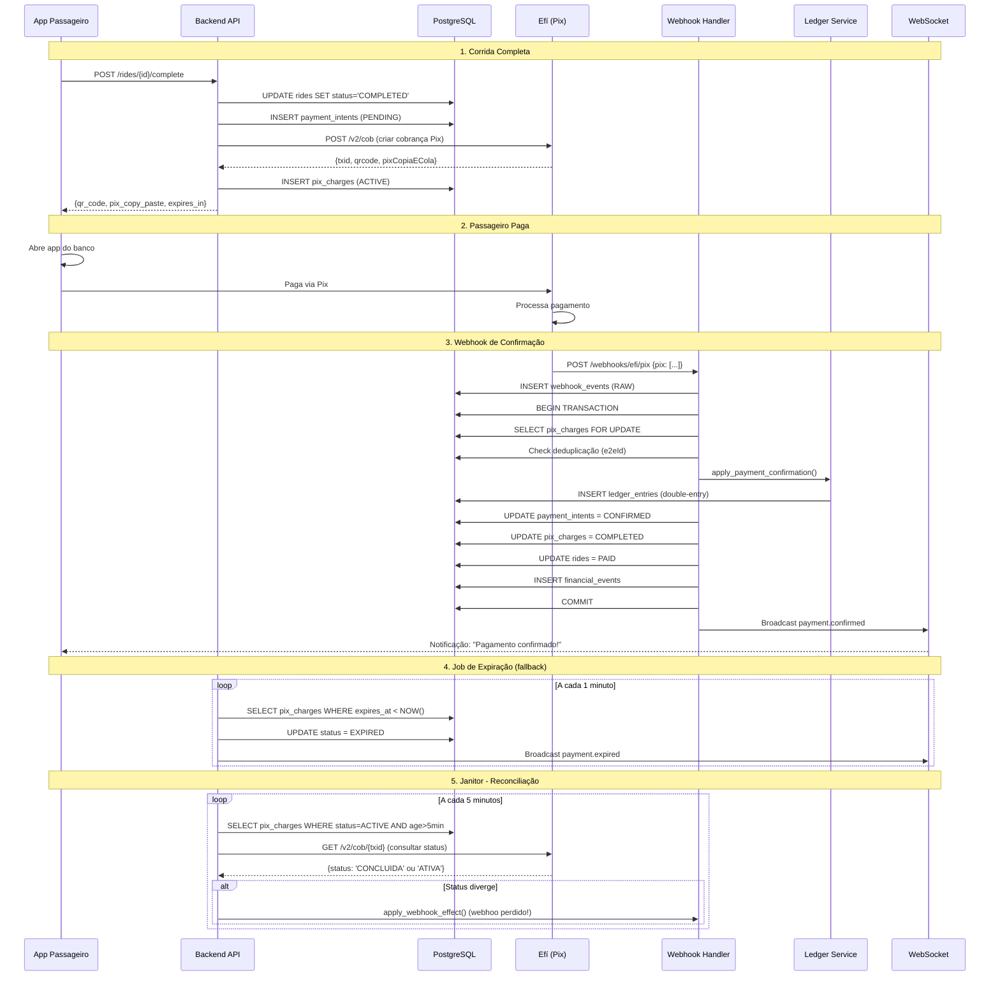

# Item E: Pix Efí - Cobrança + Webhook (Transacional)

**Objetivo:** Processar pagamentos via Pix de forma transacional, idempotente e auditável.

**Criticidade:** 🔴 CRÍTICO - Envolve dinheiro real e compliance financeiro.

---

## 📋 Índice

1. [Visão Geral do Fluxo](#visão-geral-do-fluxo)
2. [Integração com Efí (Gerencianet)](#integração-com-efí-gerencianet)
3. [Modelo de Dados](#modelo-de-dados)
4. [Criação de Cobrança Pix](#criação-de-cobrança-pix)
5. [Handler de Webhook](#handler-de-webhook)
6. [Deduplicação e Idempotência](#deduplicação-e-idempotência)
7. [Validação de Autenticidade](#validação-de-autenticidade)
8. [Controle de Expiração](#controle-de-expiração)
9. [Janitor - Reconciliação](#janitor---reconciliação)
10. [Aplicação ao Ledger Financeiro](#aplicação-ao-ledger-financeiro)
11. [Eventos e Notificações](#eventos-e-notificações)
12. [Casos de Borda](#casos-de-borda)
13. [Monitoramento e Alertas](#monitoramento-e-alertas)

---

## 🔄 Visão Geral do Fluxo

### Diagrama Mermaid - Fluxo Completo



---

## 🏦 Integração com Efí (Gerencianet)

### Documentação Oficial

**Base URL Sandbox:** `https://sandbox.gerencianet.com.br`
**Base URL Produção:** `https://api.gerencianet.com.br`

**Documentação:** https://dev.gerencianet.com.br/docs/pix

### Autenticação

**Método:** OAuth 2.0 Client Credentials + mTLS (Certificado Digital)

```python
import httpx
from datetime import datetime, timedelta

class EfiClient:
    def __init__(self, client_id: str, client_secret: str, cert_path: str, env: str = "sandbox"):
        self.client_id = client_id
        self.client_secret = client_secret
        self.cert_path = cert_path
        self.base_url = (
            "https://sandbox.gerencianet.com.br"
            if env == "sandbox"
            else "https://api.gerencianet.com.br"
        )
        self.access_token = None
        self.token_expires_at = None

    async def _get_access_token(self) -> str:
        """Obtém access token via OAuth 2.0"""
        if self.access_token and self.token_expires_at > datetime.now():
            return self.access_token

        async with httpx.AsyncClient(cert=self.cert_path) as client:
            response = await client.post(
                f"{self.base_url}/oauth/token",
                auth=(self.client_id, self.client_secret),
                data={"grant_type": "client_credentials"},
                headers={"Content-Type": "application/json"}
            )
            response.raise_for_status()

            data = response.json()
            self.access_token = data["access_token"]
            self.token_expires_at = datetime.now() + timedelta(seconds=data["expires_in"] - 60)

            return self.access_token

    async def _request(self, method: str, path: str, **kwargs):
        """Helper para fazer requests autenticados"""
        token = await self._get_access_token()

        async with httpx.AsyncClient(cert=self.cert_path) as client:
            response = await client.request(
                method,
                f"{self.base_url}{path}",
                headers={
                    "Authorization": f"Bearer {token}",
                    "Content-Type": "application/json"
                },
                **kwargs
            )
            response.raise_for_status()
            return response.json()
```

---

## 📊 Modelo de Dados

### Tabela: `payment_intents`

```sql
CREATE TABLE payment_intents (
    id UUID PRIMARY KEY DEFAULT gen_random_uuid(),
    ride_id UUID NOT NULL REFERENCES rides(id),

    -- Valores
    amount DECIMAL(10, 2) NOT NULL,  -- Valor total
    currency VARCHAR(3) NOT NULL DEFAULT 'BRL',

    -- Status
    status VARCHAR(50) NOT NULL DEFAULT 'PENDING',
    -- PENDING, CONFIRMED, EXPIRED, REFUNDED, FAILED

    -- Timestamps
    created_at TIMESTAMP WITH TIME ZONE NOT NULL DEFAULT NOW(),
    confirmed_at TIMESTAMP WITH TIME ZONE,
    expires_at TIMESTAMP WITH TIME ZONE,

    -- Metadata
    payment_method VARCHAR(50) DEFAULT 'pix',
    description TEXT,

    -- Índices
    INDEX idx_payment_intents_ride (ride_id),
    INDEX idx_payment_intents_status (status),
    INDEX idx_payment_intents_expires (expires_at) WHERE expires_at IS NOT NULL,

    CONSTRAINT valid_payment_status CHECK (status IN (
        'PENDING', 'CONFIRMED', 'EXPIRED', 'REFUNDED', 'FAILED'
    ))
);
```

### Tabela: `pix_charges`

```sql
CREATE TABLE pix_charges (
    id UUID PRIMARY KEY DEFAULT gen_random_uuid(),
    payment_intent_id UUID NOT NULL REFERENCES payment_intents(id),

    -- Efí (Gerencianet) IDs
    txid VARCHAR(100) NOT NULL UNIQUE,  -- Transaction ID da Efí
    e2e_id VARCHAR(100) UNIQUE,  -- End-to-End ID (após pagamento)

    -- QR Code
    qr_code TEXT NOT NULL,  -- Base64 da imagem
    pix_copy_paste TEXT NOT NULL,  -- Pix copia e cola

    -- Valores (espelhados para auditoria)
    amount DECIMAL(10, 2) NOT NULL,

    -- Status
    status VARCHAR(50) NOT NULL DEFAULT 'ACTIVE',
    -- ACTIVE, COMPLETED, EXPIRED, REMOVED

    -- Timestamps
    created_at TIMESTAMP WITH TIME ZONE NOT NULL DEFAULT NOW(),
    expires_at TIMESTAMP WITH TIME ZONE NOT NULL,
    paid_at TIMESTAMP WITH TIME ZONE,

    -- Response da Efí (JSON completo)
    efi_response JSONB,

    -- Índices
    INDEX idx_pix_charges_payment_intent (payment_intent_id),
    INDEX idx_pix_charges_txid (txid),
    INDEX idx_pix_charges_e2e_id (e2e_id) WHERE e2e_id IS NOT NULL,
    INDEX idx_pix_charges_status (status),
    INDEX idx_pix_charges_expires (expires_at),

    CONSTRAINT valid_pix_status CHECK (status IN (
        'ACTIVE', 'COMPLETED', 'EXPIRED', 'REMOVED'
    ))
);
```

### Tabela: `webhook_events`

```sql
CREATE TABLE webhook_events (
    id UUID PRIMARY KEY DEFAULT gen_random_uuid(),

    -- Provedor
    provider VARCHAR(50) NOT NULL DEFAULT 'efi',

    -- Evento
    event_type VARCHAR(100) NOT NULL,  -- 'pix', 'pix_devolucao', etc.
    txid VARCHAR(100),  -- Pode não existir em alguns eventos
    e2e_id VARCHAR(100),  -- End-to-End ID

    -- Payload completo (RAW)
    payload JSONB NOT NULL,

    -- Hash para deduplicação
    payload_hash VARCHAR(64) NOT NULL,  -- SHA256 do payload

    -- Processamento
    processed BOOLEAN NOT NULL DEFAULT FALSE,
    processed_at TIMESTAMP WITH TIME ZONE,
    processing_error TEXT,

    -- Auditoria
    received_at TIMESTAMP WITH TIME ZONE NOT NULL DEFAULT NOW(),
    signature VARCHAR(500),  -- Assinatura do webhook (se houver)
    ip_address INET,
    user_agent TEXT,

    -- Índices
    INDEX idx_webhook_events_txid (txid) WHERE txid IS NOT NULL,
    INDEX idx_webhook_events_e2e_id (e2e_id) WHERE e2e_id IS NOT NULL,
    INDEX idx_webhook_events_hash (payload_hash),
    INDEX idx_webhook_events_processed (processed, received_at),
    INDEX idx_webhook_events_received (received_at)
);
```

### Tabela: `financial_events`

```sql
CREATE TABLE financial_events (
    id UUID PRIMARY KEY DEFAULT gen_random_uuid(),

    -- Tipo de evento
    event_type VARCHAR(100) NOT NULL,
    -- 'ride.completed', 'payment.confirmed', 'payout.created', 'refund.created'

    -- Referências
    ride_id UUID REFERENCES rides(id),
    payment_intent_id UUID REFERENCES payment_intents(id),
    payout_id UUID,  -- References payouts(id) quando criar tabela

    -- Valores
    amount DECIMAL(10, 2) NOT NULL,
    currency VARCHAR(3) NOT NULL DEFAULT 'BRL',

    -- IDs externos (deduplicação)
    external_id VARCHAR(255) UNIQUE,  -- e2eId do Pix, por exemplo

    -- Timestamps
    occurred_at TIMESTAMP WITH TIME ZONE NOT NULL DEFAULT NOW(),

    -- Metadata
    metadata JSONB,

    -- Índices
    INDEX idx_financial_events_type (event_type),
    INDEX idx_financial_events_ride (ride_id) WHERE ride_id IS NOT NULL,
    INDEX idx_financial_events_payment (payment_intent_id) WHERE payment_intent_id IS NOT NULL,
    INDEX idx_financial_events_external_id (external_id) WHERE external_id IS NOT NULL,
    INDEX idx_financial_events_occurred (occurred_at)
);
```

---

## 💳 Criação de Cobrança Pix

### Endpoint: POST /payments/intent

```python
from fastapi import FastAPI, Depends, HTTPException
from pydantic import BaseModel, Field
from decimal import Decimal
from datetime import datetime, timezone, timedelta
import hashlib

# ============= Schemas =============

class CreatePaymentIntentRequest(BaseModel):
    ride_id: UUID
    # Valor é calculado automaticamente a partir da corrida


class CreatePaymentIntentResponse(BaseModel):
    payment_intent_id: UUID
    ride_id: UUID
    amount: Decimal
    qr_code: str  # Base64 image
    pix_copy_paste: str  # Código copia e cola
    expires_at: datetime
    expires_in_seconds: int


# ============= Service =============

class PaymentService:
    def __init__(
        self,
        db: AsyncSession,
        efi_client: EfiClient,
        event_bus: EventBus
    ):
        self.db = db
        self.efi_client = efi_client
        self.event_bus = event_bus

    async def create_payment_intent(
        self,
        ride_id: UUID,
        request_id: str
    ) -> CreatePaymentIntentResponse:
        """
        Cria intenção de pagamento e cobrança Pix na Efí.

        Fluxo:
        1. Validar corrida (deve estar COMPLETED)
        2. Criar PaymentIntent (PENDING)
        3. Criar cobrança Pix na Efí
        4. Salvar PixCharge
        5. Retornar QR Code
        """

        async with self.db.begin():
            # ========== STEP 1: Validar Corrida ==========

            ride = await self.db.execute(
                select(Ride).where(Ride.id == ride_id)
            )
            ride = ride.scalar_one_or_none()

            if not ride:
                raise HTTPException(404, "Ride not found")

            if ride.status != "COMPLETED":
                raise HTTPException(
                    400,
                    f"Ride must be COMPLETED to create payment. Current: {ride.status}"
                )

            if not ride.final_fare:
                raise HTTPException(400, "Ride does not have final_fare calculated")

            # Verificar se já existe payment intent
            existing = await self.db.execute(
                select(PaymentIntent)
                .where(PaymentIntent.ride_id == ride_id)
                .where(PaymentIntent.status.in_(['PENDING', 'CONFIRMED']))
            )
            existing = existing.scalar_one_or_none()

            if existing:
                # Já existe - retornar existente
                pix_charge = await self.db.execute(
                    select(PixCharge)
                    .where(PixCharge.payment_intent_id == existing.id)
                    .order_by(PixCharge.created_at.desc())
                )
                pix_charge = pix_charge.scalar_one()

                return self._build_response(existing, pix_charge)

            # ========== STEP 2: Criar PaymentIntent ==========

            amount = ride.final_fare
            expires_at = datetime.now(timezone.utc) + timedelta(hours=1)

            payment_intent = PaymentIntent(
                ride_id=ride_id,
                amount=amount,
                currency="BRL",
                status="PENDING",
                payment_method="pix",
                expires_at=expires_at,
                description=f"Corrida {ride_id}"
            )

            self.db.add(payment_intent)
            await self.db.flush()  # Get ID

            # ========== STEP 3: Criar Cobrança Pix na Efí ==========

            try:
                efi_response = await self._create_pix_charge_efi(
                    amount=amount,
                    expires_in=3600,  # 1 hora
                    ride_id=ride_id,
                    payment_intent_id=payment_intent.id
                )
            except Exception as e:
                logger.exception(
                    f"Failed to create Pix charge in Efí",
                    extra={"request_id": request_id, "ride_id": str(ride_id)}
                )
                raise HTTPException(502, f"Payment provider error: {str(e)}")

            # ========== STEP 4: Salvar PixCharge ==========

            pix_charge = PixCharge(
                payment_intent_id=payment_intent.id,
                txid=efi_response["txid"],
                qr_code=efi_response["qrcode"]["imagemQrcode"],  # Base64
                pix_copy_paste=efi_response["qrcode"]["qrcode"],  # Copia e cola
                amount=amount,
                status="ACTIVE",
                expires_at=expires_at,
                efi_response=efi_response  # JSON completo
            )

            self.db.add(pix_charge)

            # ========== STEP 5: Emitir Evento ==========

            await self.event_bus.post_from_transaction(
                self.db,
                event_type="payment.intent.created",
                payload={
                    "payment_intent_id": str(payment_intent.id),
                    "ride_id": str(ride_id),
                    "amount": float(amount),
                    "txid": pix_charge.txid,
                    "expires_at": expires_at.isoformat()
                }
            )

            await self.db.flush()

        # Transaction commits here

        # ========== STEP 6: Retornar Resposta ==========

        return self._build_response(payment_intent, pix_charge)

    async def _create_pix_charge_efi(
        self,
        amount: Decimal,
        expires_in: int,
        ride_id: UUID,
        payment_intent_id: UUID
    ) -> dict:
        """
        Cria cobrança Pix na Efí usando API v2/cob.

        Docs: https://dev.gerencianet.com.br/docs/pix#criar-cobrança-imediata
        """

        # Gerar txid único (max 25 caracteres alfanuméricos)
        # Formato: "R{ride_id_short}P{payment_short}"
        txid = f"R{str(ride_id).replace('-', '')[:8]}P{str(payment_intent_id).replace('-', '')[:8]}"

        payload = {
            "calendario": {
                "expiracao": expires_in  # Em segundos
            },
            "valor": {
                "original": f"{amount:.2f}"  # Formato: "50.00"
            },
            "chave": settings.EFI_PIX_KEY,  # Chave Pix da plataforma
            "solicitacaoPagador": f"Pagamento corrida {ride_id}"
        }

        response = await self.efi_client._request(
            "PUT",
            f"/v2/cob/{txid}",
            json=payload
        )

        # Response format:
        # {
        #   "calendario": {"criacao": "...", "expiracao": 3600},
        #   "txid": "...",
        #   "revisao": 0,
        #   "loc": {...},
        #   "location": "...",
        #   "status": "ATIVA",
        #   "valor": {"original": "50.00"},
        #   "chave": "..."
        # }

        # Gerar QR Code
        qr_response = await self.efi_client._request(
            "GET",
            f"/v2/loc/{response['loc']['id']}/qrcode"
        )

        # qr_response format:
        # {
        #   "qrcode": "00020126580014br.gov.bcb.pix...",  # Copia e cola
        #   "imagemQrcode": "data:image/png;base64,iVBORw0KGg..."  # Base64
        # }

        return {
            **response,
            "qrcode": qr_response
        }

    def _build_response(
        self,
        payment_intent: PaymentIntent,
        pix_charge: PixCharge
    ) -> CreatePaymentIntentResponse:
        """Constrói resposta do endpoint"""

        now = datetime.now(timezone.utc)
        expires_in = int((pix_charge.expires_at - now).total_seconds())

        return CreatePaymentIntentResponse(
            payment_intent_id=payment_intent.id,
            ride_id=payment_intent.ride_id,
            amount=payment_intent.amount,
            qr_code=pix_charge.qr_code,
            pix_copy_paste=pix_charge.pix_copy_paste,
            expires_at=pix_charge.expires_at,
            expires_in_seconds=max(0, expires_in)
        )


# ============= Endpoint =============

@app.post("/payments/intent", response_model=CreatePaymentIntentResponse)
async def create_payment_intent(
    request: CreatePaymentIntentRequest,
    db: AsyncSession = Depends(get_db),
    efi_client: EfiClient = Depends(get_efi_client),
    event_bus: EventBus = Depends(get_event_bus),
    request_id: str = Header(None, alias="X-Request-ID")
):
    """
    Cria intenção de pagamento e cobrança Pix.

    Returns:
    - qr_code: Imagem QR Code em Base64
    - pix_copy_paste: Código Pix copia e cola
    - expires_at: Data/hora de expiração
    """
    request_id = request_id or str(uuid4())

    service = PaymentService(db, efi_client, event_bus)

    return await service.create_payment_intent(
        ride_id=request.ride_id,
        request_id=request_id
    )
```

---

## 🔔 Handler de Webhook

### Endpoint: POST /webhooks/efi/pix

```python
from fastapi import Request, BackgroundTasks
import hashlib
import json

# ============= Webhook Handler =============

class WebhookHandler:
    def __init__(
        self,
        db: AsyncSession,
        ledger_service: LedgerService,
        event_bus: EventBus
    ):
        self.db = db
        self.ledger_service = ledger_service
        self.event_bus = event_bus

    async def handle_pix_webhook(
        self,
        payload: dict,
        signature: str | None,
        ip_address: str,
        user_agent: str,
        request_id: str
    ):
        """
        Processa webhook de pagamento Pix da Efí.

        Fluxo:
        1. Persistir webhook (SEMPRE, mesmo que duplicado)
        2. Validar assinatura (autenticidade)
        3. Lock na PixCharge (transação)
        4. Deduplicação por e2eId
        5. Aplicar efeito financeiro (ledger)
        6. Atualizar status (payment, pix, ride)
        7. Emitir eventos
        8. Commit atômico
        """

        logger.info(
            f"Received Pix webhook",
            extra={
                "request_id": request_id,
                "payload": payload
            }
        )

        # ========== STEP 1: Persistir Webhook (RAW) ==========

        payload_hash = hashlib.sha256(
            json.dumps(payload, sort_keys=True).encode()
        ).hexdigest()

        webhook_event = WebhookEvent(
            provider="efi",
            event_type=payload.get("tipo", "unknown"),
            txid=payload.get("txid"),
            e2e_id=self._extract_e2e_id(payload),
            payload=payload,
            payload_hash=payload_hash,
            processed=False,
            signature=signature,
            ip_address=ip_address,
            user_agent=user_agent
        )

        async with self.db.begin():
            self.db.add(webhook_event)
            await self.db.flush()

        # ========== STEP 2: Validar Assinatura ==========

        # Efí não usa assinatura HTTP, mas usa mTLS (certificado)
        # Em produção, validar que request veio de IP da Efí
        if not self._validate_webhook_source(ip_address):
            logger.warning(
                f"Webhook from untrusted IP: {ip_address}",
                extra={"request_id": request_id}
            )
            # Processar mesmo assim, mas alertar

        # ========== STEP 3: Verificar Tipo de Evento ==========

        event_type = payload.get("tipo")

        if event_type != "pix":
            logger.info(
                f"Ignoring webhook type: {event_type}",
                extra={"request_id": request_id}
            )
            return {"status": "ignored", "reason": f"type={event_type}"}

        # ========== STEP 4: Processar Pagamento ==========

        try:
            await self._process_pix_payment(webhook_event, payload, request_id)
        except Exception as e:
            logger.exception(
                f"Error processing webhook",
                extra={"request_id": request_id, "webhook_id": str(webhook_event.id)}
            )

            # Marcar como erro para retry posterior
            async with self.db.begin():
                webhook_event.processing_error = str(e)
                self.db.add(webhook_event)

            raise HTTPException(500, "Webhook processing failed")

        return {"status": "processed"}

    async def _process_pix_payment(
        self,
        webhook_event: WebhookEvent,
        payload: dict,
        request_id: str
    ):
        """Processa confirmação de pagamento Pix"""

        txid = payload["txid"]
        pix_data = payload["pix"][0]  # Pode ter múltiplos pix no webhook
        e2e_id = pix_data["endToEndId"]
        amount_paid = Decimal(pix_data["valor"])

        logger.info(
            f"Processing Pix payment: txid={txid}, e2e_id={e2e_id}, amount={amount_paid}",
            extra={"request_id": request_id}
        )

        # ========== TRANSACTION ==========

        async with self.db.begin():

            # ========== STEP 1: Lock PixCharge (FOR UPDATE) ==========

            pix_charge = await self.db.execute(
                select(PixCharge)
                .where(PixCharge.txid == txid)
                .with_for_update()
            )
            pix_charge = pix_charge.scalar_one_or_none()

            if not pix_charge:
                logger.warning(
                    f"PixCharge not found for txid={txid}",
                    extra={"request_id": request_id}
                )
                # Possível webhook de teste ou txid inválido
                return

            # ========== STEP 2: Deduplicação por e2eId ==========

            # Verificar se já processamos este e2eId
            existing_event = await self.db.execute(
                select(FinancialEvent)
                .where(FinancialEvent.external_id == e2e_id)
            )
            existing_event = existing_event.scalar_one_or_none()

            if existing_event:
                logger.info(
                    f"Payment already processed: e2e_id={e2e_id}",
                    extra={"request_id": request_id}
                )

                # Marcar webhook como processado (idempotente)
                webhook_event.processed = True
                webhook_event.processed_at = datetime.now(timezone.utc)
                self.db.add(webhook_event)

                return  # Já processado - idempotência

            # ========== STEP 3: Validações ==========

            payment_intent = await self.db.execute(
                select(PaymentIntent)
                .where(PaymentIntent.id == pix_charge.payment_intent_id)
            )
            payment_intent = payment_intent.scalar_one()

            # Validar valor pago
            if amount_paid != payment_intent.amount:
                logger.error(
                    f"Amount mismatch: expected={payment_intent.amount}, paid={amount_paid}",
                    extra={"request_id": request_id}
                )
                # Decidir: aceitar valor diferente ou rejeitar?
                # Por ora, aceitamos e registramos discrepância
                # TODO: Criar caso de ajuste/reconciliação

            # Validar status
            if payment_intent.status == "CONFIRMED":
                logger.warning(
                    f"PaymentIntent already confirmed: {payment_intent.id}",
                    extra={"request_id": request_id}
                )
                # Pode acontecer se webhook duplicado chegou antes
                # Continuar para marcar webhook como processado

            # ========== STEP 4: Aplicar Efeito Financeiro (Ledger) ==========

            ride = await self.db.execute(
                select(Ride).where(Ride.id == payment_intent.ride_id)
            )
            ride = ride.scalar_one()

            # Criar journal entries (double-entry)
            transaction_id = f"payment_{payment_intent.id}"

            await self.ledger_service.create_journal_entry(
                transaction_id=transaction_id,
                entries=[
                    {
                        "account": "PIX_A_RECEBER",
                        "type": "DEBIT",
                        "amount": amount_paid,
                        "description": f"Pagamento Pix corrida {ride.id}"
                    },
                    {
                        "account": "RECEITA_CORRIDAS",
                        "type": "CREDIT",
                        "amount": amount_paid,
                        "description": f"Receita corrida {ride.id}"
                    }
                ],
                entity_type="PAYMENT",
                entity_id=str(payment_intent.id),
                reference_number=e2e_id
            )

            # Calcular comissão e saldo motorista
            commission_rate = Decimal("0.20")  # 20% (buscar de config)
            commission_amount = amount_paid * commission_rate
            driver_amount = amount_paid - commission_amount

            # Journal: Comissão e saldo motorista
            await self.ledger_service.create_journal_entry(
                transaction_id=f"commission_{payment_intent.id}",
                entries=[
                    {
                        "account": "RECEITA_CORRIDAS",
                        "type": "DEBIT",
                        "amount": amount_paid,
                        "description": f"Distribuição receita corrida {ride.id}"
                    },
                    {
                        "account": "COMISSAO_PLATAFORMA",
                        "type": "CREDIT",
                        "amount": commission_amount,
                        "description": f"Comissão plataforma (20%)"
                    },
                    {
                        "account": "MOTORISTAS_A_PAGAR",
                        "type": "CREDIT",
                        "amount": driver_amount,
                        "driver_id": str(ride.accepted_driver_id),
                        "description": f"Saldo motorista corrida {ride.id}"
                    }
                ],
                entity_type="COMMISSION",
                entity_id=str(ride.id)
            )

            # ========== STEP 5: Atualizar Status ==========

            # PaymentIntent
            payment_intent.status = "CONFIRMED"
            payment_intent.confirmed_at = datetime.now(timezone.utc)
            self.db.add(payment_intent)

            # PixCharge
            pix_charge.status = "COMPLETED"
            pix_charge.e2e_id = e2e_id
            pix_charge.paid_at = datetime.now(timezone.utc)
            self.db.add(pix_charge)

            # Ride
            ride.status = "PAID"
            ride.paid_at = datetime.now(timezone.utc)
            self.db.add(ride)

            # ========== STEP 6: Registrar Evento Financeiro ==========

            financial_event = FinancialEvent(
                event_type="payment.confirmed",
                ride_id=ride.id,
                payment_intent_id=payment_intent.id,
                amount=amount_paid,
                external_id=e2e_id,  # Deduplicação
                metadata={
                    "txid": txid,
                    "pix_data": pix_data,
                    "commission_rate": str(commission_rate),
                    "commission_amount": str(commission_amount),
                    "driver_amount": str(driver_amount)
                }
            )
            self.db.add(financial_event)

            # ========== STEP 7: Marcar Webhook como Processado ==========

            webhook_event.processed = True
            webhook_event.processed_at = datetime.now(timezone.utc)
            self.db.add(webhook_event)

            # ========== STEP 8: Emitir Eventos (Transacionais) ==========

            await self.event_bus.post_from_transaction(
                self.db,
                event_type="payment.confirmed",
                payload={
                    "payment_intent_id": str(payment_intent.id),
                    "ride_id": str(ride.id),
                    "amount": float(amount_paid),
                    "e2e_id": e2e_id,
                    "driver_id": str(ride.accepted_driver_id),
                    "passenger_id": str(ride.passenger_id)
                }
            )

            await self.event_bus.post_from_transaction(
                self.db,
                event_type="ride.paid",
                payload={
                    "ride_id": str(ride.id),
                    "amount": float(amount_paid)
                }
            )

            await self.db.flush()

        # COMMIT HERE - eventos só disparam após commit

        logger.info(
            f"Pix payment processed successfully: e2e_id={e2e_id}",
            extra={"request_id": request_id}
        )

    def _extract_e2e_id(self, payload: dict) -> str | None:
        """Extrai endToEndId do payload do webhook"""
        if "pix" in payload and len(payload["pix"]) > 0:
            return payload["pix"][0].get("endToEndId")
        return None

    def _validate_webhook_source(self, ip_address: str) -> bool:
        """
        Valida que webhook veio de IP da Efí.

        IPs oficiais da Efí (consultar documentação atualizada):
        - Sandbox: varia
        - Produção: faixas específicas
        """
        # TODO: Implementar whitelist de IPs
        # Por ora, sempre retorna True (validar via mTLS)
        return True


# ============= Endpoint =============

@app.post("/webhooks/efi/pix")
async def receive_efi_pix_webhook(
    request: Request,
    background_tasks: BackgroundTasks,
    db: AsyncSession = Depends(get_db),
    ledger_service: LedgerService = Depends(get_ledger_service),
    event_bus: EventBus = Depends(get_event_bus)
):
    """
    Recebe webhook de pagamento Pix da Efí.

    Este endpoint DEVE responder rapidamente (< 5s) para não causar timeout.
    Processamento pesado deve ser assíncrono.
    """

    # Extrair dados do request
    payload = await request.json()
    signature = request.headers.get("X-Gerencianet-Signature")
    ip_address = request.client.host
    user_agent = request.headers.get("User-Agent")
    request_id = request.headers.get("X-Request-ID", str(uuid4()))

    # Processar webhook
    handler = WebhookHandler(db, ledger_service, event_bus)

    try:
        result = await handler.handle_pix_webhook(
            payload=payload,
            signature=signature,
            ip_address=ip_address,
            user_agent=user_agent,
            request_id=request_id
        )

        return result

    except HTTPException:
        raise

    except Exception as e:
        logger.exception(f"Unexpected error in webhook handler")
        # Retornar 200 para evitar retry da Efí (já persistimos webhook)
        return {"status": "error", "message": str(e)}
```

---

## 🔁 Deduplicação e Idempotência

### Estratégias de Deduplicação

#### 1. Por End-to-End ID (e2eId)

**Garantia:** Cada transação Pix tem e2eId único no SPB (Sistema de Pagamentos Brasileiro)

```python
# Check em financial_events
existing = await db.execute(
    select(FinancialEvent)
    .where(FinancialEvent.external_id == e2e_id)
)

if existing.scalar_one_or_none():
    return  # Já processado
```

#### 2. Por Hash do Payload

**Uso:** Detectar webhooks 100% idênticos (raro)

```python
payload_hash = hashlib.sha256(
    json.dumps(payload, sort_keys=True).encode()
).hexdigest()

existing_webhook = await db.execute(
    select(WebhookEvent)
    .where(WebhookEvent.payload_hash == payload_hash)
    .where(WebhookEvent.processed == True)
)

if existing_webhook.scalar_one_or_none():
    logger.info("Exact duplicate webhook received")
    return
```

#### 3. Por txid + timestamp

**Uso:** Múltiplos eventos do mesmo txid (ex.: pix + devolução)

```python
# Cada evento é único por (txid, event_type, horario)
# Permitimos múltiplos eventos do mesmo txid, mas deduplicamos por e2eId
```

### Garantias

✅ **Mesmo e2eId, múltiplos webhooks:** Apenas 1 efeito financeiro
✅ **Webhooks fora de ordem:** Idempotência garante consistência
✅ **Retry da Efí:** Webhook duplicado é detectado e ignorado
✅ **Auditável:** Todos webhooks (incluindo duplicados) são persistidos

---

## 🔒 Validação de Autenticidade

### mTLS (Mutual TLS)

**Recomendação da Efí:** Usar certificado digital para autenticação

```python
# Nginx configuração
server {
    listen 443 ssl;
    server_name api.seudominio.com;

    ssl_certificate /path/to/cert.pem;
    ssl_certificate_key /path/to/key.pem;

    # Validar certificado do cliente (Efí)
    ssl_client_certificate /path/to/efi_ca.pem;
    ssl_verify_client optional;

    location /webhooks/efi {
        # Passar info de cliente SSL para app
        proxy_set_header X-SSL-Client-Verify $ssl_client_verify;
        proxy_set_header X-SSL-Client-DN $ssl_client_s_dn;

        proxy_pass http://backend;
    }
}
```

```python
# No handler
@app.post("/webhooks/efi/pix")
async def receive_webhook(
    request: Request,
    x_ssl_client_verify: str = Header(None)
):
    if x_ssl_client_verify != "SUCCESS":
        raise HTTPException(401, "Invalid SSL client certificate")

    # Processar webhook
    ...
```

### IP Whitelist

```python
EFI_ALLOWED_IPS = [
    "34.237.80.149",  # Exemplo - consultar docs atualizadas
    "54.207.93.179",
    # ...
]

def validate_ip(ip_address: str):
    if ip_address not in EFI_ALLOWED_IPS:
        logger.warning(f"Webhook from non-whitelisted IP: {ip_address}")
        # Decidir: rejeitar ou apenas alertar
```

---

## ⏰ Controle de Expiração

### Job de Expiração (Celery/APScheduler)

```python
from apscheduler.schedulers.asyncio import AsyncIOScheduler

scheduler = AsyncIOScheduler()

@scheduler.scheduled_job('interval', minutes=1)
async def expire_pix_charges():
    """
    Marca cobranças Pix expiradas.

    Webhook da Efí NÃO dispara em expiração, apenas em pagamento.
    Portanto, precisamos de job para marcar como expirado.
    """
    logger.info("Running expire_pix_charges job")

    async with async_session_maker() as db:
        async with db.begin():
            # Buscar cobranças ativas expiradas
            now = datetime.now(timezone.utc)

            result = await db.execute(
                select(PixCharge)
                .where(PixCharge.status == "ACTIVE")
                .where(PixCharge.expires_at < now)
            )

            expired_charges = result.scalars().all()

            if not expired_charges:
                logger.info("No expired charges found")
                return

            logger.info(f"Found {len(expired_charges)} expired charges")

            for pix_charge in expired_charges:
                # Atualizar PixCharge
                pix_charge.status = "EXPIRED"
                db.add(pix_charge)

                # Atualizar PaymentIntent
                payment_intent = await db.get(PaymentIntent, pix_charge.payment_intent_id)
                payment_intent.status = "EXPIRED"
                db.add(payment_intent)

                # Atualizar Ride
                ride = await db.get(Ride, payment_intent.ride_id)
                ride.status = "PAYMENT_EXPIRED"
                db.add(ride)

                logger.info(
                    f"Expired: pix_charge={pix_charge.id}, ride={ride.id}",
                    extra={"txid": pix_charge.txid}
                )

            await db.flush()

        # Emitir eventos (após commit)
        for pix_charge in expired_charges:
            await event_bus.publish(
                event_type="payment.expired",
                payload={
                    "pix_charge_id": str(pix_charge.id),
                    "payment_intent_id": str(pix_charge.payment_intent_id),
                    "txid": pix_charge.txid
                }
            )

    logger.info(f"Expired {len(expired_charges)} charges")
```

---

## 🔧 Janitor - Reconciliação

### Job de Reconciliação

```python
@scheduler.scheduled_job('interval', minutes=5)
async def reconcile_pix_charges():
    """
    Reconcilia estado local com estado da Efí.

    Casos de uso:
    1. Webhook perdido (rede, downtime)
    2. Webhook atrasado (>5min)
    3. Discrepância de status
    """
    logger.info("Running reconcile_pix_charges job")

    async with async_session_maker() as db:
        # Buscar cobranças ativas com mais de 5 minutos
        threshold = datetime.now(timezone.utc) - timedelta(minutes=5)

        result = await db.execute(
            select(PixCharge)
            .where(PixCharge.status == "ACTIVE")
            .where(PixCharge.created_at < threshold)
            .limit(100)  # Processar em lotes
        )

        charges_to_check = result.scalars().all()

        if not charges_to_check:
            logger.info("No charges to reconcile")
            return

        logger.info(f"Reconciling {len(charges_to_check)} charges")

        for pix_charge in charges_to_check:
            try:
                # Consultar status na Efí
                efi_status = await efi_client._request(
                    "GET",
                    f"/v2/cob/{pix_charge.txid}"
                )

                # efi_status format:
                # {
                #   "status": "ATIVA" | "CONCLUIDA" | "REMOVIDA_PELO_USUARIO_RECEBEDOR",
                #   "pix": [{...}] se CONCLUIDA,
                #   ...
                # }

                status = efi_status["status"]

                if status == "CONCLUIDA":
                    # WEBHOOK PERDIDO! Aplicar efeito agora
                    logger.warning(
                        f"Webhook perdido! Applying payment: txid={pix_charge.txid}",
                        extra={"pix_charge_id": str(pix_charge.id)}
                    )

                    # Extrair dados do Pix
                    pix_data = efi_status["pix"][0]

                    # Simular webhook
                    fake_webhook_payload = {
                        "tipo": "pix",
                        "txid": pix_charge.txid,
                        "pix": [pix_data]
                    }

                    # Processar como webhook
                    handler = WebhookHandler(db, ledger_service, event_bus)
                    await handler._process_pix_payment(
                        webhook_event=None,  # Janitor não tem webhook real
                        payload=fake_webhook_payload,
                        request_id=f"janitor_{uuid4()}"
                    )

                    # Métrica: webhook perdido detectado
                    metrics.increment("pix.webhook.missed")

                elif status == "ATIVA":
                    # Ainda ativa - verificar se expirou
                    now = datetime.now(timezone.utc)
                    if pix_charge.expires_at < now:
                        # Expirou mas Efí ainda mostra como ativa (edge case)
                        logger.info(f"Marking as expired: txid={pix_charge.txid}")
                        # O job de expiração vai pegar
                    else:
                        # Ainda válida - nada a fazer
                        logger.debug(f"Charge still active: txid={pix_charge.txid}")

                elif status == "REMOVIDA_PELO_USUARIO_RECEBEDOR":
                    # Cobrança cancelada
                    logger.info(f"Charge removed: txid={pix_charge.txid}")

                    async with db.begin():
                        pix_charge.status = "REMOVED"
                        db.add(pix_charge)

                        payment_intent = await db.get(PaymentIntent, pix_charge.payment_intent_id)
                        payment_intent.status = "FAILED"
                        db.add(payment_intent)

            except Exception as e:
                logger.exception(
                    f"Error reconciling pix_charge={pix_charge.id}",
                    extra={"txid": pix_charge.txid}
                )
                # Continuar com próximas cobranças

    logger.info("Reconciliation completed")
```

---

## 📒 Aplicação ao Ledger Financeiro

**Ver documento:** `F-LEDGER-FINANCEIRO.md` (a ser criado)

**Resumo:**

```python
# Exemplo já mostrado no handler de webhook

# 1. Pagamento recebido
await ledger_service.create_journal_entry(
    transaction_id=f"payment_{payment_intent_id}",
    entries=[
        {"account": "PIX_A_RECEBER", "type": "DEBIT", "amount": 50.00},
        {"account": "RECEITA_CORRIDAS", "type": "CREDIT", "amount": 50.00}
    ]
)

# 2. Distribuição: comissão e saldo motorista
await ledger_service.create_journal_entry(
    transaction_id=f"commission_{payment_intent_id}",
    entries=[
        {"account": "RECEITA_CORRIDAS", "type": "DEBIT", "amount": 50.00},
        {"account": "COMISSAO_PLATAFORMA", "type": "CREDIT", "amount": 10.00},
        {"account": "MOTORISTAS_A_PAGAR", "type": "CREDIT", "amount": 40.00, "driver_id": "..."}
    ]
)
```

**Regras:**
- Débitos = Créditos (double-entry)
- Entries são imutáveis
- Reversões via novos journal entries

---

## 📡 Eventos e Notificações

### Eventos Emitidos

#### 1. `payment.intent.created`

```json
{
  "event_type": "payment.intent.created",
  "payment_intent_id": "...",
  "ride_id": "...",
  "amount": 50.00,
  "txid": "...",
  "expires_at": "2024-12-14T19:30:00Z"
}
```

#### 2. `payment.confirmed`

```json
{
  "event_type": "payment.confirmed",
  "payment_intent_id": "...",
  "ride_id": "...",
  "amount": 50.00,
  "e2e_id": "E12345678202412141830...",
  "driver_id": "...",
  "passenger_id": "..."
}
```

#### 3. `payment.expired`

```json
{
  "event_type": "payment.expired",
  "pix_charge_id": "...",
  "payment_intent_id": "...",
  "txid": "..."
}
```

#### 4. `ride.paid`

```json
{
  "event_type": "ride.paid",
  "ride_id": "...",
  "amount": 50.00
}
```

---

## 🐛 Casos de Borda

### 1. Webhook chega antes de QR Code ser exibido

**Impossível:** QR Code é criado ANTES de retornar ao cliente.

### 2. Passageiro paga valor diferente

**Comportamento:**
- Efí aceita qualquer valor >= valor_original
- Nosso sistema registra discrepância em logs
- Financial event guarda valor real pago
- Decisão de negócio: aceitar ou estornar diferença

### 3. Múltiplos pagamentos para mesma cobrança

**Efí:** Não permite (cobrança vai para CONCLUIDA após primeiro pagamento)

### 4. Webhook duplicado com delay de horas

**Deduplicação:** e2eId garante que efeito só é aplicado uma vez

### 5. Janitor e Webhook processam simultaneamente

**Lock:** `SELECT ... FOR UPDATE` em PixCharge previne race condition

### 6. Banco de dados cai após webhook mas antes de commit

**Rollback automático:** PostgreSQL descarta transação
**Webhook:** Efí retenta (nosso webhook não foi marcado como processado)
**Idempotência:** Retry vai funcionar normalmente

---

## 📊 Monitoramento e Alertas

### Métricas (Prometheus)

```python
# Contadores
pix_charges_created = Counter("pix_charges_created_total")
pix_payments_confirmed = Counter("pix_payments_confirmed_total")
pix_charges_expired = Counter("pix_charges_expired_total")
webhooks_received = Counter("webhooks_received_total", ["status"])
webhooks_missed = Counter("webhooks_missed_total")  # Detectado pelo Janitor

# Histogramas
webhook_processing_duration = Histogram("webhook_processing_seconds")
payment_confirmation_delay = Histogram(
    "payment_confirmation_delay_seconds",
    buckets=[1, 5, 10, 30, 60, 300, 600]  # 1s até 10min
)

# Gauges
active_pix_charges = Gauge("pix_charges_active")
pending_payment_intents = Gauge("payment_intents_pending")
```

### Alertas (Grafana)

```yaml
alerts:
  - name: HighWebhookErrorRate
    expr: |
      rate(webhooks_received_total{status="error"}[5m]) > 0.1
    for: 5m
    severity: warning
    description: "Webhook error rate > 10%"

  - name: WebhooksMissed
    expr: |
      increase(webhooks_missed_total[15m]) > 0
    for: 1m
    severity: critical
    description: "Webhooks perdidos detectados pelo Janitor"

  - name: PaymentConfirmationDelayed
    expr: |
      histogram_quantile(0.95, payment_confirmation_delay_seconds) > 300
    for: 10m
    severity: warning
    description: "P95 de confirmação de pagamento > 5min"

  - name: HighExpirationRate
    expr: |
      rate(pix_charges_expired_total[1h]) > 0.5
    for: 10m
    severity: warning
    description: "Taxa de expiração > 50%"
```

### Logs Estruturados

```python
logger.info(
    "Pix payment confirmed",
    extra={
        "event": "payment.confirmed",
        "request_id": request_id,
        "payment_intent_id": str(payment_intent.id),
        "ride_id": str(ride.id),
        "amount": float(amount),
        "e2e_id": e2e_id,
        "txid": txid,
        "processing_time_ms": processing_time * 1000
    }
)
```

---

## 🎯 Resumo Executivo

### Garantias Fornecidas

✅ **Idempotência absoluta:** Webhook duplicado não causa efeito duplicado (e2eId)
✅ **Atomicidade:** Ledger + Status + Eventos são atômicos (transação única)
✅ **Auditabilidade:** Todos webhooks persistidos, mesmo duplicados
✅ **Resiliência:** Janitor reconcilia webhooks perdidos
✅ **Expiração:** Job marca cobranças expiradas (webhook não dispara)
✅ **Validação:** mTLS + IP whitelist garantem autenticidade

### Fluxo de Sucesso (Happy Path)

1. Corrida completa → API cria PaymentIntent + PixCharge na Efí
2. App mostra QR Code → Passageiro paga via Pix
3. Webhook chega → Handler deduplica, aplica ledger, atualiza status, emite eventos
4. WebSocket notifica passageiro e motorista → Corrida marcada como PAID

### Fluxos de Falha (Unhappy Paths)

1. **Webhook perdido:** Janitor detecta após 5min e aplica efeito
2. **Cobrança expira:** Job marca como EXPIRED, notifica passageiro
3. **Valor divergente:** Registra discrepância, aceita pagamento
4. **Webhook duplicado:** Deduplicação por e2eId ignora
5. **Banco cai:** Rollback automático, webhook retenta

### Próximos Passos

1. ✅ Documentação completa (este documento)
2. ⏳ Implementar em FastAPI
3. ⏳ Testes de integração com Efí (sandbox)
4. ⏳ Testes de idempotência (webhooks duplicados)
5. ⏳ Load tests (webhooks simultâneos)
6. ⏳ Configurar monitoramento (Prometheus + Grafana)
7. ⏳ Configurar jobs (Celery/APScheduler)

---

**Documento criado em:** 14/12/2024
**Versão:** 1.0
**Autor:** Sistema de Arquitetura Backend
