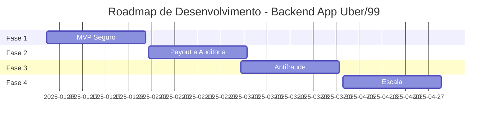

# Itens J e K: Observabilidade + Roadmap Incremental

---

## 📋 Índice

1. [Item J - Observabilidade Mínima](#item-j---observabilidade-mínima)
2. [Item K - Roadmap Incremental (4 Fases)](#item-k---roadmap-incremental-4-fases)

---

# Item J - Observabilidade Mínima

## 📊 Logs Estruturados

### Configuração do Logger

```python
import logging
import json
from datetime import datetime
from contextvars import ContextVar

# Context var para request_id
request_id_var: ContextVar[str] = ContextVar('request_id', default='')

class StructuredFormatter(logging.Formatter):
    """Formatter que produz logs em JSON."""

    def format(self, record: logging.LogRecord) -> str:
        log_data = {
            "timestamp": datetime.utcnow().isoformat() + "Z",
            "level": record.levelname,
            "logger": record.name,
            "message": record.getMessage(),
            "request_id": request_id_var.get(''),
        }

        # Adicionar campos extras
        if hasattr(record, 'extra'):
            log_data.update(record.extra)

        # Adicionar exception se houver
        if record.exc_info:
            log_data["exception"] = self.formatException(record.exc_info)

        return json.dumps(log_data)


# Configurar logger
logging.basicConfig(level=logging.INFO)
handler = logging.StreamHandler()
handler.setFormatter(StructuredFormatter())

logger = logging.getLogger("ibora")
logger.addHandler(handler)
logger.setLevel(logging.INFO)
```

### Middleware de Request ID

```python
from fastapi import Request
from starlette.middleware.base import BaseHTTPMiddleware
from uuid import uuid4

class RequestIDMiddleware(BaseHTTPMiddleware):
    async def dispatch(self, request: Request, call_next):
        # Gerar ou extrair request_id
        request_id = request.headers.get("X-Request-ID", str(uuid4()))

        # Armazenar em context var
        request_id_var.set(request_id)

        # Adicionar ao request state
        request.state.request_id = request_id

        # Processar request
        response = await call_next(request)

        # Adicionar header na resposta
        response.headers["X-Request-ID"] = request_id

        return response


app.add_middleware(RequestIDMiddleware)
```

### Exemplos de Logs

```python
# Log simples
logger.info("Ride created", extra={
    "ride_id": str(ride.id),
    "passenger_id": str(ride.passenger_id),
    "estimated_fare": float(ride.estimated_fare)
})

# Log com erro
try:
    await process_payment(payment_id)
except Exception as e:
    logger.exception(
        "Payment processing failed",
        extra={
            "payment_id": str(payment_id),
            "error": str(e)
        }
    )

# Log de performance
start_time = time.time()
result = await expensive_operation()
duration = time.time() - start_time

logger.info("Operation completed", extra={
    "operation": "expensive_operation",
    "duration_seconds": duration,
    "result_count": len(result)
})
```

---

## 🔍 Audit Trail

### Tabela de Auditoria

**Ver documento:** `A-B-C-MODELO-DOMINIO.md` (tabela `audit_logs`)

### Decorator de Auditoria

```python
from functools import wraps

def audit(action: str, entity_type: str):
    """Decorator para registrar ações auditáveis."""

    def decorator(func):
        @wraps(func)
        async def wrapper(*args, **kwargs):
            # Executar função
            result = await func(*args, **kwargs)

            # Registrar auditoria
            try:
                # Extrair contexto
                request = kwargs.get('request')
                current_user = kwargs.get('current_user')

                entity_id = None
                if hasattr(result, 'id'):
                    entity_id = str(result.id)

                # Criar log de auditoria
                async with async_session_maker() as db:
                    audit_log = AuditLog(
                        action=action,
                        entity_type=entity_type,
                        entity_id=entity_id,
                        user_id=current_user.id if current_user else None,
                        user_type=current_user.user_type if current_user else None,
                        ip_address=request.client.host if request else None,
                        user_agent=request.headers.get("User-Agent") if request else None,
                        request_id=request_id_var.get(),
                        changes=kwargs if kwargs else None
                    )
                    db.add(audit_log)
                    await db.commit()

            except Exception as e:
                logger.error(f"Failed to create audit log: {e}")

            return result

        return wrapper
    return decorator


# Uso
@audit(action="approve_driver", entity_type="driver")
async def approve_driver(
    driver_id: UUID,
    current_user: User = Depends(get_current_admin)
):
    # ...
    pass
```

---

## 📈 Métricas (Prometheus)

### Configuração de Métricas

```python
from prometheus_client import Counter, Histogram, Gauge, generate_latest
from fastapi import Response

# Contadores
rides_created = Counter(
    "rides_created_total",
    "Total de corridas criadas",
    ["category"]
)

rides_completed = Counter(
    "rides_completed_total",
    "Total de corridas completadas",
    ["category"]
)

rides_canceled = Counter(
    "rides_canceled_total",
    "Total de corridas canceladas",
    ["canceled_by", "reason_category"]
)

payments_confirmed = Counter(
    "payments_confirmed_total",
    "Total de pagamentos confirmados"
)

webhooks_received = Counter(
    "webhooks_received_total",
    "Total de webhooks recebidos",
    ["provider", "event_type", "status"]
)

webhooks_missed = Counter(
    "webhooks_missed_total",
    "Webhooks perdidos detectados pelo Janitor"
)

# Histogramas
ride_accept_duration = Histogram(
    "ride_accept_duration_seconds",
    "Tempo para aceitar corrida",
    buckets=[0.1, 0.5, 1.0, 2.0, 5.0, 10.0, 30.0]
)

ride_duration = Histogram(
    "ride_duration_minutes",
    "Duração das corridas",
    ["category"],
    buckets=[5, 10, 15, 20, 30, 45, 60, 90, 120]
)

payment_confirmation_delay = Histogram(
    "payment_confirmation_delay_seconds",
    "Delay entre criação e confirmação de pagamento",
    buckets=[1, 5, 10, 30, 60, 300, 600]
)

webhook_processing_duration = Histogram(
    "webhook_processing_duration_seconds",
    "Tempo de processamento de webhooks"
)

# Gauges
active_rides = Gauge(
    "active_rides",
    "Número de corridas ativas"
)

drivers_online = Gauge(
    "drivers_online",
    "Número de motoristas online"
)

drivers_available = Gauge(
    "drivers_available",
    "Número de motoristas disponíveis (não em corrida)"
)

pending_payouts_amount = Gauge(
    "pending_payouts_amount_brl",
    "Valor total de payouts pendentes"
)


# Endpoint de métricas
@app.get("/metrics")
async def metrics():
    """Endpoint para Prometheus scraping."""
    return Response(
        content=generate_latest(),
        media_type="text/plain"
    )
```

### Instrumentação de Código

```python
# Exemplo: Contadores
@app.post("/rides")
async def create_ride(request: CreateRideRequest, ...):
    ride = Ride(...)
    db.add(ride)
    await db.commit()

    # Incrementar métrica
    rides_created.labels(category=ride.requested_category).inc()

    return ride


# Exemplo: Histograma com context manager
from contextlib import contextmanager
import time

@contextmanager
def measure_time(histogram):
    start = time.time()
    try:
        yield
    finally:
        histogram.observe(time.time() - start)


async def accept_ride(...):
    with measure_time(ride_accept_duration):
        # Lógica de aceite
        ...


# Exemplo: Gauge atualizado periodicamente
@scheduler.scheduled_job('interval', minutes=1)
async def update_gauges():
    async with async_session_maker() as db:
        # Contar corridas ativas
        active = await db.execute(
            select(func.count(Ride.id))
            .where(Ride.status.in_(['ACCEPTED', 'ARRIVING', 'STARTED']))
        )
        active_rides.set(active.scalar())

        # Contar motoristas online
        online = await db.execute(
            select(func.count(Driver.id))
            .where(Driver.online == True)
        )
        drivers_online.set(online.scalar())
```

---

## 🚨 Alertas (Grafana/AlertManager)

### Regras de Alerta

```yaml
# prometheus/alerts.yml
groups:
  - name: ride_alerts
    interval: 30s
    rules:
      - alert: HighRideCancellationRate
        expr: |
          rate(rides_canceled_total[5m]) / rate(rides_created_total[5m]) > 0.3
        for: 5m
        labels:
          severity: warning
        annotations:
          summary: "Alta taxa de cancelamento de corridas"
          description: "Taxa de cancelamento acima de 30% nos últimos 5 minutos"

      - alert: NoDriversAvailable
        expr: drivers_available < 5
        for: 2m
        labels:
          severity: critical
        annotations:
          summary: "Poucos motoristas disponíveis"
          description: "Apenas {{ $value }} motoristas disponíveis"

      - alert: WebhookProcessingTooSlow
        expr: |
          histogram_quantile(0.95,
            rate(webhook_processing_duration_seconds_bucket[5m])
          ) > 5.0
        for: 5m
        labels:
          severity: warning
        annotations:
          summary: "Processamento de webhook lento"
          description: "P95 de processamento de webhook > 5s"

      - alert: WebhooksMissed
        expr: increase(webhooks_missed_total[15m]) > 0
        for: 1m
        labels:
          severity: critical
        annotations:
          summary: "Webhooks perdidos detectados"
          description: "Janitor detectou {{ $value }} webhooks perdidos"

      - alert: PaymentConfirmationDelayed
        expr: |
          histogram_quantile(0.95,
            rate(payment_confirmation_delay_seconds_bucket[10m])
          ) > 300
        for: 10m
        labels:
          severity: warning
        annotations:
          summary: "Confirmação de pagamento atrasada"
          description: "P95 de confirmação > 5 minutos"

      - alert: HighPayoutFailureRate
        expr: |
          rate(payouts_failed_total[10m]) / rate(payouts_created_total[10m]) > 0.1
        for: 5m
        labels:
          severity: critical
        annotations:
          summary: "Alta taxa de falha em payouts"
          description: "Taxa de falha em payouts > 10%"
```

---

## 🔍 Tracing Distribuído

### OpenTelemetry

```python
from opentelemetry import trace
from opentelemetry.sdk.trace import TracerProvider
from opentelemetry.sdk.trace.export import BatchSpanProcessor
from opentelemetry.exporter.jaeger.thrift import JaegerExporter

# Configurar tracer
trace.set_tracer_provider(TracerProvider())
tracer = trace.get_tracer(__name__)

# Exportar para Jaeger
jaeger_exporter = JaegerExporter(
    agent_host_name="localhost",
    agent_port=6831,
)
trace.get_tracer_provider().add_span_processor(
    BatchSpanProcessor(jaeger_exporter)
)


# Instrumentar função
@tracer.start_as_current_span("accept_ride")
async def accept_ride(ride_id: UUID, driver_id: UUID):
    span = trace.get_current_span()
    span.set_attribute("ride_id", str(ride_id))
    span.set_attribute("driver_id", str(driver_id))

    # Lógica
    ...

    span.add_event("ride_accepted")
```

---

# Item K - Roadmap Incremental (4 Fases)

## 🎯 Visão Geral



---

## 📌 Fase 1: MVP Seguro (30 dias)

**Objetivo:** Sistema funcional com garantias de consistência e segurança financeira.

### Entregas

#### 1.1 - Infraestrutura Base (5 dias)
- [ ] Setup PostgreSQL (com réplicas)
- [ ] Setup Redis (cluster)
- [ ] Setup FastAPI com estrutura de projeto
- [ ] Docker Compose para desenvolvimento
- [ ] CI/CD básico (GitHub Actions)

#### 1.2 - Autenticação e Usuários (3 dias)
- [ ] Tabelas: users, passengers, drivers, vehicles
- [ ] Endpoints de registro e login (JWT)
- [ ] Middleware de autenticação
- [ ] Aprovação de motoristas (admin)

#### 1.3 - Sistema de Corridas (10 dias)
- [ ] Tabelas: rides, ride_offers, ride_accept_attempts
- [ ] Endpoint: POST /rides (criar corrida)
- [ ] Endpoint: POST /rides/{id}/accept (aceite transacional)
  - Implementar lock híbrido (Redis + PostgreSQL)
  - Idempotency keys
  - Testes de concorrência
- [ ] Endpoint: POST /rides/{id}/start
- [ ] Endpoint: POST /rides/{id}/complete
- [ ] Endpoint: POST /rides/{id}/cancel
- [ ] State machine de corrida
- [ ] Testes de transição de estados

#### 1.4 - Pagamentos Pix (8 dias)
- [ ] Tabelas: payment_intents, pix_charges, webhook_events
- [ ] Integração Efí (sandbox)
  - OAuth 2.0 + mTLS
  - Criar cobrança Pix
- [ ] Endpoint: POST /payments/intent
- [ ] Endpoint: POST /webhooks/efi/pix
  - Deduplicação por e2eId
  - Aplicação transacional ao ledger
- [ ] Job de expiração de cobranças
- [ ] Testes de webhook duplicado

#### 1.5 - Ledger Mínimo (4 dias)
- [ ] Tabelas: ledger_accounts, ledger_entries, financial_events
- [ ] Chart of Accounts básico
- [ ] Serviço de criação de journal entries
- [ ] Validação de double-entry
- [ ] Trigger de imutabilidade
- [ ] Queries de saldo

### Critérios de Sucesso
- ✅ Aceite de corrida NUNCA duplica (testado com 100 motoristas simultâneos)
- ✅ Webhook duplicado não causa efeito duplicado
- ✅ Todos débitos = todos créditos (ledger balanceado)
- ✅ Testes end-to-end passando (corrida completa + pagamento)
- ✅ Deploy em ambiente de staging

---

## 🔐 Fase 2: Payout + Auditoria + Cancelamento Robusto (30 dias)

**Objetivo:** Sistema de repasse financeiro e auditoria completa.

### Entregas

#### 2.1 - Sistema de Payout (12 dias)
- [ ] Tabela: payouts
- [ ] Configuração de comissão
- [ ] Cálculo de saldo disponível
- [ ] Período de hold (24h)
- [ ] Endpoint: POST /payouts
- [ ] Processamento assíncrono de payout (Celery)
- [ ] Integração com Efí para pagamento Pix
- [ ] Reversão de ledger em caso de falha
- [ ] Dashboard financeiro do motorista

#### 2.2 - Janitor de Reconciliação (5 dias)
- [ ] Job de reconciliação de webhooks
  - Consultar status na Efí
  - Aplicar efeito se webhook perdido
- [ ] Métricas de webhooks perdidos
- [ ] Alertas de discrepância

#### 2.3 - Auditoria Completa (5 dias)
- [ ] Tabelas: audit_logs, ledger_entries_history
- [ ] Triggers de histórico
- [ ] Decorator de auditoria para ações admin
- [ ] Endpoint: GET /audit/logs (admin)
- [ ] Relatórios de auditoria

#### 2.4 - Cancelamento Robusto (5 dias)
- [ ] Lógica de taxa de cancelamento
  - Cancelamento antes de aceite: grátis
  - Cancelamento após aceite: R$ 5
  - Cancelamento após início: tarifa cheia
- [ ] Estornos via ledger
- [ ] Disputa de corridas (tabela disputes)
- [ ] Endpoint: POST /rides/{id}/dispute

#### 2.5 - Running Balance (3 dias)
- [ ] Tabela: ledger_running_balances
- [ ] Job de cálculo incremental
- [ ] Otimização de queries de saldo

### Critérios de Sucesso
- ✅ Payouts processados com sucesso (>99% taxa de sucesso)
- ✅ Janitor detecta e corrige webhooks perdidos
- ✅ Auditoria completa de todas ações financeiras
- ✅ Estornos funcionam corretamente (ledger balanceado)

---

## 🛡️ Fase 3: Antifraude e Limites (30 dias)

**Objetivo:** Proteção contra fraudes e abuso do sistema.

### Entregas

#### 3.1 - Rate Limiting (3 dias)
- [ ] Rate limiting por IP
- [ ] Rate limiting por usuário
- [ ] Throttling de endpoints críticos

#### 3.2 - Detecção de Fraude (10 dias)
- [ ] Múltiplos cancelamentos (passageiro ou motorista)
- [ ] Rotas suspeitas (distância muito diferente)
- [ ] Pagamentos suspeitos (múltiplas falhas)
- [ ] Contas duplicadas (mesmo CPF/telefone)
- [ ] Score de confiança (passageiro e motorista)
- [ ] Bloqueio automático em caso de fraude detectada

#### 3.3 - Limites Financeiros (5 dias)
- [ ] Limite diário de payout por motorista
- [ ] Limite de valor por corrida
- [ ] Alertas de valores atípicos
- [ ] Aprovação manual para valores altos

#### 3.4 - Validações Avançadas (7 dias)
- [ ] Verificação de CPF (Serasa/bureau)
- [ ] Verificação de CNH (Detran API)
- [ ] Verificação de antecedentes criminais
- [ ] KYC (Know Your Customer) completo

#### 3.5 - Geofencing (5 dias)
- [ ] Definir zonas de operação
- [ ] Bloquear corridas fora de zonas permitidas
- [ ] Surge pricing por zona/horário

### Critérios de Sucesso
- ✅ Fraudes detectadas e bloqueadas automaticamente
- ✅ Limites financeiros respeitados
- ✅ Score de confiança reduz fraudes em >80%
- ✅ KYC completo para todos motoristas

---

## 🚀 Fase 4: Escala (30 dias)

**Objetivo:** Sistema preparado para alta volumetria e múltiplas regiões.

### Entregas

#### 4.1 - Fila de Eventos (5 dias)
- [ ] Migrar de Redis Pub/Sub para Kafka
- [ ] Dead letter queue para eventos falhados
- [ ] Retry com backoff exponencial
- [ ] Monitoramento de lag de consumo

#### 4.2 - Particionamento de Dados (8 dias)
- [ ] Particionamento de location_updates por data
- [ ] Particionamento de ledger_entries por data
- [ ] Particionamento de audit_logs por data
- [ ] Estratégia de arquivamento de dados antigos

#### 4.3 - Cache Distribuído (5 dias)
- [ ] Cache de motoristas online (Redis)
- [ ] Cache de corridas ativas
- [ ] Cache de saldos (com TTL curto)
- [ ] Invalidação inteligente de cache

#### 4.4 - Horizontal Scaling (7 days)
- [ ] Stateless API (múltiplas instâncias)
- [ ] Load balancer (Nginx/ALB)
- [ ] Session storage no Redis
- [ ] WebSocket com sticky sessions

#### 4.5 - Observabilidade Avançada (5 dias)
- [ ] Tracing distribuído (Jaeger/Zipkin)
- [ ] Dashboards Grafana completos
- [ ] Alertas configurados
- [ ] SLOs definidos e monitorados
  - Latência P99 < 500ms
  - Uptime > 99.9%
  - Webhooks processados < 2s

### Critérios de Sucesso
- ✅ Sistema suporta 10,000 corridas/dia
- ✅ Latência P99 < 500ms
- ✅ Zero downtime em deploy
- ✅ Múltiplas regiões (se necessário)

---

## 📊 Métricas de Progresso

### KPIs por Fase

#### Fase 1 (MVP)
- Corridas criadas/dia: 100+
- Taxa de aceite: >50%
- Pagamentos confirmados: >95%
- Bugs críticos: 0

#### Fase 2 (Payout)
- Payouts processados/dia: 50+
- Taxa de sucesso de payout: >99%
- Webhooks perdidos: <1%
- Tempo de reconciliação: <5min

#### Fase 3 (Antifraude)
- Fraudes detectadas: >80%
- Falsos positivos: <5%
- Tempo de verificação KYC: <24h

#### Fase 4 (Escala)
- Corridas/dia: 10,000+
- Latência P99: <500ms
- Uptime: >99.9%
- Custo por corrida: <R$ 0.10

---

## 🛠️ Stack Tecnológica Completa

### Backend
- **API:** FastAPI (Python 3.11+)
- **ORM:** SQLAlchemy 2.0 (async)
- **Migrations:** Alembic
- **Validação:** Pydantic v2

### Databases
- **Primary:** PostgreSQL 15+
- **Cache:** Redis 7+ (cluster)
- **Queue:** Celery com Redis broker (Fase 1-3) → Kafka (Fase 4)

### Infraestrutura
- **Container:** Docker + Docker Compose
- **Orchestration:** Kubernetes (Fase 4)
- **Load Balancer:** Nginx / AWS ALB
- **CDN:** CloudFront (para assets)

### Observabilidade
- **Logs:** Estruturados (JSON) → ELK Stack ou CloudWatch
- **Métricas:** Prometheus + Grafana
- **Tracing:** Jaeger (Fase 4)
- **APM:** Sentry para errors

### Segurança
- **Auth:** JWT (access + refresh tokens)
- **Secrets:** AWS Secrets Manager ou Vault
- **SSL/TLS:** Let's Encrypt
- **WAF:** Cloudflare ou AWS WAF (Fase 3+)

### CI/CD
- **CI:** GitHub Actions
- **CD:** ArgoCD ou GitLab CI
- **Testes:** Pytest + pytest-asyncio
- **Coverage:** >80%

---

## 🎯 Próximos Passos (Após Fase 4)

### Fase 5: Funcionalidades Avançadas (Futuro)
- Corridas agendadas
- Corridas compartilhadas (carpool)
- Programa de fidelidade
- Assinatura mensal (subscription)
- Integração com carteiras digitais (PayPal, Mercado Pago)
- App para empresas (corporate rides)
- API pública para parceiros

### Fase 6: Machine Learning (Futuro)
- Previsão de demanda
- Precificação dinâmica (surge pricing inteligente)
- Matching otimizado (motorista mais próximo + rating)
- Detecção avançada de fraude (ML models)
- Recomendação de rotas

---

## 📝 Resumo Executivo

### Observabilidade
- ✅ **Logs estruturados** com request_id
- ✅ **Audit trail** de mudanças admin
- ✅ **Métricas Prometheus** (contadores, histogramas, gauges)
- ✅ **Alertas Grafana** para anomalias
- ✅ **Tracing opcional** (OpenTelemetry)

### Roadmap
- ✅ **Fase 1 (30d):** MVP com aceite transacional + Pix
- ✅ **Fase 2 (30d):** Payout + Auditoria + Reconciliação
- ✅ **Fase 3 (30d):** Antifraude + Limites + KYC
- ✅ **Fase 4 (30d):** Escala + Kafka + Particionamento

### Total: 120 dias (~4 meses) para produção completa

---

**Documento criado em:** 14/12/2024
**Versão:** 1.0
**Autor:** Sistema de Arquitetura Backend
