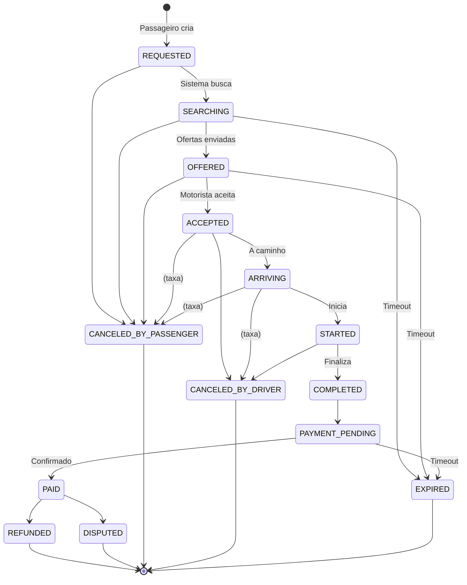

# Blueprint Técnico - Sistema Uber/99 Style

**Data:** 14/12/2024  
**Versão:** 1.0  
**Stack:** FastAPI + PostgreSQL + Redis + WebSocket

---

## 📋 Índice

1. [Stack e Decisões Arquiteturais](#1-stack-e-decisões-arquiteturais)
2. [Modelo de Domínio e Banco de Dados](#2-modelo-de-domínio-e-banco-de-dados)
3. [Máquina de Estados da Corrida](#3-máquina-de-estados-da-corrida)
4. [Fluxos Transacionais Críticos](#4-fluxos-transacionais-críticos)
5. [Modelo Financeiro (Ledger + D+N)](#5-modelo-financeiro-ledger--dn)
6. [Wallet do Motorista (Earnings + Credit)](#6-wallet-do-motorista-earnings--credit)
7. [Abstração PaymentProvider](#7-abstração-paymentprovider)
8. [Segurança e Idempotência](#8-segurança-e-idempotência)
9. [Eventos Tempo Real](#9-eventos-tempo-real)
10. [Contratos API FastAPI](#10-contratos-api-fastapi)
11. [Observabilidade](#11-observabilidade)
12. [Roadmap de Implementação](#12-roadmap-de-implementação)

---

## 1. Stack e Decisões Arquiteturais

### 1.1 Stack Tecnológica

```yaml
Backend:
  Framework: FastAPI (Python 3.11+)
  Database: PostgreSQL 15+ (JSONB, extensões PostGIS)
  Cache: Redis 7+ (locks, pub/sub, rate limiting)
  Jobs: Arq (async) ou Celery
  Auth: JWT + Refresh Tokens
  
Pagamentos:
  Pix: Efí (Pix Cob + Webhook)
  Cartão: Plugável (Pagar.me, Mercado Pago, Stripe, Adyen)
  Cash: Registro offline
  
Real-time:
  Protocol: WebSocket (Socket.io ou nativo)
  Broadcast: Redis Pub/Sub
  
Observability:
  Logs: JSON estruturado
  Metrics: Prometheus/StatsD
  Tracing: OpenTelemetry (opcional)
```

### 1.2 Princípios Arquiteturais

1. **ACID Transactions**: Operações críticas em transações atômicas
2. **Idempotency First**: Todas mutations são idempotentes
3. **Append-Only Ledger**: Ledger financeiro imutável
4. **Event Sourcing Lite**: Histórico via `ride_events` e `financial_events`
5. **Domain-Driven Design**: Agregados bem definidos (Ride, Payment, Payout)
6. **Fail-Safe**: Compensações automáticas em falhas

### 1.3 Requisitos de Negócio

**Marketplace:**
- Passageiro solicita corrida
- Dispatch para motoristas próximos  
- **Aceite único** (1 motorista por corrida)
- Rastreamento GPS em tempo real
- Estados bem definidos com transições validadas

**Pagamentos:**
- **Pix**: Plataforma recebe, segura D+N, libera ao motorista
- **Cartão**: Autorização/Captura, suporte a chargeback
- **Cash**: Passageiro paga motorista, sistema registra e aplica comissão

**Financeiro:**
- **Ledger Imutável**: Double-entry bookkeeping
- **Earnings Wallet** (motorista):
  - `EARNINGS`: Ganhos em hold D+N
  - `AVAILABLE`: Liberado para saque
  - `LOCKED`: Disputas, chargeback
- **Credit Wallet** (motorista - separado):
  - `DRIVER_CREDIT`: Pré-pago para usar app
  - Recarga via Pix/Cartão
  - Consumo por corrida/período

**Settlement D+N:**
- Ganhos ficam bloqueados por N dias (configurável)
- Job diário libera saldo: `LOCKED` → `AVAILABLE`

**Payout:**
- Saque mínimo: R$ 50,00 (configurável)
- Valida saldo `AVAILABLE`
- Taxas aplicáveis
- Transferência bancária/Pix

---

## 2. Modelo de Domínio e Banco de Dados

### 2.1 Convenções Globais

```sql
-- IDs: UUID v7 (ordenável por tempo)
CREATE EXTENSION IF NOT EXISTS "uuid-ossp";
CREATE EXTENSION IF NOT EXISTS "pgcrypto";

-- Função para UUID v7 (simulado via timestamp + random)
CREATE OR REPLACE FUNCTION uuid_generate_v7()
RETURNS UUID AS $$
DECLARE
  unix_ts_ms BIGINT;
  uuid_bytes BYTEA;
BEGIN
  unix_ts_ms := (EXTRACT(EPOCH FROM CLOCK_TIMESTAMP()) * 1000)::BIGINT;
  uuid_bytes := OVERLAY(gen_random_bytes(16) PLACING 
    substring(int8send(unix_ts_ms) FROM 3) FROM 1 FOR 6);
  uuid_bytes := SET_BYTE(uuid_bytes, 6, (GET_BYTE(uuid_bytes, 6) & 15) | 112);
  uuid_bytes := SET_BYTE(uuid_bytes, 8, (GET_BYTE(uuid_bytes, 8) & 63) | 128);
  RETURN encode(uuid_bytes, 'hex')::UUID;
END;
$$ LANGUAGE plpgsql VOLATILE;

-- Timestamps: sempre WITH TIME ZONE
-- Monetary: DECIMAL(19,4) - suporta até 999 trilhões com 4 decimais
-- Soft delete: deleted_at TIMESTAMP WITH TIME ZONE
-- Audit: created_at, updated_at, created_by, updated_by
```

### 2.2 Entidades Core - Identidade

#### users (base polimórfica)

```sql
CREATE TYPE user_type AS ENUM ('PASSENGER', 'DRIVER', 'ADMIN');
CREATE TYPE user_status AS ENUM ('ACTIVE', 'SUSPENDED', 'BANNED', 'PENDING_VERIFICATION');

CREATE TABLE users (
    id UUID PRIMARY KEY DEFAULT uuid_generate_v7(),
    phone VARCHAR(20) UNIQUE NOT NULL,
    email VARCHAR(255) UNIQUE,
    password_hash VARCHAR(255) NOT NULL,
    user_type user_type NOT NULL,
    status user_status DEFAULT 'PENDING_VERIFICATION',
    
    full_name VARCHAR(255) NOT NULL,
    cpf VARCHAR(14) UNIQUE,
    date_of_birth DATE,
    profile_photo_url TEXT,
    
    phone_verified_at TIMESTAMPTZ,
    email_verified_at TIMESTAMPTZ,
    
    created_at TIMESTAMPTZ DEFAULT NOW(),
    updated_at TIMESTAMPTZ DEFAULT NOW(),
    deleted_at TIMESTAMPTZ,
    
    CONSTRAINT phone_format CHECK (phone ~ '^\+?[1-9]\d{1,14}$'),
    CONSTRAINT cpf_format CHECK (cpf ~ '^\d{11}$' OR cpf IS NULL)
);

CREATE INDEX idx_users_phone ON users(phone) WHERE deleted_at IS NULL;
CREATE INDEX idx_users_email ON users(email) WHERE deleted_at IS NULL;
CREATE INDEX idx_users_cpf ON users(cpf) WHERE deleted_at IS NULL;
```

#### drivers

```sql
CREATE TYPE driver_status AS ENUM (
    'PENDING_APPROVAL', 'APPROVED', 'ACTIVE', 'ON_TRIP', 'OFFLINE', 'SUSPENDED', 'BANNED'
);

CREATE TABLE drivers (
    id UUID PRIMARY KEY REFERENCES users(id),
    status driver_status DEFAULT 'PENDING_APPROVAL',
    
    cnh VARCHAR(20) UNIQUE NOT NULL,
    cnh_category VARCHAR(5) NOT NULL,
    cnh_expires_at DATE NOT NULL,
    
    vehicle_id UUID REFERENCES vehicles(id),
    bank_account_id UUID,
    
    total_rides INTEGER DEFAULT 0,
    total_earned DECIMAL(19,4) DEFAULT 0,
    acceptance_rate DECIMAL(5,2),
    average_rating DECIMAL(3,2),
    
    last_lat DECIMAL(10,8),
    last_lng DECIMAL(11,8),
    last_location_update TIMESTAMPTZ,
    is_available BOOLEAN DEFAULT FALSE,
    
    created_at TIMESTAMPTZ DEFAULT NOW(),
    updated_at TIMESTAMPTZ DEFAULT NOW(),
    approved_at TIMESTAMPTZ,
    approved_by UUID REFERENCES users(id)
);

CREATE INDEX idx_drivers_status ON drivers(status);
CREATE INDEX idx_drivers_available ON drivers(is_available) WHERE status = 'ACTIVE';
```

#### vehicles

```sql
CREATE TYPE vehicle_type AS ENUM ('STANDARD', 'COMFORT', 'BLACK', 'XL');

CREATE TABLE vehicles (
    id UUID PRIMARY KEY DEFAULT uuid_generate_v7(),
    license_plate VARCHAR(10) UNIQUE NOT NULL,
    brand VARCHAR(50) NOT NULL,
    model VARCHAR(50) NOT NULL,
    year INTEGER NOT NULL,
    color VARCHAR(30) NOT NULL,
    vehicle_type vehicle_type DEFAULT 'STANDARD',
    passenger_capacity INTEGER DEFAULT 4,
    
    created_at TIMESTAMPTZ DEFAULT NOW(),
    updated_at TIMESTAMPTZ DEFAULT NOW(),
    deleted_at TIMESTAMPTZ,
    
    CONSTRAINT valid_year CHECK (year >= 2000 AND year <= EXTRACT(YEAR FROM NOW()) + 1)
);
```

### 2.3 Entidades - Corridas

#### rides

```sql
CREATE TYPE ride_status AS ENUM (
    'REQUESTED', 'SEARCHING', 'OFFERED', 'ACCEPTED', 'ARRIVING', 'STARTED', 
    'COMPLETED', 'PAYMENT_PENDING', 'PAID',
    'CANCELED_BY_PASSENGER', 'CANCELED_BY_DRIVER', 'CANCELED_BY_SYSTEM',
    'EXPIRED', 'REFUNDED', 'DISPUTED'
);

CREATE TYPE payment_method AS ENUM ('PIX', 'CARD', 'CASH', 'WALLET');

CREATE TABLE rides (
    id UUID PRIMARY KEY DEFAULT uuid_generate_v7(),
    
    passenger_id UUID NOT NULL REFERENCES passengers(id),
    driver_id UUID REFERENCES drivers(id),
    vehicle_id UUID REFERENCES vehicles(id),
    
    status ride_status DEFAULT 'REQUESTED',
    
    -- Origem
    pickup_lat DECIMAL(10,8) NOT NULL,
    pickup_lng DECIMAL(11,8) NOT NULL,
    pickup_address TEXT NOT NULL,
    
    -- Destino
    dropoff_lat DECIMAL(10,8) NOT NULL,
    dropoff_lng DECIMAL(11,8) NOT NULL,
    dropoff_address TEXT NOT NULL,
    
    -- Estimativas
    estimated_distance_km DECIMAL(10,2),
    estimated_duration_min INTEGER,
    estimated_fare DECIMAL(19,4),
    
    -- Valores reais (após completar)
    actual_distance_km DECIMAL(10,2),
    actual_duration_min INTEGER,
    final_fare DECIMAL(19,4),
    
    -- Comissão
    platform_fee DECIMAL(19,4),
    driver_earnings DECIMAL(19,4),
    
    -- Pagamento
    payment_method payment_method,
    payment_intent_id UUID,
    
    -- Cancelamento
    cancellation_fee DECIMAL(19,4),
    cancellation_reason TEXT,
    canceled_by UUID REFERENCES users(id),
    
    -- Lifecycle timestamps
    requested_at TIMESTAMPTZ DEFAULT NOW(),
    accepted_at TIMESTAMPTZ,
    driver_arrived_at TIMESTAMPTZ,
    started_at TIMESTAMPTZ,
    completed_at TIMESTAMPTZ,
    paid_at TIMESTAMPTZ,
    canceled_at TIMESTAMPTZ,
    
    metadata JSONB,
    
    created_at TIMESTAMPTZ DEFAULT NOW(),
    updated_at TIMESTAMPTZ DEFAULT NOW(),
    
    CONSTRAINT valid_coordinates CHECK (
        pickup_lat BETWEEN -90 AND 90 AND pickup_lng BETWEEN -180 AND 180 AND
        dropoff_lat BETWEEN -90 AND 90 AND dropoff_lng BETWEEN -180 AND 180
    )
);

CREATE INDEX idx_rides_passenger ON rides(passenger_id);
CREATE INDEX idx_rides_driver ON rides(driver_id) WHERE driver_id IS NOT NULL;
CREATE INDEX idx_rides_status ON rides(status);
CREATE INDEX idx_rides_active ON rides(status) WHERE status IN (
    'REQUESTED', 'SEARCHING', 'OFFERED', 'ACCEPTED', 'ARRIVING', 'STARTED', 'PAYMENT_PENDING'
);
CREATE INDEX idx_rides_created_at ON rides(created_at DESC);
```

#### ride_offers

```sql
CREATE TYPE offer_status AS ENUM ('PENDING', 'ACCEPTED', 'REJECTED', 'EXPIRED');

CREATE TABLE ride_offers (
    id UUID PRIMARY KEY DEFAULT uuid_generate_v7(),
    ride_id UUID NOT NULL REFERENCES rides(id) ON DELETE CASCADE,
    driver_id UUID NOT NULL REFERENCES drivers(id),
    
    status offer_status DEFAULT 'PENDING',
    
    estimated_distance_to_pickup_km DECIMAL(10,2),
    estimated_time_to_pickup_min INTEGER,
    
    offered_at TIMESTAMPTZ DEFAULT NOW(),
    expires_at TIMESTAMPTZ NOT NULL,
    responded_at TIMESTAMPTZ,
    
    created_at TIMESTAMPTZ DEFAULT NOW(),
    
    UNIQUE(ride_id, driver_id)
);

CREATE INDEX idx_ride_offers_ride ON ride_offers(ride_id);
CREATE INDEX idx_ride_offers_driver ON ride_offers(driver_id);
CREATE INDEX idx_ride_offers_pending ON ride_offers(status, expires_at) WHERE status = 'PENDING';
```

#### ride_events (Event Sourcing leve)

```sql
CREATE TABLE ride_events (
    id UUID PRIMARY KEY DEFAULT uuid_generate_v7(),
    ride_id UUID NOT NULL REFERENCES rides(id) ON DELETE CASCADE,
    
    event_type VARCHAR(50) NOT NULL,
    previous_status ride_status,
    new_status ride_status NOT NULL,
    
    actor_id UUID REFERENCES users(id),
    actor_type VARCHAR(20),
    
    event_data JSONB,
    occurred_at TIMESTAMPTZ DEFAULT NOW()
);

CREATE INDEX idx_ride_events_ride ON ride_events(ride_id, occurred_at);
CREATE INDEX idx_ride_events_type ON ride_events(event_type);
```

### 2.4 Entidades - Pagamentos

#### payment_intents

```sql
CREATE TYPE payment_intent_status AS ENUM (
    'PENDING', 'PROCESSING', 'CONFIRMED', 'FAILED', 'EXPIRED', 'CANCELED', 'REFUNDED'
);

CREATE TABLE payment_intents (
    id UUID PRIMARY KEY DEFAULT uuid_generate_v7(),
    ride_id UUID NOT NULL REFERENCES rides(id) ON DELETE RESTRICT,
    
    amount DECIMAL(19,4) NOT NULL,
    currency VARCHAR(3) DEFAULT 'BRL',
    payment_method payment_method NOT NULL,
    status payment_intent_status DEFAULT 'PENDING',
    
    idempotency_key VARCHAR(255) UNIQUE NOT NULL,
    metadata JSONB,
    
    created_at TIMESTAMPTZ DEFAULT NOW(),
    confirmed_at TIMESTAMPTZ,
    failed_at TIMESTAMPTZ,
    expires_at TIMESTAMPTZ,
    updated_at TIMESTAMPTZ DEFAULT NOW(),
    
    CONSTRAINT positive_amount CHECK (amount > 0)
);

CREATE INDEX idx_payment_intents_ride ON payment_intents(ride_id);
CREATE INDEX idx_payment_intents_status ON payment_intents(status);
CREATE INDEX idx_payment_intents_idempotency ON payment_intents(idempotency_key);
```

#### pix_charges (Efí)

```sql
CREATE TYPE pix_charge_status AS ENUM ('ACTIVE', 'COMPLETED', 'EXPIRED', 'REMOVED');

CREATE TABLE pix_charges (
    id UUID PRIMARY KEY DEFAULT uuid_generate_v7(),
    payment_intent_id UUID NOT NULL REFERENCES payment_intents(id) ON DELETE RESTRICT,
    
    txid VARCHAR(35) UNIQUE NOT NULL,
    qr_code TEXT NOT NULL,
    qr_code_text TEXT NOT NULL,
    amount DECIMAL(19,4) NOT NULL,
    status pix_charge_status DEFAULT 'ACTIVE',
    
    e2e_id VARCHAR(50) UNIQUE,
    
    created_at TIMESTAMPTZ DEFAULT NOW(),
    expires_at TIMESTAMPTZ NOT NULL,
    paid_at TIMESTAMPTZ,
    updated_at TIMESTAMPTZ DEFAULT NOW(),
    
    CONSTRAINT positive_amount CHECK (amount > 0)
);

CREATE INDEX idx_pix_charges_payment_intent ON pix_charges(payment_intent_id);
CREATE INDEX idx_pix_charges_txid ON pix_charges(txid);
CREATE INDEX idx_pix_charges_e2e ON pix_charges(e2e_id) WHERE e2e_id IS NOT NULL;
CREATE INDEX idx_pix_charges_active ON pix_charges(status, expires_at) WHERE status = 'ACTIVE';
```

#### webhook_events

```sql
CREATE TYPE webhook_status AS ENUM ('RECEIVED', 'PROCESSING', 'PROCESSED', 'FAILED', 'DUPLICATE');

CREATE TABLE webhook_events (
    id UUID PRIMARY KEY DEFAULT uuid_generate_v7(),
    
    provider VARCHAR(50) NOT NULL,
    event_id VARCHAR(255) UNIQUE NOT NULL,
    event_type VARCHAR(100) NOT NULL,
    payload JSONB NOT NULL,
    
    status webhook_status DEFAULT 'RECEIVED',
    processed_at TIMESTAMPTZ,
    error_message TEXT,
    
    idempotency_hash VARCHAR(64) UNIQUE,
    
    received_at TIMESTAMPTZ DEFAULT NOW(),
    created_at TIMESTAMPTZ DEFAULT NOW()
);

CREATE INDEX idx_webhook_events_provider ON webhook_events(provider);
CREATE INDEX idx_webhook_events_event_id ON webhook_events(event_id);
CREATE INDEX idx_webhook_events_status ON webhook_events(status);
```

### 2.5 Entidades - Ledger Financeiro

#### ledger_accounts

```sql
CREATE TYPE account_type AS ENUM ('ASSET', 'LIABILITY', 'REVENUE', 'EXPENSE');

CREATE TABLE ledger_accounts (
    id UUID PRIMARY KEY DEFAULT uuid_generate_v7(),
    
    code VARCHAR(20) UNIQUE NOT NULL,
    name VARCHAR(255) NOT NULL,
    description TEXT,
    account_type account_type NOT NULL,
    
    parent_account_id UUID REFERENCES ledger_accounts(id),
    
    entity_type VARCHAR(50),
    entity_id UUID,
    
    balance DECIMAL(19,4) DEFAULT 0,
    balance_calculated_at TIMESTAMPTZ,
    
    is_active BOOLEAN DEFAULT TRUE,
    
    created_at TIMESTAMPTZ DEFAULT NOW(),
    updated_at TIMESTAMPTZ DEFAULT NOW()
);

CREATE INDEX idx_ledger_accounts_code ON ledger_accounts(code);
CREATE INDEX idx_ledger_accounts_type ON ledger_accounts(account_type);
CREATE INDEX idx_ledger_accounts_entity ON ledger_accounts(entity_type, entity_id) 
    WHERE entity_id IS NOT NULL;
```

**Chart of Accounts inicial:**

```sql
INSERT INTO ledger_accounts (code, name, account_type, description) VALUES
    ('1100', 'Caixa', 'ASSET', 'Dinheiro em caixa'),
    ('1200', 'Banco Corrente', 'ASSET', 'Conta corrente da plataforma'),
    ('1300', 'Pix a Receber', 'ASSET', 'Valores a receber via Pix'),
    
    ('2100', 'Motoristas a Pagar - Earnings', 'LIABILITY', 'Valores devidos aos motoristas (earnings)'),
    ('2200', 'Comissões Retidas', 'LIABILITY', 'Comissões retidas temporariamente'),
    
    ('4100', 'Receita de Corridas', 'REVENUE', 'Receita total de corridas'),
    ('4200', 'Comissão Plataforma', 'REVENUE', 'Comissão da plataforma'),
    
    ('5100', 'Taxas de Pagamento', 'EXPENSE', 'Taxas pagas a gateways'),
    ('5200', 'Estornos', 'EXPENSE', 'Valores estornados');
```

#### financial_events

```sql
CREATE TABLE financial_events (
    id UUID PRIMARY KEY DEFAULT uuid_generate_v7(),
    
    event_type VARCHAR(100) NOT NULL,
    entity_type VARCHAR(50) NOT NULL,
    entity_id UUID NOT NULL,
    external_id VARCHAR(255),
    
    amount DECIMAL(19,4) NOT NULL,
    currency VARCHAR(3) DEFAULT 'BRL',
    transaction_id VARCHAR(100) NOT NULL,
    
    metadata JSONB,
    
    occurred_at TIMESTAMPTZ DEFAULT NOW(),
    created_at TIMESTAMPTZ DEFAULT NOW(),
    
    CONSTRAINT positive_amount CHECK (amount > 0)
);

CREATE INDEX idx_financial_events_type ON financial_events(event_type);
CREATE INDEX idx_financial_events_entity ON financial_events(entity_type, entity_id);
CREATE INDEX idx_financial_events_external ON financial_events(external_id) WHERE external_id IS NOT NULL;
CREATE INDEX idx_financial_events_transaction ON financial_events(transaction_id);

-- Deduplicação
CREATE UNIQUE INDEX idx_financial_events_dedup ON financial_events(event_type, external_id) 
    WHERE external_id IS NOT NULL;
```

#### ledger_entries (Double-Entry)

```sql
CREATE TYPE entry_type AS ENUM ('DEBIT', 'CREDIT');

CREATE TABLE ledger_entries (
    id UUID PRIMARY KEY DEFAULT uuid_generate_v7(),
    
    account_id UUID NOT NULL REFERENCES ledger_accounts(id),
    entry_type entry_type NOT NULL,
    amount DECIMAL(19,4) NOT NULL,
    currency VARCHAR(3) DEFAULT 'BRL',
    
    transaction_id VARCHAR(100) NOT NULL,
    financial_event_id UUID REFERENCES financial_events(id),
    
    description TEXT NOT NULL,
    reference_type VARCHAR(50),
    reference_id UUID,
    
    reversal_of_entry_id UUID REFERENCES ledger_entries(id),
    is_reversed BOOLEAN DEFAULT FALSE,
    
    posted_at TIMESTAMPTZ DEFAULT NOW(),
    created_at TIMESTAMPTZ DEFAULT NOW(),
    created_by UUID REFERENCES users(id),
    
    CONSTRAINT positive_amount CHECK (amount > 0)
);

CREATE INDEX idx_ledger_entries_account ON ledger_entries(account_id, posted_at DESC);
CREATE INDEX idx_ledger_entries_transaction ON ledger_entries(transaction_id);
CREATE INDEX idx_ledger_entries_event ON ledger_entries(financial_event_id);
CREATE INDEX idx_ledger_entries_reference ON ledger_entries(reference_type, reference_id);

-- View para validar balanço
CREATE VIEW ledger_balance_check AS
SELECT 
    transaction_id,
    SUM(CASE WHEN entry_type = 'DEBIT' THEN amount ELSE 0 END) AS total_debits,
    SUM(CASE WHEN entry_type = 'CREDIT' THEN amount ELSE 0 END) AS total_credits,
    SUM(CASE WHEN entry_type = 'DEBIT' THEN amount ELSE -amount END) AS balance
FROM ledger_entries
GROUP BY transaction_id
HAVING ABS(SUM(CASE WHEN entry_type = 'DEBIT' THEN amount ELSE -amount END)) > 0.01;
```

#### holds (D+N e Disputas)

```sql
CREATE TYPE hold_type AS ENUM ('SETTLEMENT', 'DISPUTE', 'FRAUD', 'MANUAL');
CREATE TYPE hold_status AS ENUM ('ACTIVE', 'RELEASED', 'CANCELED');

CREATE TABLE holds (
    id UUID PRIMARY KEY DEFAULT uuid_generate_v7(),
    
    account_id UUID NOT NULL REFERENCES ledger_accounts(id),
    hold_type hold_type NOT NULL,
    amount DECIMAL(19,4) NOT NULL,
    currency VARCHAR(3) DEFAULT 'BRL',
    
    reference_type VARCHAR(50),
    reference_id UUID,
    
    status hold_status DEFAULT 'ACTIVE',
    release_at TIMESTAMPTZ,
    reason TEXT,
    
    created_at TIMESTAMPTZ DEFAULT NOW(),
    released_at TIMESTAMPTZ,
    created_by UUID REFERENCES users(id),
    released_by UUID REFERENCES users(id),
    
    CONSTRAINT positive_amount CHECK (amount > 0)
);

CREATE INDEX idx_holds_account ON holds(account_id);
CREATE INDEX idx_holds_status ON holds(status);
CREATE INDEX idx_holds_release ON holds(release_at) WHERE status = 'ACTIVE';
```

#### settlements (Agenda D+N)

```sql
CREATE TYPE settlement_status AS ENUM ('SCHEDULED', 'PROCESSING', 'COMPLETED', 'FAILED');

CREATE TABLE settlements (
    id UUID PRIMARY KEY DEFAULT uuid_generate_v7(),
    
    hold_id UUID NOT NULL REFERENCES holds(id),
    driver_id UUID NOT NULL REFERENCES drivers(id),
    amount DECIMAL(19,4) NOT NULL,
    currency VARCHAR(3) DEFAULT 'BRL',
    
    status settlement_status DEFAULT 'SCHEDULED',
    scheduled_for DATE NOT NULL,
    
    processed_at TIMESTAMPTZ,
    error_message TEXT,
    
    created_at TIMESTAMPTZ DEFAULT NOW(),
    
    CONSTRAINT positive_amount CHECK (amount > 0)
);

CREATE INDEX idx_settlements_hold ON settlements(hold_id);
CREATE INDEX idx_settlements_driver ON settlements(driver_id);
CREATE INDEX idx_settlements_scheduled ON settlements(scheduled_for, status) 
    WHERE status = 'SCHEDULED';
```

### 2.6 Entidades - Wallet de Crédito (Recarga)

#### driver_credits

```sql
CREATE TABLE driver_credits (
    id UUID PRIMARY KEY REFERENCES drivers(id),
    
    balance DECIMAL(19,4) DEFAULT 0,
    balance_calculated_at TIMESTAMPTZ DEFAULT NOW(),
    minimum_balance DECIMAL(19,4) DEFAULT 0,
    
    is_active BOOLEAN DEFAULT TRUE,
    
    created_at TIMESTAMPTZ DEFAULT NOW(),
    updated_at TIMESTAMPTZ DEFAULT NOW(),
    
    CONSTRAINT non_negative_balance CHECK (balance >= 0)
);
```

#### driver_credit_events

```sql
CREATE TYPE credit_event_type AS ENUM ('TOPUP', 'CONSUMPTION', 'ADJUSTMENT', 'REFUND', 'BONUS');

CREATE TABLE driver_credit_events (
    id UUID PRIMARY KEY DEFAULT uuid_generate_v7(),
    driver_id UUID NOT NULL REFERENCES drivers(id),
    
    event_type credit_event_type NOT NULL,
    amount DECIMAL(19,4) NOT NULL,
    balance_after DECIMAL(19,4) NOT NULL,
    
    reference_type VARCHAR(50),
    reference_id UUID,
    description TEXT,
    payment_intent_id UUID REFERENCES payment_intents(id),
    
    occurred_at TIMESTAMPTZ DEFAULT NOW(),
    created_at TIMESTAMPTZ DEFAULT NOW(),
    created_by UUID REFERENCES users(id)
);

CREATE INDEX idx_driver_credit_events_driver ON driver_credit_events(driver_id, occurred_at DESC);
CREATE INDEX idx_driver_credit_events_type ON driver_credit_events(event_type);
```

### 2.7 Entidades - Payout

#### payout_requests

```sql
CREATE TYPE payout_status AS ENUM (
    'PENDING', 'APPROVED', 'PROCESSING', 'COMPLETED', 'FAILED', 'CANCELED'
);

CREATE TABLE payout_requests (
    id UUID PRIMARY KEY DEFAULT uuid_generate_v7(),
    driver_id UUID NOT NULL REFERENCES drivers(id),
    
    amount DECIMAL(19,4) NOT NULL,
    currency VARCHAR(3) DEFAULT 'BRL',
    fee DECIMAL(19,4) DEFAULT 0,
    net_amount DECIMAL(19,4) NOT NULL,
    
    status payout_status DEFAULT 'PENDING',
    bank_account_id UUID NOT NULL,
    available_balance_at_request DECIMAL(19,4) NOT NULL,
    
    processed_at TIMESTAMPTZ,
    error_message TEXT,
    idempotency_key VARCHAR(255) UNIQUE NOT NULL,
    
    requested_at TIMESTAMPTZ DEFAULT NOW(),
    created_at TIMESTAMPTZ DEFAULT NOW(),
    updated_at TIMESTAMPTZ DEFAULT NOW(),
    
    CONSTRAINT positive_amount CHECK (amount > 0),
    CONSTRAINT positive_net_amount CHECK (net_amount > 0)
);

CREATE INDEX idx_payout_requests_driver ON payout_requests(driver_id);
CREATE INDEX idx_payout_requests_status ON payout_requests(status);
```

---

## 3. Máquina de Estados da Corrida

### 3.1 Diagrama (Mermaid)



### 3.2 Eventos por Transição

```python
STATE_EVENTS = {
    "REQUESTED": ["ride.created"],
    "SEARCHING": ["ride.searching"],
    "OFFERED": ["ride.offered"],
    "ACCEPTED": ["ride.accepted", "driver.assigned"],
    "ARRIVING": ["ride.driver_arriving"],
    "STARTED": ["ride.started"],
    "COMPLETED": ["ride.completed"],
    "PAYMENT_PENDING": ["payment.pending"],
    "PAID": ["ride.paid", "payment.confirmed"],
    "CANCELED_BY_PASSENGER": ["ride.canceled"],
    "CANCELED_BY_DRIVER": ["ride.canceled"],
    "EXPIRED": ["ride.expired"]
}
```

---

## 4. Fluxos Transacionais Críticos

### 4.1 Accept Ride (CRÍTICO #1)

**Objetivo:** Garantir aceite único com idempotência

**Abordagem:** Redis Lock + PostgreSQL SELECT FOR UPDATE

```python
@router.post("/rides/{ride_id}/accept")
async def accept_ride(
    ride_id: UUID,
    driver_id: UUID,
    idempotency_key: str,  # OBRIGATÓRIO
    db: AsyncSession = Depends(get_db),
    redis: Redis = Depends(get_redis)
):
    # 1. Validar idempotência PRÉ-LOCK
    existing = await db.execute(
        select(RideAcceptAttempt)
        .where(RideAcceptAttempt.idempotency_key == idempotency_key)
    )
    attempt = existing.scalar_one_or_none()
    
    if attempt:
        if attempt.status == "SUCCESS":
            ride = await db.get(Ride, attempt.ride_id)
            return RideAcceptedResponse.from_orm(ride)
        elif attempt.status == "PENDING":
            await asyncio.sleep(0.5)
            return await accept_ride(ride_id, driver_id, idempotency_key, db, redis)
    
    # 2. REDIS LOCKS (previne contenção)
    ride_lock = f"lock:ride:{ride_id}"
    driver_lock = f"lock:driver:{driver_id}"
    
    async with redis.lock(ride_lock, timeout=10):
        async with redis.lock(driver_lock, timeout=10):
            
            # 3. TRANSAÇÃO DO BANCO
            async with db.begin():
                
                # Lock pessimista
                result = await db.execute(
                    select(Ride).where(Ride.id == ride_id).with_for_update()
                )
                ride = result.scalar_one_or_none()
                
                if not ride:
                    raise HTTPException(404, "Ride not found")
                
                # Validações
                if ride.status != RideStatus.OFFERED:
                    raise HTTPException(400, f"Invalid status: {ride.status}")
                
                if ride.driver_id is not None:
                    raise HTTPException(409, "Already accepted")
                
                # Validar motorista
                driver = await db.get(Driver, driver_id)
                if driver.status != DriverStatus.ACTIVE:
                    raise HTTPException(400, "Driver not available")
                
                # Verificar corrida ativa do motorista
                active = await db.execute(
                    select(Ride).where(
                        Ride.driver_id == driver_id,
                        Ride.status.in_(['ACCEPTED', 'ARRIVING', 'STARTED'])
                    )
                )
                if active.scalar_one_or_none():
                    raise HTTPException(409, "Driver has active ride")
                
                # Validar crédito
                credit = await db.get(DriverCredit, driver_id)
                if credit and credit.balance < credit.minimum_balance:
                    raise HTTPException(402, "Insufficient credit")
                
                # ATUALIZAR
                ride.driver_id = driver_id
                ride.vehicle_id = driver.vehicle_id
                ride.status = RideStatus.ACCEPTED
                ride.accepted_at = func.now()
                db.add(ride)
                
                driver.status = DriverStatus.ON_TRIP
                driver.is_available = False
                db.add(driver)
                
                # Expirar outras ofertas
                await db.execute(
                    update(RideOffer)
                    .where(
                        RideOffer.ride_id == ride_id,
                        RideOffer.driver_id != driver_id,
                        RideOffer.status == OfferStatus.PENDING
                    )
                    .values(status=OfferStatus.EXPIRED)
                )
                
                # Aceitar oferta
                await db.execute(
                    update(RideOffer)
                    .where(
                        RideOffer.ride_id == ride_id,
                        RideOffer.driver_id == driver_id
                    )
                    .values(status=OfferStatus.ACCEPTED)
                )
                
                # Registrar tentativa (idempotência)
                db.add(RideAcceptAttempt(
                    idempotency_key=idempotency_key,
                    ride_id=ride_id,
                    driver_id=driver_id,
                    status="SUCCESS"
                ))
                
                # Evento
                db.add(RideEvent(
                    ride_id=ride_id,
                    event_type="RIDE_ACCEPTED",
                    previous_status=RideStatus.OFFERED,
                    new_status=RideStatus.ACCEPTED,
                    actor_id=driver_id,
                    actor_type="DRIVER"
                ))
                
                # COMMIT
                await db.commit()
                await db.refresh(ride)
    
    # 4. Eventos tempo real (async)
    asyncio.create_task(emit_ride_accepted(ride, driver))
    
    return RideAcceptedResponse.from_orm(ride)
```

**Tabela de Idempotência:**

```sql
CREATE TABLE ride_accept_attempts (
    id UUID PRIMARY KEY DEFAULT uuid_generate_v7(),
    idempotency_key VARCHAR(255) UNIQUE NOT NULL,
    ride_id UUID NOT NULL REFERENCES rides(id),
    driver_id UUID NOT NULL REFERENCES drivers(id),
    status VARCHAR(20) NOT NULL, -- PENDING, SUCCESS, FAILED
    error_message TEXT,
    created_at TIMESTAMPTZ DEFAULT NOW()
);
```

---

### 4.2 Webhook Pix (CRÍTICO #2)

**Objetivo:** Processar confirmação Pix com idempotência e atomicidade

```python
@router.post("/webhooks/efi/pix")
async def handle_efi_pix_webhook(
    request: Request,
    db: AsyncSession = Depends(get_db),
    redis: Redis = Depends(get_redis)
):
    # 1. VALIDAR ASSINATURA
    body = await request.body()
    signature = request.headers.get("x-signature")
    
    if not validate_efi_signature(body, signature, EFI_SECRET):
        raise HTTPException(401, "Invalid signature")
    
    webhook_data = await request.json()
    
    # 2. PERSISTIR WEBHOOK (SEMPRE)
    payload_hash = sha256(json.dumps(webhook_data, sort_keys=True).encode()).hexdigest()
    
    webhook_event = WebhookEvent(
        provider="EFI",
        event_id=webhook_data.get("endToEndId", str(uuid4())),
        event_type="PIX_RECEIVED",
        payload=webhook_data,
        idempotency_hash=payload_hash,
        status=WebhookStatus.RECEIVED
    )
    
    try:
        async with db.begin():
            db.add(webhook_event)
            await db.commit()
    except IntegrityError:
        logger.info("Duplicate webhook ignored")
        return {"status": "ok", "message": "Duplicate"}
    
    # 3. EXTRAIR DADOS
    txid = webhook_data.get("txid")
    e2e_id = webhook_data.get("endToEndId")
    valor = Decimal(webhook_data["pix"]["valor"])
    
    if not txid or not e2e_id:
        webhook_event.status = WebhookStatus.FAILED
        webhook_event.error_message = "Missing txid/e2e_id"
        await db.commit()
        raise HTTPException(400, "Invalid payload")
    
    # 4. LOCK DISTRIBUÍDO
    lock_key = f"lock:webhook:pix:{e2e_id}"
    
    async with redis.lock(lock_key, timeout=30):
        
        # 5. TRANSAÇÃO PRINCIPAL
        async with db.begin():
            
            # Buscar Pix Charge
            result = await db.execute(
                select(PixCharge).where(PixCharge.txid == txid).with_for_update()
            )
            pix_charge = result.scalar_one_or_none()
            
            if not pix_charge:
                webhook_event.status = WebhookStatus.FAILED
                await db.commit()
                return {"status": "error", "message": "Charge not found"}
            
            # Validar status
            if pix_charge.status == PixChargeStatus.COMPLETED:
                webhook_event.status = WebhookStatus.DUPLICATE
                await db.commit()
                return {"status": "ok", "message": "Already processed"}
            
            # Validar montante
            if abs(valor - pix_charge.amount) > Decimal("0.01"):
                raise HTTPException(400, "Amount mismatch")
            
            # Buscar PaymentIntent e Ride
            payment = await db.get(PaymentIntent, pix_charge.payment_intent_id, with_for_update=True)
            ride = await db.get(Ride, payment.ride_id, with_for_update=True)
            
            # DEDUPLICAÇÃO por e2e_id
            existing_event = await db.execute(
                select(FinancialEvent).where(
                    FinancialEvent.event_type == "PIX_PAYMENT_CONFIRMED",
                    FinancialEvent.external_id == e2e_id
                )
            )
            if existing_event.scalar_one_or_none():
                webhook_event.status = WebhookStatus.DUPLICATE
                await db.commit()
                return {"status": "ok", "message": "Already processed"}
            
            # ATUALIZAR ENTIDADES
            pix_charge.status = PixChargeStatus.COMPLETED
            pix_charge.e2e_id = e2e_id
            pix_charge.paid_at = func.now()
            db.add(pix_charge)
            
            payment.status = PaymentIntentStatus.CONFIRMED
            payment.confirmed_at = func.now()
            db.add(payment)
            
            ride.status = RideStatus.PAID
            ride.paid_at = func.now()
            db.add(ride)
            
            # CRIAR FINANCIAL EVENT
            fin_event = FinancialEvent(
                event_type="PIX_PAYMENT_CONFIRMED",
                entity_type="PAYMENT",
                entity_id=payment.id,
                external_id=e2e_id,  # Deduplicação
                amount=valor,
                transaction_id=f"payment_{payment.id}"
            )
            db.add(fin_event)
            
            # LEDGER ENTRIES (Double-Entry)
            tx_id = f"payment_{payment.id}_{e2e_id}"
            
            # 1. Débito: Pix a Receber
            pix_account = await get_account_by_code(db, "1300")
            db.add(LedgerEntry(
                account_id=pix_account.id,
                entry_type=EntryType.DEBIT,
                amount=valor,
                transaction_id=tx_id,
                financial_event_id=fin_event.id,
                description=f"Pix recebido - Ride {ride.id}",
                reference_type="PAYMENT",
                reference_id=payment.id
            ))
            
            # 2. Crédito: Receita de Corridas
            revenue_account = await get_account_by_code(db, "4100")
            db.add(LedgerEntry(
                account_id=revenue_account.id,
                entry_type=EntryType.CREDIT,
                amount=valor,
                transaction_id=tx_id,
                financial_event_id=fin_event.id,
                description=f"Receita corrida - Ride {ride.id}",
                reference_type="PAYMENT",
                reference_id=payment.id
            ))
            
            # CALCULAR COMISSÃO
            commission_rate = await get_commission_rate(db, ride)  # Ex: 0.20
            commission = valor * commission_rate
            driver_earnings = valor - commission
            
            ride.platform_fee = commission
            ride.driver_earnings = driver_earnings
            db.add(ride)
            
            # LEDGER: Distribuir receita
            commission_tx = f"commission_{ride.id}_{e2e_id}"
            
            commission_account = await get_account_by_code(db, "4200")
            driver_payable = await get_driver_payable_account(db, ride.driver_id)
            
            # 3. Débito: Receita (distribuição)
            db.add(LedgerEntry(
                account_id=revenue_account.id,
                entry_type=EntryType.DEBIT,
                amount=valor,
                transaction_id=commission_tx,
                description=f"Distribuição receita - Ride {ride.id}",
                reference_type="RIDE",
                reference_id=ride.id
            ))
            
            # 4. Crédito: Comissão
            db.add(LedgerEntry(
                account_id=commission_account.id,
                entry_type=EntryType.CREDIT,
                amount=commission,
                transaction_id=commission_tx,
                description=f"Comissão {commission_rate*100}% - Ride {ride.id}",
                reference_type="RIDE",
                reference_id=ride.id
            ))
            
            # 5. Crédito: Motorista (earnings)
            db.add(LedgerEntry(
                account_id=driver_payable.id,
                entry_type=EntryType.CREDIT,
                amount=driver_earnings,
                transaction_id=commission_tx,
                description=f"Ganhos motorista - Ride {ride.id}",
                reference_type="RIDE",
                reference_id=ride.id
            ))
            
            # CRIAR HOLD D+N
            settlement_days = await get_settlement_days(db, ride)  # Ex: 7
            release_at = datetime.now(UTC) + timedelta(days=settlement_days)
            
            hold = Hold(
                account_id=driver_payable.id,
                hold_type=HoldType.SETTLEMENT,
                amount=driver_earnings,
                reference_type="RIDE",
                reference_id=ride.id,
                status=HoldStatus.ACTIVE,
                release_at=release_at,
                reason=f"D+{settlement_days} settlement"
            )
            db.add(hold)
            
            # AGENDAR SETTLEMENT
            settlement = Settlement(
                hold_id=hold.id,
                driver_id=ride.driver_id,
                amount=driver_earnings,
                status=SettlementStatus.SCHEDULED,
                scheduled_for=release_at.date()
            )
            db.add(settlement)
            
            # CRIAR RIDE EVENT
            db.add(RideEvent(
                ride_id=ride.id,
                event_type="RIDE_PAID",
                previous_status=RideStatus.PAYMENT_PENDING,
                new_status=RideStatus.PAID,
                actor_type="SYSTEM",
                event_data={
                    "e2e_id": e2e_id,
                    "amount": str(valor),
                    "commission": str(commission),
                    "driver_earnings": str(driver_earnings)
                }
            ))
            
            # MARCAR WEBHOOK
            webhook_event.status = WebhookStatus.PROCESSED
            webhook_event.processed_at = func.now()
            db.add(webhook_event)
            
            # COMMIT
            await db.commit()
    
    # 6. Eventos tempo real
    asyncio.create_task(emit_payment_confirmed(ride, payment))
    
    return {"status": "ok"}
```

**Validação de Assinatura:**

```python
import hmac, hashlib

def validate_efi_signature(payload: bytes, signature: str, secret: str) -> bool:
    expected = hmac.new(secret.encode(), payload, hashlib.sha256).hexdigest()
    return hmac.compare_digest(signature.lower(), expected.lower())
```

---

## 5. Modelo Financeiro (Ledger + D+N)

### 5.1 Princípios

1. **Double-Entry Bookkeeping**: Toda transação tem débitos = créditos
2. **Imutabilidade**: Ledger entries são append-only (nunca UPDATE/DELETE)
3. **Reversões**: Estornos via novos entries invertidos
4. **Saldo Derivado**: Calculado via SUM(ledger_entries), não armazenado
5. **Auditoria Completa**: Toda mudança rastreável

### 5.2 Chart of Accounts

```
ASSETS (1xxx)
├── 1100: Caixa
├── 1200: Banco Corrente
└── 1300: Pix a Receber

LIABILITIES (2xxx)
├── 2100: Motoristas a Pagar - Earnings
└── 2200: Comissões Retidas

REVENUE (4xxx)
├── 4100: Receita de Corridas
└── 4200: Comissão Plataforma

EXPENSES (5xxx)
├── 5100: Taxas de Pagamento
└── 5200: Estornos
```

### 5.3 Fluxo Contábil - Corrida Paga

**Exemplo:** Corrida de R$ 50,00, comissão 20% (R$ 10,00)

**Transaction 1: Pagamento Pix Confirmado**
```
ID: payment_abc123_e2e456
Débito:  1300 - Pix a Receber           R$ 50,00
Crédito: 4100 - Receita de Corridas     R$ 50,00
```

**Transaction 2: Distribuição da Receita**
```
ID: commission_ride789_e2e456
Débito:  4100 - Receita de Corridas     R$ 50,00
Crédito: 4200 - Comissão Plataforma     R$ 10,00
Crédito: 2100 - Motoristas a Pagar      R$ 40,00 (driver_id: X)
```

**Hold D+7:** R$ 40,00 bloqueados na conta 2100 do motorista até D+7

### 5.4 Cálculo de Saldo

```sql
-- Saldo EARNINGS do motorista (conta 2100)
SELECT 
    SUM(CASE WHEN entry_type = 'CREDIT' THEN amount ELSE -amount END) AS balance
FROM ledger_entries le
JOIN ledger_accounts la ON la.id = le.account_id
WHERE la.code = '2100'
  AND la.entity_id = :driver_id
  AND le.is_reversed = FALSE;

-- Saldo LOCKED (em hold)
SELECT SUM(amount) 
FROM holds
WHERE account_id = (
    SELECT id FROM ledger_accounts 
    WHERE code = '2100' AND entity_id = :driver_id
)
AND status = 'ACTIVE';

-- Saldo AVAILABLE (liberado para saque)
-- = EARNINGS - LOCKED
```

### 5.5 Settlement D+N (Job Diário)

```python
@celery_app.task
async def process_daily_settlements():
    """
    Job executado diariamente às 00:00 UTC.
    Libera holds de D+N cujo release_at <= HOJE.
    """
    today = date.today()
    
    async with get_db_session() as db:
        
        # Buscar settlements agendados para hoje
        result = await db.execute(
            select(Settlement)
            .where(
                Settlement.status == SettlementStatus.SCHEDULED,
                Settlement.scheduled_for <= today
            )
        )
        settlements = result.scalars().all()
        
        logger.info(f"Processing {len(settlements)} settlements for {today}")
        
        for settlement in settlements:
            
            async with db.begin():
                
                # Lock
                await db.refresh(settlement, ['hold'])
                hold = settlement.hold
                
                if hold.status != HoldStatus.ACTIVE:
                    logger.warning(f"Hold {hold.id} not active, skipping")
                    continue
                
                # LIBERAR HOLD
                hold.status = HoldStatus.RELEASED
                hold.released_at = func.now()
                db.add(hold)
                
                # ATUALIZAR SETTLEMENT
                settlement.status = SettlementStatus.COMPLETED
                settlement.processed_at = func.now()
                db.add(settlement)
                
                # CRIAR LEDGER ENTRY (opcional, para auditoria)
                # Movimento de LOCKED → AVAILABLE é apenas conceitual,
                # não precisa de entry contábil (saldo já está correto)
                
                await db.commit()
                
                logger.info(f"Released hold {hold.id}, amount: {hold.amount}")
                
                # Notificar motorista
                asyncio.create_task(
                    websocket_manager.emit_to_user(
                        user_id=settlement.driver_id,
                        event="wallet.available.updated",
                        data={
                            "amount": float(settlement.amount),
                            "message": f"R$ {settlement.amount:.2f} liberado para saque"
                        }
                    )
                )
```

---

## 6. Wallet do Motorista (Earnings + Credit)

### 6.1 Separação de Carteiras

**EARNINGS WALLET** (Ganhos de corridas):
- `EARNINGS` = Total ganho (soma de ledger entries na conta 2100)
- `LOCKED` = Em hold (D+N, disputas)
- `AVAILABLE` = `EARNINGS - LOCKED` (disponível para saque)

**CREDIT WALLET** (Crédito para uso do app):
- `DRIVER_CREDIT` = Saldo de crédito pré-pago
- Recarga via Pix/Cartão
- Consumo por corrida ou período (diária/semanal/mensal)

**Por que separar?**
- Evita misturar custo operacional com ganhos
- Permite bloquear operação se crédito insuficiente
- Simplifica contabilidade (ganhos vs custos)

### 6.2 Recarga de Crédito (Topup)

```python
@router.post("/drivers/topup")
async def create_driver_topup(
    driver_id: UUID,
    amount: Decimal,
    payment_method: PaymentMethod,  # PIX ou CARD
    idempotency_key: str,
    db: AsyncSession = Depends(get_db)
):
    """
    Criar recarga de crédito para motorista.
    """
    
    async with db.begin():
        
        # Validar motorista
        driver = await db.get(Driver, driver_id)
        if not driver:
            raise HTTPException(404, "Driver not found")
        
        # Criar PaymentIntent
        payment_intent = PaymentIntent(
            amount=amount,
            payment_method=payment_method,
            status=PaymentIntentStatus.PENDING,
            idempotency_key=idempotency_key,
            metadata={"type": "DRIVER_TOPUP", "driver_id": str(driver_id)}
        )
        db.add(payment_intent)
        
        if payment_method == PaymentMethod.PIX:
            # Criar Pix Charge via Efí
            efi_response = await efi_client.create_pix_charge(
                amount=amount,
                expiration=3600  # 1 hora
            )
            
            pix_charge = PixCharge(
                payment_intent_id=payment_intent.id,
                txid=efi_response["txid"],
                qr_code=efi_response["qrcode"],
                qr_code_text=efi_response["pixCopiaECola"],
                amount=amount,
                expires_at=datetime.now(UTC) + timedelta(hours=1)
            )
            db.add(pix_charge)
            
            await db.commit()
            
            return {
                "payment_intent_id": payment_intent.id,
                "pix_charge": {
                    "qr_code": pix_charge.qr_code,
                    "qr_code_text": pix_charge.qr_code_text,
                    "expires_at": pix_charge.expires_at.isoformat()
                }
            }
        
        elif payment_method == PaymentMethod.CARD:
            # Integração com gateway de cartão
            # (similar ao Pix, mas com CardCharge)
            pass
```

**Webhook de confirmação (Topup Pix):**

Similar ao webhook de corrida, mas ao invés de criar hold D+N, credita diretamente em `driver_credits`:

```python
# Dentro do webhook handler, após validações:

# Criar DriverCreditEvent
driver_credit = await db.get(DriverCredit, driver_id, with_for_update=True)
if not driver_credit:
    driver_credit = DriverCredit(id=driver_id, balance=Decimal("0"))
    db.add(driver_credit)

new_balance = driver_credit.balance + amount

credit_event = DriverCreditEvent(
    driver_id=driver_id,
    event_type=CreditEventType.TOPUP,
    amount=amount,
    balance_after=new_balance,
    reference_type="PAYMENT",
    reference_id=payment_intent.id,
    payment_intent_id=payment_intent.id,
    description=f"Recarga via Pix - R$ {amount:.2f}"
)
db.add(credit_event)

# Atualizar saldo
driver_credit.balance = new_balance
driver_credit.updated_at = func.now()
db.add(driver_credit)
```

### 6.3 Consumo de Crédito

**Opção 1: Consumo por corrida (no accept)**

```python
# Dentro do accept_ride:

# Calcular custo da corrida para o motorista
cost_per_ride = Decimal("2.00")  # Configurável

# Debitar crédito
driver_credit = await db.get(DriverCredit, driver_id, with_for_update=True)
new_balance = driver_credit.balance - cost_per_ride

if new_balance < 0:
    raise HTTPException(402, "Insufficient credit")

credit_event = DriverCreditEvent(
    driver_id=driver_id,
    event_type=CreditEventType.CONSUMPTION,
    amount=-cost_per_ride,  # Negativo
    balance_after=new_balance,
    reference_type="RIDE",
    reference_id=ride.id,
    description=f"Consumo por corrida - Ride {ride.id}"
)
db.add(credit_event)

driver_credit.balance = new_balance
db.add(driver_credit)
```

**Opção 2: Consumo por período (diária/semanal)**

Job diário que cobra taxa fixa se motorista esteve ativo.

### 6.4 Bloqueio por Crédito Insuficiente

```python
# No accept_ride, antes de permitir aceite:

driver_credit = await db.get(DriverCredit, driver_id)
if driver_credit and driver_credit.balance < driver_credit.minimum_balance:
    raise HTTPException(
        status_code=402,
        detail="Insufficient driver credit. Please top up your account."
    )
```

---

## 7. Abstração PaymentProvider

### 7.1 Interface (Conceitual)

```python
from abc import ABC, abstractmethod
from typing import Dict, Any
from decimal import Decimal

class PaymentProvider(ABC):
    """
    Interface abstrata para provedores de pagamento.
    Permite plugar múltiplos gateways (Efí, Pagar.me, Stripe, etc).
    """
    
    @abstractmethod
    async def create_charge(
        self,
        amount: Decimal,
        currency: str,
        metadata: Dict[str, Any]
    ) -> Dict[str, Any]:
        """
        Criar cobrança.
        
        Returns:
            {
                "provider_transaction_id": str,
                "status": str,
                "expires_at": datetime,
                "payment_data": dict  # QR code, link, etc
            }
        """
        pass
    
    @abstractmethod
    async def get_charge_status(self, transaction_id: str) -> str:
        """Consultar status de cobrança."""
        pass
    
    @abstractmethod
    async def refund(self, transaction_id: str, amount: Decimal) -> Dict[str, Any]:
        """Estornar pagamento."""
        pass
    
    @abstractmethod
    async def handle_webhook(self, payload: Dict[str, Any]) -> Dict[str, Any]:
        """
        Processar webhook.
        
        Returns:
            {
                "event_type": str,
                "transaction_id": str,
                "amount": Decimal,
                "status": str,
                "external_id": str  # e2e_id, charge_id, etc
            }
        """
        pass
    
    @abstractmethod
    def validate_webhook_signature(self, payload: bytes, signature: str) -> bool:
        """Validar autenticidade do webhook."""
        pass
```

### 7.2 Implementação - EfiPixProvider

```python
class EfiPixProvider(PaymentProvider):
    
    def __init__(self, client_id: str, client_secret: str, cert_path: str, sandbox: bool = False):
        self.client_id = client_id
        self.client_secret = client_secret
        self.cert_path = cert_path
        self.sandbox = sandbox
        self.base_url = "https://pix-h.api.efipay.com.br" if sandbox else "https://pix.api.efipay.com.br"
    
    async def create_charge(self, amount: Decimal, currency: str, metadata: Dict) -> Dict:
        """
        Criar Pix Cob (cobrança imediata).
        """
        
        # Autenticação OAuth
        token = await self._get_access_token()
        
        # Payload Pix Cob
        payload = {
            "calendario": {
                "expiracao": metadata.get("expiration_seconds", 3600)
            },
            "valor": {
                "original": f"{amount:.2f}"
            },
            "chave": metadata.get("pix_key", self.default_pix_key)
        }
        
        # Request
        async with httpx.AsyncClient(verify=self.cert_path) as client:
            response = await client.put(
                f"{self.base_url}/v2/cob/{uuid4()}",
                json=payload,
                headers={"Authorization": f"Bearer {token}"}
            )
            response.raise_for_status()
            data = response.json()
        
        return {
            "provider_transaction_id": data["txid"],
            "status": "ACTIVE",
            "expires_at": datetime.now(UTC) + timedelta(seconds=payload["calendario"]["expiracao"]),
            "payment_data": {
                "qr_code": data["pixCopiaECola"],  # Base64 image
                "qr_code_text": data["pixCopiaECola"],
                "txid": data["txid"]
            }
        }
    
    async def get_charge_status(self, txid: str) -> str:
        token = await self._get_access_token()
        
        async with httpx.AsyncClient(verify=self.cert_path) as client:
            response = await client.get(
                f"{self.base_url}/v2/cob/{txid}",
                headers={"Authorization": f"Bearer {token}"}
            )
            data = response.json()
        
        return data.get("status")  # ATIVA, CONCLUIDA, REMOVIDA_PELO_USUARIO_RECEBEDOR
    
    async def refund(self, e2e_id: str, amount: Decimal) -> Dict:
        """
        Estornar Pix (devolução).
        """
        token = await self._get_access_token()
        
        payload = {
            "valor": f"{amount:.2f}"
        }
        
        async with httpx.AsyncClient(verify=self.cert_path) as client:
            response = await client.put(
                f"{self.base_url}/v2/pix/{e2e_id}/devolucao/{uuid4()}",
                json=payload,
                headers={"Authorization": f"Bearer {token}"}
            )
            data = response.json()
        
        return {
            "status": data.get("status"),
            "refund_id": data.get("id")
        }
    
    async def handle_webhook(self, payload: Dict) -> Dict:
        """
        Processar webhook Efí.
        """
        
        return {
            "event_type": "PIX_RECEIVED",
            "transaction_id": payload.get("txid"),
            "amount": Decimal(payload["pix"]["valor"]),
            "status": "COMPLETED",
            "external_id": payload.get("endToEndId")
        }
    
    def validate_webhook_signature(self, payload: bytes, signature: str) -> bool:
        import hmac, hashlib
        
        expected = hmac.new(
            self.webhook_secret.encode(),
            payload,
            hashlib.sha256
        ).hexdigest()
        
        return hmac.compare_digest(signature.lower(), expected.lower())
    
    async def _get_access_token(self) -> str:
        """Obter token OAuth2 da Efí."""
        # Implementação de autenticação OAuth
        pass
```

### 7.3 Factory Pattern

```python
class PaymentProviderFactory:
    
    @staticmethod
    def get_provider(provider_name: str, config: Dict) -> PaymentProvider:
        
        if provider_name == "EFI_PIX":
            return EfiPixProvider(
                client_id=config["client_id"],
                client_secret=config["client_secret"],
                cert_path=config["cert_path"],
                sandbox=config.get("sandbox", False)
            )
        
        elif provider_name == "PAGARME_CARD":
            return PagarmeCardProvider(
                api_key=config["api_key"],
                encryption_key=config["encryption_key"]
            )
        
        elif provider_name == "STRIPE":
            return StripeProvider(
                api_key=config["api_key"]
            )
        
        else:
            raise ValueError(f"Unknown provider: {provider_name}")

# Uso:
provider = PaymentProviderFactory.get_provider("EFI_PIX", settings.EFI_CONFIG)
charge = await provider.create_charge(amount=Decimal("100.00"), currency="BRL", metadata={})
```

---

## 8. Segurança e Idempotência

### 8.1 Idempotency Keys

**Regra:** Toda operação de mutação exige `idempotency_key`.

**Implementação:**

```python
@router.post("/rides")
async def create_ride(
    data: CreateRideRequest,
    idempotency_key: str = Header(..., alias="X-Idempotency-Key"),
    db: AsyncSession = Depends(get_db)
):
    # Verificar se key já existe
    existing = await db.execute(
        select(Ride).where(Ride.idempotency_key == idempotency_key)
    )
    ride = existing.scalar_one_or_none()
    
    if ride:
        return RideResponse.from_orm(ride)  # Retornar resultado anterior
    
    # Criar nova ride
    async with db.begin():
        ride = Ride(
            passenger_id=data.passenger_id,
            pickup_lat=data.pickup_lat,
            # ...
            idempotency_key=idempotency_key
        )
        db.add(ride)
        await db.commit()
    
    return RideResponse.from_orm(ride)
```

### 8.2 Rate Limiting

**Redis-based:**

```python
async def rate_limit(key: str, limit: int, window_seconds: int, redis: Redis):
    """
    Rate limiting usando Redis.
    
    Args:
        key: Chave única (ex: f"ratelimit:create_ride:{user_id}")
        limit: Número máximo de requisições
        window_seconds: Janela de tempo
    """
    
    current = await redis.incr(key)
    
    if current == 1:
        await redis.expire(key, window_seconds)
    
    if current > limit:
        raise HTTPException(429, "Too many requests")

# Middleware:
@router.post("/rides")
async def create_ride(
    request: Request,
    redis: Redis = Depends(get_redis)
):
    user_id = request.state.user.id
    await rate_limit(f"ratelimit:create_ride:{user_id}", limit=5, window_seconds=60, redis=redis)
    # ...
```

### 8.3 Antifraude Básico

**Regras:**

```python
class AntiFraudService:
    
    async def validate_ride_creation(self, passenger_id: UUID, db: AsyncSession):
        """
        Validações antifraude para criação de corrida.
        """
        
        # 1. Limitar corridas simultâneas
        active_rides = await db.execute(
            select(func.count()).select_from(Ride).where(
                Ride.passenger_id == passenger_id,
                Ride.status.in_(['REQUESTED', 'SEARCHING', 'OFFERED', 'ACCEPTED', 'ARRIVING', 'STARTED'])
            )
        )
        if active_rides.scalar() >= 2:
            raise HTTPException(409, "Too many active rides")
        
        # 2. Verificar tentativas falhadas recentes
        failed_count = await db.execute(
            select(func.count()).select_from(Ride).where(
                Ride.passenger_id == passenger_id,
                Ride.status == 'EXPIRED',
                Ride.created_at >= datetime.now(UTC) - timedelta(hours=1)
            )
        )
        if failed_count.scalar() >= 5:
            raise HTTPException(429, "Too many failed ride attempts")
        
        # 3. Verificar disputas/chargebacks
        disputes = await db.execute(
            select(func.count()).select_from(Ride).where(
                Ride.passenger_id == passenger_id,
                Ride.status.in_(['DISPUTED', 'REFUNDED']),
                Ride.created_at >= datetime.now(UTC) - timedelta(days=30)
            )
        )
        if disputes.scalar() >= 3:
            raise HTTPException(403, "Account under review due to disputes")
    
    async def validate_payout_request(self, driver_id: UUID, amount: Decimal, db: AsyncSession):
        """
        Validações antifraude para payout.
        """
        
        # 1. Limitar saques diários
        today_payouts = await db.execute(
            select(func.count()).select_from(PayoutRequest).where(
                PayoutRequest.driver_id == driver_id,
                PayoutRequest.requested_at >= datetime.now(UTC).replace(hour=0, minute=0, second=0),
                PayoutRequest.status.in_(['PENDING', 'APPROVED', 'PROCESSING', 'COMPLETED'])
            )
        )
        if today_payouts.scalar() >= 3:
            raise HTTPException(429, "Daily payout limit reached")
        
        # 2. Verificar valor máximo diário
        today_total = await db.execute(
            select(func.sum(PayoutRequest.amount)).select_from(PayoutRequest).where(
                PayoutRequest.driver_id == driver_id,
                PayoutRequest.requested_at >= datetime.now(UTC).replace(hour=0, minute=0, second=0),
                PayoutRequest.status == 'COMPLETED'
            )
        )
        total = today_total.scalar() or Decimal("0")
        if total + amount > Decimal("5000.00"):  # Limite configurável
            raise HTTPException(403, "Daily payout limit exceeded")
```

---

## 9. Eventos Tempo Real

### 9.1 WebSocket Manager

```python
from typing import Dict, Set
import asyncio

class WebSocketManager:
    
    def __init__(self, redis: Redis):
        self.redis = redis
        self.active_connections: Dict[UUID, Set[WebSocket]] = {}
        self.pubsub_task: asyncio.Task = None
    
    async def connect(self, user_id: UUID, websocket: WebSocket):
        """Registrar nova conexão."""
        await websocket.accept()
        
        if user_id not in self.active_connections:
            self.active_connections[user_id] = set()
        
        self.active_connections[user_id].add(websocket)
        
        # Subscribe to user's channel
        await self.redis.subscribe(f"ws:user:{user_id}")
    
    async def disconnect(self, user_id: UUID, websocket: WebSocket):
        """Desconectar websocket."""
        if user_id in self.active_connections:
            self.active_connections[user_id].discard(websocket)
            
            if not self.active_connections[user_id]:
                del self.active_connections[user_id]
                await self.redis.unsubscribe(f"ws:user:{user_id}")
    
    async def emit_to_user(self, user_id: UUID, event: str, data: Dict):
        """
        Enviar evento para usuário específico.
        Usa Redis pub/sub para broadcast entre múltiplas instâncias.
        """
        message = {
            "event": event,
            "data": data,
            "timestamp": datetime.now(UTC).isoformat()
        }
        
        # Publish to Redis
        await self.redis.publish(
            f"ws:user:{user_id}",
            json.dumps(message)
        )
    
    async def _listen_pubsub(self):
        """
        Task assíncrona que escuta mensagens do Redis pub/sub
        e envia para websockets locais.
        """
        pubsub = self.redis.pubsub()
        
        while True:
            try:
                message = await pubsub.get_message(ignore_subscribe_messages=True)
                
                if message and message["type"] == "message":
                    channel = message["channel"].decode()
                    user_id = UUID(channel.split(":")[-1])
                    data = json.loads(message["data"])
                    
                    # Enviar para websockets locais deste usuário
                    if user_id in self.active_connections:
                        dead_sockets = set()
                        
                        for ws in self.active_connections[user_id]:
                            try:
                                await ws.send_json(data)
                            except Exception:
                                dead_sockets.add(ws)
                        
                        # Remover conexões mortas
                        for ws in dead_sockets:
                            await self.disconnect(user_id, ws)
                
                await asyncio.sleep(0.01)
                
            except Exception as e:
                logger.error(f"Pub/sub error: {e}")
                await asyncio.sleep(1)
    
    async def start(self):
        """Iniciar listener pub/sub."""
        self.pubsub_task = asyncio.create_task(self._listen_pubsub())
    
    async def stop(self):
        """Parar listener."""
        if self.pubsub_task:
            self.pubsub_task.cancel()

# Instância global
websocket_manager = WebSocketManager(redis_client)

# Endpoint WebSocket
@app.websocket("/ws")
async def websocket_endpoint(
    websocket: WebSocket,
    token: str = Query(...),
    redis: Redis = Depends(get_redis)
):
    # Autenticar token
    user_id = await authenticate_token(token)
    
    if not user_id:
        await websocket.close(code=4001, reason="Unauthorized")
        return
    
    await websocket_manager.connect(user_id, websocket)
    
    try:
        while True:
            # Manter conexão viva (heartbeat)
            await websocket.receive_text()
    except WebSocketDisconnect:
        await websocket_manager.disconnect(user_id, websocket)
```

### 9.2 Eventos Definidos

```python
RIDE_EVENTS = {
    "ride.created": "Corrida criada",
    "ride.searching": "Buscando motoristas",
    "ride.offered": "Ofertas enviadas",
    "ride.accepted": "Motorista aceitou",
    "ride.driver_arriving": "Motorista a caminho",
    "ride.started": "Corrida iniciada",
    "ride.completed": "Corrida finalizada",
    "ride.canceled": "Corrida cancelada"
}

DRIVER_EVENTS = {
    "driver.location.updated": "Localização atualizada",
    "driver.status.changed": "Status mudou"
}

PAYMENT_EVENTS = {
    "payment.intent.created": "Intenção de pagamento criada",
    "payment.qr.generated": "QR Code gerado",
    "payment.confirmed": "Pagamento confirmado",
    "payment.failed": "Pagamento falhou",
    "payment.expired": "Pagamento expirou"
}

WALLET_EVENTS = {
    "wallet.earnings.updated": "Ganhos atualizados",
    "wallet.available.updated": "Saldo disponível atualizado",
    "wallet.credit.updated": "Crédito atualizado"
}

PAYOUT_EVENTS = {
    "payout.requested": "Saque solicitado",
    "payout.approved": "Saque aprovado",
    "payout.completed": "Saque concluído",
    "payout.failed": "Saque falhou"
}
```

---

## 10. Contratos API FastAPI

### 10.1 Schemas Pydantic

#### Auth

```python
class RegisterRequest(BaseModel):
    phone: str
    email: Optional[str]
    password: str
    full_name: str
    user_type: UserType

class LoginRequest(BaseModel):
    phone: str
    password: str

class TokenResponse(BaseModel):
    access_token: str
    refresh_token: str
    token_type: str = "bearer"
    expires_in: int
```

#### Rides

```python
class CreateRideRequest(BaseModel):
    pickup_lat: Decimal
    pickup_lng: Decimal
    pickup_address: str
    dropoff_lat: Decimal
    dropoff_lng: Decimal
    dropoff_address: str
    payment_method: PaymentMethod

class RideResponse(BaseModel):
    id: UUID
    passenger_id: UUID
    driver_id: Optional[UUID]
    status: RideStatus
    pickup_address: str
    dropoff_address: str
    estimated_fare: Decimal
    final_fare: Optional[Decimal]
    created_at: datetime
    
    class Config:
        from_attributes = True

class AcceptRideRequest(BaseModel):
    driver_id: UUID
    idempotency_key: str

class RideAcceptedResponse(BaseModel):
    ride_id: UUID
    driver_id: UUID
    driver_name: str
    vehicle_info: Dict
    status: RideStatus
    accepted_at: datetime
```

#### Payments

```python
class CreatePaymentIntentRequest(BaseModel):
    ride_id: UUID
    payment_method: PaymentMethod
    idempotency_key: str

class PixPaymentResponse(BaseModel):
    payment_intent_id: UUID
    qr_code: str
    qr_code_text: str
    amount: Decimal
    expires_at: datetime
```

#### Payouts

```python
class CreatePayoutRequest(BaseModel):
    amount: Decimal
    bank_account_id: UUID
    idempotency_key: str

class PayoutResponse(BaseModel):
    id: UUID
    amount: Decimal
    fee: Decimal
    net_amount: Decimal
    status: PayoutStatus
    requested_at: datetime
```

### 10.2 Endpoints Principais

```python
# Auth
POST   /auth/register
POST   /auth/login
POST   /auth/refresh

# Passenger
POST   /rides
GET    /rides/{id}
POST   /rides/{id}/cancel
POST   /payments/intent

# Driver
POST   /drivers/location
POST   /rides/{id}/accept
POST   /rides/{id}/start
POST   /rides/{id}/complete
GET    /drivers/wallet
POST   /drivers/topup
POST   /payouts/request

# Admin
GET    /admin/rides
GET    /admin/drivers
PATCH  /admin/drivers/{id}/status
GET    /admin/financial/report

# Webhooks
POST   /webhooks/efi/pix
POST   /webhooks/cards/{provider}
```

---

## 11. Observabilidade

### 11.1 Logs Estruturados

```python
import logging
import json
from contextvars import ContextVar

request_id_var: ContextVar[str] = ContextVar("request_id", default=None)

class JSONFormatter(logging.Formatter):
    def format(self, record):
        log_data = {
            "timestamp": self.formatTime(record),
            "level": record.levelname,
            "message": record.getMessage(),
            "logger": record.name,
            "request_id": request_id_var.get()
        }
        
        if record.exc_info:
            log_data["exception"] = self.formatException(record.exc_info)
        
        # Adicionar campos extras
        for key, value in record.__dict__.items():
            if key not in ["name", "msg", "args", "levelname", "levelno", "pathname", 
                          "filename", "module", "exc_info", "exc_text", "stack_info",
                          "lineno", "funcName", "created", "msecs", "relativeCreated",
                          "thread", "threadName", "processName", "process"]:
                log_data[key] = value
        
        return json.dumps(log_data)

# Middleware para request_id
@app.middleware("http")
async def add_request_id(request: Request, call_next):
    request_id = request.headers.get("X-Request-ID", str(uuid4()))
    request_id_var.set(request_id)
    
    response = await call_next(request)
    response.headers["X-Request-ID"] = request_id
    
    return response
```

### 11.2 Métricas

```python
from prometheus_client import Counter, Histogram, Gauge

# Counters
rides_created_total = Counter("rides_created_total", "Total de corridas criadas")
rides_accepted_total = Counter("rides_accepted_total", "Total de aceites")
rides_double_accept_attempts = Counter("rides_double_accept_attempts", "Tentativas de duplo aceite")

webhooks_received_total = Counter("webhooks_received_total", "Total de webhooks recebidos", ["provider"])
webhooks_duplicates_total = Counter("webhooks_duplicates_total", "Webhooks duplicados", ["provider"])

# Histograms
ride_accept_duration = Histogram("ride_accept_duration_seconds", "Tempo de aceite")
webhook_processing_duration = Histogram("webhook_processing_duration_seconds", "Tempo de processamento de webhook")

# Gauges
active_rides = Gauge("active_rides", "Corridas ativas")
available_drivers = Gauge("available_drivers", "Motoristas disponíveis")

# Uso:
@router.post("/rides/{id}/accept")
async def accept_ride(...):
    with ride_accept_duration.time():
        # ...
        rides_accepted_total.inc()
        # ...
```

### 11.3 Audit Log

```sql
CREATE TABLE audit_log (
    id UUID PRIMARY KEY DEFAULT uuid_generate_v7(),
    admin_id UUID NOT NULL REFERENCES admin_users(id),
    action VARCHAR(50) NOT NULL,  -- CREATE, UPDATE, DELETE, APPROVE, etc
    entity_type VARCHAR(50) NOT NULL,
    entity_id UUID NOT NULL,
    changes JSONB,  -- {"field": {"old": "value", "new": "value"}}
    reason TEXT,
    ip_address INET,
    user_agent TEXT,
    occurred_at TIMESTAMPTZ DEFAULT NOW()
);

CREATE INDEX idx_audit_log_admin ON audit_log(admin_id);
CREATE INDEX idx_audit_log_entity ON audit_log(entity_type, entity_id);
CREATE INDEX idx_audit_log_occurred ON audit_log(occurred_at DESC);
```

---

## 12. Roadmap de Implementação

### Fase 1: MVP Seguro (4-6 semanas)

**Objetivos:**
- Sistema de corridas funcionando
- Aceite transacional único
- Pagamento Pix funcionando
- Ledger básico

**Entregáveis:**
1. ✅ Modelo de dados completo
2. ✅ Auth JWT + Refresh Tokens
3. ✅ CRUD de Users, Passengers, Drivers, Vehicles
4. ✅ Criação de Ride
5. ✅ Dispatch (ofertas) simples
6. ✅ **Accept Ride transacional** (lock Redis + Postgres)
7. ✅ Pix Efí: Create Charge + Webhook idempotente
8. ✅ Ledger: Double-entry básico
9. ✅ WebSocket: Eventos básicos
10. ✅ Testes de concorrência (accept ride)

### Fase 2: Completude Financeira (4-6 semanas)

**Objetivos:**
- Settlement D+N funcionando
- Payout implementado
- Recarga de crédito
- Cartão (provider plugável)
- Cash

**Entregáveis:**
1. ✅ Settlement D+N: Holds + Job diário
2. ✅ Payout: Request + Validações + Transferência
3. ✅ Recarga: Topup Pix/Cartão
4. ✅ Consumo de crédito por corrida
5. ✅ Abstração PaymentProvider
6. ✅ CardProvider (ex: Pagar.me)
7. ✅ Cash: Registro + Comissão
8. ✅ Cancelamento com regras de taxa
9. ✅ Admin: Audit log, configurações

### Fase 3: Robustez e Antifraude (3-4 semanas)

**Objetivos:**
- Antifraude básico
- Rate limiting
- Reconciliação
- Relatórios

**Entregáveis:**
1. ✅ Antifraude: Limites, validações
2. ✅ Rate limiting Redis
3. ✅ Job: Expiração de Pix Charges
4. ✅ Job: Reconciliação de webhooks perdidos
5. ✅ Disputas e chargebacks (modelo básico)
6. ✅ Refunds
7. ✅ Relatórios financeiros (admin)
8. ✅ Dashboard de métricas

### Fase 4: Escala e Otimização (ongoing)

**Objetivos:**
- Otimizar performance
- Particionamento de tabelas
- Tracing distribuído
- Alta disponibilidade

**Entregáveis:**
1. ⏳ Particionamento: driver_locations (por mês)
2. ⏳ Índices otimizados
3. ⏳ Cache: Corridas ativas, motoristas disponíveis
4. ⏳ OpenTelemetry: Tracing
5. ⏳ Load balancing
6. ⏳ Postgres replication (read replicas)
7. ⏳ Monitoramento avançado
8. ⏳ Alertas automáticos

---

## 📚 Referências e Padrões Utilizados

### Padrões Arquiteturais

1. **Double-Entry Bookkeeping** (Fineract)
   - Ledger imutável
   - Transações balanceadas
   - Auditoria completa

2. **State Machine** (Kill Bill)
   - Estados bem definidos
   - Transições validadas
   - Guard conditions

3. **Event Sourcing Lite** (Traccar)
   - Histórico via eventos
   - Rastreabilidade
   - Replay possível

4. **Idempotency Keys** (Stripe, Kill Bill)
   - Operações seguras para retry
   - Deduplicação

5. **Ledger + Holds** (Financial Systems)
   - Separação EARNINGS vs AVAILABLE
   - D+N settlement
   - Dispute handling

### Decisões Técnicas

| Decisão | Razão |
|---------|-------|
| UUID v7 | Ordenável por tempo, melhor para índices |
| DECIMAL(19,4) | Precisão financeira, evita erros de float |
| Redis Locks | Prevenir contenção no banco |
| SELECT FOR UPDATE | Garantia ACID no Postgres |
| Append-Only Ledger | Imutabilidade, auditoria |
| WebSocket + Redis Pub/Sub | Escalabilidade horizontal |
| Idempotency Keys | Retry seguro, mobile-friendly |
| Separation of Wallets | Earnings vs Credit, contabilidade clara |

---

**Fim do Blueprint Técnico v1.0**

