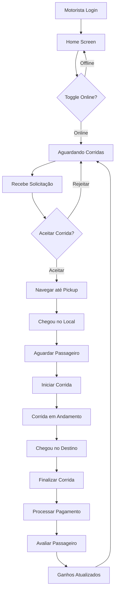
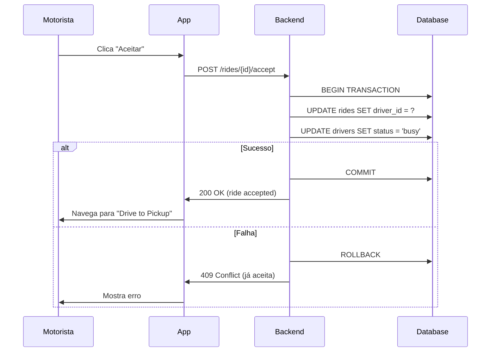
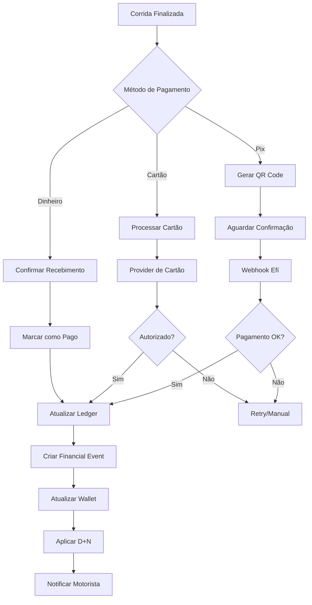
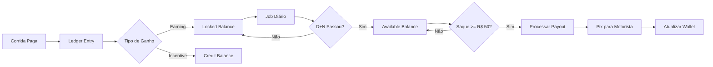
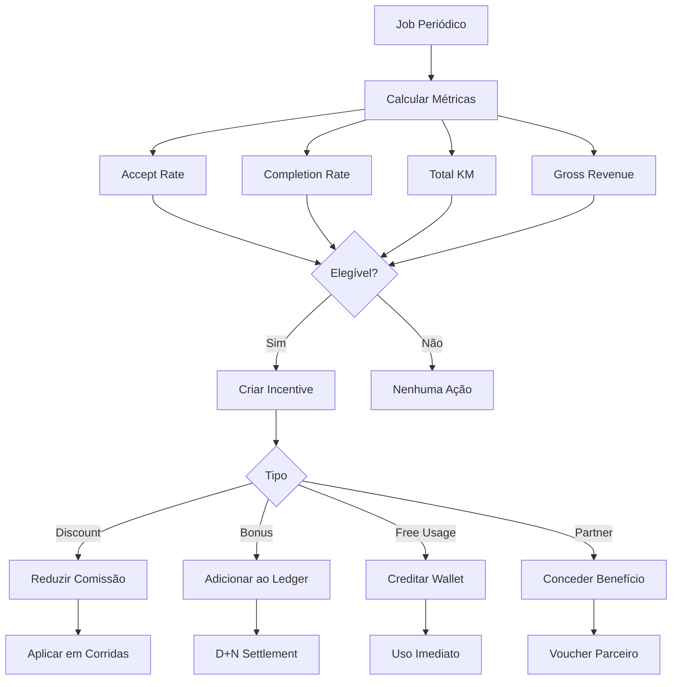
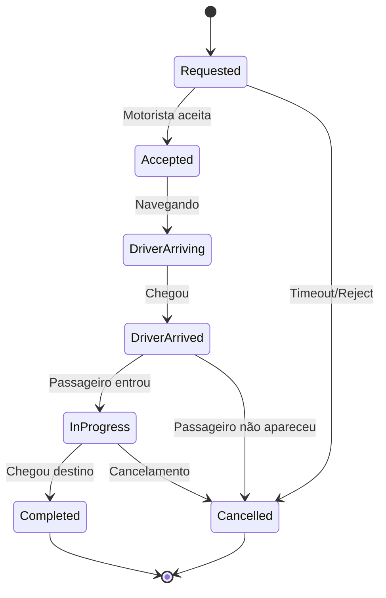
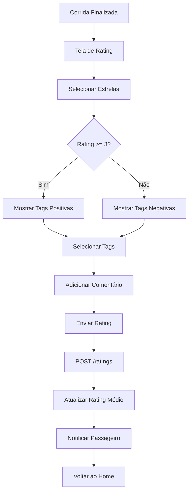
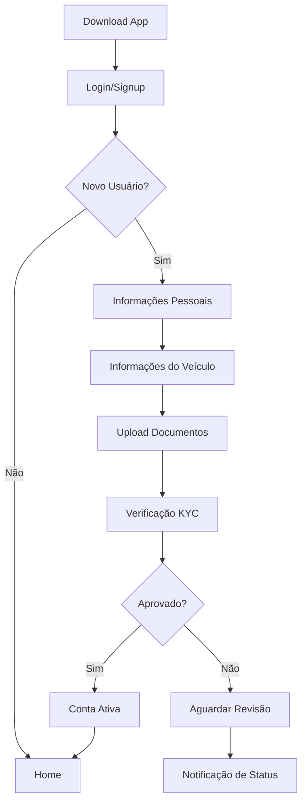
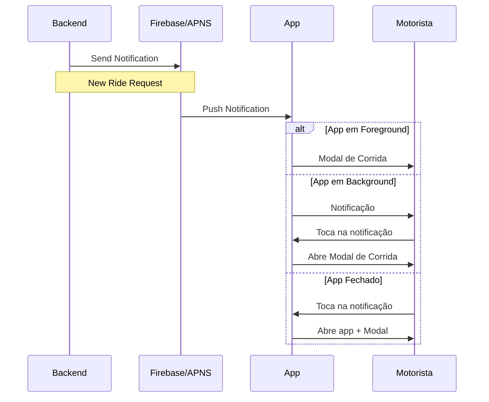
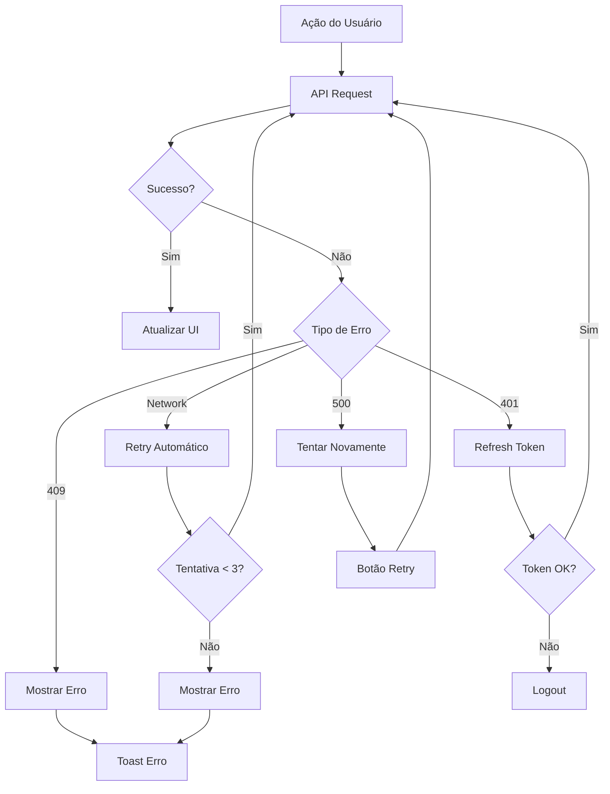

# Fluxos do iBora Driver App

Este documento contém os fluxos principais do aplicativo em formato Mermaid.

## 1. Fluxo Completo do Motorista: Online → Corrida → Concluída

## 2. Fluxo de Aceite de Corrida (Transacional)

## 3. Fluxo de Pagamento (Pix/Card/Cash)

## 4. Fluxo de Wallet e Settlement D+N

## 5. Fluxo de Incentivos e Fidelidade

## 6. Fluxo de Estados da Corrida (State Machine)

## 7. Fluxo de Avaliação (Rating)

## 8. Fluxo de Onboarding

## 9. Fluxo de Notificações Push

## 10. Fluxo de Erro e Retry

## Notas sobre os Fluxos

### Fluxo 1: Motorista Online → Corrida
- **Estados principais**: Offline, Online, Busy, In Trip
- **Pontos críticos**: Accept ride (transaction), Start trip, End trip
- **Timeouts**: 30s para aceitar, 5min para chegar

### Fluxo 3: Pagamento
- **Métodos suportados**: Pix, Cartão, Dinheiro
- **Idempotência**: Todas as operações são idempotentes
- **Webhooks**: Retry com backoff exponencial

### Fluxo 4: Wallet D+N
- **D+N**: Configurável por tipo de transação
- **Saque mínimo**: R$ 50,00
- **Settlement**: Job diário às 00:00

### Fluxo 5: Incentivos
- **Cálculo**: Jobs periódicos (diário/semanal/mensal)
- **Tipos**: Discount, Bonus, Free Usage, Partner
- **Validade**: Campanhas têm início e fim

### Fluxo 6: State Machine
- **Estados finais**: Completed, Cancelled
- **Transições**: Apenas as definidas são permitidas
- **Rollback**: Possível antes de InProgress
